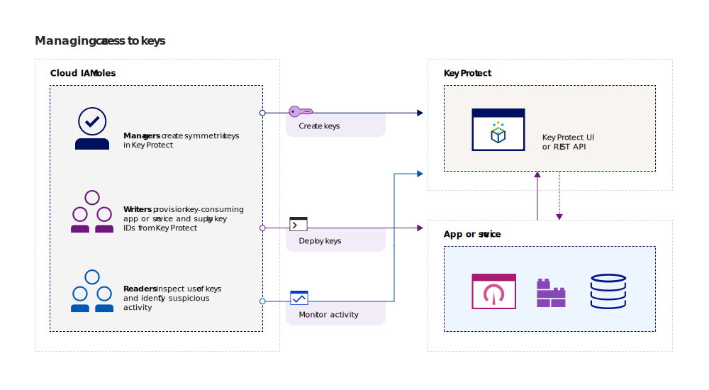
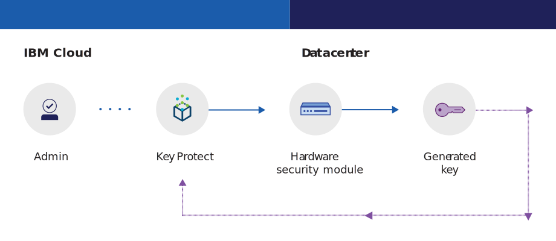
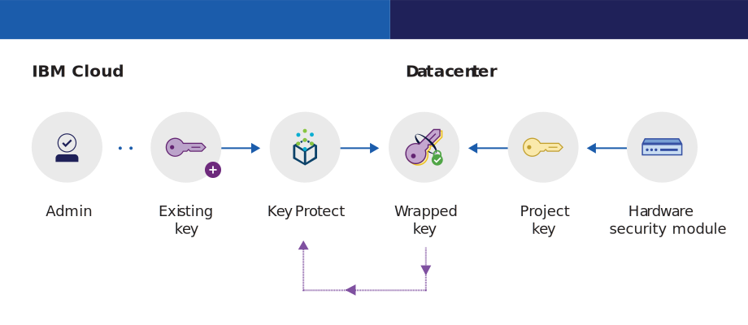

---

copyright:
  years: 2017, 2019
lastupdated: "2019-01-03"

---

{:shortdesc: .shortdesc}
{:codeblock: .codeblock}
{:screen: .screen}
{:new_window: target="_blank"}
{:pre: .pre}
{:tip: .tip}
{:note: .note}
{:important: .important}

# About the service
{: #about}

{{site.data.keyword.keymanagementservicefull}} helps you provision encrypted keys for apps across {{site.data.keyword.cloud_notm}} services. As you manage the lifecycle of your keys, you can benefit from knowing that your keys are secured by FIPS 140-2 Level 2 certified cloud-based hardware security modules (HSMs) that protect against the theft of information.
{: shortdesc}

## Reasons to use {{site.data.keyword.keymanagementserviceshort}}
{: #kp-reasons}

You might need to manage keys in the following scenarios:

<table>
  <tr>
    <th>Scenario</th>
    <th>Reasons</th>
  </tr>
  <tr>
    <td>You need to encrypt high volumes of sensitive data, such as medical records, by individual resource.</td>
    <td>You can integrate the {{site.data.keyword.keymanagementserviceshort}} service with storage solutions, such as [{{site.data.keyword.cos_full_notm}} ](/docs/services/cloud-object-storage/about-cos.html), to encrypt your data at rest in the cloud. Each document can be protected by a different key, so you have granular control of your data.</td>
  </tr>
  <tr>
    <td>You want to perform envelope encryption as you move data into the cloud. You need to bring your own master encryption key, so you can achieve full control of other keys that encrypt your data at rest.</td>
    <td>With {{site.data.keyword.keymanagementserviceshort}}, you can [wrap your data encryption keys with a highly secure root key](/docs/services/key-protect/concepts/envelope-encryption.html). You can bring your own root keys or create them in the service.</td>
  </tr>
  <tr>
    <td>As an IT admin for a large corporation, you need to integrate, track, and rotate keys for many different service offerings.</td>
    <td>The {{site.data.keyword.keymanagementserviceshort}} interface simplifies the management of multiple encryption services. With the service, you can manage and sort keys in one centralized location, or you can separate keys by project and house them in different {{site.data.keyword.cloud_notm}} spaces.</td>
  </tr>
  <tr>
    <td>You are a security admin in an industry, such as finance or legal, that must adhere to governance over how data is protected. You need to grant controlled access of keys without compromising the data that it secures.</td>
    <td>With the service, you can control user access to manage keys by [assigning different Identity and Access Management roles](/docs/services/key-protect/manage-access.html#roles). For example, you can grant read-only access to users who need to view key creation information without viewing the key material.</td>
  <tr>
    <td>As a developer, you can integrate pre-existing applications, such as self-encrypting storage, to {{site.data.keyword.keymanagementserviceshort}}. You can also develop your own apps that integrate with the service.</td>
    <td>Apps on or outside {{site.data.keyword.cloud_notm}} can integrate with the {{site.data.keyword.keymanagementserviceshort}} APIs. You can use your own existing keys for your apps. </td>
  </tr>
  <tr>
    <td>Your development team has stringent policies, and you need a way to generate and rotate keys every 14 days.</td>
    <td>With {{site.data.keyword.cloud_notm}}, you can rapidly generate keys from a hardware security module (HSM) to meet your on-going security needs.</td>
  </tr>
</table>

## How {{site.data.keyword.keymanagementserviceshort}} works
{: #kp-how}

{{site.data.keyword.keymanagementservicelong_notm}} helps you manage encryption keys throughout your organization by aligning with {{site.data.keyword.cloud_notm}} Identity and Access Management roles.

An IT or security admin needs advanced permissions that an auditor might not. To simplify access, {{site.data.keyword.keymanagementserviceshort}} maps to {{site.data.keyword.cloud_notm}} Identity and Access Management roles so that each role has a different view of the service. To help guide which view and level of access best suits your needs, see [Managing users and access](/docs/services/key-protect/manage-access.html#roles).

The following diagram shows how managers, readers, and writers can interact with keys that are managed in the service.

<dl>
  <dt>Service integration</dt>
    <dd>Managers for your {{site.data.keyword.keymanagementserviceshort}} service instance
manage the keys for cryptography.</dd>
  <dt>Audits</dt>
    <dd>Readers access a high-level view of keys and identify suspicious activities.</dd>
  <dt>Apps</dt>
    <dd>Writers manage the keys for the cryptography that they code into apps.</dd>
</dl>

## {{site.data.keyword.keymanagementserviceshort}} architecture
{: #kp_architecture}

{{site.data.keyword.keymanagementservicelong_notm}} is composed of industry-accepted technologies.

<dl>
  <dt>{{site.data.keyword.cloud_notm}} server</dt>
    <dd>Identity, projects, and their tokens from the {{site.data.keyword.cloud_notm}} server let the {{site.data.keyword.keymanagementserviceshort}} service map resources to keys.</dd>
  <dt>API for {{site.data.keyword.keymanagementserviceshort}}</dt>
    <dd>The {{site.data.keyword.keymanagementserviceshort}} REST API drives key creation and management. The service provides encrypted multi-tenancy.</dd>
  <dt>User interface in {{site.data.keyword.cloud_notm}}</dt>
    <dd>With the {{site.data.keyword.keymanagementserviceshort}} user interface (UI), you can securely work with your keys.</dd>
  <dt>Hardware security module (HSM)</dt>
    <dd>Behind the scenes, {{site.data.keyword.cloud_notm}} data centers provide the hardware to protect your keys.</dd>
  <dt>Database cluster</dt>
    <dd>You can count on redundant and secure storage of your keys with a clustered database.</dd>
</dl>

The following diagrams show how {{site.data.keyword.keymanagementserviceshort}} works with the hardware security modules to generate keys compared to how the service stores keys.

