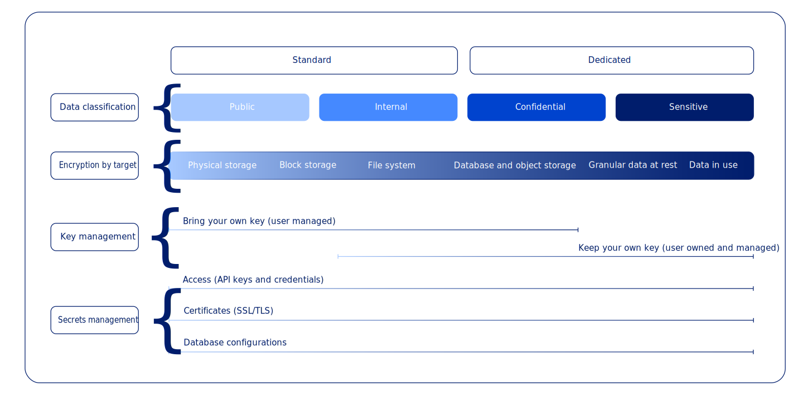

---

copyright:
  years: 2017, 2026

lastupdated: "2026-04-02"

keywords: about Key Protect, about Key Management Service, Key Protect use cases, Standard Key Protect, Dedicated Key Protect, single-tenant, multi-tenant

subcollection: key-protect

---

{{site.data.keyword.attribute-definition-list}}

# About Standard and Dedicated {{site.data.keyword.keymanagementserviceshort}}
{: #about}

{{site.data.keyword.keymanagementservicefull}} offers two deployment options to meet different security and compliance requirements: Standard (multi-tenant) and Dedicated (single-tenant).
{: shortdesc}

Both versions provide full-service encryption solutions that allow data to be secured and stored in {{site.data.keyword.cloud_notm}} by using envelope encryption techniques and cloud-based hardware security modules. Standard is a multi-tenant offering, where {{site.data.keyword.keymanagementserviceshort}} manages the isolation of keys and resources. Dedicated is single-tenant, offering full control of keys (master key and root keys) and confidential computing.

All existing key operations (for example, key creations, rotations, deletions) are available for the Dedicated option in the console. However, initializing the service requires following CLI instructions that can be found in [Initializing Dedicated {{site.data.keyword.keymanagementserviceshort}} by creating an instance, credentials, and a master key](/docs/key-protect?topic=key-protect-st-init-cli).
{: important}

## Overview of both offerings
{: #comparison-overview}

Both Standard and Dedicated {{site.data.keyword.keymanagementserviceshort}} protect sensitive data by encrypting data encryption keys (DEKs) with root keys that are managed through hardware security modules. In Standard, the master keys are managed by IBM. In Dedicated, you own and manage your own master keys. In this envelope encryption system, decrypting data requires first "unwrapping" the encrypted DEK and then using the DEK to decrypt the data.

For more information about how envelope encryption works, see [Protecting data with envelope encryption](/docs/key-protect?topic=key-protect-envelope-encryption).

Unsure which {{site.data.keyword.cloud_notm}} security service is right for your use case? Check out [Which data security service is best for me?](/docs/key-protect?topic=key-protect-manage-secrets-ibm-cloud) for more information.
{: tip}

## Key similarities
{: #comparison-similarities}

Both Standard and Dedicated {{site.data.keyword.keymanagementserviceshort}} share the following core capabilities:

### Encryption and key management
{: #comparison-similarities-encryption}

Envelope encryption
:   Used to protect data encryption keys with root keys.

AES-GCM encryption
:   Both use the Advanced Encryption Standard algorithm in Galois/Counter Mode (AES GCM) to wrap and unwrap DEKs.

256-bit key material
:   Both support 256-bit key material for created root keys.

Key lifecycle management
:   Creating, importing, rotating, and managing encryption keys are supported.

Key operations
:   All existing key operations (creations, rotations, deletions) are available in both versions.

### Integration and access
{: #comparison-similarities-integration}

IAM integration
:   Both integrate with {{site.data.keyword.cloud_notm}} Identity and Access Management (IAM) for fine-grained access control.

API compatibility
:   Both use the same key-provider API, ensuring a consistent developer experience.

Service integrations
:   Both integrate with {{site.data.keyword.cloud_notm}} services, including database, storage, container, and ingestion services.

HTTPS communication
:   Both use HTTPS with Transport Layer Security (TLS) protocol to encrypt data in transit.

REST API
:   Both provide REST APIs for encryption key creation and management.

### Management capabilities
{: #comparison-similarities-management}

Key rings
:   Both support organizing keys by using key rings.

Key aliases
:   Both support creating aliases for keys.

Rotation policies
:   Both allow setting rotation schedules for keys.

Dual authorization
:   Both support dual authorization policies for key deletion.

KMIP support
:   Both offer Key Management Interoperability Protocol (KMIP) support, which is certified by VMWare.

## Key differences
{: #comparison-differences}

The following table highlights the primary differences between Standard and Dedicated {{site.data.keyword.keymanagementserviceshort}}:

| Feature | Standard {{site.data.keyword.keymanagementserviceshort}} | Dedicated {{site.data.keyword.keymanagementserviceshort}} |
|---------|----------------------------------------------------------|-----------------------------------------------------------|
| Tenancy model | Multi-tenant with shared HSMs | Single-tenant with dedicated HSM partitions |
| HSM certification | FIPS 140-2 Level 3 certified | Submitted to NIST for FIPS 140-3 Level 4 certification |
| Key control | Bring Your Own Key (BYOK) | Keep Your Own Key (KYOK) |
| {{site.data.keyword.IBM_notm}} administrator access | {{site.data.keyword.IBM_notm}} administrators have operational access | No visibility for {{site.data.keyword.cloud_notm}} administrators |
| HSM partition ownership | Shared HSM resources | Exclusive ownership of HSM partitions (crypto units) |
| Master key management | {{site.data.keyword.IBM_notm}}-managed HSM master keys | User-owned master keys |
| Administrator assignment | {{site.data.keyword.IBM_notm}}-managed | User assigns their own administrators |
| Initialization | Console or CLI | CLI required for initialization |
| Workload isolation | Shared infrastructure | Complete workload isolation |
| Crypto units | Not applicable | Operational crypto units for key management and cryptographic operations |
| Key hierarchy control | {{site.data.keyword.IBM_notm}} manages root of trust | User owns root of trust |
| Privileged access | {{site.data.keyword.IBM_notm}} operational access | No operational access for provider |
{: caption="Table 1. Comparison of Standard and Dedicated {{site.data.keyword.keymanagementserviceshort}}" caption-side="bottom"}

## Standard {{site.data.keyword.keymanagementserviceshort}} features
{: #comparison-standard-features}

Standard {{site.data.keyword.keymanagementserviceshort}} is a multi-tenant service that provides cost-effective encryption key management with shared infrastructure and {{site.data.keyword.IBM_notm}}-managed security operations.

### What Standard offers
{: #comparison-standard-offers}

Bring your encryption keys to the cloud
:   Fully control and strengthen your key management practices by securely exporting symmetric keys from your internal key management infrastructure into {{site.data.keyword.cloud_notm}}.

Robust security
:   Provision and store keys by using FIPS 140-2 Level 3 hardware security modules (HSMs). Leverage {{site.data.keyword.cloud_notm}} [Identity and Access Management (IAM) roles](/docs/account?topic=account-userroles) to provide fine-grain access control to your keys.

Control and visibility
:   Use {{site.data.keyword.logs_full_notm}} to measure how users and applications interact with {{site.data.keyword.keymanagementserviceshort}}.

Simplified billing
:   Track subscription and credit spending for all accounts from a single view. To learn more about keys, key versions, and pricing, check out [Pricing](/docs/key-protect?topic=key-protect-pricing-plan).

Self-managed encryption
:   Create or import root and standard keys to protect your data.

Flexibility
:   Apps on or outside {{site.data.keyword.IBM_notm}} Cloud can integrate with the Key Protect APIs. {{site.data.keyword.keymanagementserviceshort}} integrates easily with various {{site.data.keyword.IBM_notm}} database, storage, container, and ingestion services.

Built-in protection
:   Deleted keys, and their encrypted data, can never be recovered. Manage your user roles, key states, and set a rotation schedule that works for your use case by using the UI, CLI, or API.

Application-independent
:   Generate, store, retrieve, and manage keys independent of application logic.

Standard {{site.data.keyword.keymanagementserviceshort}} is ideal for organizations that need robust encryption key management with shared infrastructure and {{site.data.keyword.IBM_notm}}-managed security operations.

## Dedicated {{site.data.keyword.keymanagementserviceshort}} features
{: #comparison-dedicated-features}

Dedicated {{site.data.keyword.keymanagementserviceshort}} is a single-tenant service that is designed to provide enterprises with full control over their encryption keys and cryptographic operations in the cloud.

### What Dedicated offers
{: #comparison-dedicated-offers}

Complete key control
:   KYOK capabilities ensure only you have access to your keys, with no visibility for {{site.data.keyword.cloud_notm}} administrators.

FIPS 140-3 Level 4 HSMs (submitted for NIST certification)
:   Submitted to NIST for certification of the latest hardware security module certification standard.

Dedicated HSM partitions
:   Exclusive crypto units for enhanced security and workload isolation.

User-managed master keys
:   Full control over the root of trust that encrypts the entire hierarchy of encryption keys.

Custom administrators
:   Assign your own HSM administrators by using RSA signature authentication keys.

Workload isolation
:   Complete separation from other tenants with dedicated infrastructure.

Enhanced compliance
:   Meets stringent regulatory requirements for data sovereignty and security.

Zero trust
:   Infrastructure runs on Red Hat OpenShift Confidential Containers fortified by Intel TDX secure enclaves.

All existing key operations (for example, key creations, rotations, deletions) are available in the console. However, initializing the service requires following CLI instructions that can be found in [Initializing Dedicated {{site.data.keyword.keymanagementserviceshort}} by creating an instance, credentials, and a master key](/docs/key-protect?topic=key-protect-st-init-cli).
{: important}

### Dedicated-specific concepts
{: #comparison-dedicated-concepts}

Dedicated {{site.data.keyword.keymanagementserviceshort}} introduces several unique concepts:

Crypto units
:   A single unit representing an HSM and a corresponding software stack dedicated to cryptography. Operational crypto units manage encryption keys and perform cryptographic operations.

RSA signature authentication keys
:   Administrators use RSA-based signature keys to sign commands that are issued to crypto units. The private key creates signatures and is stored locally in an encrypted keyfile, while the public key is installed in the crypto unit to define administrators.

Master key (HSM master backup key)
:   A symmetric 256-bit AES key that encrypts the service instance for key storage. With the master key, you own the root of trust that encrypts the entire hierarchy of encryption keys. Deleting the master key effectively crypto-shreds all encrypted data.

Master key parts
:   When initializing by using key part files, a master key is composed of two or more master key parts. Each part is a symmetric 256-bit AES key that can be owned by different people for enhanced security.

## Use case comparison
{: #comparison-use-cases}

The following diagram illustrates use cases where Standard or Dedicated {{site.data.keyword.keymanagementserviceshort}} would be most appropriate. The primary factor in choosing between Standard and Dedicated is the level of security and control that you require for your data.

{: caption="Figure 1. Use cases for Standard and Dedicated {{site.data.keyword.keymanagementserviceshort}}" caption-side="bottom"}

### When to use Standard {{site.data.keyword.keymanagementserviceshort}}
{: #comparison-when-standard}

Standard {{site.data.keyword.keymanagementserviceshort}} is ideal for:

* Organizations requiring FIPS 140-2 Level 3 encryption.
* Cost-sensitive deployments that can use shared infrastructure.
* Rapid deployment requirements.
* Standard compliance and regulatory requirements.
* Applications that need BYOK capabilities.
* Integration with multiple {{site.data.keyword.cloud_notm}} services.
* Organizations comfortable with {{site.data.keyword.IBM_notm}}-managed HSM infrastructure.

### When to use Dedicated {{site.data.keyword.keymanagementserviceshort}}
{: #comparison-when-dedicated}

Dedicated {{site.data.keyword.keymanagementserviceshort}} is ideal for:

* Organizations requiring FIPS 140-3 Level 4 (submitted for certification) encryption.
* Stringent regulatory compliance that requires data sovereignty.
* Regulated industries with sensitive data and strict security requirements (finance, healthcare, government).
* Organizations requiring full control of the root of trust for keys and the HSM.
* Complete workload isolation requirements.
* Organizations that need to eliminate privileged access risks.
* Scenarios requiring custom HSM administrator assignment.
* Organizations that need full control over the encryption key hierarchy.

## Common scenarios
{: #comparison-scenarios}

The following table shows common scenarios that explain how both versions of {{site.data.keyword.keymanagementserviceshort}} can be used:

| Scenario | Standard | Dedicated |
|----------|----------|-----------|
| Generate and manage encryption keys that are backed by FIPS-certified hardware | ✓ FIPS 140-2 Level 3 certified | ✓ (Submitted to NIST for FIPS 140-3 Level 4 certification) |
| IT admin needs to integrate, track, and rotate encryption keys for multiple services | ✓ | ✓ |
| Developer wants to integrate pre-existing applications with key management | ✓ | ✓ |
| Development team has stringent policies that require rapid key generation and rotation | ✓ | ✓ |
| Security admin needs controlled access without compromising data security | ✓ | ✓ |
| Perform envelope encryption with master encryption keys | ✓ | ✓ |
| Eliminate all {{site.data.keyword.IBM_notm}} administrator access to encryption keys | ✗ | ✓ |
| Require dedicated HSM partitions for regulatory compliance | ✗ | ✓ |
| Need complete control over HSM master keys | ✗ | ✓ |
| Assign custom HSM administrators | ✗ | ✓ |
| Cost-effective shared infrastructure | ✓ | ✗ |
| For public and internal data, cloud workloads like cloud object storage, physical storage, block storage, file systems, and databases | ✓ | ✗ |
| For sensitive and confidential data (PHI, PII, Financial records), database and object storage, AI models and data, and data-in-use protection (confidential computing) |   | Recommended |
{: caption="Table 2. Scenario comparison for Standard and Dedicated {{site.data.keyword.keymanagementserviceshort}}" caption-side="bottom"}

## Architecture overview
{: #comparison-architecture}

Both Standard and Dedicated {{site.data.keyword.keymanagementserviceshort}} use similar architectural components with key differences in tenancy and control.

{{site.data.keyword.keymanagementserviceshort}} uses the Advanced Encryption Standard algorithm in Galois/Counter Mode (AES GCM) to wrap and unwrap DEKs. Root keys that are not imported are created with 256-bit key material. Imported root keys can have 128, 192, or 256-bit key material.
{: note}

Access to the {{site.data.keyword.keymanagementserviceshort}} service takes place over HTTPS. All communication uses the Transport Layer Security (TLS) protocol to encrypt data in transit. For more information about TLS and the ciphers that are supported by {{site.data.keyword.keymanagementserviceshort}}, check out [Data encryption](/docs/key-protect?topic=key-protect-security-and-compliance#data-encryption).
{: note}

### Common architectural components
{: #comparison-architecture-common}

{{site.data.keyword.keymanagementserviceshort}} REST API
:   The {{site.data.keyword.keymanagementserviceshort}} REST API drives encryption key creation and management across {{site.data.keyword.cloud_notm}} services.

Hardware security modules
:   {{site.data.keyword.cloud_notm}} data centers provide the hardware to protect your keys. HSMs are tamper-resistant hardware devices that store and use cryptographic key material without exposing keys outside of a cryptographic boundary.

Customer-managed encryption keys
:   Root keys are symmetric keys that protect data encryption keys with [envelope encryption](/docs/key-protect?topic=key-protect-envelope-encryption). Root keys never leave the boundary of the HSM.

Dedicated key storage
:   Key metadata is stored in highly durable, dedicated storage for {{site.data.keyword.keymanagementserviceshort}} that is encrypted at rest with additional application layer encryption.

Fine-grained access control
:   {{site.data.keyword.keymanagementserviceshort}} leverages {{site.data.keyword.cloud_notm}} IAM roles to ensure that users can be assigned appropriate access at the instance, key, and key ring level.

### Standard-specific architecture
{: #comparison-architecture-standard}

In Standard {{site.data.keyword.keymanagementserviceshort}}:

* HSMs are shared across multiple tenants in a multi-tenant architecture.
* {{site.data.keyword.IBM_notm}} manages and periodically rotates the HSM's master keys, providing an extra layer of security.
* {{site.data.keyword.IBM_notm}} administrators have operational access to manage the infrastructure.

### Dedicated-specific architecture
{: #comparison-architecture-dedicated}

In {{site.data.keyword.keymanagementserviceshort}} Dedicated:

* Each customer receives dedicated HSM partitions (crypto units) for complete workload isolation.
* Customers manage their own HSM master backup keys, owning the root of trust.
* Customers assign their own administrators by using RSA signature authentication keys.
* No {{site.data.keyword.IBM_notm}} administrator access to customer encryption keys or cryptographic operations.

## Next steps
{: #comparison-next-steps}

* To get started with Standard {{site.data.keyword.keymanagementserviceshort}}, see [Provisioning the service](/docs/key-protect?topic=key-protect-provision).
* To get started with Dedicated {{site.data.keyword.keymanagementserviceshort}}, see [Initializing Dedicated {{site.data.keyword.keymanagementserviceshort}}](/docs/key-protect?topic=key-protect-st-init-cli).
* For more information about your responsibilities when you use {{site.data.keyword.keymanagementserviceshort}}, see [Understanding your responsibilities](/docs/key-protect?topic=key-protect-shared-responsibilities).
* To compare {{site.data.keyword.keymanagementserviceshort}} with other {{site.data.keyword.IBM_notm}} security services, see [Which data security service is best for me?](/docs/key-protect?topic=key-protect-manage-secrets-ibm-cloud)
