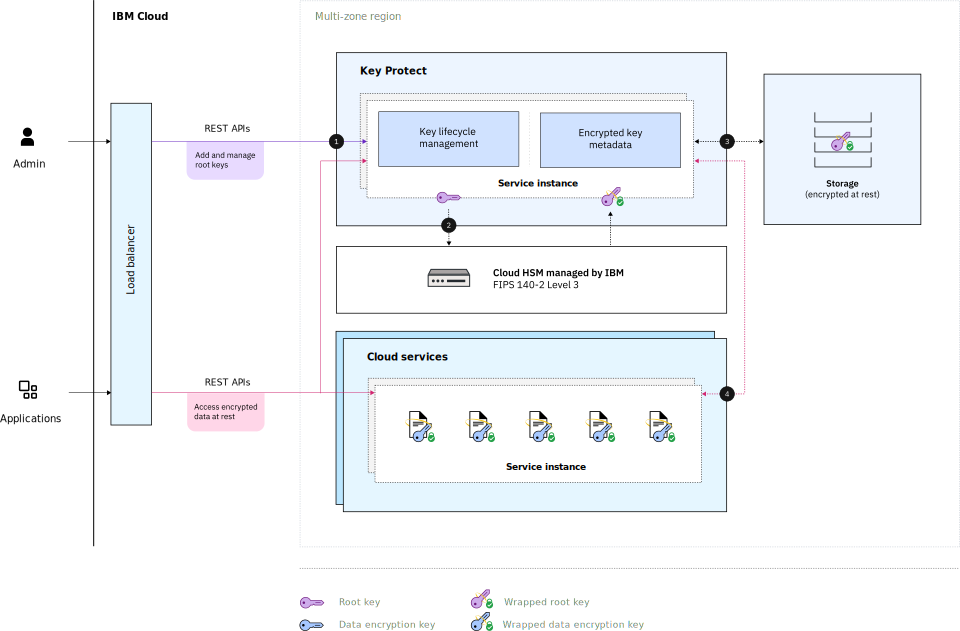

---

copyright:
  years: 2017, 2021
lastupdated: "2021-05-13"

keywords: key management service, KMS, about Key Protect, about KMS, Key Protect use cases, KMS use cases

subcollection: key-protect

---

{:shortdesc: .shortdesc}
{:screen: .screen}
{:pre: .pre}
{:table: .aria-labeledby="caption"}
{:external: target="_blank" .external}
{:codeblock: .codeblock}
{:tip: .tip}
{:note: .note}
{:important: .important}
{:term: .term}

# About {{site.data.keyword.keymanagementserviceshort}}
{: #about}

{{site.data.keyword.keymanagementservicefull}} is a full-service encryption solution that allows data to be secured and stored in {{site.data.keyword.cloud_notm}} using the latest envelope encryption techniques that leverage FIPS 140-2 Level 3 certified cloud-based hardware security modules.
{: shortdesc}

Sensitive data should not be stored on any cloud provider unencrypted (as "plaintext", in other words). But just as with any method of encryption, going back to the earliest known ciphertexts created thousands of years ago, the trick is not just to encrypt information so that it cannot be decoded easily but to protect the ciphers used to encrypt and decrypt it (since having a cipher is as good as having the data).

While it is possible to set up a hardware security module (HSM) on premises to manage your data, this kind of system can be very expensive to establish and manage. Cloud-based storage, where encrypted data must be accessible at scale and at speed from a variety of permissioned actors, is less expensive, but has its own difficulties. How can you be sure that the data is secure when the key used to encrypt it (what's known as a "data encryption key") could exist on dozens if not hundreds of computers spread all over the world? In that scenario, your data is only as secure as the computers and connections of those with the data encryption key.

The solution is a key management system like {{site.data.keyword.keymanagementserviceshort}}, which keeps data secure by encrypting the data encryption keys (DEKs) that encrypt your plaintext data with root keys managed by IBM via an impenetrable HSM. In this kind of a system, known as "envelope encryption", the process of decrypting the data means first "unwrapping" the encrypted DEK (opening its envelope, in other words) and then using the DEK to decrypt the data.

For more information about envelope encryption works, check out [Protecting data with envelope encryption](/docs/key-protect?topic=key-protect-envelope-encryption).

## What {{site.data.keyword.keymanagementserviceshort}} offers
{: #about-offers}

* **Fully managed key management system**: Create or import both root and standard keys (the latter is generally used to encrypt secrets, for example a password) with {{site.data.keyword.keymanagementserviceshort}} that can be used to encrypt your application data. Manage your user roles, key states, and set a rotation schedule that works for your use case using the UI, CLI, or API. Leverage the power of IBM master keys stored inside an HSM shared across {{site.data.keyword.cloud_notm}} multi-zone regions for the best in cost, performance, and security. Run multiple instances of {{site.data.keyword.keymanagementserviceshort}} on shared clusters and a shared container that processes API requests within a security context that is user-based and unique to each customer.
* **Integration with IBM products**: {{site.data.keyword.keymanagementserviceshort}} integrates easily with a variety of IBM database, storage, container, and ingestion services. For more information, check out [Integrating services](/docs/key-protect?topic=key-protect-integrate-services). Chief among these is the native integration with IBM Cloud Object Storage (COS). For more information about this integration, check out [Server-Side Encryption with IBM Key Protect (SSE-KP)](/docs/cloud-object-storage?topic=cloud-object-storage-kp) in the COS documentation.
* **Security, compliance, and auditing**: In addition to the FIPS 140-2 Level 3 certified cloud-based hardware security modules (HSMs), {{site.data.keyword.keymanagementserviceshort}} leverages {{site.data.keyword.cloud_notm}} [Identity and Access Management (IAM) roles](/docs/account?topic=account-userroles) to provide fine-grain access control to your keys. For more information, check out [Understanding your responsibilities with using Key Protect](/docs/key-protect?topic=key-protect-shared-responsibilities).
* **Monitoring**: Use the {{site.data.keyword.mon_full_notm}} service and {{site.data.keyword.at_full_notm}} to measure how users and applications interact with {{site.data.keyword.keymanagementserviceshort}}. For more information, check out [Monitoring operational metrics](/docs/key-protect?topic=key-protect-operational-metrics) and [Activity Tracker events](/docs/key-protect?topic=key-protect-at-events).
* **Low cost**: Your first 20 keys are free, with a graduated pay system of less than USD1 per key after that (depending on the number of keys created). For more information, check out the [Key Protect catalog page](https://cloud.ibm.com/catalog/services/key-protect).

## Reasons to use {{site.data.keyword.keymanagementserviceshort}}
{: #use-cases}

Here are a few common scenarios that explain how {{site.data.keyword.keymanagementserviceshort}} can be used to solve issues faced by businesses operating at scale in production.

| Scenarios | Reasons |
| --------- | ------- |
| As an IT admin for a large corporation, you need to integrate, track, and rotate encryption keys for many different service offerings. | The {{site.data.keyword.keymanagementserviceshort}} interface simplifies the management of multiple encryption services. With the service, you can manage and sort encryption keys in one centralized location, or you can separate keys by project and house them in different {{site.data.keyword.cloud_notm}} spaces. |
| As a developer, you want to integrate your pre-existing applications, such as self-encrypting storage, to {{site.data.keyword.keymanagementserviceshort}}. | Apps on or outside {{site.data.keyword.cloud_notm}} can integrate with the {{site.data.keyword.keymanagementserviceshort}} APIs. You can use your own existing keys for your apps and import them into {{site.data.keyword.keymanagementserviceshort}}. |
| Your development team has stringent policies, and you need a way to generate and rotate keys. | With {{site.data.keyword.keymanagementserviceshort}}, you can rapidly generate keys from an {{site.data.keyword.cloud_notm}} hardware security module (HSM). When it's time to replace a key, whether it was created using {{site.data.keyword.keymanagementserviceshort}} or imported, you can [rotate the key on-demand](/docs/key-protect?topic=key-protect-rotate-keys) or [set a rotation policy](/docs/key-protect?topic=key-protect-set-rotation-policy) for the key to meet your on-going security needs. |
| You are a security admin in an industry, such as finance or legal, that must adhere to governance over how data is protected. You need to grant controlled access of keys without compromising the data that it secures. | With the service, you can control user access to manage keys by [assigning different IAM roles](/docs/key-protect?topic=key-protect-manage-access#manage-access-roles). For example, you can grant read-only access to users who need to view key creation information without viewing the key material. Similarly, users can be assigned the "Manager" role over only a single key, if needed. |
| You want to perform envelope encryption as you move data into the cloud. You need to bring your own master encryption keys, so you can manage and protect other keys that encrypt your data at rest. | With {{site.data.keyword.keymanagementserviceshort}}, you can [wrap (encrypt) your data encryption keys with a highly secure root key](/docs/key-protect?topic=key-protect-envelope-encryption) and also unwrap that key when needed. You can bring your own root keys or create them in the service. |

{{site.data.keyword.keymanagementserviceshort}} is a cloud-based key management system that provides the best of cost, security, and scale. If you are looking for a dedicated key management solution that supports customer-controlled, cloud-based HSMs [{{site.data.keyword.cloud_notm}} {{site.data.keyword.hscrypto}}](/docs/hs-crypto?topic=hs-crypto-get-started){: external} integrates with {{site.data.keyword.keymanagementserviceshort}} to enable Keep Your Own Keys (KYOK) for {{site.data.keyword.cloud_notm}}, so your organization has more control and authority over its data. Check out the [{{site.data.keyword.hscrypto}} offering details page](/catalog/services/hyper-protect-crypto-services){: external} to learn more.
{: tip}

## How {{site.data.keyword.keymanagementserviceshort}} works
{: #kp-how}

{{site.data.keyword.keymanagementservicelong_notm}} helps you manage encryption keys throughout your organization by aligning with {{site.data.keyword.cloud_notm}} IAM roles.

An IT or security admin might need advanced permissions to your instance, keys, or key rings that other users, including auditors, might not. For this reason, {{site.data.keyword.keymanagementserviceshort}} maps to established IAM roles to allow fine-grained access for each user as needed. For more information, check out [Managing users and access](/docs/key-protect?topic=key-protect-manage-access#manage-access-roles).

The following diagram shows how the default IAM roles of manager, reader, and writer can interact with keys that are managed in the service.

{: caption="Figure 1. Shows how different access roles interact with keys." caption-side="bottom"}

While a particular user can be assigned specific roles over specific resources (a user with a "Reader" role at the instance level might be a "Manager" of a particular key or key ring), in general:

* **Readers** can access information about keys.
* **Writers** can use keys with an application or service that is integrated with {{site.data.keyword.keymanagementserviceshort}}
* **Managers** create keys and control their lifecycle (in addition to being able to do everything Readers and Writers can do).

### Architecture overview
{: #about-architecture-overview}

The following architecture diagram shows how {{site.data.keyword.keymanagementserviceshort}} components work to protect your sensitive data and keys.

{: caption="Figure 1. {{site.data.keyword.keymanagementserviceshort}} architecture" caption-side="bottom"}

Access to the {{site.data.keyword.keymanagementserviceshort}} service takes place over HTTPS. All communication uses the Transport Layer Security (TLS) protocol to encrypt data in transit. For more information about TLS, check out [Introduction to Quantum-safe Cryptography in TLS](/docs/key-protect?topic=key-protect-quantum-safe-cryptography-tls-introduction).
{: note}

| Components | Description |
| ---------- | ----------- |
| {{site.data.keyword.keymanagementserviceshort}} REST API | The {{site.data.keyword.keymanagementserviceshort}} REST API drives encryption key creation and management across {{site.data.keyword.cloud_notm}} services. |
| IBM-managed hardware security module | {{site.data.keyword.cloud_notm}} data centers provide the hardware to protect your keys. Hardware security modules (HSMs) are tamper-resistant hardware devices that store and use cryptographic key material without exposing keys outside of a cryptographic boundary. All cryptographic operations, such as key creation and key rotation, are performed within the HSM. IBM periodically rotates the HSM's master keys, providing an extra layer of security. |
| Customer-managed encryption keys | Root keys are symmetric keys that protect data encryption keys with [envelope encryption](/docs/key-protect?topic=key-protect-envelope-encryption). Root keys never leave the boundary of the HSM. |
| Dedicated key storage | Key metadata is stored in highly durable, dedicated storage for {{site.data.keyword.keymanagementserviceshort}} that is encrypted at rest with additional application layer encryption. |
| Fine-grained access control | {{site.data.keyword.keymanagementserviceshort}} leverages {{site.data.keyword.cloud_notm}} IAM roles to ensure that users can be assigned appropriate access at the instance, key, and key ring level. |
{: caption="Table 1. {{site.data.keyword.keymanagementserviceshort}} service components" caption-side="top"}
