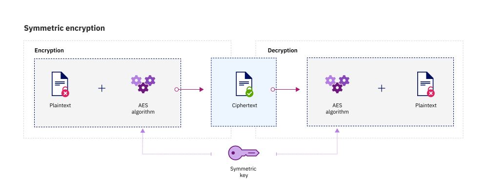

---

copyright:
  years: 2017, 2020
lastupdated: "2020-03-19"

keywords: data encryption, understand encryption, get started with encryption, data encryption on IBM Cloud

subcollection: key-protect

---

{:shortdesc: .shortdesc}
{:screen: .screen}
{:pre: .pre}
{:table: .aria-labeledby="caption"}
{:external: target="_blank" .external}
{:codeblock: .codeblock}
{:tip: .tip}
{:note: .note}
{:important: .important}
{:term: .term}

# Introduction to encryption
{: #basics}

Learn about cryptography basics in this brief introduction to encryption and
{{site.data.keyword.keymanagementservicefull}}.
{: shortdesc}

## What is encryption?
{: #encryption}

Encryption is a process for obscuring a message to make it unreadable in the
absence of special knowledge. This method of cryptography is usually done for
secrecy, and typically for confidential communications. Decryption reverses the
encryption process to reveal the original message.

Messages can contain any kind of data, including text, sound, and images. A
message that is encrypted is referred to as _ciphertext_. A message that is not
encrypted is referred to as _plaintext_.

## What are encryption keys and algorithms?
{: #encryption_keys}

An encryption algorithm is a set of precise rules that specify how a plaintext
transforms into ciphertext. Encryption algorithms require encryption keys, or
random bits of data that are generated specifically to scramble and unscramble
data.

These keys are created by using an encryption algorithm and a mode of operation
that are designed to ensure that each key is unique and unpredictable. The
longer a key is constructed this way, the harder it is to break the encryption
code.

The {{site.data.keyword.keymanagementserviceshort}} service uses the Advanced
Encryption Standard (AES) algorithm in Galois/Counter Mode (GCM) for its key
operations. AES keys encrypt and decrypt data in 128-bit blocks, using 128-,
192-, or 256-bit keys. By default,
{{site.data.keyword.keymanagementserviceshort}} generates 256-bit AES keys.

## What is symmetric key encryption?
{: #symmetric_encryption}

Federal security policies and regulations often require a special class of
encryption for the development of secure applications.

To ensure Federal Information Processing Standard (FIPS) compliance, the
National Institute of Standards and Technology (NIST) recommends using either
_symmetric_ or _asymmetric_ encryption algorithms.

A **symmetric** key algorithm uses the same key for encryption and decryption.

An **asymmetric** key algorithm uses a key pair, for example a public key and a
private key, to perform its functions.

The {{site.data.keyword.keymanagementserviceshort}} service uses only symmetric
key encryption for its key operations. The following diagram shows symmetric key
encryption in action.

{: caption="Figure 1. Symmetric key encryption." caption-side="bottom"}

## Additional resources
{: #resources}

- For more information about approved encryption algorithms, see the
[NIST Special Publication 800-57, Recommendation for Key Management](https://www.nist.gov/publications/recommendation-key-management-part-1-general-0){: external}.
