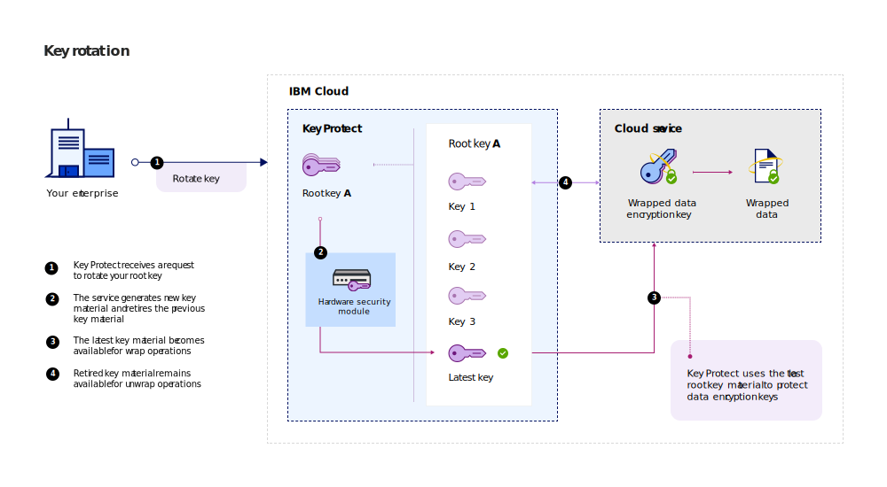
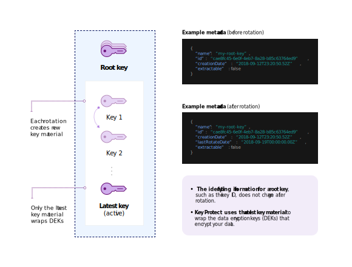

---

copyright:
  years: 2017, 2018
lastupdated: "2018-10-02"

---

{:shortdesc: .shortdesc}
{:codeblock: .codeblock}
{:screen: .screen}
{:new_window: target="_blank"}
{:pre: .pre}
{:tip: .tip}

# Key rotation
{: #key-rotation}

Key rotation takes place when you retire an encryption key, and you replace the key by generating new, cryptographic key material.

Rotating keys on a regular basis helps you meet industry standards and cryptographic best practices. The following table describes the main benefits of key rotation:

<table>
  <th>Benefit</th>
  <th>Description</th>
  <tr>
    <td>Cryptoperiod management for keys</td>
    <td>Key rotation limits the amount of information that is protected by a single key. By rotating your root keys at regular intervals, you also shorten the cryptoperiod of the keys. The longer the lifetime of an encryption key, the higher the probability for a security breach.</td>
  </tr>
  <tr>
    <td>Incident mitigation</td>
    <td>If your organization detects a security issue, you can immediately rotate the key to mitigate or reduce costs that are associated with key compromise.</td>
  </tr>

  <caption style="caption-side:bottom;">Table 1. Describes the benefits of key rotation</caption>
</table>

Key rotation is treated in the NIST Special Publication 800-57, Recommendation for Key Management. To learn more, see [NIST SP 800-57 Pt. 1 Rev. 4. ](http://nvlpubs.nist.gov/nistpubs/SpecialPublications/NIST.SP.800-57pt1r4.pdf){: new_window}
{: tip}

## How key rotation works
{: #how-rotation-works}

Cryptographic keys, in their lifetime, transition through different [key states](key-states.md). In the _Active_ state, keys encrypt and decrypt data. In the _Deactivated_ state, keys can't encrypt data, but they remain available for decryption. In the _Destroyed_ state, keys can no longer be used for either encryption or decryption.

Key rotation works by securely transitioning key material from an _Active_ to a _Deactivated_ state. To replace the retired key material, new key material moves into the _Active_ state and becomes available for cryptographic operations.

In {{site.data.keyword.keymanagementserviceshort}}, you can rotate your root keys on-demand, without needing to keep track of your retired root key material. The following diagram shows a contextual view of the key rotation functionality.

Rotation is available only for root keys. 
{: tip}

### Rotating root keys
{: #rotating-key}

With each rotation request, {{site.data.keyword.keymanagementserviceshort}} associates new key material with your root key. 

After a rotation completes, the new root key material becomes available for protecting future data encryption keys (DEKs) with [envelope encryption](envelope-encryption.md). Retired key material moves to the _Deactivated_ state, where it can only be used to unwrap and access older DEKs that aren't yet protected by the latest root key material. If {{site.data.keyword.keymanagementserviceshort}} detects that you're using retired root key material to unwrap an older DEK, the service automatically reencrypts the DEK and returns a wrapped data encryption key (WDEK) that's based on the latest root key material. Store and use the new WDEK for future unwrap operations, so you protect your DEKs with the latest root key material.

To learn how to use the {{site.data.keyword.keymanagementserviceshort}} API to rotate your root keys, see [Rotating keys](/docs/services/key-protect/rotate-keys.md).

When you rotate a key in {{site.data.keyword.keymanagementserviceshort}}, you're not charged additional fees. You can continue to unwrap your wrapped data encryption keys (WDEKs) with retired key material at no extra cost. For more information about our pricing options, see the [{{site.data.keyword.keymanagementserviceshort}} catalog page](https://console.bluemix.net/catalog/services/key-protect).
{: tip}

## Frequency of key rotation
{: #rotation-frequency}

After you generate a root key in {{site.data.keyword.keymanagementserviceshort}}, you decide the frequency of its rotation. You might want to rotate your keys due to personnel turnover, process malfunction, or according to your organization's internal key expiration policy. 

Rotate your keys regularly, for example every 30 days, to meet cryptographic best practices. {{site.data.keyword.keymanagementserviceshort}} allows one rotation per hour for each root key.