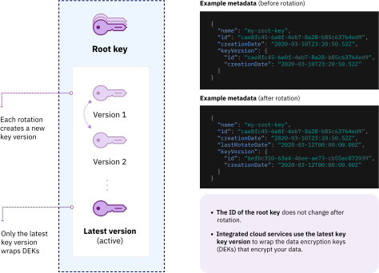

---

copyright:
  years: 2017, 2023
lastupdated: "2023-03-24"

keywords: rotate encryption keys, rotate keys automatically, key rotation

subcollection: key-protect

---

{:shortdesc: .shortdesc}
{:screen: .screen}
{:pre: .pre}
{:table: .aria-labeledby="caption"}
{:external: target="_blank" .external}
{:codeblock: .codeblock}
{:tip: .tip}
{:note: .note}
{:important: .important}
{:term: .term}

# Rotating your root keys
{: #key-rotation}

It is a best practice to rotate your root keys (that is, to create a new version of the key) on a regular basis. Regular rotations reduce what is known as the "cryptoperiod" of the key, and can also be used in specific cases such as personnel turnover, process malfunctions, or the detection of a security issue.

**If you suspect a key has been compromised, disable it as soon as possible**. Check out [Disabling root keys](/docs/key-protect?topic=key-protect-disable-keys) for more information.
{: important}

Recall that root keys are not just used to create data encryption keys (DEKs), they are also used in conjunction with a master key (secured by IBM using a Hardware Security Module) to create a "wrap" of a DEK. The resulting "wrapped data encryption key" (WDEK) protects the DEK, which is used to encrypt data. If a user has a DEK they want to use, that key can be passed when creating a WDEK using the `wrap` call. If no DEK is specified, {{site.data.keyword.keymanagementserviceshort}} creates the DEK for you.

Rotating to a new version of the root key does not immediately create a new WDEK, but it does mean that on the next wrap and re-wrap initiated by the user that the new root key will be used to create the new WDEK. Note that the new WDEK can also be unwrapped and used to read data encrypted with older versions of the DEK, and that old versions of the WDEK can still be unwrapped to obtain the DEK.

Each rotation creates a new "version" of the key, and you are charged on your {{site.data.keyword.cloud_notm}} account per key version. Check out [Pricing](/docs/key-protect?topic=key-protect-pricing-plan) for more information.
{: tip}

## Rotating manually or automatically
{: #compare-key-rotation-options}

Only root keys can be rotated using {{site.data.keyword.keymanagementserviceshort}}. Standard keys cannot be rotated.
{: note}

Root keys can be rotated manually or on a schedule set by the owner of the key. The option you choose depends on your preferences and the needs of your use case.

* **Setting a rotation policy**  
    The simplest key rotation option, setting an [automatic rotation interval](/docs/key-protect?topic=key-protect-key-rotation#rotation-frequency) means root keys are updated without further effort from the user. These rotations can be set at 30 day intervals (in other words, every 30 days, or 60 days, or 90 days, up to 12 months, or 720 days). This policy can be managed in the UI or by using the {{site.data.keyword.keymanagementserviceshort}} API. For more information about how to set a rotation policy, check out [Setting a rotation policy](/docs/key-protect?topic=key-protect-set-rotation-policy). The process can also be set using the [CLI](/docs/key-protect?topic=key-protect-cli-plugin-key-protect-cli-reference#kp-key-policy-update-rotation).

    To rotate a key that you initially imported to the service, you must generate and provide new key material for the key with each rotation. As a result, automatic rotation policies are not available for keys that have imported key material. Imported root keys must therefore be rotated manually. Note that the metadata for imported keys, such as the key ID, do not change when the key is rotated, just as with a key generated with {{site.data.keyword.keymanagementserviceshort}}.

* **Rotating keys manually**  
    As a security admin, you might want to have more control over the frequency of rotation for your root keys. If you don't want to set an automatic rotation policy for a key, you can manually create a new key to replace an existing key, and then update your applications so that they reference the new key.

    To simplify this process, you can use {{site.data.keyword.keymanagementserviceshort}} to rotate the root key at any time. In this scenario, {{site.data.keyword.keymanagementserviceshort}} creates and replaces the key on your behalf with each rotation request. The metadata and key ID of the key will not change. For more information about to manually rotate a key, check out [Manually rotating keys](/docs/key-protect?topic=key-protect-rotate-keys).

Manually rotating a root key does not disturb any rotation policy that might currently exist for the key. As a result, a good option is to set a regular rotation policy and then manually update keys more often as needed.
{: tip}

### How often should keys be rotated?
{: #rotation-frequency}

After you generate a root key in {{site.data.keyword.keymanagementserviceshort}}, you decide how often it is rotated. The best practice is to rotate your keys regularly.

| Rotation type | Frequency | Description |
| ------------- | --------- | ----------- |
| [Policy-based key rotation](/docs/key-protect?topic=key-protect-set-rotation-policy) | Intervals of 30 days (in other words, every 30 days, or 60 days, or 90 days, etc) | Choose a rotation interval between one and 12 months for your root key based on your security needs. After you set a rotation policy for a root key, the clock starts immediately based on the initial creation date for the key. If you choose at any time to manually rotate this key, the rotation period resets based on that rotation. |
| [Manual key rotation](/docs/key-protect?topic=key-protect-rotate-keys) | Up to one rotation per hour | {{site.data.keyword.keymanagementserviceshort}} allows no more than one rotation per hour for each key. |
{: caption="Table 2. Rotation frequency options for rotating keys in {{site.data.keyword.keymanagementserviceshort}}" caption-side="top"}

It is possible to learn the last date a key was rotated by using the `lastRotateDate` field available in APIs such as [`getkey`](/apidocs/key-protect#getkey), [`getkeymetadata`](/apidocs/key-protect#getkeymetadata), and [`getkeys`](/apidocs/key-protect#getkeys).
{: tip}

## How key rotation works
{: #how-key-rotation-works}

During a root key rotation, the key remains in an **active** state. However, older versions are deactivated and can be considered "retired". This latest version of the root key will then be used for all future actions. While unwraps can still be done with WDEKs which were generated with an older version of the root key, wraps and re-wraps use the latest version of the root key. Note that a previous key version can only be used to unwrap and access data encrypted using that particular key version or lower. An old version of a root key cannot be used to create a new DEK or to wrap the DEK and create a WDEK. For more information, check out [Managing retired key versions](#key-rotation-managing).

For more information about how key rotation works, check out [Understanding the key rotation process](#understand-key-rotation-process).

To enable key rotation options for your {{site.data.keyword.cloud_notm}} data service, the data service must be integrated with {{site.data.keyword.keymanagementserviceshort}}. Refer to the documentation for your {{site.data.keyword.cloud_notm}} data service, or [check out our list of integrated services to learn more](/docs/key-protect?topic=key-protect-integrate-services).
{: note}

### Monitoring key rotations
{: #key-rotation-monitoring}

After you rotate a root key, {{site.data.keyword.keymanagementserviceshort}} notifies the {{site.data.keyword.cloud_notm}} data services that use the key to protect your data. This notification triggers actions in those services to rewrap the key's associated data encryption keys (DEKs) with the latest key version.

After {{site.data.keyword.keymanagementserviceshort}} receives confirmation from those services that all associated DEKs are rewrapped, you receive an event in your {{site.data.keyword.at_full_notm}} UI to show that the rotation is complete.

### Managing retired key versions
{: #key-rotation-managing}

{{site.data.keyword.keymanagementserviceshort}} creates a new version of the root key with each rotation request. The service retires the old key versions and retains them until the key is deleted. The retired key versions can no longer be used to wrap keys, but they remain available for unwrap operations.

If {{site.data.keyword.keymanagementserviceshort}} detects that you're using a retired root key version to unwrap DEKs, the service provides a newly wrapped DEK that's based on the latest key version.

#### Rewrapping data after rotating a key
{: #rewrap-data-after-key-rotation}

Because retired key versions can only be used to access older DEKs, to secure your envelope encryption workflow, [rewrap your DEKs](/docs/key-protect?topic=key-protect-rewrap-keys) after you rotate a key so that your at rest data is protected by the newest key.

Alternatively, if {{site.data.keyword.keymanagementserviceshort}} detects that you're using a retired key version to unwrap a DEK, the service automatically re-encrypts the DEK and returns a wrapped data encryption key (WDEK) that is based on the latest root key.

Store and use the new WDEK for future unwrap operations so that the DEKs are protected with the newest key version.
{: tip}

To learn how to use the {{site.data.keyword.keymanagementserviceshort}} API to rewrap data encryption keys, see [Rewrapping keys](/docs/key-protect?topic=key-protect-rewrap-keys).

### Understanding the key rotation process
{: #understand-key-rotation-process}

Behind the scenes, the {{site.data.keyword.keymanagementserviceshort}} API drives the key rotation process. To learn how to use the {{site.data.keyword.keymanagementserviceshort}} API to rotate your keys, see [Rotating keys](/docs/key-protect?topic=key-protect-rotate-keys).

The following diagram shows a contextual view of how keys are rotated.
{: caption="Figure 1. Contextual view of key rotation." caption-side="bottom"}

With each rotation request, {{site.data.keyword.keymanagementserviceshort}} creates a new root key version by associating new key material with your key.

{: caption="Figure 2. Micro view of a key stack." caption-side="bottom"}

Keys do not rotate at precisely the same time of the day the key was created. That is, if a key was originally created at 8 a.m., it will not necessarily be rotated at 8 a.m. on the day the rotation is scheduled. Instead, the rotation can happen at any point during a 24-hour window.
{: note}

## What's next
{: #rotation-next-steps}

- For more information about how to use {{site.data.keyword.keymanagementserviceshort}} to set an automatic rotation policy for an individual root key, see
    [Setting a rotation policy](/docs/key-protect?topic=key-protect-set-rotation-policy).

- For more information about manually rotating root keys, check out [Manually rotating keys](/docs/key-protect?topic=key-protect-rotate-keys).

- For more information about viewing the key versions that are available for a root key, check out [Viewing key versions](/docs/key-protect?topic=key-protect-view-key-versions).
