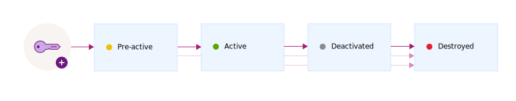

---

copyright:
  years: 2017, 2020
lastupdated: "2020-03-19"

keywords: encryption key states, encryption key lifecycle, manage key lifecycle

subcollection: key-protect

---

{:shortdesc: .shortdesc}
{:screen: .screen}
{:pre: .pre}
{:table: .aria-labeledby="caption"}
{:external: target="_blank" .external}
{:codeblock: .codeblock}
{:tip: .tip}
{:note: .note}
{:important: .important}
{:term: .term}

# Monitoring the lifecycle of encryption keys
{: #key-states}

{{site.data.keyword.keymanagementservicefull}} follows the security guidelines
by
[NIST SP 800-57 for key states](https://www.nist.gov/publications/recommendation-key-management-part-1-general-0){: external}.
{: shortdesc}

## Key states and transitions
{: #key-transitions}

Cryptographic keys, in their lifetime, transition through several states that
are a function of how long the keys are in existence and whether data is
protected.

{{site.data.keyword.keymanagementserviceshort}} provides a graphical user
interface and a REST API for tracking keys as they move through several states
in their lifecycle. The following diagram shows how a key passes through states
between its generation and its destruction.

{: caption="Figure 1. Key states and transitions." caption-side="bottom"}

| State          | Description                                                                                                                                                                                                                                                                        |
| -------------- | ---------------------------------------------------------------------------------------------------------------------------------------------------------------------------------------------------------------------------------------------------------------------------------- |
| Pre-active | Keys are initially created in the _Pre-activation_ state. A pre-active key cannot be used to cryptographically protect data.                                                                                                                                                       |
| Active         | Keys move immediately into the _Active_ state on the activation date. This transition marks the beginning of a key's cryptoperiod. Keys with no activation date become active immediately and remain active until they expire or are destroyed.                                    |
| Suspended      | A key moves into the _Suspended_ state when it is [disabled for encrypt and decrypt operations](/docs/key-protect?topic=key-protect-disable-keys). In this state, the key is unable to cryptographically protect data and can only be moved to the _Active_ or _Destroyed_ states. |
| Deactivated    | A key moves into the _Deactivated_ state on its expiration date, if one is assigned. In this state, the key is unable to cryptographically protect data and can only be moved to the _Destroyed_ state.                                                                            |
| Destroyed      | Deleted keys are in the _Destroyed_ state. Keys in this state are not recoverable. Metadata that is associated with a key, such as the key's transition history and name, is kept in the {{site.data.keyword.keymanagementserviceshort}} database.                                 |
{: caption="Table 1. Describes key states and transitions." caption-side="top"}

## Key states and service actions
{: #key-states-service-actions}

Key states affect whether an action that is performed on a key succeeds or
fails. For example, if a key is in the _Active_ state, you can't restore the
key, because the key wasn't previously deleted.

The following table shows how {{site.data.keyword.keymanagementserviceshort}}
handles service actions based on the state of a key. The column headers
represent the key states, and the row headers represent the actions that you can
perform on a key. The check mark icon
()
indicates that the action on a key is expected to succeed based on the key state.

| Action     | Active | Suspended | Deactivated | Destroyed |
| ----------- | ---------- | ------ | --------- | ----------- | --------- |
| Get key     | | | | |
| List keys   | | | | |
| Rotate key  | | | | |
| Wrap key    | | | | |
| Unwrap key  | | | | |
| Rewrap key  | | | | |
| Disable key | | | | |
| Enable key  | | | | |
| Delete key  | |  | | |
| Restore key | | | | |
{: caption="Table 2. Describes how key states affect service actions." caption-side="top"}

## Monitoring for lifecycle changes
{: #monitor-lifecycle-changes}

After you add a key to the service, use the {{site.data.keyword.keymanagementserviceshort}}
dashboard or the {{site.data.keyword.keymanagementserviceshort}} REST APIs to
view your key's transition history and configuration.

For audit purposes, you can also monitor the activity trail for a key by
integrating {{site.data.keyword.keymanagementserviceshort}} with
[{{site.data.keyword.at_full_notm}}](/docs/Activity-Tracker-with-LogDNA?topic=logdnaat-getting-started#getting-started).
After both services are provisioned and running, activity events are generated
and automatically collected in a {{site.data.keyword.at_full_notm}} log when you
perform actions on keys in {{site.data.keyword.keymanagementserviceshort}}.
