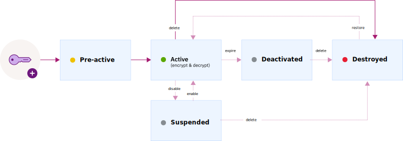

---

copyright:
  years: 2017, 2021
lastupdated: "2021-05-26"

keywords: encryption key states, encryption key lifecycle, manage key lifecycle

subcollection: key-protect

---

{:shortdesc: .shortdesc}
{:screen: .screen}
{:pre: .pre}
{:table: .aria-labeledby="caption"}
{:external: target="_blank" .external}
{:codeblock: .codeblock}
{:tip: .tip}
{:note: .note}
{:important: .important}
{:term: .term}

# Monitoring the lifecycle of encryption keys
{: #key-states}

{{site.data.keyword.keymanagementservicefull}} follows the established security guidelines per [NIST SP 800-57 for key states](https://www.nist.gov/publications/recommendation-key-management-part-1-general-0){: external}.
{: shortdesc}

## Key states and transitions
{: #key-transitions}

Cryptographic keys often transition through several states that are a function of how long the keys have been in existence and whether they are currently being used to encrypt data.

{{site.data.keyword.keymanagementserviceshort}} provides a graphical user interface and a REST API for tracking keys as they move through several states in their lifecycle. The following diagram shows how a key passes through states between its generation and its destruction.

Although this diagram shows keys in a "pre-activation" state, a state defined in NIST standards, from a technical point of view, "pre-active" defines a state before a key exists. Keys that do not yet exist cannot, obviously, have a state. Nevertheless, it is shown here for conceptual completeness. The "purged" state of a key, in which the key material has been permanently shredded a certain period of time after the key has been moved into a _Destroyed_ state, is not shown in this diagram and is similarly a state of nonexistence.
{: important}

{: caption="Figure 1. Key states and transitions." caption-side="bottom"}

| State       | Integer Mapping | Description |
| ----------- | --------------- | ----------- |
| Active      |       1         | Keys move immediately into the _Active_ state on the activation date. This transition marks the beginning of a key's cryptoperiod. Keys with no activation date become active immediately and remain active until they expire or are destroyed. |
| Suspended   |       2         | A key moves into the _Suspended_ state when it is [disabled for encrypt and decrypt operations](/docs/key-protect?topic=key-protect-disable-keys). In this state, the key is unable to cryptographically protect data and can only be moved to the _Active_ or _Destroyed_ states. |
| Deactivated |       3         | A key moves into the _Deactivated_ state within one hour past its expiration date, if one is assigned. In this state, the only actions that can be performed on the key are unwrap, rewrap, rotate, and delete. |
| Destroyed   |       5         | Keys are moved into the _Destroyed_ state after being deleted. Keys in this state can be recovered for 30 days but become eligible to be purged after 90 days. They can also be purged four hours after being moved into the _Destroyed_ state, if necessary. After being moved into a _Destroyed_ state, metadata that is associated with a key, such as its name and a record of when it last transitioned, is kept in the {{site.data.keyword.keymanagementserviceshort}} database until the key is purged. For more information, check out [About deleting and purging keys](/docs/key-protect?topic=key-protect-delete-purge-keys). |
{: caption="Table 1. Describes key states and transitions." caption-side="top"}

## Key states and service actions
{: #key-states-service-actions}

Key states affect whether an action that is performed on a key succeeds or fails. For example, if a key is in the _Active_ state, you can't restore the key, because the key wasn't previously deleted.

The following table describes how key states affect service actions. The column headers represent the key states, and the row headers represent the actions that you can perform on a key. The check mark icon ( indicates that the action on a key is expected to succeed based on the key state.

| Action      | Active                                             | Suspended (disabled keys)                                         | Deactivated (expired keys)                                       | Destroyed (deleted keys)                                          |
| ----------- | -------------------------------------------------- | -------------------------------------------------- | -------------------------------------------------- | -------------------------------------------------- |
| Get key     |  |  |  |  |
| List keys   |  |  |  |                                                    |
| Rotate key  |  |  |  |                                                    |
| Wrap key    |  |                                                    |                                                    |                                                    |
| Unwrap key  |  |                                                    |  |                                                    |
| Rewrap key  |  |                                                    |  |                                                    |
| Disable key |  |                                                    |                                                    |                                                    |
| Enable key  |                                                    |  |                                                    |                                                    |
| Delete key  |  |  |  |                                                    |
| Restore key |                                                    |                                                    |                                                    |  |
{: caption="Table 2. Describes how key states affect service actions." caption-side="top"}

### Cryptoperiods, originator-usage periods, and recipient-usage periods
{: #key-states-periods}

If you're familiar with NIST standard terms and key management systems, then you're probably aware of the concepts of a "crpytoperiod", an "originator-usage period", and a "recepient-usage period".

A "cryptoperiod" describes the complete lifecycle of a key. If a key is purged one year after it was created, the crpytoperiod of the key was one year. The cryptoperiod of a key, then, begins when it is created.

Similarly, the "originator-usage period" and "recepient-usage period" also begin when a key is created. The former describes the time in which a key can be used to protect data by wrapping it. The "recepient-usage period", on the other hand, describes the time in which a key can be "unwrapped" to decrypt protected data. Recall that deactivated keys can no longer be used to wrap data, but still can be used to unwrap data. Therefore, if a key is moved to the _Deactivated_ state (for example, by establishing an expiration date), it's originator-usage period has ended. However, its recepient-usage period will continue until the key is deleted.

If no expiration date is set on a key (and it is not manually suspended, deactivated, or destroyed), the originator-usage period, recipient-usage period, and cryptoperiod of the key are the same.
{: tip}

## Monitoring for lifecycle changes
{: #monitor-lifecycle-changes}

After you add a key to the service, use the {{site.data.keyword.keymanagementserviceshort}} dashboard or the {{site.data.keyword.keymanagementserviceshort}} REST APIs to view the last time the key was transitioned.

For audit purposes, you can also monitor the activity trail for a key by integrating {{site.data.keyword.keymanagementserviceshort}} with [{{site.data.keyword.at_full_notm}}](/docs/activity-tracker?topic=activity-tracker-getting-started){: external}. After both services are provisioned and running, activity events are generated and automatically collected in a {{site.data.keyword.at_full_notm}} log when you perform actions on keys in {{site.data.keyword.keymanagementserviceshort}}.
