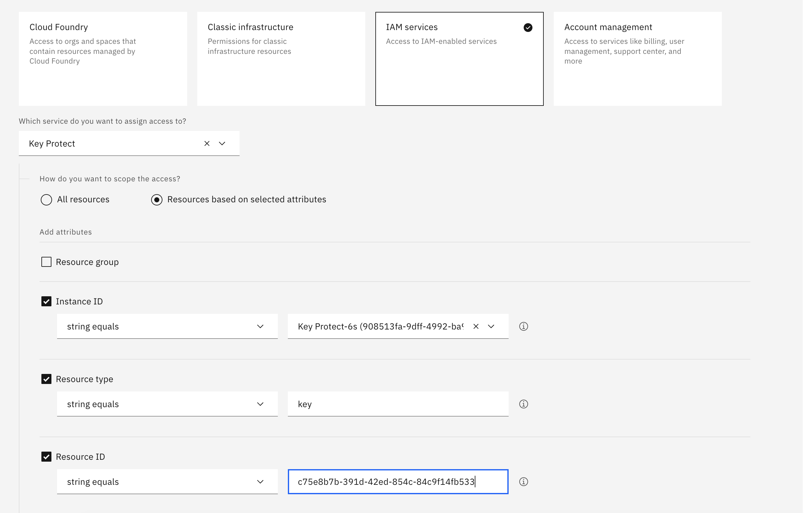

---

copyright:
  years: 2017, 2024
lastupdated: "2024-10-09"

keywords: grant user access, IAM permissions, IAM roles

subcollection: key-protect

---

{:shortdesc: .shortdesc}
{:screen: .screen}
{:pre: .pre}
{:table: .aria-labeledby="caption"}
{:external: target="_blank" .external}
{:codeblock: .codeblock}
{:tip: .tip}
{:note: .note}
{:important: .important}
{:deprecated: .deprecated}
{:term: .term}

# Granting access to keys
{: #grant-access-keys}

You can enable different levels of access to {{site.data.keyword.keymanagementservicelong}} resources in your {{site.data.keyword.cloud_notm}} account by creating and modifying {{site.data.keyword.cloud_notm}} IAM access policies.
{: shortdesc}

Account admins should determine an [access policy type](/docs/account?topic=account-userroles){: external} for users, service IDs, and [access groups](#x2160811){: term} based on internal access control requirements. These access controls can be assigned at multiple levels, from instances down to individual keys. For example, if you want to grant user access to {{site.data.keyword.keymanagementserviceshort}} at the smallest scope available, you can [assign access to a single key](#grant-access-key-level) in an instance.

## Granting access to all keys in an instance
{: #grant-access-instance-level}

Review [roles and permissions](/docs/key-protect?topic=key-protect-manage-access) to learn how {{site.data.keyword.cloud_notm}} IAM roles map to {{site.data.keyword.keymanagementserviceshort}} actions.
{: tip}

To grant access to keys within a {{site.data.keyword.keymanagementserviceshort}} instance by using the {{site.data.keyword.cloud_notm}} console:

1. From the menu bar, click **Manage** &gt; **Access (IAM)**, and select **Users** to browse the existing users in your account.

2. Select a table row, and click the ⋯ icon to open a list of options for that user.

3. From the options menu, click **Assign access**.

4. Click **Assign access**.

5. Choose whether you want to assign access to a group (by clicking **Access group**) or to an individual (by clicking **Access policies**). Your access groups can be found by clicking **Access groups** in the **Manage access** section of the left navigation.

6. From the list of services, select **{{site.data.keyword.keymanagementserviceshort}}** and click **Next** to open the **Resources** section.

7. In the **Resources** section, use the radio buttons to select whether you assign access over all resources or only specific resources. If you select **Specific resources** you are asked to provide an **Attribute type** (for example, a **Key ring ID**, where the string equals the ID). The **Add a condition** box allows you add more attributes to the policy you create in the next step. When you are ready, click **Next** to create the policy. Note that you can click **Edit** if you want to go back to the list of services.

8. In the **Roles and access** section, you can assign access over the resources you have selected. For more information about the difference between **Service access** roles and **Platform access** roles, check out [Platform roles and service roles](/docs/key-protect?topic=key-protect-manage-access#manage-access-roles). The box to the right of the selection options dynamically updates to provide a summary of the access that would be assigned if the selected options are kept. Review the provided list of access carefully. Note that a JSON version of the policy can be viewed (and copied) by clicking `JSON` in the tab marked `[UI|JSON]` to the right of the **Create policy** header.

9. When you are satisfied with your policy, click **Add**. This creates the selected policy over the selected resources. The **Access summary** column shows the created policy. If there is an error, you can **Remove** or **Edit** the access in this section.

## Granting access to a single key in an instance
{: #grant-access-key-level}

Calling the [list keys API](/apidocs/key-protect#getkeys) will not return keys that you have assigned individual access to (that **only you** can access, in other words, even if you have the access over those keys and you are the one making the call). Calling this API will, however, return the keys in key rings you have access to.
{: note}

If you need to assign access beyond the instance level, you can choose to assign access to a particular key or to a [key ring](#grant-access-key-ring-console).

To create an access policy for a particular key, you need to:

1. [Retrieve the key ID](#access-key-retrieve-ID).
2. [Create an access policy](#access-key-create-policy).

### Step 1. Retrieve the key ID
{: #access-key-retrieve-ID}

Retrieve the unique identifier that's associated with the key that you want to grant someone access to.

To get the ID for a specific key, you can:

- [Access the {{site.data.keyword.keymanagementserviceshort}} GUI](/docs/key-protect?topic=key-protect-view-keys#view-keys-gui) to browse the keys that are stored in your {{site.data.keyword.keymanagementserviceshort}} instance.

- [Use the {{site.data.keyword.keymanagementserviceshort}} API](/docs/key-protect?topic=key-protect-view-keys#retrieve-keys-api) to retrieve a list of your keys, along with metadata about the keys.

### Step 2. Create an access policy
{: #access-key-create-policy}

You can create an access policy for a key by targeting the instance and the key by:

1. From the menu bar, click **Manage** &gt; **Access (IAM)**, and select **Users** to browse the existing users in your account.

2. Select a table row, and click the ⋯ icon to open a list of options for that user.

3. From the options menu, click **Assign access**.

4. Click **Assign access to the users**.

5. From the list of services, select **{{site.data.keyword.keymanagementserviceshort}}**.

6. From the list of {{site.data.keyword.keymanagementserviceshort}} instances, select the {{site.data.keyword.keymanagementserviceshort}} instance that contains the key that you want to grant access to.

7. Select **Resources based on selected attributes**.

8. Click the **Instance ID** box and select the instance in which the key ring resides from the drop-down list.

9. Click the **Resource type** box and enter `key`.

10. Click the **Resource ID** box enter the ID that was assigned to your key by the {{site.data.keyword.keymanagementserviceshort}} service.

11. Choose a combination of [platform and service access roles](/docs/key-protect?topic=key-protect-manage-access#manage-access-roles) to assign access for the user.

12. Click **Add**.

13. Continue to add platform and service access roles as needed. When you are finished, click **Assign**.

{: caption="Shows how to grant user access to a specific key." caption-side="bottom"}

## Granting access to key rings in an instance
{: #grant-access-key-ring-level}

A key ring is a collection of keys located within your service instance, in which you can restrict access to via IAM access policy. For information on key rings, see [Grouping keys](/docs/key-protect?topic=key-protect-grouping-keys).

You can grant access to key rings within a {{site.data.keyword.keymanagementserviceshort}} instance by using the {{site.data.keyword.cloud_notm}} console, IAM API, or IAM CLI.

Review [roles and permissions](/docs/key-protect?topic=key-protect-manage-access) to learn how {{site.data.keyword.cloud_notm}} IAM roles map to {{site.data.keyword.keymanagementserviceshort}} actions.
{: tip}

### Granting access to key rings in an instance using the console
{: #grant-access-key-ring-console}

To assign access to a key ring via the console:

1. From the menu bar, click **Manage** &gt; **Access (IAM)**, and select **Users** to browse the existing users in your account.

2. Select a table row, and click the ⋯ icon to open a list of options for that user.

3. From the options menu, click **Assign access**.

4. Click **Assign access to the users**.

5. Click the **IAM services** tile.

6. From the list of services, select **{{site.data.keyword.keymanagementserviceshort}}**.

7. Select **Resources based on selected attributes**.

8. Click the **Instance ID** box and select the instance in which the key ring resides from the drop-down list.

9. Click the **Key Ring ID** box and enter the name of the key ring. Note that the key ring ID is case sensitive and must be exact.

8. Choose the combination of [platform and service access roles](/docs/key-protect?topic=key-protect-manage-access#manage-access-roles) you want this user to have.

9. Click **Add**.

10. Continue to add platform and service access roles as needed and when you are finished, click **Assign**. Note that the user must be assigned at least _Reader_ access to the entire instance in order for them to list, create and delete key rings within the instance.

{: caption="Shows how to grant user access to a key ring." caption-side="bottom"}

## Granting access for specific functions
{: #grant-access-keys-specific-functions}

In order to use the {{site.data.keyword.keymanagementserviceshort}} [Key Purge feature](/docs/key-protect?topic=key-protect-delete-purge-keys), a specific role called `KeyPurge` must be granted as it is not enabled by default, even for the account owner. Once you've followed the steps listed in the other sections of this topic for either granting access to this permission for all keys, or a specific key, choose the _KeyPurge_ role as shown in the graphic.

{: caption="Shows how to grant permission to use the Key Purge Feature." caption-side="bottom"}

## Next Steps
{: #grant-access-keys-next-steps}

You can also create an access policy via the {{site.data.keyword.keymanagementserviceshort}} [API](/apidocs/iam-policy-management#create-policy){: external} or the {{site.data.keyword.keymanagementserviceshort}} [CLI plugin](/docs/cli?topic=cli-ibmcloud_commands_iam#ibmcloud_iam_user_policy_create){: external}.
