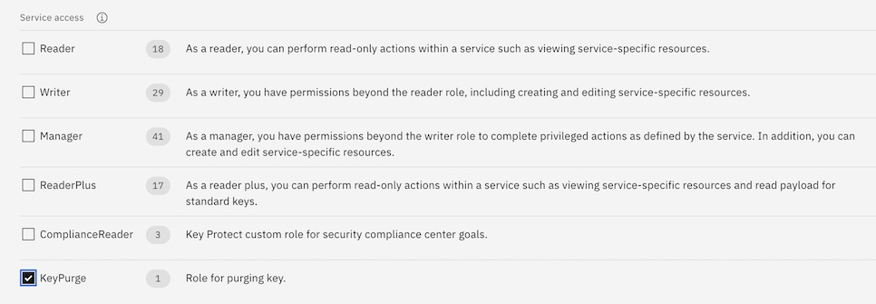

---

copyright:
  years: 2017, 2021
lastupdated: "2021-08-16"

keywords: grant user access, IAM permissions, IAM roles

subcollection: key-protect

---

{:shortdesc: .shortdesc}
{:screen: .screen}
{:pre: .pre}
{:table: .aria-labeledby="caption"}
{:external: target="_blank" .external}
{:codeblock: .codeblock}
{:tip: .tip}
{:note: .note}
{:important: .important}
{:deprecated: .deprecated}
{:term: .term}

# Granting access to keys
{: #grant-access-keys}

You can enable different levels of access to
{{site.data.keyword.keymanagementservicelong}} resources in your
{{site.data.keyword.cloud_notm}} account by creating and modifying
{{site.data.keyword.cloud_notm}} IAM access policies.
{: shortdesc}

As an account admin, determine an
[access policy type](/docs/account?topic=account-userroles#policytypes){: external}
for users, service IDs, and
[access groups](#x2160811){: term}
based on your internal access control requirements. For example, if you want to
grant user access to {{site.data.keyword.keymanagementserviceshort}} at the
smallest scope available, you can
[assign access to a single key](#grant-access-key-level)
in an instance.

## Granting access to all keys in an instance
{: #grant-access-instance-level}

You can grant access to keys within a
{{site.data.keyword.keymanagementserviceshort}} instance by using the
{{site.data.keyword.cloud_notm}} console.

Review
[roles and permissions](/docs/key-protect?topic=key-protect-manage-access)
to learn how {{site.data.keyword.cloud_notm}} IAM roles map to
{{site.data.keyword.keymanagementserviceshort}} actions.
{: tip}

To assign access:

1. From the menu bar, click **Manage** &gt; **Access (IAM)**, and select
    **Users** to browse the existing users in your account.

2. Select a table row, and click the ⋯ icon to open a list of options for that
    user.

3. From the options menu, click **Assign access**.

4. Click **Assign users additional access**.

5. Click the **IAM services** button.

6. From the list of services, select
    **{{site.data.keyword.keymanagementserviceshort}}**.

7. From the list of {{site.data.keyword.keymanagementserviceshort}} instances,
    select a {{site.data.keyword.keymanagementserviceshort}} instance that you
    want to grant access to.

8. Choose a combination of
    [platform and service access roles](/docs/key-protect?topic=key-protect-manage-access#manage-access-roles)
    to assign access for the user.

9. Click **Add**.

10. Continue to add platform and service access roles as needed and when you are
    finished, click **Assign**.

{: caption="Figure 1. Shows how to grant user access to an instance." caption-side="bottom"}

## Granting access to a single key in an instance
{: #grant-access-key-level}

You can also assign access to a single key in a
{{site.data.keyword.keymanagementserviceshort}} instance.

### Step 1. Retrieve the key ID
{: #access-key-retrieve-ID}

Retrieve the unique identifer that's associated with the key that you want to
grant someone access to.

To get the ID for a specific key, you can:

- [Access the {{site.data.keyword.keymanagementserviceshort}} GUI](/docs/key-protect?topic=key-protect-view-keys#view-keys-gui)
    to browse the keys that are stored in your
    {{site.data.keyword.keymanagementserviceshort}} instance.

- [Use the {{site.data.keyword.keymanagementserviceshort}} API](/docs/key-protect?topic=key-protect-view-keys#retrieve-keys-api)
    to retrieve a list of your keys, along with metadata about the keys.

### Step 2. Create an access policy
{: #access-key-create-policy}

Use the retrieved key ID to create a access policy:

1. From the menu bar, click **Manage** &gt; **Access (IAM)**, and select
    **Users** to browse the existing users in your account.

2. Select a table row, and click the ⋯ icon to open a list of options for that
    user.

3. From the options menu, click **Assign access**.

4. Click **Assign users additional access**.

5. From the list of services, select
    **{{site.data.keyword.keymanagementserviceshort}}**.

6. From the list of {{site.data.keyword.keymanagementserviceshort}} instances,
    select the {{site.data.keyword.keymanagementserviceshort}} instance that
    contains the key that you want to grant access to.

7. Enter identifying information about the key.

    1. For **Resource type**, enter the word "key".

    2. For **Resource ID**, enter the ID that was assigned to your key by the
        {{site.data.keyword.keymanagementserviceshort}} service.

8. Choose a combination of
    [platform and service access roles](/docs/key-protect?topic=key-protect-manage-access#manage-access-roles)
    to assign access for the user.

9. Click **Add**.

10. Continue to add platform and service access roles as needed and when you are
    finished, click **Assign**.

{: caption="Figure 2. Shows how to grant user access to a key." caption-side="bottom"}

## Granting access to key rings in an instance
{: #grant-access-key-ring-level}

A key ring is a collection of keys located within your service instance, in which you can
restrict access to via IAM access policy. For information on key rings,
see [Grouping keys](/docs/key-protect?topic=key-protect-grouping-keys).

You can grant access to key rings within a
{{site.data.keyword.keymanagementserviceshort}} instance by using the
{{site.data.keyword.cloud_notm}} console, IAM API, or IAM CLI.

Review
[roles and permissions](/docs/key-protect?topic=key-protect-manage-access)
to learn how {{site.data.keyword.cloud_notm}} IAM roles map to
{{site.data.keyword.keymanagementserviceshort}} actions.
{: tip}

### Granting access to key rings in an instance via console
{: #grant-access-key-ring-console}

To assign access to a key ring via the console:

1. From the menu bar, click **Manage** &gt; **Access (IAM)**, and select
    **Users** to browse the existing users in your account.

2. Select a table row, and click the ⋯ icon to open a list of options for that
    user.

3. From the options menu, click **Assign access**.

4. Click **Assign users additional access**.

5. Click the **IAM services** button.

6. From the list of services, select
    **{{site.data.keyword.keymanagementserviceshort}}**.

7. Select **Services based on attributes**.

8. Select the **Instance ID** attribute and select the instance in which the key
    ring resides.

9. Select the **Key Ring ID** attribute and enter the ID associated with the key ring.

8. Choose a combination of
    [platform and service access roles](/docs/key-protect?topic=key-protect-manage-access#manage-access-roles)
    to assign access for the user.

9. Click **Add**.

10. Continue to add platform and service access roles as needed and when you are
    finished, click **Assign**.

{: caption="Figure 3. Shows how to select specific targets, including Key Rings." caption-side="bottom"}

## Granting access for specific functions
{: #grant-access-keys-specific-functions}

In order to use the {{site.data.keyword.keymanagementserviceshort}} [Key Purge feature](/docs/key-protect?topic=key-protect-delete-purge-keys), a specific role called `KeyPurge` must be granted as it is not enabled by default, even for the account owner. Once you've followed the steps listed in the other sections of this topic for either granting access to this permission for all keys, or a specific key, choose the _KeyPurge_ role as shown in the graphic.

{: caption="Figure 4. Shows how to grant permission to use the Key Purge Feature." caption-side="bottom"}

## Next Steps
{: #grant-access-keys-next-steps}

You can also create an access policy via the {{site.data.keyword.keymanagementserviceshort}} [API](/apidocs/iam-policy-management#create-policy){: external}
or the {{site.data.keyword.keymanagementserviceshort}} [CLI plugin](/docs/cli?topic=cli-ibmcloud_commands_iam#ibmcloud_iam_user_policy_create){: external}.

