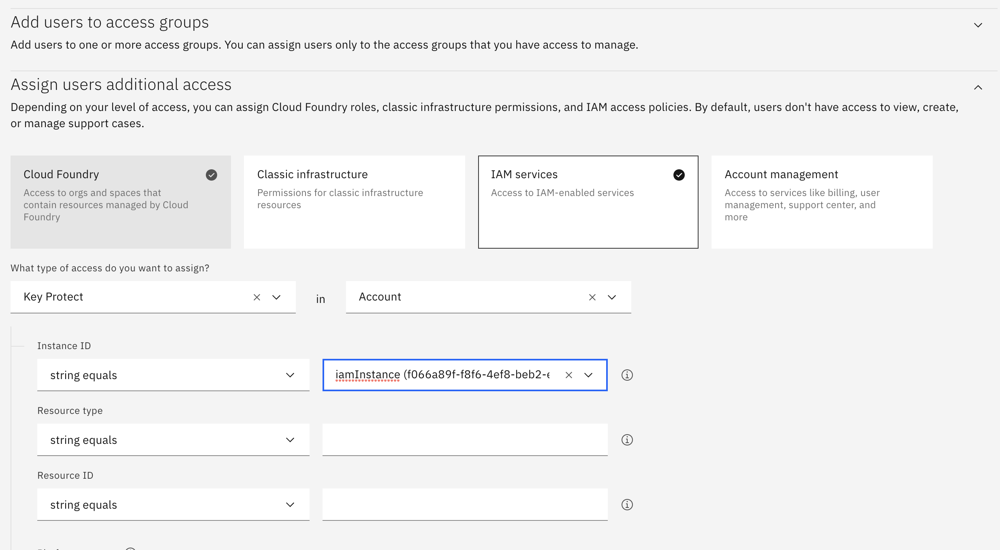
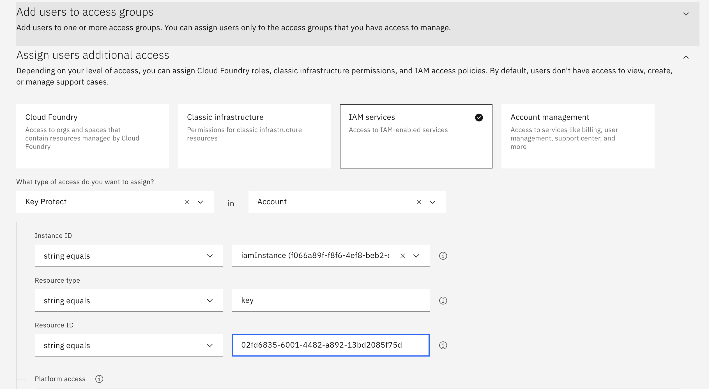

---

copyright:
  years: 2017, 2020
lastupdated: "2020-06-15"

keywords: grant access to keys

subcollection: key-protect

---

{:shortdesc: .shortdesc}
{:screen: .screen}
{:pre: .pre}
{:table: .aria-labeledby="caption"}
{:external: target="_blank" .external}
{:codeblock: .codeblock}
{:tip: .tip}
{:note: .note}
{:important: .important}
{:deprecated: .deprecated}
{:term: .term}

# Granting access to keys
{: #grant-access-keys}

You can enable different levels of access to {{site.data.keyword.keymanagementservicelong}}
resources in your {{site.data.keyword.cloud_notm}} account by creating and
modifying {{site.data.keyword.cloud_notm}} IAM access policies.
{: shortdesc}

As an account admin, determine an
[access policy type](/docs/iam?topic=iam-userroles#policytypes){: external}
for users, service IDs, and
[access groups](#x2160811){: term}
based on your internal access control requirements. For example, if you want to
grant user access to {{site.data.keyword.keymanagementserviceshort}} at the
smallest scope available, you can
[assign access to a single key](#grant-access-key-level)
in an instance.

## Granting access to all keys in an instance
{: #grant-access-instance-level}

You can grant access to keys within a {{site.data.keyword.keymanagementserviceshort}}
service instance by using the {{site.data.keyword.cloud_notm}} console.

Review
[roles and permissions](/docs/key-protect?topic=key-protect-manage-access)
to learn how {{site.data.keyword.cloud_notm}} IAM roles map to
{{site.data.keyword.keymanagementserviceshort}} actions.
{: tip}

To assign access:

1. From the menu bar, click **Manage** &gt; **Access (IAM)**, and select **Users** to browse the existing users in your account.
2. Select a table row, and click the ⋯ icon to open a list of options for that user.
3. From the options menu, click **Assign access**.
4. Click **Assign users additional access**.
5. Click the **IAM services** button.
6. From the list of services, select **{{site.data.keyword.keymanagementserviceshort}}**.
7. From the list of service instances, select a {{site.data.keyword.keymanagementserviceshort}} service instance that you want to grant access to.
8. Choose a combination of [platform and service access roles](/docs/key-protect?topic=key-protect-manage-access#roles) to assign access for the user.
9. Click **Add**.
10. Continue to add platform and service access roles as needed and when you are finished, click **Assign**.

{: caption="Figure 1. Shows how to grant user access to an instance." caption-side="bottom"}

## Granting access to a single key in an instance
{: #grant-access-key-level}

You can also assign access to a single key in a
{{site.data.keyword.keymanagementserviceshort}} service instance.

### Step 1. Retrieve the key ID
{: #access-key-retrieve-ID}

Retrieve the unique identifer that's associated with the key that you want to
grant someone access to.

To get the ID for a specific key, you can:

- [Access the {{site.data.keyword.keymanagementserviceshort}} GUI](/docs/key-protect?topic=key-protect-view-keys#view-keys-gui)
to browse the keys that are stored in your service instance.
- [Use the {{site.data.keyword.keymanagementserviceshort}} API](/docs/key-protect?topic=key-protect-view-keys#retrieve-keys-api)
to retrieve a list of your keys, along with metadata about the keys.

### Step 2. Create an access policy
{: #access-key-create-policy}

Use the retrieved key ID to create a access policy:

1. From the menu bar, click **Manage** &gt; **Access (IAM)**, and select **Users** to browse the existing users in your account.
2. Select a table row, and click the ⋯ icon to open a list of options for that user.
3. From the options menu, click **Assign access**.
4. Click **Assign users additional access**.
5. From the list of services, select **{{site.data.keyword.keymanagementserviceshort}}**.
6. From the list of service instances, select the {{site.data.keyword.keymanagementserviceshort}} service instance that contains the key that you want
to grant access to.
7. Enter identifying information about the key.
   1. For **Resource type**, enter the word "key".
   2. For **Resource ID**, enter the ID that was assigned to your key by the {{site.data.keyword.keymanagementserviceshort}} service.
8. Choose a combination of [platform and service access roles](/docs/key-protect?topic=key-protect-manage-access#roles) to assign access for the user.
9. Click **Add**.
10. Continue to add platform and service access roles as needed and when you are finished, click **Assign**.

{: caption="Figure 2. Shows how to grant user access to a key." caption-side="bottom"}