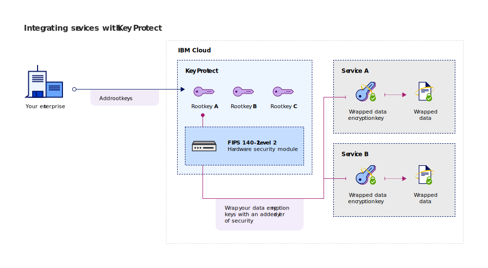

---

copyright:
  years: 2017, 2018
lastupdated: "2018-08-24"

---

{:shortdesc: .shortdesc}
{:codeblock: .codeblock}
{:screen: .screen}
{:new_window: target="_blank"}
{:pre: .pre}
{:tip: .tip}

# Integrating services
{: #integrate-services}

{{site.data.keyword.keymanagementservicefull}} integrates with data and storage solutions to help you bring and manage your own encryption in the cloud.
{: shortdesc}

[After you create an instance of the service](/docs/services/key-protect/provision.html), you can integrate {{site.data.keyword.keymanagementserviceshort}} with the following supported services:

<table>
    <tr>
        <th>Service</th>
        <th>Description</th>
    </tr>
    <tr>
        <td>
          
{{site.data.keyword.cos_full_notm}}

        </td>
        <td>
          
Add [envelope encryption](/docs/services/key-protect/concepts/envelope-encryption.html) to your storage buckets by using {{site.data.keyword.keymanagementserviceshort}}. Use root keys that you manage in {{site.data.keyword.keymanagementserviceshort}} to protect the data encryption keys that encrypt your data at rest.

          
For more information, check out [Integrating with {{site.data.keyword.cos_full_notm}}](/docs/services/key-protect/integrations/integrate-cos.html).

        </td>
    </tr>
   <caption style="caption-side:bottom;">Table 1. Describes the integrations that are available for {{site.data.keyword.keymanagementserviceshort}}</caption>
</table>

## Understanding your integration 
{: #understand-integration}

When you integrate a supported service with {{site.data.keyword.keymanagementserviceshort}}, you enable [envelope encryption](/docs/services/key-protect/concepts/envelope-encryption.html) for that service. This integration allows you to use a root key that you store in {{site.data.keyword.keymanagementserviceshort}} to wrap the data encryption keys that encrypt your data at rest. 

For example, you can create a root key, manage the key in {{site.data.keyword.keymanagementserviceshort}}, and use the root key to protect the data that is stored across different cloud services.

### {{site.data.keyword.keymanagementserviceshort}} API methods
{: #api-methods}

Behind the scenes, the {{site.data.keyword.keymanagementserviceshort}} API drives the envelope encryption process.  

The following table lists the API methods that add or remove envelope encryption on a resource.

<table>
  <tr>
    <th>Method</th>
    <th>Description</th>
  </tr>
  <tr>
    <td><code>POST /keys/{root_key_ID}?action=wrap</code></td>
    <td><a href="/docs/services/key-protect/wrap-keys.html">Wrap (encrypt) a data encryption key</a></td>
  </tr>
  <tr>
    <td><code>POST /keys/{root_key_ID}?action=unwrap</code></td>
    <td><a href="/docs/services/key-protect/unwrap-keys.html">Unwrap (decrypt) a data encryption key</a></td>
  </tr>
  <caption style="caption-side:bottom;">Table 2. Describes the {{site.data.keyword.keymanagementserviceshort}} API methods</caption>
</table>

To find out more about programmatically managing your keys in {{site.data.keyword.keymanagementserviceshort}}, check out the [{{site.data.keyword.keymanagementserviceshort}} API reference doc ](https://console.bluemix.net/apidocs/kms){: new_window}.
{: tip}

## Integrating a supported service
{: #grant-access}

To add an integration, create an authorization between services by using the {{site.data.keyword.iamlong}} dashboard. Authorizations enable service to service access policies, so you can associate a resource in your cloud data service with a [root key](/docs/services/key-protect/concepts/envelope-encryption.html#key-types) that you manage in {{site.data.keyword.keymanagementserviceshort}}.

Be sure to provision both services in the same region before you create an authorization. To learn more about service authorizations, see [Granting access between services ](/docs/iam/authorizations.html){: new_window}.
{: tip}

When you're ready to integrate a service, use the following steps to create an authorization:

1. [Log in to the {{site.data.keyword.cloud_notm}} console ](https://console.bluemix.net/){: new_window}.
2. From the menu bar, click **Manage** &gt; **Security** &gt; **Identity and Access**, and then select **Authorizations**. 
3. Click **Create**.
4. Select a source and target for the authorization.
 
  - For **Source service**, select the cloud data service that you want to integrate with {{site.data.keyword.keymanagementserviceshort}}. For example, **Cloud Object Storage**.
  - For **Target service**, select **{{site.data.keyword.keymanagementservicelong_notm}}**. 
4. To grant read-only access between the services, select the **Reader** check box.

    With _Reader_ permissions, your source service can browse the root keys that are provisioned in the specified instance of {{site.data.keyword.keymanagementserviceshort}}.
5. Click **Authorize**.

### What's next

Add advanced encryption to your cloud resources by creating a root key in {{site.data.keyword.keymanagementserviceshort}}. Add a new resource to a supported cloud data service, and then select the root key that you want to use for advanced encryption.

- To find out more about creating root keys with the {{site.data.keyword.keymanagementserviceshort}} service, see [Creating root keys](/docs/services/key-protect/create-root-keys.html).
- To find out more about bringing your own root keys to the {{site.data.keyword.keymanagementserviceshort}} service, see [Importing root keys](/docs/services/key-protect/import-root-keys.html).

