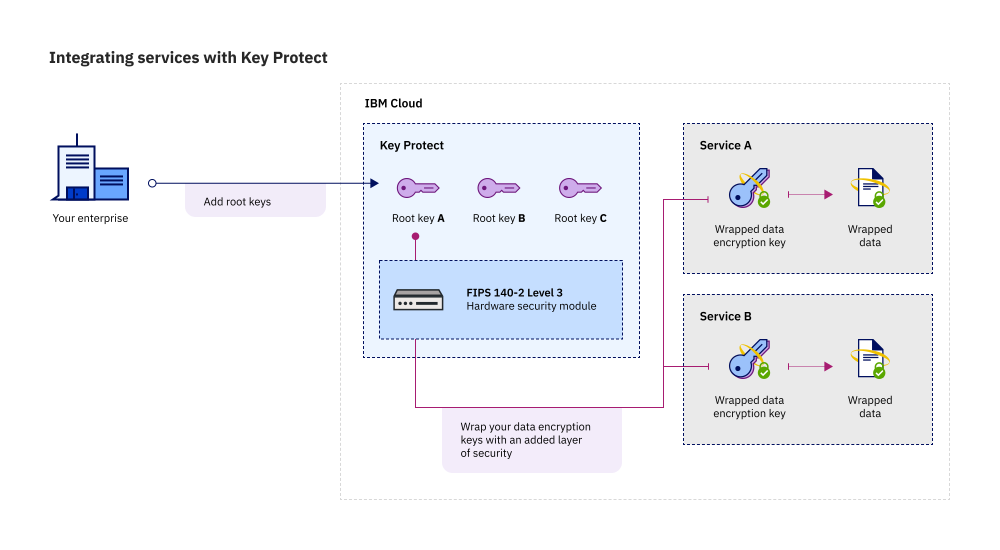

---

copyright:
  years: 2017, 2020
lastupdated: "2020-02-25"

keywords: Key Protect integration, integrate service with Key Protect

subcollection: key-protect

---

{:shortdesc: .shortdesc}
{:screen: .screen}
{:pre: .pre}
{:table: .aria-labeledby="caption"}
{:external: target="_blank" .external}
{:codeblock: .codeblock}
{:tip: .tip}
{:note: .note}
{:important: .important}
{:term: .term}

# Integrating services
{: #integrate-services}

{{site.data.keyword.keymanagementservicefull}} integrates with a number of
{{site.data.keyword.cloud_notm}} services to enable encryption with
customer-managed keys for those services. Encryption with customer-managed
encryption keys is sometimes called Bring Your Own Key (BYOK).
{: shortdesc}

You can integrate {{site.data.keyword.keymanagementserviceshort}} with the
following supported services.

| Service | Description | Links |
| ------- | ----------- | ----- |
| [{{site.data.keyword.cloudant_short_notm}} for {{site.data.keyword.cloud_notm}} ({{site.data.keyword.cloud_notm}} Dedicated)](/docs/Cloudant?topic=Cloudant-ibm-cloud-dedicated) | {{site.data.keyword.cloudant_short_notm}} is a document-oriented database as a service (DBaaS). It stores data as documents in JSON format. | [View docs](/docs/Cloudant?topic=Cloudant-securing-your-data-in-cloudant) |
| [{{site.data.keyword.databases-for-elasticsearch_full_notm}}](/docs/databases-for-elasticsearch) | {{site.data.keyword.databases-for-elasticsearch_full_notm}} is a managed Elasticsearch service that is hosted in the {{site.data.keyword.cloud_notm}} and integrated with other {{site.data.keyword.cloud_notm}} services. | [View docs](/docs/databases-for-elasticsearch?topic=cloud-databases-key-protect) |
| [{{site.data.keyword.databases-for-etcd_full_notm}}](/docs/databases-for-etcd) | {{site.data.keyword.databases-for-etcd_full_notm}} is a managed etcd service that is hosted in the {{site.data.keyword.cloud_notm}} and integrated with other {{site.data.keyword.cloud_notm}} services. | [View docs](/docs/databases-for-etcd?topic=cloud-databases-key-protect) |
| [{{site.data.keyword.databases-for-mongodb_full_notm}}](/docs/databases-for-mongodb) | {{site.data.keyword.databases-for-mongodb_full_notm}} is a managed MongoDB service that is hosted in the {{site.data.keyword.cloud_notm}} and integrated with other {{site.data.keyword.cloud_notm}} services. | [View docs](/docs/databases-for-mongodb?topic=cloud-databases-key-protect) |
| [{{site.data.keyword.databases-for-postgresql_full_notm}}](/docs/databases-for-postgresql) | {{site.data.keyword.databases-for-postgresql_full_notm}} is a managed PostgreSQL service that is hosted in the {{site.data.keyword.cloud_notm}} and integrated with other {{site.data.keyword.cloud_notm}} services. | [View docs](/docs/databases-for-postgresql?topic=cloud-databases-key-protect) |
| [{{site.data.keyword.databases-for-redis_full_notm}}](/docs/databases-for-redis) | {{site.data.keyword.databases-for-redis_full_notm}} is a managed service that is hosted in the {{site.data.keyword.cloud_notm}} and integrated with other {{site.data.keyword.cloud_notm}} services. | [View docs](/docs/databases-for-redis?topic=cloud-databases-key-protect)|
| [{{site.data.keyword.cloud_notm}} {{site.data.keyword.ihsdbaas_mongodb_full}}](/docs/hyper-protect-dbaas-for-mongodb) | {{site.data.keyword.ihsdbaas_mongodb_full}} offers fully managed and highly secure {{site.data.keyword.mongodb}} databases with a high level of data confidentiality for your sensitive data. | [View docs](/docs/hyper-protect-dbaas-for-mongodb?topic=hyper-protect-dbaas-for-mongodb-key-protect-byok) |
| [{{site.data.keyword.cloud_notm}} {{site.data.keyword.ihsdbaas_postgresql_full}}](/docs/hyper-protect-dbaas-for-postgresql) | {{site.data.keyword.ihsdbaas_postgresql_full}} offers fully managed and highly secure {{site.data.keyword.postgresql}} databases with a high level of data confidentiality for your sensitive data. | [View docs](/docs/hyper-protect-dbaas-for-postgresql?topic=hyper-protect-dbaas-for-postgresql-key-protect-byok) |
| [{{site.data.keyword.messages-for-rabbitmq_full_notm}}](/docs/messages-for-rabbitmq) | {{site.data.keyword.messages-for-rabbitmq_full_notm}} is a managed RabbitMQ service that is hosted in the {{site.data.keyword.cloud_notm}} and integrated with other {{site.data.keyword.cloud_notm}} services. | [View docs](/docs/messages-for-rabbitmq?topic=cloud-databases-key-protect) |
| [{{site.data.keyword.Db2_on_Cloud_long_notm}}](/docs/Db2onCloud) | {{site.data.keyword.Db2_on_Cloud_long_notm}} is an SQL database that is provisioned for you in the cloud. You can use {{site.data.keyword.Db2_on_Cloud_short}} just as you would use any database software, but without the time and expense of hardware setup or software installation and maintenance. | [View docs](/docs/Db2onCloud?topic=Db2onCloud-key-protect) |
| [{{site.data.keyword.sqlquery_short}}](/docs/sql-query) | You can use the {{site.data.keyword.sqlquery_short}} service to run SQL queries (that is, SELECT statements) to analyze, transform, or clean up rectangular data. | [View docs](/docs/sql-query?topic=sql-query-keyprotect) |
{: caption="Table 1. Supported database services" caption-side="top"}
{: #table-1}
{: tab-title="Databases"}
{: tab-group="supported-services"}
{: class="simple-tab-table"}

| Service | Description | Integration docs |
| ------- | ----------- | ---------------- |
| [{{site.data.keyword.block_storage_is_short}}](/docs/vpc-on-classic-block-storage?topic=vpc-on-classic-block-storage-getting-started-gen1) | You can use {{site.data.keyword.block_storage_is_short}} to provide hypervisor-mounted, high-performance data storage for virtual server instances (instances) in your VPC. | [View docs](/docs/vpc-on-classic-block-storage?topic=vpc-on-classic-block-storage-block-storage-encryption) |
| [{{site.data.keyword.cos_full_notm}}](/docs/cloud-object-storage?topic=cloud-object-storage-getting-started-cloud-object-storage) | You can use {{site.data.keyword.cos_full_notm}} to store unstructured data in the {{site.data.keyword.cloud_notm}}. | [View docs](/docs/cloud-object-storage?topic=cloud-object-storage-encryption#encryption-kp)|
{: caption="Table 2. Supported storage services" caption-side="top"}
{: #table-2}
{: tab-title="Storage"}
{: tab-group="supported-services"}
{: class="simple-tab-table"}

| Service | Description | Integration docs |
| ------- | ----------- | ---------------- |
| [{{site.data.keyword.cloud_notm}} image templates](/docs/image-templates?topic=image-templates-getting-started-with-image-templates#getting-started-with-image-templates) | You can use {{site.data.keyword.cloud_notm}} image templates to capture an image of a virtual server to quickly replicate its configuration with minimal changes in the order process. With the End to End (E2E) Encryption feature, you can bring your own encrypted, cloud-init enabled operating system image. | [View docs](/docs/image-templates?topic=image-templates-using-end-to-end-e2e-encryption-to-provision-an-encrypted-instance#using-end-to-end-e2e-encryption-to-provision-an-encrypted-instance) |
| [KMIP for VMware](/docs/vmwaresolutions?topic=vmwaresolutions-kmip_standalone_considerations) | KMIP for VMware works together with VMware native vSphere encryption and vSAN encryption to provide simplified storage encryption management together with the security and flexibility of {{site.data.keyword.keymanagementserviceshort}} or Hyper Protect Crypto Services customer-managed keys. | [View docs](/docs/vmwaresolutions?topic=vmwaresolutions-kmip_standalone_considerations){: external} |
| [{{site.data.keyword.vsi_is_short}}](/docs/vpc-on-classic-vsi?topic=vpc-on-classic-vsi-virtual-private-cloud) | You can use {{site.data.keyword.vsi_is_short}} to create an instance that consists of your virtual compute resources and resulting capacity within an {{site.data.keyword.vpc_short}}. | [View docs](/docs/vpc-on-classic-vsi?topic=vpc-on-classic-vsi-creating-instances-byok) |
{: caption="Table 3. Supported compute services" caption-side="top"}
{: #table-3}
{: tab-title="Compute"}
{: tab-group="supported-services"}
{: class="simple-tab-table"}

| Service | Description | Integration docs |
| ------- | ----------- | ---------------- |
| [{{site.data.keyword.containerlong_notm}}](/docs/containers?topic=containers-getting-started) | You can use the {{site.data.keyword.containerlong_notm}} service to deploy highly available apps in Docker containers that run in Kubernetes clusters. | [View docs](/docs/containers?topic=containers-encryption#keyprotect) |
{: caption="Table 4. Supported containers services" caption-side="top"}
{: #table-4}
{: tab-title="Containers"}
{: tab-group="supported-services"}
{: class="simple-tab-table"}

| Service | Description | Integration docs |
| ------- | ----------- | ---------------- |
| [{{site.data.keyword.messagehub_full}}](/docs/EventStreams?topic=EventStreams-getting_started) | The {{site.data.keyword.messagehub}} service is a high-throughput message bus built with Apache Kafka. You can use it for event ingestion into {{site.data.keyword.cloud_notm}} and event stream distribution between your services and applications. | [View docs](/docs/EventStreams?topic=EventStreams-managing_encryption) |
{: caption="Table 5. Supported Integration services" caption-side="top"}
{: #table-5}
{: tab-title="Integration"}
{: tab-group="supported-services"}
{: class="simple-tab-table"}

## Understanding your integration
{: #understand-integration}

When you integrate a supported service with
{{site.data.keyword.keymanagementserviceshort}}, you enable
[envelope encryption](/docs/key-protect?topic=key-protect-envelope-encryption)
for that service. This integration allows you to use a root key that you store
in {{site.data.keyword.keymanagementserviceshort}} to wrap the data encryption
keys that encrypt your data at rest.

For example, you can create a root key, manage the key in
{{site.data.keyword.keymanagementserviceshort}}, and use the root key to protect
the data that is stored across different cloud services.

{: caption="Figure 1. Contextual view of {{site.data.keyword.keymanagementserviceshort}} integration." caption-side="bottom"}

### {{site.data.keyword.keymanagementserviceshort}} API methods
{: #envelope-encryption-api-methods}

Behind the scenes, the {{site.data.keyword.keymanagementserviceshort}} API
drives the envelope encryption process.

The following table lists the API methods that add or remove envelope encryption
on a resource.

| Method | Description |
| ------ | ----------- |
| `POST /keys/{root_key_ID}?action=wrap` | [Wrap (encrypt) a data encryption key](/docs/key-protect?topic=key-protect-wrap-keys) |
| `POST /keys/{root_key_ID}?action=unwrap` | [Unwrap (decrypt) a data encryption key](/docs/key-protect?topic=key-protect-unwrap-keys) |
{: caption="Table 2. Describes the {{site.data.keyword.keymanagementserviceshort}} API methods" caption-side="top"}

To find out more about programmatically managing your keys in
{{site.data.keyword.keymanagementserviceshort}}, check out the
[{{site.data.keyword.keymanagementserviceshort}} API reference doc](/apidocs/key-protect){: external}.
{: tip}

## Integrating a supported service
{: #grant-access}

To add an integration, create an authorization between services by using the
{{site.data.keyword.iamlong}} dashboard. Authorizations enable service to
service access policies, so you can associate a resource in your cloud data
service with a
[root key](/docs/key-protect?topic=key-protect-envelope-encryption#key-types)
that you manage in {{site.data.keyword.keymanagementserviceshort}}.

Be sure to provision both services in the same region before you create an
authorization. To learn more about service authorizations, see
[Granting access between services](/docs/iam?topic=iam-serviceauth){: external}.
{: note}

When you're ready to integrate a service, use the following steps to create an
authorization:

1. From the menu bar, click **Manage** &gt; **Access (IAM)**, and select
**Authorizations**.
2. Click **Create**.
3. Select a source and target service for the authorization.

    For **Source service**, select the cloud data service that you want to
    integrate with {{site.data.keyword.keymanagementserviceshort}}

    For **Target service**, select
    **{{site.data.keyword.keymanagementservicelong_notm}}**.

4. Enable the **Reader** role.

    With _Reader_ permissions, your source service can browse the root keys that
    are provisioned in the specified instance of
    {{site.data.keyword.keymanagementserviceshort}}.

5. Click **Authorize**.

## What's next
{: #integration-next-steps}

Add advanced encryption to your cloud resources by creating a root key in
{{site.data.keyword.keymanagementserviceshort}}.

Add a new resource to a supported cloud data service, and then select the root
key that you want to use for advanced encryption.

- To find out more about creating root keys with the
{{site.data.keyword.keymanagementserviceshort}} service, see
[Creating root keys](/docs/key-protect?topic=key-protect-create-root-keys).
- To find out more about bringing your own root keys to the
{{site.data.keyword.keymanagementserviceshort}} service, see
[Importing root keys](/docs/key-protect?topic=key-protect-import-root-keys).
