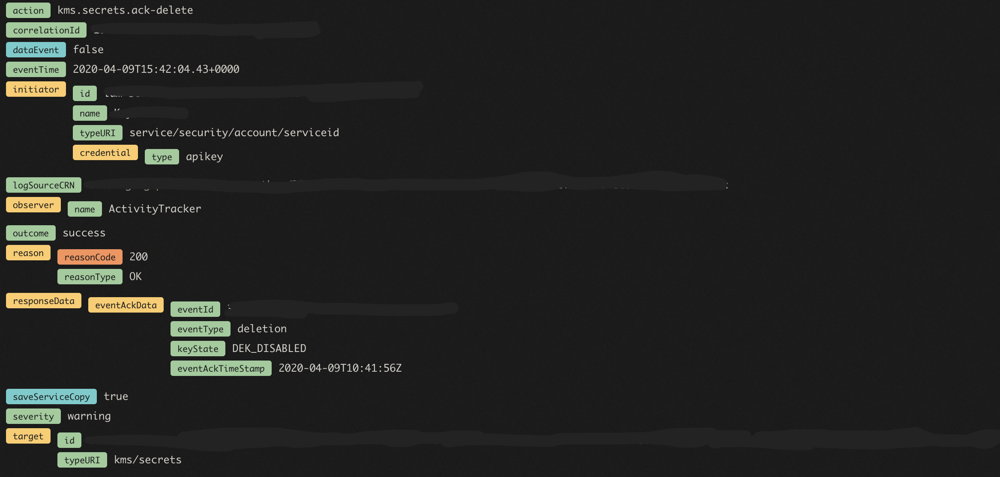

---

copyright:
  years: 2019, 2022
lastupdated: "2022-02-23"

keywords: crypto erasure, disable BYOK, cryptoerasure

subcollection: key-protect

---

{:shortdesc: .shortdesc}
{:codeblock: .codeblock}
{:external: target="_blank" .external}
{:screen: .screen}
{:pre: .pre}
{:tip: .tip}
{:note: .note}
{:important: .important}

# Plan for cryptoerasure
{: #key-erasure}

Erasing data across the cloud is coordinated by
{{site.data.keyword.keymanagementservicefull}} and requires adopting services to
take the appropriate actions.
{: shortdesc}

BYOK Crypto Erasure is an effort to bridge the gap and ensure that when a
customer deletes the key, it raises service events that invalidates the data
encryption keys (DEKs) without deleting the data source itself. 

Benefits of Crypto erasure:

- Data becomes unusable up to 4 hours after deleting keys
- Evidence is captured showing all DEKs are erased per adopting service

## Impacts to your service
{: #crypto-erasure-impact}

When a root key is destroyed, your service must stop the use of the DEK when
notified.

Your service should not attempt to destroy the data, even if the key is
destroyed. It is the customer's responsibility to also destroy their data. This
is important for accidental key deletion or the ability to restore keys, where
having the encrypted data available would be necessary.
{: important}

## Before you begin
{: #crypto-erasure-prereqs}

Before invalidating a data encryption key (DEK), register your cloud resource
with {{site.data.keyword.keymanagementservicefull}} and
[onboard to Hyperwarp](/docs/get-coding?topic=get-coding-hyperwarp){: external}
as a subscriber to {{site.data.keyword.keymanagementservicefull}}.

After the BSS team approves your Hyperwarp request, open a new
[Hyperwarp Integration Onboarding Request Issue](https://github.ibm.com/kms/customer-issues/blob/master/.github/ISSUE_TEMPLATE/hyperwarp-integration-onboard-request.md){: external}
with {{site.data.keyword.keymanagementservicefull}}.
{: note}

## Deleting cryptographically protected keys
{: #crypto-erase-key}

### Step 1. Delete a root key
{: #delete-root-key}

You can find the ID for a key in your
{{site.data.keyword.keymanagementserviceshort}} instance by
[retrieving a list of your keys](/docs/key-protect?topic=key-protect-view-keys),
or by accessing the {{site.data.keyword.keymanagementservicefull}} dashboard.

Once you locate the key ID, delete the key by making a call to
`DELETE /v2/keys`.

### Step 2. Check for a Hyperwarp deletion event
{: #crypto-erasure-receive-hyperwarp-event}

When {{site.data.keyword.keymanagementservicefull}} receives a delete key
request from your cloud service, the content and data with the key is deleted
and the key is transitioned into the _Destroyed_ state. A Hyperwarp notification
is sent to all cloud services that have registrations associated with the key.

Your service will only receive Hyperwarp events if the root key has
registrations that are associated with it.
{: note}

### Step 3. Check the state of the deleted key and flush associated Data Encryption Keys (DEKS)
{: #check-key-state}

You can check the state of the deleted key by
[viewing details about the key](/docs/key-protect?topic=key-protect-retrieve-key-metadata#view-key-metadata-api)
and if the key is in the destroyed state, flush the DEKs.

It is mandatory that all DEKs are flushed after deleting a root key.
{: important}

Use the adopters guide for
[more information](https://github.ibm.com/kms/Adopter_services/blob/master/src/github.ibm.com/skms/key-protect/event_processor.go){: external}
on processing the Hyperwarp event.
{: note}

### Step 4. Notify {{site.data.keyword.keymanagementserviceshort}} that the associated DEKs have been flushed
{: #notify-key-protect}

After checking the key state and taking necessary steps, your service can
acknowledge the deletion of the root key and key state via the
[event API](/apidocs/key-protect#acknowledge-key-events){: external}.

Services have a time frame of 4 hours to confirm with
{{site.data.keyword.keymanagementservicefull}} that all appropriate actions have
been taken.
{: important}

Run the following `curl` command to acknowledge the Hyperwarp deletion event:

```sh
$ curl -X POST \
    "https://<region>.kms.cloud.ibm.com/api/v2/event_ack" \
    -H "authorization: Bearer <IAM_token>" \
    -H "bluemix-instance: <instance_ID>" \
    -H "content-type: application/json" \
    -d '{
            "metadata": {
                "collectionType": "application/vnd.ibm.kms.event_acknowledge+json",
                "collectionTotal": 1
            },
            "resources": [
                {
                    "eventId": "<event_ID>",
                    "adopterKeyState": "<key_state>",
                    "timestamp": "<time_stamp>",
                    "keyStateData": {
                        "rewrappedKeyVersion": "<key_version>"
                    }
                }
            ]
        }'
```
{: codeblock}

Replace the variables in the example request according to the following table.

|Variable|Description|
|--- |--- |
|region|**Required**. The region abbreviation, such as `us-south` or `eu-gb`, that represents the geographic area where your {{site.data.keyword.keymanagementserviceshort}} instance resides.<br><br>For more information, see [Regional service endpoints](/docs/key-protect?topic=key-protect-regions#service-endpoints).|
|IAM_token|**Required**. Your {{site.data.keyword.cloud_notm}} access token. Include the full contents of the IAM token, including the Bearer value, in the curl request.<br>For more information, see [Retrieving an access token](/docs/key-protect?topic=key-protect-retrieve-access-token).|
|instance_ID|**Required**. The unique identifier that is assigned to your {{site.data.keyword.keymanagementserviceshort}} instance.<br><br>For more information, see [Retrieving an instance ID](/docs/key-protect?topic=key-protect-retrieve-instance-ID).|
|event_ID|**Required**. The identifier for the Hyperwarp event that you want to acknowledge.|
|key_state|**Required**. The adopter's reported state of the key at the time of processing the Hyperwarp event.|
|time_stamp|**Required**. The date that the Hyperwarp event was processed by the adopter service. The date format follows RFC 3339.|
|key_version|Required if the adopter state is "DEK_ENABLED". The ID of the key version that was used to rewrap the wrapped data encryption key (wDEK).|
{: caption="Table 1. Describes the variables that are needed to acknowledge a Hyperwarp event with the {{site.data.keyword.keymanagementserviceshort}} API." caption-side="top"}

### Monitor logs for an end-to-end key deletion event in activity tracker
{: #crypto-erasure-monitor-logs}

For audit purposes, you can monitor the activity trail of a deleted root key. The following is an example of a successful root key deletion event.



## Next steps
{: #crypto-erasure-next-steps}

Congratulations! Your service is Crypto Erasure ready! 

- Validate that your service is
    [BYOK ready](/docs/key-protect?topic=key-protect-byok-cheatsheet#byok-required-actions)


