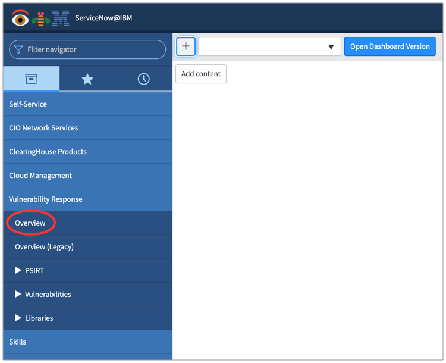
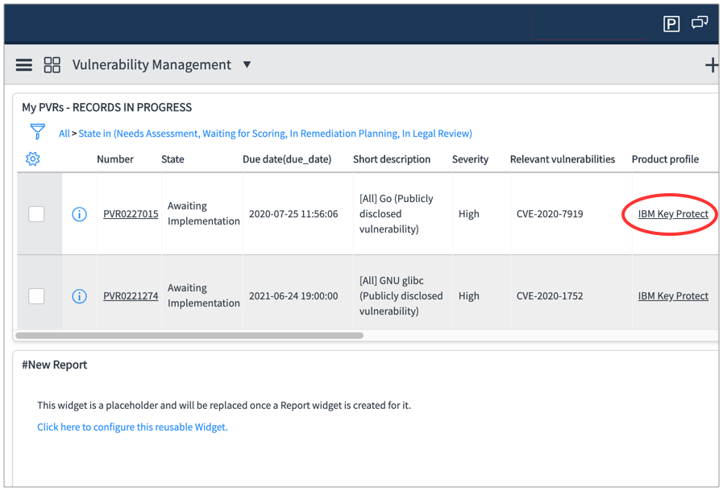
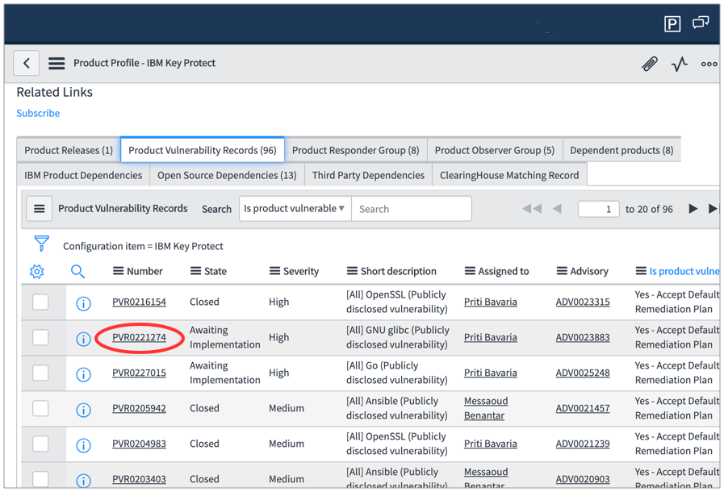
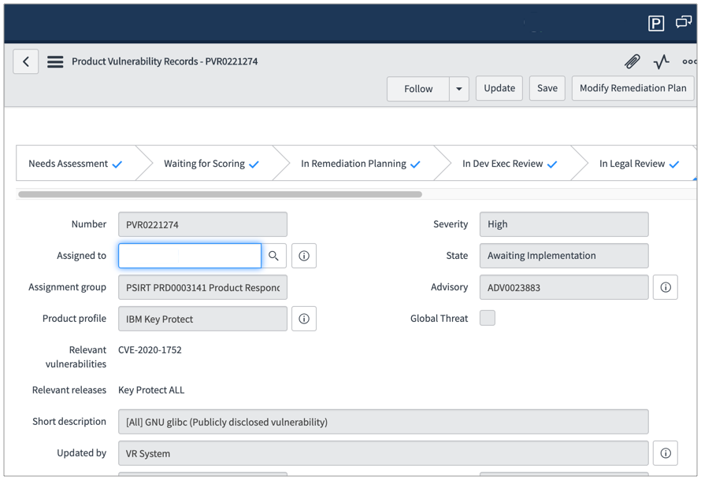
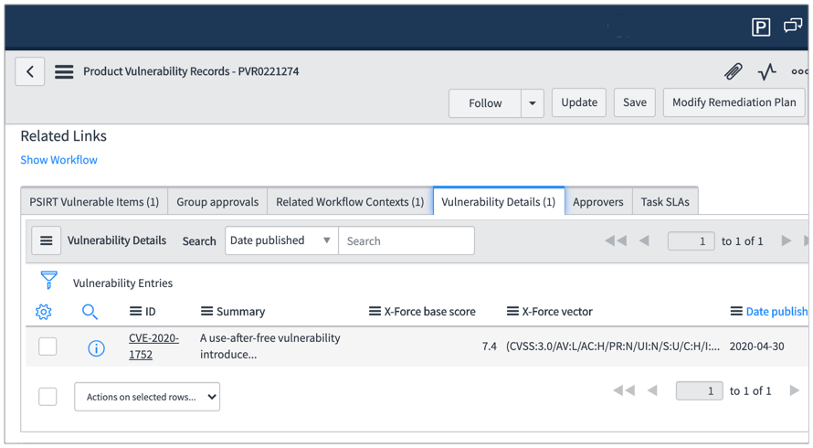

---

copyright:
  years: 2020
lastupdated: "2020-07-13"

keywords: Key Protect integration, psirt, product security incident response team, cve, common vulnerabilities exposures, service now

subcollection: key-protect

---

{:shortdesc: .shortdesc}
{:screen: .screen}
{:pre: .pre}
{:table: .aria-labeledby="caption"}
{:external: target="_blank" .external}
{:codeblock: .codeblock}
{:tip: .tip}
{:note: .note}
{:important: .important}

# PSIRT
{: #psirt}

## Overview
{: #psirt-overview}

IBM Product Security Incident Response Team (PSIRT) is the centralized process
through which IBM customers, security researchers, industry groups, government
organizations, or vendors report potential IBM security vulnerabilities.
{: shortdesc}

- A global team manages the receipt, investigation and internal coordination of
    security vulnerability information related to all IBM products, offerings and
    websites.

- This team then coordinates with individual IBM product and solution teams
    across the world to investigate, and if needed, identify the appropriate
    response plan.

- Maintaining communication between all involved parties, both internal and
    external, is a key component of IBM's vulnerability response process.

These IBM links have additional PSIRT information.

1. [PSIRT Blog](https://ibm.com/blogs/psirt/){: external}

2. [PSIRT Support](https://ibm.com/support/pages/product-security-incident-response-psirt-information){: external}

3. [Security Vulnerability Management](https://ibm.com/trust/security-psirt){: external}

## PSIRT for {{site.data.keyword.keymanagementserviceshort}}
{: #psirt-for-key-protect}

PSIRT and common vulnerabilities and exposures (CVE) for
{{site.data.keyword.keymanagementserviceshort}} is maintained in
[Service Now](https://ibm.service-now.com/){: external}.

PSIRTs are organized in the following hierarchy.

- **Overview**

    - Find the `Vulnerability Response` section, then click on `Overview` and look
        for {{site.data.keyword.keymanagementservicelong_notm}}

    - Click a link in the `Product profile` column to view a specific product
        profile

- **Product profile**

    - A product profile has product vulnerability records (PVR)

    - Scroll down the page to view PVRs (you may need to click the
        `Product Vulnerability Records` tab)

    - Click a link in the `Number` column to view a specific PVR

- **Product Vulnerability Records (PVR)**

    - The PVR references a common vulnerabilities and exposures (CVE) that is
        relevant to the PVR

    - In the first tab group, select `Comments / History` see the PVR evolution

    - Click the `Vulnerability Details` tab for more information

    - A PVR has product vulnerability items (PVI)

    - Scroll down the page and click the `Vulnerability Details` tab for more
        information

## Vulnerabilities
{: #psirt-vulnerabilities}

Last update: 2020-07-13

| CVE                                                                           | State                   | Due date   | Priority | Description |
| ----------------------------------------------------------------------------- | ----------------------- | ---------- | -------- | ----------- |
| [CVE-2019-9169](https://nvd.nist.gov/vuln/detail/CVE-2019-9169){: external}   | Awaiting Implementation | 2021-06-24 | High     | GNU glibc (Publicly disclosed vulnerability) |
| [CVE-2020-1752](https://nvd.nist.gov/vuln/detail/CVE-2020-1752){: external}   | Awaiting Implementation | 2021-06-24 | High     | GNU glibc (Publicly disclosed vulnerability) |
| [CVE-2020-7919](https://nvd.nist.gov/vuln/detail/CVE-2020-7919){: external}   | Awaiting Implementation | 2020-07-25 | High     | Go (Publicly disclosed vulnerability) |
| [CVE-2018-20796](https://nvd.nist.gov/vuln/detail/CVE-2018-20796){: external} | Awaiting Implementation | 2021-06-24 | Medium   | GNU glibc (Publicly disclosed vulnerability) |
| [CVE-2016-10739](https://nvd.nist.gov/vuln/detail/CVE-2016-10739){: external} | Awaiting Implementation | 2021-06-24 | Medium   | GNU glibc (Publicly disclosed vulnerability) |
| [CVE-2019-7309](https://nvd.nist.gov/vuln/detail/CVE-2019-7309){: external}   | Awaiting Implementation | 2021-06-24 | Medium   | GNU glibc (Publicly disclosed vulnerability) |

## Screen shots
{: #psirt-screen-shots}

### Screen 1 / 5 - Dashboard
{: #psirt-dashboard}

This is the Service Now dashboard, your view may vary based on personal
settings.

Select the `Overview` link on the `left` navigation and view your product
vulnerability records (PVRs) (see screen 2).

{: caption="Figure 1. Service Now dashboard." caption-side="bottom"}

### Screen 2 / 5 - Product Vulnerability Records (PVRs)
{: #psirt-pvr}

The page shows PVR records in progress.

In the `Product Profile` column select `IBM Key Protect` to view all
{{site.data.keyword.keymanagementserviceshort}} PVRs (see screen 3).

{: caption="Figure 2. PVRs in progress page." caption-side="bottom"}

### Screen 3 / 5 - All PVRs
{: #psirt-all-pvrs}

This page shows all PVRs.

Click the `Product Vulnerability Records` tab to see the full list of PVRs.

Select a particular PVR from the `Number` column (see screen 4).

{: caption="Figure 3. All product vulnerability records page." caption-side="bottom"}

### Screen 4 / 5 - PVR Summary
{: #psirt-pvr-summary}

This a PVR summary. The common vulnerability and exposure (CVE) is in the
`relevant vulnerabilities` field.

The full CVE database is maintained by
[nvd.nist.gov](https://nvd.nist.gov/){: external}.

Scroll down the page to view the PVR details (see screen 5).

{: caption="Figure 4. Product vulnerability summary page." caption-side="bottom"}

### Screen 5 / 5 - PVR detail
{: #psirt-pvr-detail}

You may need to click the `Vulnerability Details` tab.

Select the link in the `ID` column for additional information.

{: caption="Figure 5. PVR detail page." caption-side="bottom"}

