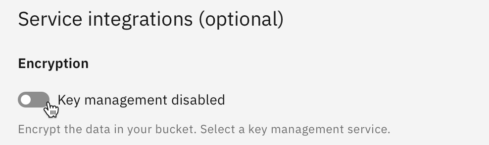
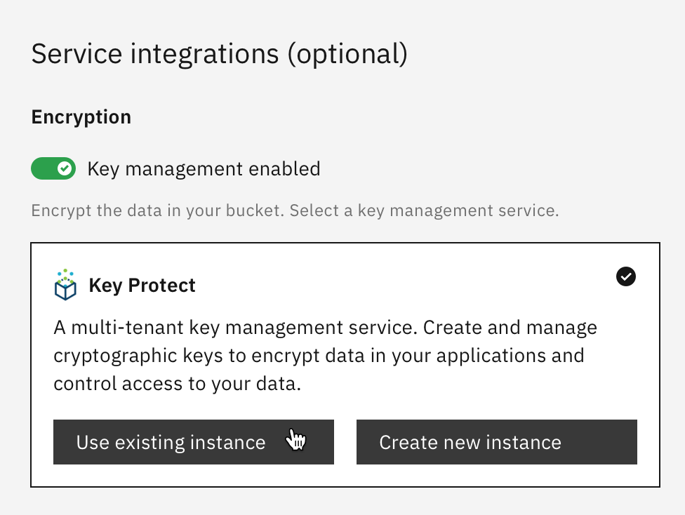
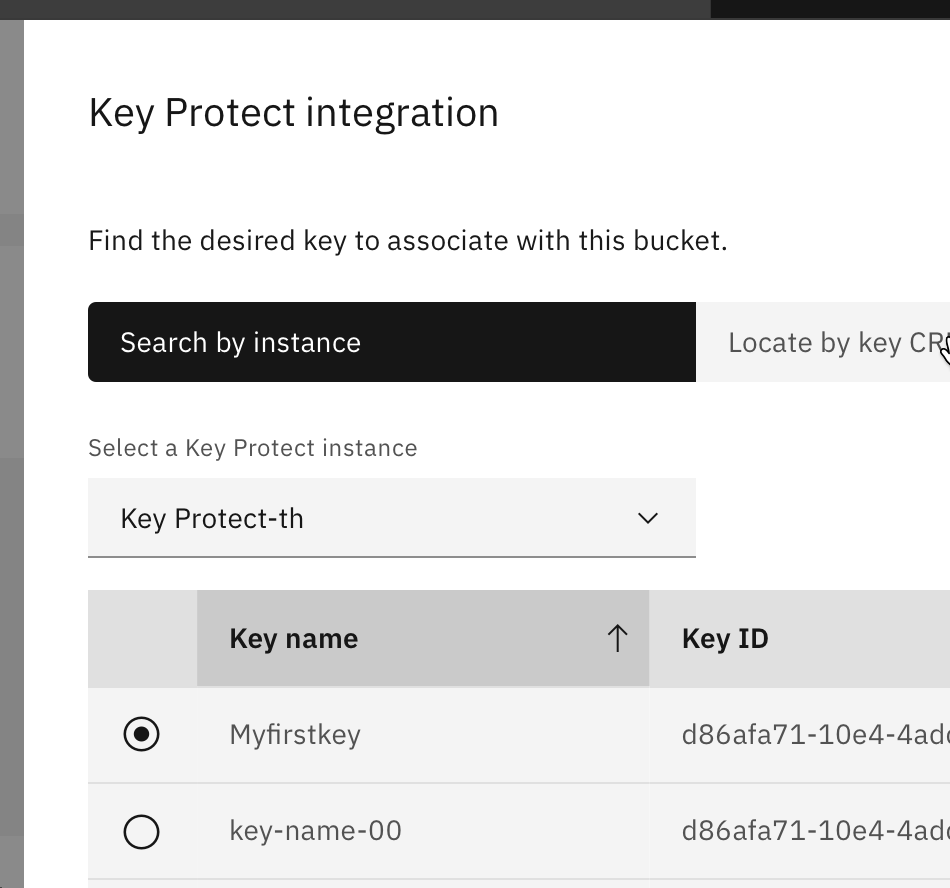
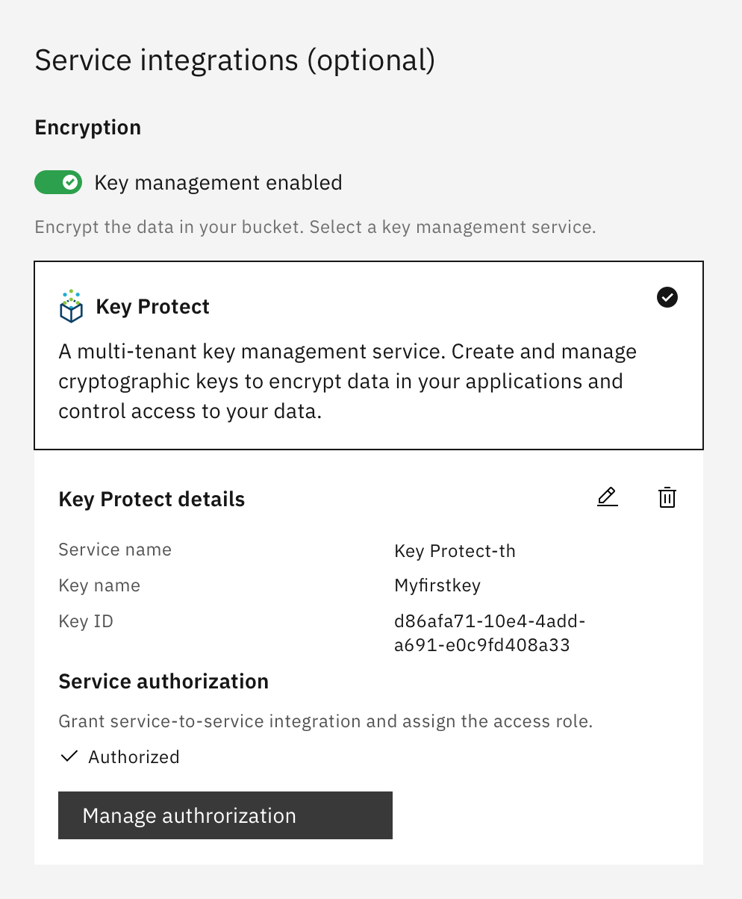
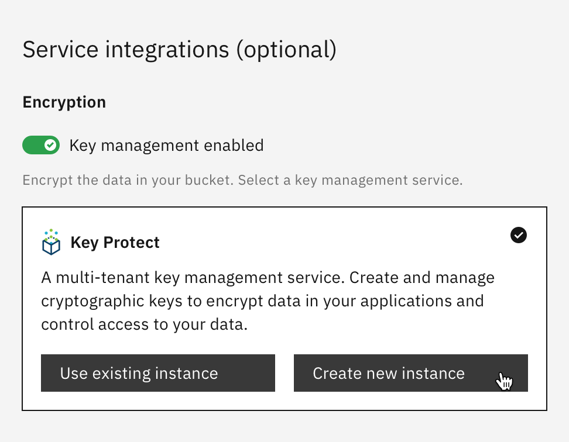
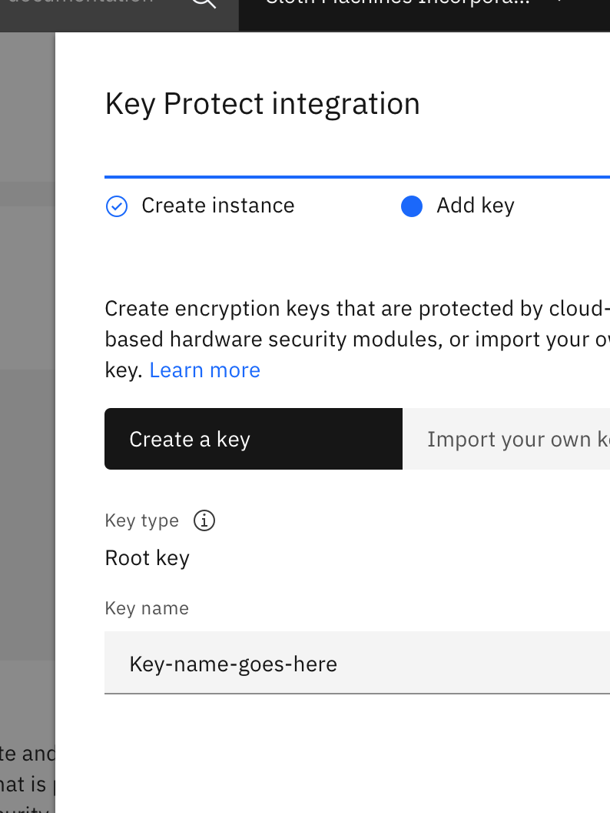
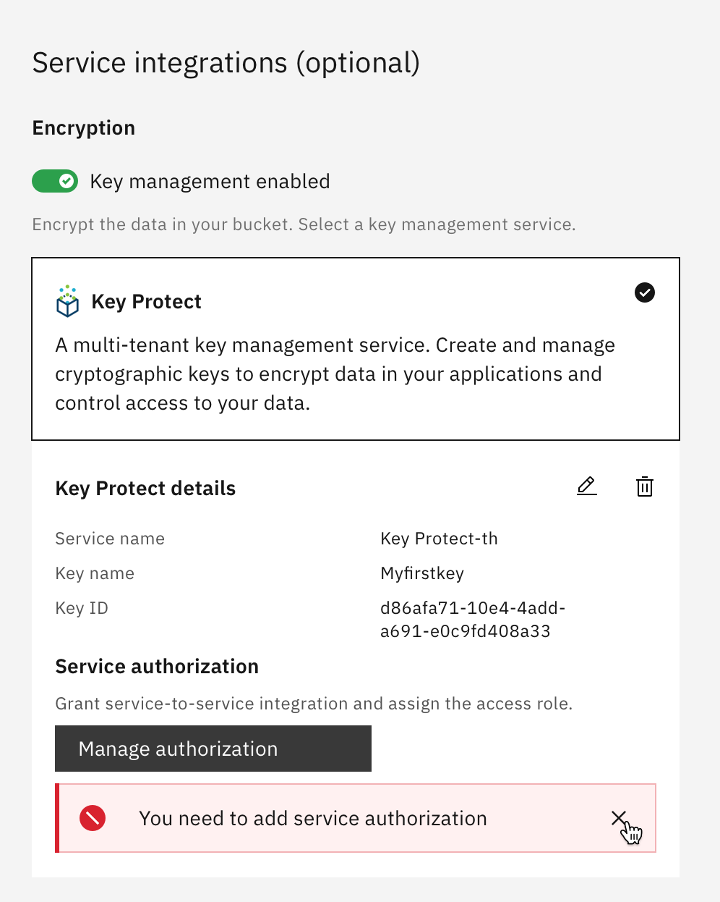
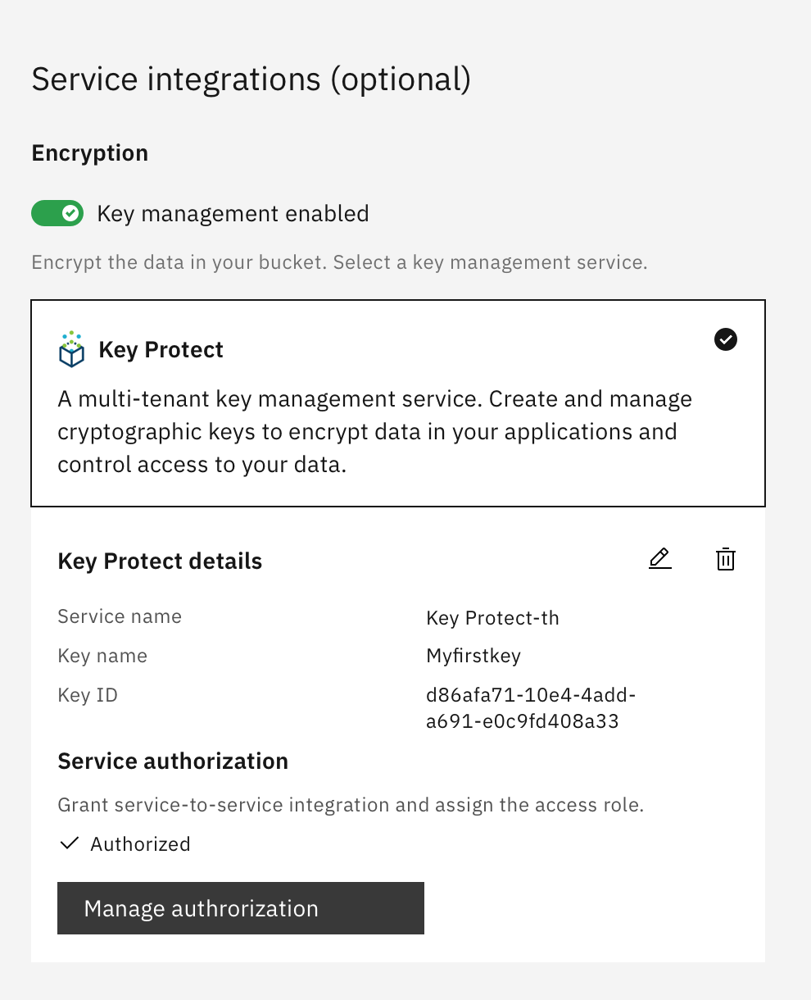

---

copyright:
  years: 2020, 2022
lastupdated: "2022-02-23"

keywords: Key Protect integration, user interface, react

subcollection: key-protect

---

{:external: target="_blank" .external}
{:important: .important}

# User interface component
{: #ui-component}

## Overview
{: #ui-component-overview}

The {{site.data.keyword.keymanagementserviceshort}} user interface (UI)
component is a
[React](https://reactjs.org/){: external}
component that IBM services can embed in their user interface to provision a
{{site.data.keyword.keymanagementserviceshort}} instance and create keys.

This document has these sections:

- [Use case](#ui-component-use-case) - describes when you would embed the
    {{site.data.keyword.keymanagementserviceshort}} React component

- [React implementation](#ui-component-react-implementation) - has React
    implementation details and code to add to your user interface

- [Sample integration 1](#ui-component-sample-integration-existing) - shows how
    to integrate an **existing** {{site.data.keyword.keymanagementserviceshort}}
    instance and key into a Cloud Object Storage (COS) workflow.

- [Sample integration 2](#ui-component-sample-integration-new) - shows how
    to integrate a **new** {{site.data.keyword.keymanagementserviceshort}}
    instance and key into a Cloud Object Storage (COS) workflow.

## Use case
{: #ui-component-use-case}

A use case helps understand the context for implementing the
{{site.data.keyword.keymanagementserviceshort}} React component.

This use case applies to a Cloud Object Storage (COS) and
{{site.data.keyword.keymanagementserviceshort}} integration.

A customer is ordering or configuring Cloud Object Storage (COS). They have a
requirement that all COS buckets are encrypted to protect their data.

The COS-{{site.data.keyword.keymanagementserviceshort}} integration meets their
requirements.

Their workflow options are:

1. Complete the entire process in COS.

    - COS: create a COS bucket, provision a
        {{site.data.keyword.keymanagementserviceshort}} instance, create a root
        key, and authorize the integration of COS and
        {{site.data.keyword.keymanagementserviceshort}}

2. Use a combination of COS and {{site.data.keyword.keymanagementserviceshort}}
    workflows to accomplish the task.

    - COS: create an instance

    - {{site.data.keyword.keymanagementserviceshort}}: create an instance and a
        root key

    - COS: create a policy for COS to access
        {{site.data.keyword.keymanagementserviceshort}} encryption keys

    - COS: create a bucket and specify
        {{site.data.keyword.keymanagementserviceshort}} encryption

## React implementation
{: #ui-component-react-implementation}

The {{site.data.keyword.keymanagementserviceshort}}
[UI component](https://github.ibm.com/kms/key-protect-ui/tree/master/src/client/hosted){: external}
is a project within the
[{{site.data.keyword.keymanagementserviceshort}} UI](https://github.ibm.com/kms/key-protect-ui){: external}.

There are two React components that help integrate
{{site.data.keyword.keymanagementserviceshort}} into your service:

- KeyProtectProvision - provisioning a new
    {{site.data.keyword.keymanagementserviceshort}} instance

- KeyProtectAddKey - add a new key to an existing
    {{site.data.keyword.keymanagementserviceshort}} instance

In your React file you would include either component with this code.

```javascript
import { KeyProtectProvision } from '@console/pal/Hosted';
import { KeyProtectAddKey } from '@console/pal/Hosted';
```

### KeyProtectProvision component
{: #ui-component-keyprotectprovision-component}

Provisioning a new {{site.data.keyword.keymanagementserviceshort}} instance.

```javascript
<KeyProtectProvision
    fireProvision={fireProvision}
    serviceID={serviceID}
    setProvisionMap={setProvisionMap}
/>
```

The `KeyProtectProvision` component has 3 required props. The following list
shows the props.

| Prop            | Required | Description |
| --------------- | -------- | ----------- |
| fireProvision   | required | A boolean flag. When set to `true`, it notifies the React component to fire off the provision request. |
| serviceID       | required | The service id (GUID) for provisioning. |
| setProvisionMap | required | A callback to return all parameters stored in a KeyProtectProvision map. |

### fireProvision prop
{: #ui-component-fireprovision-prop}

`fireProvision` (required) is a boolean flag. When set to `true`, it notifies
the React component to fire off the provision request.

```javascript
const [fireProvision, setFireProvision] = useState(false);

<Button
    disabled={!valid}
    onClick={() => {
        setFireProvision(true);
    }}
>
    Provision
</Button>
```

### serviceID prop
{: #ui-component-serviceid-prop}

`serviceID` (required) is a the service id for provisioning. It's a GUID and
has this format:

- a0814030-c9dd-11e7-9a5e-19d80fed5e00

### setProvisionMap prop
{: #ui-component-setprovisionmap-prop}

`setProvisionMap` (required) is a callback to return all parameters stored in
a KeyProtectProvision map. Refer to the list below.

| Parameter     | Description |
| ------------- | ----------- |
| instancename  | user input instance name |
| loading       | provision loading status |
| parameter     | service customized parameter, e.g. Key Protect network type (public and private, private-only) |
| plan          | selected plan information |
| provisionRes  | provision result returned from the resource controller |
| resourcegroup | selected resource group |
| valid         | all input fields are valid |

We recommend using `useRef` to store this map rather than `useState` to avoid
an unnecessary reloading of the React component.

```javascript
const provisionMap = useRef(new Map());
const setProvisionMap = map => {
    provisionMap.current = map;
};
```

### KeyProtectAddKey component
{: #ui-component-keyprotectaddkey-component}

Add a new key to an existing {{site.data.keyword.keymanagementserviceshort}}
instance.

```javascript
<KeyProtectAddKey
    // required props
    crn="crn:v1:staging:public:kms:us-south:a/ec805238d8364bb7af9aab9c0cc63d9f:fee91c3b-e597-4007-aaf8-7b1a102bfac2::"
    fireAddKey={fireAddKey}
    setAddKeyResProp={setAddKeyResProp}
    setValidProp={setValidProp}

    // optional props
    keyCreateRestrictions={keyCreateRestrictions}
    keyRestrictionTooltip={keyRestrictionTooltip}
/>
```

The `KeyProtectAddKey` component has 4 required props and 2 optional props. The
following list shows the props.

| Prop                  | Required | Description |
| --------------------- | -------- | ----------- |
| crn                   | required | The CRN of the {{site.data.keyword.keymanagementserviceshort}} instance where the root key is created. |
| fireAddKey            | required | A boolean flag. When set to `true`, it notifies the React component to fire off the create key request. |
| setAddKeyResProp      | required | A callback for setting the response of the add key result. |
| setValidProp          | required | A callback for setting form items validity inside the React component. This can be used for the create button `disabled` prop. |
| keyCreateRestrictions | optional | An object that specifies key create restrictions, such as key type (root or standard) or the ability to import keys. |
| keyRestrictionTooltip | optional | The tooltip that appears if any key create restrictions have been set. |

#### crn prop
{: #ui-component-crn-prop}

`crn` (required) is the CRN of the
{{site.data.keyword.keymanagementserviceshort}} instance where the root key is
created.

#### fireAddKey prop
{: #ui-component-fireaddkey-prop}

`fireAddKey` (required) is a boolean flag. When set to `true`, it notifies the
React component to fire off the create key request.

```javascript
const [fireAddKey, setFireAddKey] = useState(false);

<Button
    disabled={!valid}
    onClick={() => {
        setFireAddKey(true);
    }}
>
    Create key
</Button>
```

#### setAddKeyResProp prop
{: #ui-component-setaddkeyresprop-prop}

`setAddKeyResProp` (required) is a callback for setting the response of the add
key result.

```javascript
const [addKeyResProp, setAddKeyResProp] = useState();

const setAddKeyResProp = (res) => {
    setAddKeyResProp(res);
};

useEffect(() => {
    console.log(`addKeyResProp: ${addKeyResProp}`);
}, [addKeyResProp]);
```

#### setValidProp prop
{: #ui-component-setvalidprop-prop}

`setValidProp` (required) is a callback for setting form items validity inside
the React component. This can be used for the create button `disabled` property.

```javascript
const [valid, setValid] = useState(false);
const setValidProp = (isValid) => {
    console.log(`isValid: ${isValid}`);
    setValid(isValid);
};
```

#### keyCreateRestrictions prop
{: #ui-component-keycreaterestrictions-prop}

`keyCreateRestrictions` (optional) is an object that specifies key create
restrictions, such as key type (root or standard) or the ability to import keys.

```javascript
const keyCreateRestrictions = {
    create_root_key: true,
    create_standard_key: false,
    import_root_key: true,
    import_standard_key: false,
};
```

#### keyRestrictionTooltip prop
{: #ui-component-keyrestrictiontooltip-prop}

`keyRestrictionTooltip` (optional) is the tooltip that appears if any key create
restrictions have been set.

```javascript
const keyRestrictionToolTip = (
    <Tooltip>
        Only root keys are supported by this service.
    </Tooltip>
);
```

## Sample integration 1 - use existing instance
{: #ui-component-sample-integration-existing}


These screen shots will be replaced, and this comment removed, when the UI
component is finished.
{: important}


This sample integrates an **existing**
{{site.data.keyword.keymanagementserviceshort}} instance and key into a Cloud
Object Storage (COS) workflow.

This is a summary of the steps.

| Steps | Description                      |
| ----- | -------------------------------- |
| 1     | Key management is disabled       |
| 2     | Enable key management            |
| 3     | Choose existing instance and key |
| 4     | Key Protect details              |
{: caption="Table 1. Choose an existing instance and key" caption-side="top"}

### Step 1 of 4 - existing instance - key management is disabled
{: #ui-component-existing-step-1}

During the create bucket process, the
{{site.data.keyword.keymanagementserviceshort}} integration is initially
disabled.

The user enables `Key management` to continue with the
COS-to-{{site.data.keyword.keymanagementserviceshort}} integration.



### Step 2 of 4 - existing instance - enable key management
{: #ui-component-existing-step-2}

The user enables `Key management`, which allows them to choose an existing
{{site.data.keyword.keymanagementserviceshort}} instance or create a new
{{site.data.keyword.keymanagementserviceshort}} instance.

In this example, the user chooses an existing
{{site.data.keyword.keymanagementserviceshort}} instance.



### Step 3 of 4 - existing instance - choose existing instance and key
{: #ui-component-existing-step-3}

Choose an existing {{site.data.keyword.keymanagementserviceshort}} instance and
key that will be used to encrypt and protect your COS data.



### Step 4 of 4 - existing instance - Key Protect details
{: #ui-component-existing-step-4}

The {{site.data.keyword.keymanagementserviceshort}} instance and key, selected
in step 3 above, are shown in the
`{{site.data.keyword.keymanagementserviceshort}} details` area.

This shows the state after the authorization process is complete.

COS can now use a {{site.data.keyword.keymanagementserviceshort}} root key to
encrypt and protect COS data.



## Sample integration 2 - create new instance and key
{: #ui-component-sample-integration-new}


These screen shots will be replaced, and this comment removed, when the UI
component is finished.
{: important}


This sample integrates a **new** {{site.data.keyword.keymanagementserviceshort}}
instance and key into a Cloud Object Storage (COS) workflow.

This is a summary of the steps.

| Steps | Description                |
| ----- | -------------------------- |
| 1     | Key management is disabled |
| 2     | Enable key management      |
| 3     | Create new instance        |
| 4     | Create new key             |
| 5     | Key Protect details        |
| 6     | Authorization is complete  |
{: caption="Table 2. Create a new instance and key" caption-side="top"}

### Step 1 of 6 - new instance - key management is disabled
{: #ui-component-new-step-1}

During the create bucket process, the
{{site.data.keyword.keymanagementserviceshort}} integration is initially
disabled.

The user enables `Key management` to continue with the
COS-to-{{site.data.keyword.keymanagementserviceshort}} integration.


### Step 2 of 6 - new instance - enable key management - create new instance
{: #ui-component-new-step-2}

The creates a new {{site.data.keyword.keymanagementserviceshort}} instance and
key.

The user enables `key management` and chooses `create new instance`.



### Step 3 of 6 - new instance - create new instance
{: #ui-component-new-step-3}

The user selects a region and configures a new
{{site.data.keyword.keymanagementserviceshort}} instance.


### Step 4 of 6 - new instance - create new key
{: #ui-component-new-step-4}

Create or import a root key after the instance is created.



### Step 5 of 6 - new instance - Key Protect details
{: #ui-component-new-step-5}

The new {{site.data.keyword.keymanagementserviceshort}} instance and key are
shown in the `{{site.data.keyword.keymanagementserviceshort}} details` area.

The user must `authorize` the COS and
{{site.data.keyword.keymanagementserviceshort}} integration.

A service, such as COS, cannot use a
{{site.data.keyword.keymanagementserviceshort}} root key without first creating
an `authorization` between the two services.
{: important}


### Step 6 of 6 - new instance - authorization is complete
{: #ui-component-new-step-6}

This shows the state after the authorization is complete.

COS now has the ability to use a {{site.data.keyword.keymanagementserviceshort}}
root key to encrypt and protect COS data.




