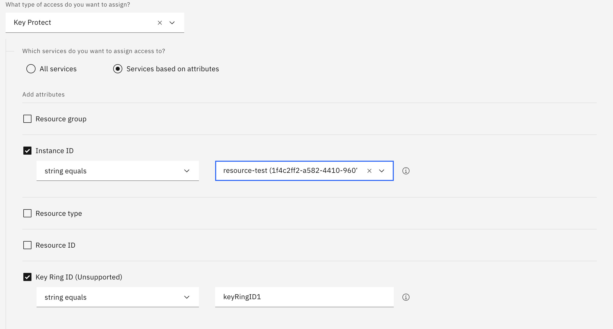

---

copyright:
  years: 2020
lastupdated: "2021-03-09"

keywords: key rings

subcollection: key-protect

---

{:shortdesc: .shortdesc}
{:screen: .screen}
{:pre: .pre}
{:table: .aria-labeledby="caption"}
{:external: target="_blank" .external}
{:codeblock: .codeblock}
{:tip: .tip}
{:note: .note}
{:important: .important}
{:preview: .preview}
{:term: .term}

# Managing key rings
{: #managing-key-rings}

You can use {{site.data.keyword.keymanagementservicefull}} to create
a group of keys for a target group of users that require the same IAM 
access permissions.
{: shortdesc}

As an account admin, you can bundle the keys in your
{{site.data.keyword.keymanagementserviceshort}} service instance into groups
called `key rings`. A key ring is a collection of keys, within your
service instance, that all require the same IAM access permissions. 
For example, if you have a group of team members who will need a particular
type of access to a specific group of keys, you can create a key ring for those
keys and assign the appropriate IAM access policy to the target user group. The
users that are assigned access to the key ring can create and manage the resources
that exist within the key ring. 

Key rings are also useful where you have different business units who require strict
access over a particular set of keys related to their activities and not other keys
managed by other units. As an account admin, you can create a key ring per
business unit and grant users of that business unit the ability to interact with the
key inside of the key rings based on the level of assigned access.

You can grant access to key rings within a
{{site.data.keyword.keymanagementserviceshort}} instance by using the
{{site.data.keyword.cloud_notm}} console, IAM API, or IAM CLI.
{: note}

Before you create a key ring for your
{{site.data.keyword.keymanagementserviceshort}} instance, keep in mind the
following considerations:

- **Every {{site.data.keyword.keymanagementserviceshort}} instance comes with a default key ring.**
  Each newly created {{site.data.keyword.keymanagementserviceshort}} instance comes with
  a generated key ring with an ID of `default`. All keys that are not associated
  with an otherwise specified key ring exists within the default key ring.

- **Key rings can hold standard and root keys.**
  Key rings can contain both standard and root keys. There is not a limit on how
  many keys can exist within a key ring.

- **A key can only belong to one key ring at a time.**
  A key can only belong to one key ring. Key ring assignment happens upon key
  creation. If a key ring id is not passed in upon creation, the key will belong
  to the default key ring.

## Creating key rings with the API
{: #create-key-ring-api}

Create a key ring by making a `POST` call to the following endpoint.

```plaintext
https://<region>.kms.cloud.ibm.com/api/v2/keys
```
{: codeblock}

1. [Retrieve your authentication credentials to work with keys in the service](/docs/key-protect?topic=key-protect-set-up-api).

2. Create a key ring by running the following `curl` command.

    ```sh
    $ curl -X POST \
        "https://<region>.kms.cloud.ibm.com/api/v2/key_rings/<key_ring_id>" \
        -H "authorization: Bearer <IAM_token>" \
        -H "bluemix-instance: <instance_ID>" \
        -H "correlation-id: <correlation_ID>"
    ```
    {: codeblock}

    Replace the variables in the example request according to the following
    table.

    <table>
      <tr>
        <th>Variable</th>
        <th>Description</th>
      </tr>

      <tr>
        <td>
          <varname>region</varname>
        </td>
        <td>
          <p>
            <strong>Required.</strong> The region abbreviation, such as
            <code>us-south</code> or <code>eu-gb</code>, that represents the
            geographic area where your
            {{site.data.keyword.keymanagementserviceshort}} instance resides.
          </p>
          <p>
            For more information, see
            [Regional service endpoints](/docs/key-protect?topic=key-protect-regions#service-endpoints).
          </p>
        </td>
      </tr>

      <tr>
        <td>
          <varname>key_ring_id</varname>
        </td>
        <td>
          <p>
            <strong>Required.</strong> The unique identifier for the key ring
            that you would like to create.
          </p>
        </td>
      </tr>

      <tr>
        <td>
          <varname>IAM_token</varname>
        </td>
        <td>
          <p>
            <strong>Required.</strong> Your {{site.data.keyword.cloud_notm}}
            access token. Include the full contents of the <code>IAM</code>
            token, including the Bearer value, in the <code>curl</code> request.
          </p>
          <p>
            For more information, see
            [Retrieving an access token](/docs/key-protect?topic=key-protect-retrieve-access-token).
          </p>
        </td>
      </tr>

      <tr>
        <td>
          <varname>instance_ID</varname>
        </td>
        <td>
          <p>
            <strong>Required.</strong> The unique identifier that is assigned to
            your {{site.data.keyword.keymanagementserviceshort}} service
            instance.
          </p>
          <p>
            For more information, see
            [Retrieving an instance ID](/docs/key-protect?topic=key-protect-retrieve-instance-ID).
          </p>
        </td>
      </tr>

      <tr>
        <td>
          <varname>correlation_ID</varname>
        </td>
        <td>
          The unique identifier that is used to track and correlate
          transactions.
        </td>
      </tr>

      <caption style="caption-side:bottom;">
        Table 1. Describes the variables that are needed to create a key ring
        with the {{site.data.keyword.keymanagementserviceshort}} API
      </caption>
    </table>

    A successful `POST api/v2/key_rings` request returns an HTTP `201 Created` 
    response, which indicates that the key ring was created and is now
    available for to hold standard and root keys.

The maximum amount of key rings is 50 per service instance.
{: note}

## Transferring a key to a different key ring
{: #transfer-key-key-ring}

As requirements change and new team members are brought into an org, you might
create new key rings to reflect these organizational changes. After creating the
key rings, it might be necessary to move a key from an existing key ring to a
new key ring that has different IAM permissions. For example, you might be
onboarding a team that will need specific access to a key that belongs to a custom
key ring. You can create a new key ring that is dedicated to the onboarding
team and, since keys can only be associated with one key ring at a time, you will need
to move the key to the new key ring.

After transferring a key to a different key ring, it may take up to a maximum of ten minutes 
for the change to take effect.
{: important}

### Transferring a key to a different key ring with the API
{: #transfer-key-key-ring-api}

Transfer a key to a different key ring by making a `PATCH` call to the following endpoint.

```plaintext
https://<region>.kms.cloud.ibm.com/api/v2/keys/<key_ID>
```
{: codeblock}

1. [Retrieve your authentication credentials to work with keys in the service](/docs/key-protect?topic=key-protect-set-up-api).

    To update the key ring of a key, you must have at least _Manager_ service access to the key and the target key ring. To learn how IAM roles map to
    {{site.data.keyword.keymanagementserviceshort}} service actions, check out
    [Service access roles](/docs/key-protect?topic=key-protect-manage-access#service-access-roles).
    {: note}

2. Update the key ring of a key by running the following `curl` command.

    ```sh
    $ curl -X PATCH \
      https://<region>.kms.cloud.ibm.com/api/v2/keys/<key_ID> \
      -H 'accept: application/vnd.ibm.kms.key+json' \
      -H 'authorization: Bearer <IAM_token>' \
      -H 'bluemix-instance: <instance_ID>' \
      -H 'content-type: application/vnd.ibm.kms.key+json' \
      -H "x-kms-key-ring: <original_key_ring_ID>" \
      -H "correlation-id: <correlation_ID>" \
      -d '{
        "keyRingID": "<new_key_ring_ID>"
      }'
    ```
    {: codeblock}

    Replace the variables in the example request according to the following
    table.

    <table>
      <tr>
        <th>Variable</th>
        <th>Description</th>
      </tr>

      <tr>
        <td>
          <varname>region</varname>
        </td>
        <td>
          <p>
            <strong>Required.</strong> The region abbreviation, such as
            <code>us-south</code> or <code>eu-gb</code>, that represents the
            geographic area where your
            {{site.data.keyword.keymanagementserviceshort}} instance resides.
          </p>
          <p>
            For more information, see
            [Regional service endpoints](/docs/key-protect?topic=key-protect-regions#service-endpoints).
          </p>
        </td>
      </tr>

      <tr>
        <td>
          <varname>IAM_token</varname>
        </td>
        <td>
          <p>
            <strong>Required.</strong> Your {{site.data.keyword.cloud_notm}}
            access token. Include the full contents of the <code>IAM</code>
            token, including the Bearer value, in the <code>curl</code> request.
          </p>
          <p>
            For more information, see
            [Retrieving an access token](/docs/key-protect?topic=key-protect-retrieve-access-token).
          </p>
        </td>
      </tr>

      <tr>
        <td>
          <varname>instance_ID</varname>
        </td>
        <td>
          <p>
            <strong>Required.</strong> The unique identifier that is assigned to
            your {{site.data.keyword.keymanagementserviceshort}} service
            instance.
          </p>
          <p>
            For more information, see
            [Retrieving an instance ID](/docs/key-protect?topic=key-protect-retrieve-instance-ID).
          </p>
        </td>
      </tr>

      <tr>
        <td>
          <varname>original_key_ring_ID</varname>
        </td>
        <td>
          <p>
            <strong>Optional.</strong> The unique identifier of the key ring that
            the currently key belongs to. If unspecified, {{site.data.keyword.keymanagementserviceshort}}
            will search for the key in every key ring associated with the specified instance.
            It is therefore recommended to specify the key ring ID for a more optimized request.
            Note: The key ring ID of keys that are created without an `x-kms-key-ring` header is: `default`.
          </p>
        </td>
      </tr>

      <tr>
        <td>
          <varname>correlation_ID</varname>
        </td>
        <td>
          The unique identifier that is used to track and correlate
          transactions.
        </td>
      </tr>

      <tr>
        <td>
          <varname>new_key_ring_ID</varname>
        </td>
        <td>
          <p>
            <strong>Required.</strong> The unique identifier for the target key ring
            that you would like to move the key to.
          </p>
        </td>
      </tr>

      <caption style="caption-side:bottom;">
        Table 2. Describes the variables that are needed to update a key's key ring
        with the {{site.data.keyword.keymanagementserviceshort}} API
      </caption>
    </table>

    A successful `PATCH api/v2/keys/key_ID` request returns the key's metadata, including
    the id of the key ring that the key now belongs to.
    
    ``` json
    {
     "metadata": {
         "collectionType": "application/vnd.ibm.kms.key+json",
         "collectionTotal": 1
     },
     "resources": [
         {
             "type": "application/vnd.ibm.kms.key+json",
             "id": "02fd6835-6001-4482-a892-13bd2085f75d",
             "name": "test-root-key",
             "aliases": [
                 "alias-1",
                 "alias-2"
               ],
             "description": "A test root key",
             "state": 1,
             "extractable": false,
             "keyRingID": "new-key-ring",
             "crn": "crn:v1:bluemix:public:kms:us-south:a/f047b55a3362ac06afad8a3f2f5586ea:12e8c9c2-a162-472d-b7d6-8b9a86b815a6:key:02fd6835-6001-4482-a892-13bd2085f75d",
             "imported": false,
             "creationDate": "2020-03-12T03:37:32Z",
             "createdBy": "...",
             "algorithmType": "AES",
             "algorithmMetadata": {
                 "bitLength": "256",
                 "mode": "CBC_PAD"
             },
             "algorithmBitSize": 256,
             "algorithmMode": "CBC_PAD",
             "lastUpdateDate": "2020-03-12T03:37:32Z",
             "keyVersion": {
                 "id": "2291e4ae-a14c-4af9-88f0-27c0cb2739e2",
                 "creationDate": "2020-03-12T03:37:32Z"
             },
             "dualAuthDelete": {
                 "enabled": false
             },
             "deleted": false
         }
     ]
    }
    ```

## Granting access to a key ring
{: #grant-access-key-ring}

You can grant access to a key ring within a
{{site.data.keyword.keymanagementserviceshort}} instance by using the
{{site.data.keyword.cloud_notm}} console, 
[IAM API](/apidocs/iam-policy-management#create-policy){: external}, 
or [CLI](/docs/cli?topic=cli-ibmcloud_commands_iam#ibmcloud_iam_user_policy_create){ :external}.

Review
[roles and permissions](/docs/key-protect?topic=key-protect-manage-access)
to learn how {{site.data.keyword.cloud_notm}} IAM roles map to
{{site.data.keyword.keymanagementserviceshort}} actions.
{: tip}

To assign access to a key ring via console:

1. From the menu bar, click **Manage** &gt; **Access (IAM)**, and select
   **Users** to browse the existing users in your account.

2. Select a table row, and click the ⋯ icon to open a list of options for that
   user.

3. From the options menu, click **Assign access**.

4. Click **Assign users additional access**.

5. Click the **IAM services** button.

6. From the list of services, select
   **{{site.data.keyword.keymanagementserviceshort}}**.

7. Select **Services based on attributes**.

8. Select the **Instance ID** attribute and select the instance in which the key
   ring resides.

9. Select the **Key Ring ID** attribute and enter the ID associated with the key ring.

8. Choose a combination of
   [platform and service access roles](/docs/key-protect?topic=key-protect-manage-access#roles)
   to assign access for the user.

9. Click **Add**.

10. Continue to add platform and service access roles as needed and when you are
    finished, click **Assign**. Note that the user must be assigned at least _Reader_ 
    access to the entire instance in order for them to list, create and delete key rings 
    within the instance.

{: caption="Figure 1. Shows how to grant user access to an instance." caption-side="bottom"}

## Listing key rings with the API
{: #list-key-ring-api}

For a high-level view, you can browse the key rings that are managed in your
provisioned instance of {{site.data.keyword.keymanagementserviceshort}} by
making a GET call to the following endpoint.

```plaintext
https://<region>.kms.cloud.ibm.com/api/v2/keys_rings
```
{: codeblock}

1. [Retrieve your authentication credentials to work with keys in the service](/docs/key-protect?topic=key-protect-set-up-api).

2. View general characteristics about your key rings by running the following
   `curl` command.

    ```sh
    $ curl -X GET \
        "https://<region>.kms.cloud.ibm.com/api/v2/key_rings" \
        -H "accept: application/vnd.ibm.kms.key_ring+json" \
        -H "authorization: Bearer <IAM_token>" \
        -H "bluemix-instance: <instance_ID>" \
        -H "correlation-id: <correlation_ID>"
    ```
    {: codeblock}

    Replace the variables in the example request according to the following
    table.

<table>
  <tr>
    <th>Variable</th>
    <th>Description</th>
  </tr>

  <tr>
    <td>
      <varname>region</varname>
    </td>
    <td>
      <p>
        <strong>Required.</strong> The region abbreviation, such as
        <code>us-south</code> or <code>eu-gb</code>, that represents the
        geographic area where your
        {{site.data.keyword.keymanagementserviceshort}} instance resides.
      </p>
      <p>
        For more information, see
        [Regional service endpoints](/docs/key-protect?topic=key-protect-regions#service-endpoints).
      </p>
    </td>
  </tr>

  <tr>
    <td>
      <varname>IAM_token</varname>
    </td>
    <td>
      <p>
        <strong>Required.</strong> Your {{site.data.keyword.cloud_notm}} access
        token. Include the full contents of the <code>IAM</code> token,
        including the Bearer value, in the <code>curl</code> request.
      </p>
      <p>
        For more information, see
        [Retrieving an access token](/docs/key-protect?topic=key-protect-retrieve-access-token).
      </p>
    </td>
  </tr>

  <tr>
    <td>
      <varname>instance_ID</varname>
    </td>
    <td>
      <p>
        <strong>Required.</strong> The unique identifier that is assigned to
        your {{site.data.keyword.keymanagementserviceshort}} instance.
      </p>
      <p>
        For more information, see
        [Retrieving an instance ID](/docs/key-protect?topic=key-protect-retrieve-instance-ID).
      </p>
    </td>
  </tr>

  <tr>
    <td>
      <varname>correlation_ID</varname>
    </td>
    <td>
      <p>
        The unique identifier that is used to track and correlate transactions.
      </p>
    </td>
  </tr>

  <caption style="caption-side:bottom;">
    Table 3. Describes the variables that are needed to view key rings with the
    {{site.data.keyword.keymanagementserviceshort}} API.
  </caption>
</table>

    A successful `GET api/v2/key_rings` request returns a collection of key
    rings that are available in your
    {{site.data.keyword.keymanagementserviceshort}} service instance.

    ```json
    {
        "metadata": {
            "collectionType": "application/vnd.ibm.kms.key_ring+json",
            "collectionTotal": 2
        },
        "resources": [
            {
                "id": "default"
            },
            {
                "id": "Sample Key Ring 2",
                "creationDate": "2020-03-12T11:00:06Z",
                "createdBy": "..."
            }
        ]
    }
    ```
    {: screen}

## Deleting key rings with the API
{: #delete-key-ring-api}

You can delete a key ring by making a `DELETE` call to the following endpoint.

```plaintext
https://<region>.kms.cloud.ibm.com/api/v2/key_rings/<key_ring_id>
```

This action won't succeed if the key ring contains at least one key, regardless
of key state (including keys in the _Destroyed_ state).
{: important}

1. [Retrieve your authentication credentials to work with keys in the service](/docs/key-protect?topic=key-protect-set-up-api).

2. Retrieve the ID of the key ring that you want to delete.

    You can find the ID for a key ring in your
    {{site.data.keyword.keymanagementserviceshort}} instance by
    [retrieving a list of your key rings](#list-key-ring-api).

3. Run the following `curl` command to delete the key ring.

    ```sh
    $ curl -X DELETE \
        "https://<region>.kms.cloud.ibm.com/api/v2/key_rings/<key_ring_id>" \
        -H "authorization: Bearer <IAM_token>" \
        -H "bluemix-instance: <instance_ID>" \
        -H "prefer: <return_preference>"
    ```
    {: codeblock}

    Replace the variables in the example request according to the following
    table.

    <table>
      <tr>
        <th>Variable</th>
        <th>Description</th>
      </tr>

      <tr>
        <td>
          <varname>region</varname>
        </td>
        <td>
          <p>
            <strong>Required.</strong> The region abbreviation, such as
            <code>us-south</code> or <code>eu-gb</code>, that represents the
            geographic area where your
            {{site.data.keyword.keymanagementserviceshort}} instance
            resides.
          </p>
          <p>
            For more information, see
            [Regional service endpoints](/docs/key-protect?topic=key-protect-regions#service-endpoints).
          </p>
        </td>
      </tr>

      <tr>
        <td>
          <varname>key_ring_id</varname>
        </td>
        <td>
          <p>
            <strong>Required.</strong> The unique identifier for the key ring
            that you would like to delete.
          </p>
        </td>
      </tr>

      <tr>
        <td>
          <varname>IAM_token</varname>
        </td>
        <td>
          <p>
            <strong>Required.</strong> Your {{site.data.keyword.cloud_notm}}
            access token. Include the full contents of the <code>IAM</code>
            token, including the Bearer value, in the <code>curl</code> request.
          </p>
          <p>
            For more information, see
            [Retrieving an access token](/docs/key-protect?topic=key-protect-retrieve-access-token).
          </p>
        </td>
      </tr>

      <tr>
        <td>
          <varname>instance_ID</varname>
        </td>
        <td>
          <p>
            <strong>Required.</strong> The unique identifier that is assigned to
            your {{site.data.keyword.keymanagementserviceshort}} service
            instance.
          </p>
          <p>
            For more information, see
            [Retrieving an instance ID](/docs/key-protect?topic=key-protect-retrieve-instance-ID).
          </p>
        </td>
      </tr>

      <caption style="caption-side:bottom;">
        Table 4. Describes the variables that are needed to delete keys with the
        {{site.data.keyword.keymanagementserviceshort}} API.
      </caption>
    </table>

    A successful request returns an HTTP `204 No Content` response, which
    indicates that the key ring was successfully deleted.
