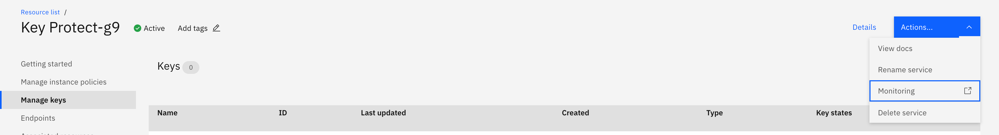
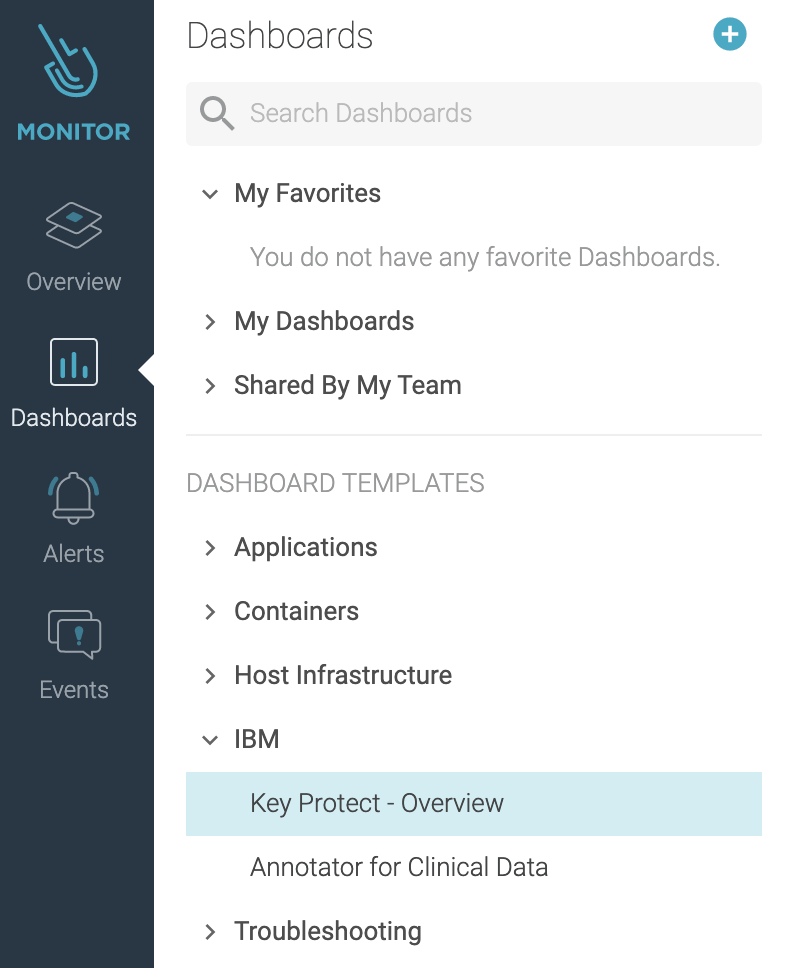
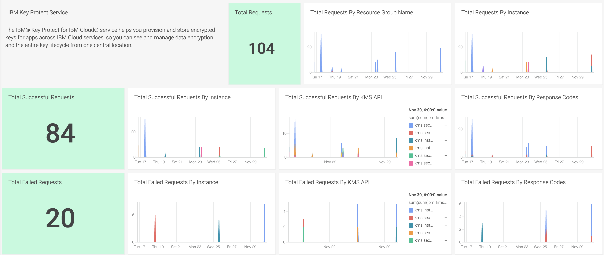
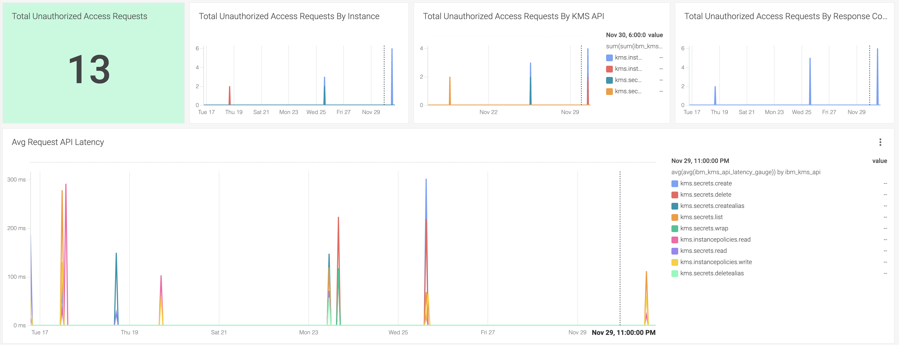
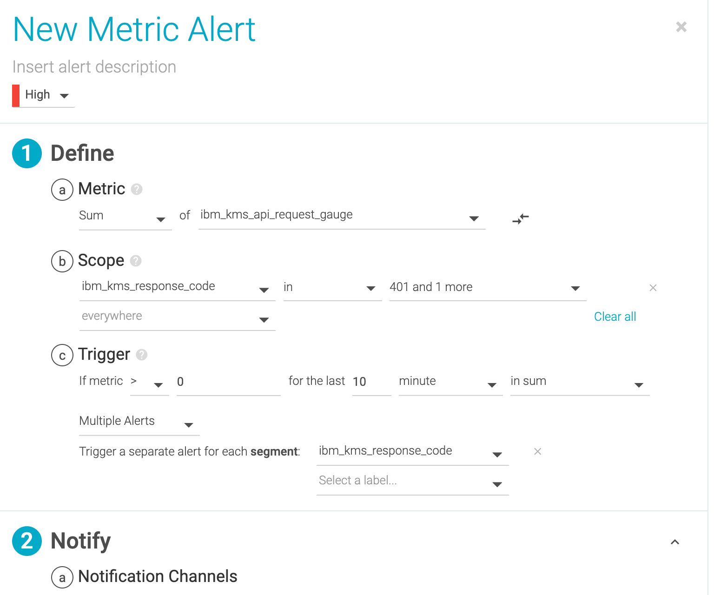

---

copyright:
  years: 2020, 2021
lastupdated: "2021-05-13"

keywords: IBM, monitoring, metrics, operational metrics

subcollection: key-protect

---

{:shortdesc: .shortdesc}
{:screen: .screen}
{:pre: .pre}
{:table: .aria-labeledby="caption"}
{:external: target="_blank" .external}
{:codeblock: .codeblock}
{:tip: .tip}
{:note: .note}
{:important: .important}

# {{site.data.keyword.mon_short}} operational metrics
{: #operational-metrics}

As a security officer, auditor, or manager, you can use the
{{site.data.keyword.mon_full_notm}} service to measure how users and
applications interact with {{site.data.keyword.keymanagementservicefull}}.
{: shortdesc}

{{site.data.keyword.mon_full_notm}} records data on the operations that occur
inside of {{site.data.keyword.cloud_notm}}. This service allows you to gain
operational visibility into the performance and health of your applications,
services, and platforms. You can use its advanced features to monitor and
troubleshoot, define alerts based on API response codes, and design custom
dashboards.

For more information regarding the {{site.data.keyword.mon_short}} service,
see the
[getting started tutorial for {{site.data.keyword.mon_full_notm}}](/docs/monitoring?topic=monitoring-getting-started-monitor){: external}.

## What metrics are available?
{: #kp-metrics-available}

You can use {{site.data.keyword.mon_short}} to track
the type of API requests being made in your service instance as
well as the latency of the requests.

The following contains examples of metrics that can be measured
in your {{site.data.keyword.mon_short}} dashboard:

- Total requests being made in your
  {{site.data.keyword.keymanagementserviceshort}} instance

- Successful vs failed API requests categorized by API type

- API request latency over time

- Total API requests categorized by response code

## Before you begin
{: #operational-metrics-considerations}

Enabling {{site.data.keyword.keymanagementserviceshort}} service metrics will
add new metrics to your {{site.data.keyword.mon_short}} instance. For
information on {{site.data.keyword.mon_short}} pricing, see
[Pricing](/docs/monitoring?topic=monitoring-pricing_plans){: external}.
{: important}

Before you provision an instance of {{site.data.keyword.mon_short}}, consider
the following guidance:

- You will need to enable a
  [metrics policy](/docs/key-protect?topic=key-protect-manage-monitor-metrics)
  in the {{site.data.keyword.keymanagementserviceshort}} instance in order to
  retrieve operational metrics.

- Other {{site.data.keyword.cloud_notm}} users with `administrator` or `editor`
  permissions can manage the {{site.data.keyword.mon_short}} service in the
  {{site.data.keyword.cloud_notm}}. These users must also have platform
  permissions to create resources within the context of the resource group where
  they plan to provision the instance.

## Connecting {{site.data.keyword.mon_short}} with {{site.data.keyword.keymanagementserviceshort}}
{: #connect-monitor-keyprotect}

Your dashboard will show metrics for all
{{site.data.keyword.keymanagementserviceshort}} instances with an enabled
metrics policy.
{: note}

### Configure a {{site.data.keyword.mon_short}} instance for metrics
{: #configure-monitor}

To enable platform metrics in a region, complete the following steps:

1. [Provision an instance of {{site.data.keyword.mon_short}}](/docs/monitoring?topic=monitoring-provision){: external}
   in the region of the Key Protect instance that contains an
   [enabled metrics policy](/docs/key-protect?topic=key-protect-manage-monitor-metrics).

2. Go to the [monitoring dashboard](/observe/monitoring).

3. Click on "Configure platform metrics."

4. Select the region where the {{site.data.keyword.keymanagementserviceshort}}
   instance was created.

5. Select the {{site.data.keyword.keymanagementserviceshort}} instance in which
   you would like to receive metrics.

6. Click "Configure."

7. Your {{site.data.keyword.keymanagementserviceshort}} instance is now set for
   platform metrics.

## {{site.data.keyword.keymanagementserviceshort}} Metrics Details
{: #kp-metrics}

You can use the metrics in your monitoring instance dashboard to measure the types of
requests being made in your service instance as well as the latency of the
requests.

### API Hits
{: #api-hits}

The type and amount of API requests being made to your
{{site.data.keyword.keymanagementserviceshort}} instance. For example, you can
track how many API requests have been made by an authorized user be setting an
[alert](#set-monitor-alerts)
that triggers when your monitoring instance notices a frequent amount of 401 status
codes being returned from your {{site.data.keyword.keymanagementserviceshort}}
instance.

|Metadata|Description|
|--- |--- |
|Metric Name|ibm_kms_api_request_gauge|
|Metric Type|Gauge|
|Value Type|none|
|Segment By|[Attributes for Segmentation](#attributes-for-segmentation)|
{: caption="Table 1. Describes the API Hits metrics." caption-side="bottom"}

## Latency
{: #latency}

The amount of time it takes
{{site.data.keyword.keymanagementserviceshort}} to receive an API request and
respond to it.

The latency is calculated by getting the average of all requests of the same
type that occur within 60 seconds.
{: note}

|Metadata|Description|
|--- |--- |
|Metric Name|ibm_kms_api_latency_gauge|
|Metric Type|Gauge|
|Value Type|Milliseconds|
|Segment By|[Attributes for Segmentation](#attributes-for-segmentation)|
{: caption="Table 2. Describes the Latency metrics." caption-side="bottom"}

## Attributes for Segmentation
{: #attributes-for-segmentation}

You can filter your metrics by using the following attributes.

|Attribute Name|Description|
|--- |--- |
|ibm_resource_type|Supported resource type is instance.|
|ibm_kms_response_code|Response code for the {{site.data.keyword.keymanagementserviceshort}} service API request.|
|ibm_scope|The account, organization, or space GUID associated with the metric.|
|ibm_ctype|public, dedicated, or local.|
|ibm_location|Location of the {{site.data.keyword.keymanagementserviceshort}} service instance.|
|ibm_service_name|kms.|
|ibm_resource|{{site.data.keyword.keymanagementserviceshort}} service instance ID.|
|ibm_kms_api|{{site.data.keyword.keymanagementserviceshort}} service API name.|
|ibm_resource_group_name|Resource group name associated with the {{site.data.keyword.keymanagementserviceshort}} service instance.|
|ibm_service_instance_name|{{site.data.keyword.keymanagementserviceshort}} service instance name.|
|ibm_service_instance|{{site.data.keyword.keymanagementserviceshort}} service instance ID.|
{: caption="Table 3. Describes the attributes use for segmenting metrics." caption-side="bottom"}

## Metrics Filter Attributes
{: #metrics-filter-attributes}

You can scope down your metrics by using the following scope filters.
These filters are more granular than the segmentation filters.

|Attribute Name|Description|
|--- |--- |
|ibmResourceGroupName|The name of the resource group associated with the {{site.data.keyword.keymanagementserviceshort}} service instance.|
|ibmScope|The account, organization, or space GUID associated with the metric.|
|ibmServiceInstanceName|The service instance associated with the metric.|
|ibmKmsApi|The {{site.data.keyword.keymanagementserviceshort}} API call associated with the metric.|
{: caption="Table 3. Table 4. Describes the scope filters for {{site.data.keyword.keymanagementserviceshort}} metrics." caption-side="bottom"}

Due to {{site.data.keyword.mon_short}} limitations, you will only be able to see
the values in the dropdown filters for up to 6 hours at a time. You can manually
type in value into scope variables to use scope filters for given time periods.
{: note}

## Default Dashboards
{: #default-dashboards}

You will need to configure platform metrics and enable a
[metrics policy](/docs/key-protect?topic=key-protect-manage-monitor-metrics)
on your KP service instance in order to view your
{{site.data.keyword.keymanagementserviceshort}} operational metrics dashboard.
{: note}

### How to find the {{site.data.keyword.mon_short}} dashboard for your {{site.data.keyword.keymanagementserviceshort}} service instance using {{site.data.keyword.keymanagementserviceshort}} console
{: #find-console}

After configuring your {{site.data.keyword.mon_short}} instance to receive
platform metrics, follow the below steps:

1. Go to the
   [Provision service instance](/docs/key-protect?topic=key-protect-provision#provision-gui)
   and create your {{site.data.keyword.keymanagementserviceshort}} service
   instance.

2. Click on the `Actions` dropdown.

3. Select `Monitoring`. This will take you to the
   {{site.data.keyword.keymanagementserviceshort}} dashboard.

{: caption="Figure 1. Shows example of the {{site.data.keyword.mon_short}} instance console monitoring button." caption-side="bottom"}

### How to find the {{site.data.keyword.mon_short}} dashboard for your {{site.data.keyword.keymanagementserviceshort}} service instance using observability page
{: #find-observability}

After configuring your {{site.data.keyword.mon_short}} instance to receive
platform metrics, follow the below steps:

1. Go to the
   [monitoring dashboard](/observe/monitoring){: external} and find your monitoring
   instance that is configured to receive platform metrics.

2. Click on the `View {{site.data.keyword.mon_short}}` button that is in the
   `View Dashboard` column of the monitoring instance.

3. Once you are in the {{site.data.keyword.mon_short}} platform, click
   `Dashboards` to open up the side menu.

4. Select `IBM` under the Dashboard Templates section.

5. Select `{{site.data.keyword.keymanagementserviceshort}} - Overview` to view
   the dashboard for your {{site.data.keyword.keymanagementserviceshort}}
   service instance.

{: caption="Figure 1. Shows the dashboard menu that lists the dashboards in your {{site.data.keyword.mon_short}} instances." caption-side="bottom"}

Below are figures that show the metric views available to you on the default
dashboard.

{: caption="Figure 2. Shows some of the metrics available on the {{site.data.keyword.mon_short}} dashboard." caption-side="bottom"}

{: caption="Figure 3. Shows some of the metrics available on the {{site.data.keyword.mon_short}} dashboard." caption-side="bottom"}

You will not be able to see any metrics in your {{site.data.keyword.mon_short}}
instance until you enable a metrics policy for your
{{site.data.keyword.keymanagementserviceshort}} instance and make API requests
to your {{site.data.keyword.keymanagementserviceshort}} instance.
{: note}

## Setting Alerts
{: #set-monitor-alerts}

You can set alerts on your {{site.data.keyword.mon_short}} dashboard to notify
you of certain metrics.

To setup a metric, complete the follow steps.

1. Click `Alerts` on the side menu.

2. Click `Add Alert` at the top of the page.

3. Select `Metric` as the alert type.

4. Select the aggregation and the metric that you would like to be performed on.

5. Select the scope if applicable.

6. Set the metric and time requirements for the alert to trigger.

7. Configure and set up the notification channel and notification interval.

8. Click the `CREATE` button.

The following figure shows an example of how to configure an alert when your
service instance receives multiple 401 and 403 errors within a 10 minute time
span.

{: caption="Figure 4=5. Shows the configuration for a 401 alert in a {{site.data.keyword.mon_short}} dashboard." caption-side="bottom"}
