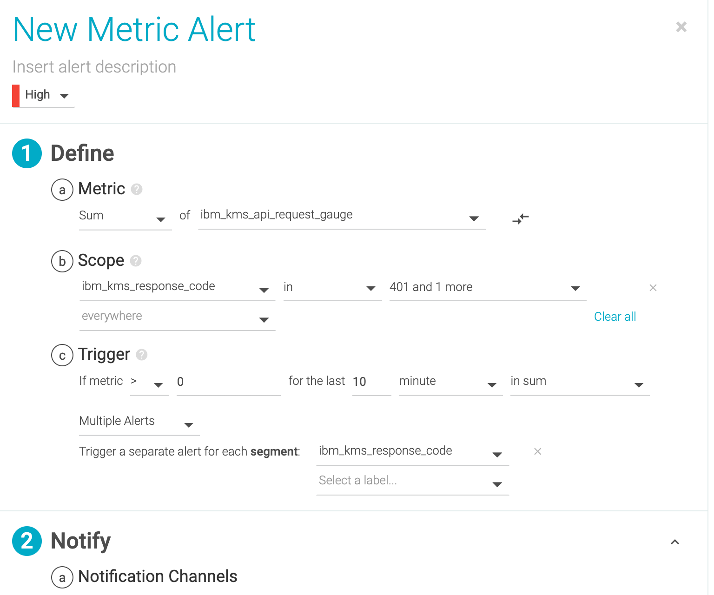

---

copyright:
  years: 2020
lastupdated: "2020-11-16"

keywords: IBM, monitoring, metrics, operational metrics

subcollection: key-protect

---

{:shortdesc: .shortdesc}
{:screen: .screen}
{:pre: .pre}
{:table: .aria-labeledby="caption"}
{:external: target="_blank" .external}
{:codeblock: .codeblock}
{:tip: .tip}
{:note: .note}
{:important: .important}

# {{site.data.keyword.mon_short}} Operational metrics
{: #operational-metrics}

As a security officer, auditor, or manager, you can use the {{site.data.keyword.mon_full_notm}}
service to measure how users and applications interact with
{{site.data.keyword.keymanagementservicefull}}.
{: shortdesc}

{{site.data.keyword.mon_full_notm}} records data on the operations 
that occur inside of {{site.data.keyword.cloud_notm}}. You can use 
this service to gain operational visibility into the performance 
and health of your applications, services, and platforms 
and to comply with regulatory audit requirements. In addition, you 
can be alerted about API requests to {{site.data.keyword.keymanagementserviceshort}} 
as they happen. 

For more information regarding the {{site.data.keyword.mon_short}} service, see the
[getting started tutorial for {{site.data.keyword.mon_full_notm}}](/docs//Monitoring-with-Sysdig?topic=Monitoring-with-Sysdig-getting-started-monitor){: external}.

## Before you begin
{: #operational-metrics-considerations}

Enabling Key Protect service metrics will add new metrics to your 
{{site.data.keyword.mon_short}} instance. For information on 
{{site.data.keyword.mon_short}} pricing, see 
[Pricing](/docs/Monitoring-with-Sysdig?topic=Monitoring-with-Sysdig-pricing_plans){: external}.
{: important}

Before you provision an instance of {{site.data.keyword.mon_short}}, consider 
the following guidance: 

- You will need to enable a [metrics policy](/docs/key-protect?topic=key-protect-manage-sysdig-metrics) 
  in the {{site.data.keyword.keymanagementserviceshort}} instance in order to retrieve 
  operational metrics. 

- Other {{site.data.keyword.cloud_notm}} users with `administrator` or `editor` permissions can manage 
  the {{site.data.keyword.mon_short}} service in the {{site.data.keyword.cloud_notm}}. These users 
  must also have platform permissions to create resources within the context of the resource group 
  where they plan to provision the instance.

## Connecting {{site.data.keyword.mon_short}} with {{site.data.keyword.keymanagementserviceshort}}
{: #connect-sysdig-keyprotect}

Your dashboard will show metrics for all {{site.data.keyword.keymanagementserviceshort}} 
instances with an enabled metrics policy.
{: note}

### Configure a {{site.data.keyword.mon_short}} instance for metrics
{: #configure-sysdig}

To enable platform metrics in a region, complete the following steps:

1. [Provision an instance of {{site.data.keyword.mon_short}}](https://cloud.ibm.com/docs/Monitoring-with-Sysdig?topic=Monitoring-with-Sysdig-provision) 
   in the region of the Key Protect instance that contains an [enabled metrics policy](/docs/key-protect?topic=key-protect-manage-sysdig-metrics).
2. Go to the [monitoring dashboard](https://cloud.ibm.com/observe/monitoring).
3. Click on "Configure platform metrics."
4. Select the region where the {{site.data.keyword.keymanagementserviceshort}} instance was created.
5. Select the {{site.data.keyword.keymanagementserviceshort}} instance in which you would like to receive metrics.
5. Click "Configure."
6. Your {{site.data.keyword.keymanagementserviceshort}} instance is now set for platform metrics.

## Key Protect Metrics Details
{: #kp-metrics}

You can use the metrics in your Sysdig dashboard to measure 
the types of requests being made in your service instance as
well as the latency of the requests. 

### API Hits
{: #kp-metrics}

The type and amount of API requests being made to your
{{site.data.keyword.keymanagementserviceshort}} instance. 
For example, you can track how many api requests have been
made by an authorized user be setting an 
[alert](#set-monitor-alerts) that triggers when your sysdig 
instance notices a frequent amount of 401 status codes being 
returned from your
{{site.data.keyword.keymanagementserviceshort}} instance.

<table>
  <tr>
    <th>Metadata</th>
    <th>Description</th>
  </tr>

  <tr>
    <td>
      Metric Name
    </td>
    <td>
      

        <code>ibm_kms_api_request_gauge</code>
      

    </td>
  </tr>

  <tr>
    <td>
      Metric Type
    </td>
    <td>
      Gauge
    </td>
  </tr>

  <tr>
    <td>
      Value Type
    </td>
    <td>
      

        none
      

    </td>
  </tr>

  <tr>
    <td>
      Label Tag
    </td>
    <td>
      status code, instance id
    </td>
  </tr>

  <caption style="caption-side:bottom;">
    Table 1. Describes the API Hits metrics.
  </caption>
</table>

## Latency
{: #kp-metrics}

The amount of time it takes 
{{site.data.keyword.keymanagementserviceshort}} to receive
an API request and respond to it.

The latency is calculated by getting the average of all requests of the same type that occur within 60 seconds.
{: note}

<table>
  <tr>
    <th>Metadata</th>
    <th>Description</th>
  </tr>

  <tr>
    <td>
      Metric Name
    </td>
    <td>
      

        <code>ibm_kms_api_latency_gauge</code>
      

    </td>
  </tr>

  <tr>
    <td>
      Metric Type
    </td>
    <td>
      Gauge
    </td>
  </tr>

  <tr>
    <td>
      Value Type
    </td>
    <td>
      

        Milliseconds
      

    </td>
  </tr>

  <tr>
    <td>
      Label Tag
    </td>
    <td>
      api
    </td>
  </tr>

  <caption style="caption-side:bottom;">
    Table 2. Describes the Latency metrics.
  </caption>
</table>

## Metrics Filter Attributes
{: #metrics-filter-attributes}

You can filter your metrics by using the following attributes. 

<table>
  <tr>
    <th>Attribute Name</th>
    <th>Description</th>
  </tr>

  <tr>
    <td>
      <code>ibmResourceGroupName</code>
    </td>
    <td>
      

        The name of the resource group being measured by the service.
      

    </td>
  </tr>

  <tr>
    <td>
      <code>ibmScope</code>
    </td>
    <td>
      The account, organization, or space GUID associated with the metric.
    </td>
  </tr>

  <tr>
    <td>
      <code>ibmServiceInstanceName</code>
    </td>
    <td>
      

        The service instance associated with the metric.
      

    </td>
  </tr>

  <tr>
    <td>
      <code>ibmKmsApi</code>
    </td>
    <td>
      The Key Protect api call associated with the metric.
    </td>
  </tr>

  <caption style="caption-side:bottom;">
    Table 3. Describes the filter attributes for {{site.data.keyword.keymanagementserviceshort}} metrics.
  </caption>
</table>

Due to {{site.data.keyword.mon_short}} limitations, you 
will only be able to see the values in the dropdown filters
for up to 6 hours at a time.
{: note}

## Default Dashboards
{: #kp-metrics}

You will need to configure platform metrics and enable a 
[metrics policy](/docs/key-protect?topic=key-protect-manage-sysdig-metrics) 
on your KP service instance in order to view your 
{{site.data.keyword.keymanagementserviceshort}} operational metrics dashboard. 
{: note}
### How to find the {{site.data.keyword.mon_short}} dashboard for your {{site.data.keyword.keymanagementserviceshort}} service instance

After configuring your {{site.data.keyword.mon_short}} 
instance to receive platform metrics, follow the below 
steps:

1. Go to the [monitoring dashboard](/observe/monitoring){: external} that contains your sysdig instance. 
2. Click on the `View {{site.data.keyword.mon_short}}`button that is in the `View Dashboard` column of the sysdig instance.
3. Once you are in the {{site.data.keyword.mon_short}} platform, Click `Dashboards` to open up the side menu.
4. Select`IBM` under the Dashboard Templates section.
5. Select `{{site.data.keyword.keymanagementserviceshort}} - Overview` to view the dashboard for your {{site.data.keyword.keymanagementserviceshort}} service instance.

{: caption="Figure 1. Shows some the monitoring dashboard that lists your {{site.data.keyword.mon_short}} instances." caption-side="bottom"}

{: caption="Figure 2. Shows the dashboard menu that lists the dashboards in your {{site.data.keyword.mon_short}} instances." caption-side="bottom"}

Below are figures that show the metric views available to you on the default
dashboard.

{: caption="Figure 3. Shows some of the metrics available on the {{site.data.keyword.mon_short}} dashboard." caption-side="bottom"}

{: caption="Figure 4. Shows some of the metrics available on the {{site.data.keyword.mon_short}} dashboard." caption-side="bottom"}

You will not be able to see any metrics in your {{site.data.keyword.mon_short}} instance until you enable a metrics policy for your {{site.data.keyword.keymanagementserviceshort}} instance and make api requests to your {{site.data.keyword.keymanagementserviceshort}} instance.
{: note}
## Setting Alerts
{: #set-monitor-alerts}

You can set alerts on your {{site.data.keyword.mon_short}} dashboard to 
notify you of certain metrics. 

To setup a metric, complete the follow steps. 

1. Click `Alerts` on the side menu.
2. Click `Add Alert` at the top of the page.
3. Select `Metric` as the alert type.
4. Select the aggregation and the metric that you would like to be performed on.
5. Select the scope if applicable.
6. Set the metric and time requirements for the alert to trigger.
7. Configure and set up the notification channel and notification interval.
8. Click the `CREATE` button.

The following figure shows an example of how to configure an alert when your
service instance recieves multiple 401 and 403 errors within a 10 minute time
span.

{: caption="Figure 4=5. Shows the configuration for a 401 alert in a {{site.data.keyword.mon_short}} dashboard." caption-side="bottom"}

For more information on configuring metric alerts, see
[Metric Alerts](https://docs.sysdig.com/en/metric-alerts.html){: external}
{: note}
