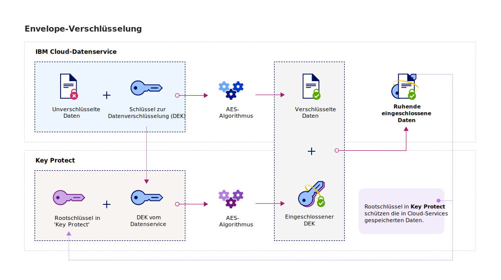
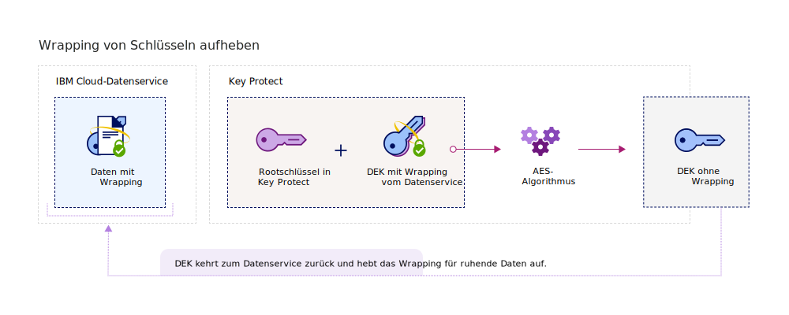

---

copyright:
  years: 2017, 2018
lastupdated: "2018-08-24"

---

{:shortdesc: .shortdesc}
{:codeblock: .codeblock}
{:screen: .screen}
{:new_window: target="_blank"}
{:pre: .pre}
{:tip: .tip}

# Envelope-Verschlüsselung
{: #envelope-encryption}

Die Envelope-Verschlüsselung ist sozusagen eine Verschlüsselung von Daten mit einem Datenverschlüsselungsschlüssel (DEK) und der anschließenden Verschlüsselung des DEK mit einem Rootschlüssel, der vollständig verwaltet wird. 
{: shortdesc}

{{site.data.keyword.keymanagementservicefull}} schützt Ihre gespeicherten Daten mit einer erweiterten Verschlüsselung und hat mehrere Vorteile:

<table>
  <th>Vorteil</th>
  <th>Beschreibung</th>
  <tr>
    <td>Vom Kunden verwaltete Verschlüsselungsschlüssel</td>
    <td>Mit diesem Service werden Rootschlüssel bereitgestellt, die die verschlüsselten Daten in der Cloud schützen. Rootschlüssel dienen als Masterschlüssel, in den Schlüssel eingeschlossen sind, die Sie bei der Verwaltung und Sicherung von Schlüsseln zur Datenverschlüsselung (DEKs) unterstützen, die in {{site.data.keyword.cloud_notm}}-Datenservices bereitgestellt werden. Sie entscheiden, ob Sie Ihre vorhandenen Rootschlüssel importieren oder von {{site.data.keyword.keymanagementserviceshort}} für Sie generieren lassen möchten.</td>
  </tr>
  <tr>
    <td>Vertraulichkeit und Integritätsschutz</td>
    <td>{{site.data.keyword.keymanagementserviceshort}} verwendet den AES-Algorithmus (Advanced Encryption Standard) in Galois/Counter Mode (GCM), um Schlüssel zu erstellen und zu schützen. Wenn Sie im Service Schlüssel erstellen, generiert {{site.data.keyword.keymanagementserviceshort}} diese Schlüssel innerhalb der Trust-Abgrenzung der {{site.data.keyword.cloud_notm}}-Hardwaresicherheitsmodule (HSMs). Deshalb haben nur Sie Zugriff auf Ihre Verschlüsselungsschlüssel.</td>
  </tr>
  <tr>
    <td>Kryptografisches Vernichten von Daten</td>
    <td>Wenn Ihre Organisation ein Sicherheitsproblem erkennt oder Ihre App keinen Datensatz mehr benötigt, können die Daten aus der Cloud permanent vernichtet werden. Wenn Sie einen Rootschlüssel löschen, der andere DEKS schützt, stellen Sie sicher, dass die den Schlüsseln zugehörigen Daten nicht mehr verfügbar sind oder nicht mehr entschlüsselt werden können.</td>
  </tr>
  <tr>
    <td>Delegierte Benutzerzugriffssteuerung</td>
    <td>{{site.data.keyword.keymanagementserviceshort}} unterstützt ein zentralisiertes Zugriffssteuerungssystem, um einen differenzierten Zugriff auf Ihre Schlüssel zu ermöglichen. [Durch das Zuweisen von IAM-Benutzerrollen und erweiterten Berechtigungen](/docs/services/key-protect/manage-access.html#roles) entscheidet der Sicherheitsadministrator, wer auf die Rootschlüssel im Service zugreifen darf.</td>
  </tr>
  <caption style="caption-side:bottom;">Tabelle 1. Vorteile der benutzerverwalteten Verschlüsselung</caption>
</table>

## Funktionsweise
{: #overview}

Die Envelope-Verschlüsselung kombiniert die Stärke mehrerer Verschlüsselungsalgorithmen, um Ihre sensiblen Daten in der Cloud zu schützen. Hierbei werden mehrere Datenverschlüsselungsschlüssel (DEKs) mit einer erweiterten Verschlüsselung eingeschlossen, indem ein Rootschlüssel verwendet wird, den Sie vollständig verwalten können. Dieser Key-Wrapping-Prozess erstellt eingeschlossene DEKs, die Ihre gespeicherten Daten vor einem unbefugten Zugriff und vor Gefährdungen schützen. Die Aufhebung des Wrapping eines DEK kehrt den Prozess der Envelope-Verschlüsselung um. Dabei wird derselbe Rootschlüssel verwendet. Das Ergebnis sind entschlüsselte und authentifizierte Daten.
 
Im folgenden Diagramm wird eine kontextabhängige Ansicht dargestellt, wie das Key-Wrapping funktioniert.

Die Envelope-Verschlüsselung wird in der Dokumentation 'NIST Special Publication 800-57, Recommendation for Key Management' kurz erläutert. Weitere Informationen finden Sie in [NIST SP 800-57 Pt. 1 Rev. 4. ](http://nvlpubs.nist.gov/nistpubs/SpecialPublications/NIST.SP.800-57pt1r4.pdf){: new_window}

## Schlüsseltypen
{: #key-types}

Der Service unterstützt die zwei Schlüsseltypen 'Rootschlüssel' und 'Standardschlüssel' für die erweiterte Verschlüsselung und Verwaltung von Daten.

<dl>
  <dt>Rootschlüssel</dt>
    <dd>Rootschlüssel sind primäre Ressourcen in {{site.data.keyword.keymanagementserviceshort}}. Sie sind symmetrische Key-Wrapping-Schlüssel, die als vertrauenswürdige Roots für das Wrapping (Verschlüsseln) und das Aufheben des Wrappings (Entschlüsseln) von anderen Schlüssel verwendet werden, die in einem Datenservice gespeichert sind. Sie können mit {{site.data.keyword.keymanagementserviceshort}} den Lebenszyklus von Rootschlüsseln erstellen, speichern und verwalten, um den uneingeschränkten Zugriff auf andere in der Cloud gespeicherten Schlüssel zu erhalten. Im Gegensatz zu einem Standardschlüssel ist ein Rootschlüssel an den {{site.data.keyword.keymanagementserviceshort}}-Service gebunden.</dd>
  <dt>Standardschlüssel</dt>
    <dd>Standardschlüssel sind Verschlüsselungsschlüssel, die in der Kryptografie verwendet werden. Im Allgemeinen verschlüsseln Standardschlüssel Daten direkt. Sie können mit {{site.data.keyword.keymanagementserviceshort}} den Lebenszyklus von Standardschlüsseln erstellen, speichern und verwalten. Nach dem Importieren oder Generieren eines Standardschlüssels im Service können Sie ihn in eine externe Datenressource (beispielsweise als Speicherbucket) exportieren, um sensible Daten zu verschlüsseln. Standardschlüssel, die gespeicherte Daten verschlüsseln, werden Datenverschlüsselungsschlüssel (DEKs) genannt, die mit einer erweiterten Verschlüsselung eingeschlossen werden können. Eingeschlossene DEKs werden nicht in {{site.data.keyword.keymanagementserviceshort}} gespeichert.</dd>
</dl>

Nachdem Sie Schlüssel in {{site.data.keyword.keymanagementserviceshort}} erstellt haben, wird ein ID-Wert zurückgegeben, der für API-Aufrufe an den Service genutzt werden kann. Der ID-Wert für Ihre Schlüssel wird mit der {{site.data.keyword.keymanagementserviceshort}}-GUI oder [{{site.data.keyword.keymanagementserviceshort}}-API](https://console.bluemix.net/apidocs/kms) abgerufen. 

## Wrapping für Schlüssel durchführen
{: #wrapping}

Rootschlüssel unterstützen das Gruppieren, Verwalten und Schützen von Datenverschlüsselungsschlüsseln (DEKs), die in der Cloud gespeichert sind. Sie können einen oder mehrere DEKs mit der erweiterten Verschlüsselung einschließen, indem Sie einen vollständig verwaltbaren Rootschlüssel in {{site.data.keyword.keymanagementserviceshort}} angeben. 

Nach der Angabe eines Rootschlüssels in {{site.data.keyword.keymanagementserviceshort}} können Sie über die {{site.data.keyword.keymanagementserviceshort}}-API eine Key-Wrapping-Anfrage an den Service senden. Die Key-Wrapping-Operation bietet sowohl Vertraulichkeit als auch einen Integritätsschutz für den DEK. Im folgenden Diagramm ist der Key-Wrapping-Prozess dargestellt:

In der folgenden Tabelle werden die Eingaben beschrieben, die für eine Key-Wrapping-Operation benötigt werden:
<table>
  <th>Eingabe</th>
  <th>Beschreibung</th>
  <tr>
    <td>Rootschlüssel-ID</td>
    <td>Der ID-Wert für den Rootschlüssel, der für das Einschließen (Wrapping) verwendet werden soll. Der Rootschlüssel kann in den Service importiert werden oder aus HSMs in {{site.data.keyword.keymanagementserviceshort}} stammen. Die für das Wrapping verwendete Rootschlüssel müssen 256, 384 oder 512 Bit groß sein, damit das Einschließen erfolgreich ist.</td>
  </tr>
  <tr>
    <td>Klartext</td>
    <td>Optional: Die Schlüsselinformationen des DEK, die die Daten enthalten, die Sie verwalten und schützen möchten. Der Klartext, der für das Key-Wrapping verwendet wird, muss base64-codiert sein. Um einen 256-Bit-DEK zu generieren, können Sie das Attribut `plaintext` weglassen. Der Service generiert einen base64-codierten DEK für das Key-Wrapping.</td>
  </tr>
  <tr>
    <td>Zusätzliche Authentifizierungsdaten (AAD)</td>
    <td>Optional: Ein Array an Zeichenfolgen, die die Integrität der Schlüsselinhalte prüft. Jede Zeichenfolge kann bis zu 255 Zeichen enthalten. Wenn AAD bei einer Wrapping-Anfrage angegeben wird, müssen Sie dieselben AAD während der nachfolgenden Unwrap-Anfrage verwenden.</td>
  </tr>
    <caption style="caption-side:bottom;">Tabelle 2. Obligatorische Eingaben für das Key-Wrapping in {{site.data.keyword.keymanagementserviceshort}}</caption>
</table>

Wenn Sie eine Wrapping-Anfrage senden, ohne den zu verschlüsselnden Klartext anzugeben, generiert der AES-GCM-Verschlüsselungsalgorithmus Klartext, der in nicht lesbare Daten konvertiert wird (sogenannter verschlüsselter Text). Die Ausgabe dieses Prozesses ist ein 256-Bit-DEK mit neuen Schlüsselinformationen. Das System verwendet dann einen AES-Key-Wrapping-Algorithmus, der den DEK und seine Schlüsselinformationen in den angegebenen Rootschlüssel einschließt. Eine erfolgreiche Wrapping-Operation gibt einen base64-codierten, eingeschlossenen DEK zurück, der in einer App oder in einem Service von {{site.data.keyword.cloud_notm}} gespeichert wird. 

## Wrapping von Schlüssel aufheben
{: #unwrapping}

Das Aufheben des Key-Wrappings für einen Datenverschlüsselungsschlüssel (DEK) entschlüsselt und authentifiziert die Inhalte im Schlüssel. Es werden die ursprünglichen Schlüsselinformationen zu Ihrem Datenservice zurückgegeben. 

Wenn Ihre Geschäftsanwendung auf die Inhalte Ihrer eingeschlossenen DEKs zugreifen muss, können Sie mit der {{site.data.keyword.keymanagementserviceshort}}-API eine Anfrage zum Aufheben des Key-Wrapping an den Service senden. Um das Wrapping eines DEK aufzuheben, geben Sie den ID-Wert des Rootschlüssel und den `ciphertext`Wert an, der während der ursprünglichen Wrapping-Anfrage zurückgegeben wurde. Um die Unwrapping-Anfrage abzuschließen, müssen Sie auch die zusätzlichen Authentifizierungsdaten (AAD) angeben, um die Integrität der Schlüsselinhalte zu prüfen.

Im folgenden Diagramm wird der Prozess zum Aufheben des Wrappings für Schlüssel dargestellt.

Nach dem Senden der Anfrage zum Aufheben des Wrappings kehrt das System mithilfe derselben AES-Algorithmen den Key-Wrapping-Prozess um. Eine erfolgreiche Operation zum Aufheben des Wrappings gibt den base64-codierten `plaintext`-Wert an Ihren {{site.data.keyword.cloud_notm}}-Service mit ruhenden Daten zurück.

