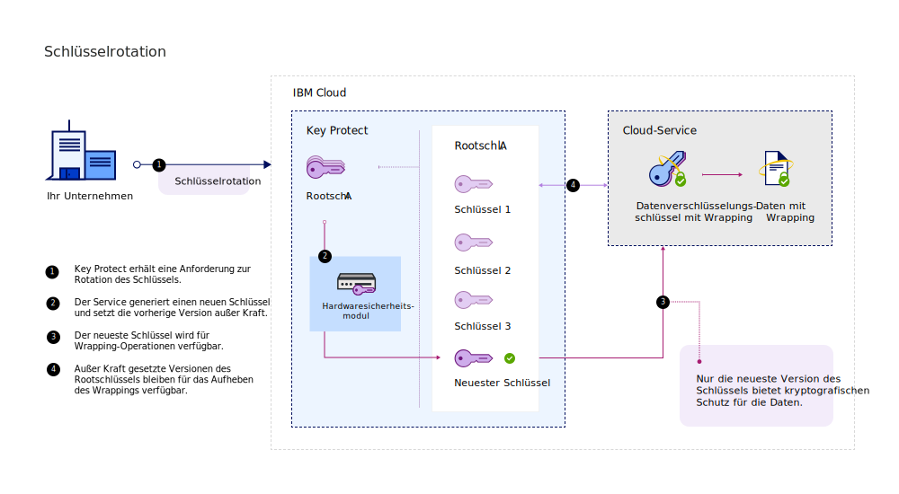
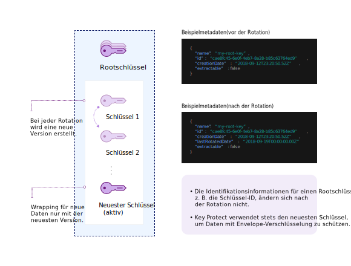

---

copyright:
  years: 2017, 2019
lastupdated: "2019-03-22"

keywords: rotate encryption keys, rotate keys automatically, key rotation

subcollection: key-protect

---

{:shortdesc: .shortdesc}
{:codeblock: .codeblock}
{:screen: .screen}
{:new_window: target="_blank"}
{:pre: .pre}
{:tip: .tip}
{:note: .note}
{:important: .important}

# Rotation von Verschlüsselungsschlüsseln
{: #key-rotation}

Die Schlüsselrotation findet statt, wenn die ursprünglichen Schlüsselinformationen eines Rootschlüssels außer Kraft gesetzt und durch die Generierung von neuen Verschlüsselungsschlüssel-Informationen neu erstellt werden.

Die regelmäßige Schlüsselrotation unterstützt Sie bei der Einhaltung branchenspezifischer Vorgaben und dem Einsatz bewährter Verschlüsselungsverfahren. Die folgenden Tabelle enthält Beschreibungen der wichtigsten Vorteile der Schlüsselrotation:

<table>
  <th>Vorteil</th>
  <th>Beschreibung</th>
  <tr>
    <td>Verwaltung von Verschlüsselungsperioden für Schlüssel</td>
    <td>Bei der Schlüsselrotation wird die Dauer des Schutzes für Ihre Informationen durch einen einzelnen Schlüssel begrenzt. Durch eine regelmäßige Rotation der Rootschlüssel wird auch die Verschlüsselungsperiode der Schlüssel verkürzt. Je länger die Laufzeit eines Verschlüsselungsschlüssels ist, desto höher ist die Wahrscheinlichkeit eines Sicherheitsverstoßes.</td>
  </tr>
  <tr>
    <td>Schadensbegrenzung bei Vorfällen</td>
    <td>Wenn Ihre Organisation ein Sicherheitsproblem feststellt, können Sie eine sofortige Rotation des Schlüssels durchführen, um Kosten im Zusammenhang mit einem beeinträchtigen Schlüssel zu mindern oder zu reduzieren.</td>
  </tr>
  <caption style="caption-side:bottom;">Tabelle 1. Beschreibung der Vorteile der Schlüsselrotation</caption>
</table>

Die Schlüsselrotation wird in der Dokumentation 'NIST Special Publication 800-57, Recommendation for Key Management' erläutert. Weitere Informationen finden Sie in [NIST SP 800-57 Pt. 1 Rev. 4. ](http://nvlpubs.nist.gov/nistpubs/SpecialPublications/NIST.SP.800-57pt1r4.pdf){: new_window}.
{: tip}

## Vergleich Ihrer Optionen für die Schlüsselrotation in {{site.data.keyword.keymanagementserviceshort}}
{: #compare-key-rotation-options}

In {{site.data.keyword.keymanagementserviceshort}} können Sie [eine Rotationsrichtlinie für einen Schlüssel festlegen](/docs/services/key-protect?topic=key-protect-set-rotation-policy) oder [den Schlüssel bedarfsgesteuert rotieren](/docs/services/key-protect?topic=key-protect-rotate-keys), ohne die Schlüsselinformationen für Ihren außer Kraft gesetzten Schlüssel weiter verfolgen zu müssen. 

Rotationsoptionen sind nur für Rootschlüssel verfügbar.
{: note}

<dl>
  <dt>Rotationsrichtlinie für einen Schlüssel festlegen</dt>
    <dd>{{site.data.keyword.keymanagementserviceshort}} hilft Ihnen, die Rotation für Verschlüsselungsschlüssel zu vereinfachen, indem Sie Rotationsrichtlinien für diejenigen Schlüssel aktivieren, die Sie im Service generieren. Nach dem Erstellen eines Rootschlüssels können Sie eine Rotationsrichtlinie für den Schlüssel entweder in der grafischen Benutzeroberfläche von {{site.data.keyword.keymanagementserviceshort}} oder mit der API verwalten. <a href="/docs/services/key-protect?topic=key-protect-rotation-frequency">Wählen Sie ein automatisches Rotationsintervall zwischen 1 und 12 Monaten für Ihren Schlüssel</a> entsprechend Ihren Sicherheitsanforderungen aus. Wenn der Schlüssel auf Basis des von Ihnen angegebenen Rotationsintervalls rotieren soll, ersetzt {{site.data.keyword.keymanagementserviceshort}} den Schlüssel automatisch durch neue Schlüsselinformationen.</dd>
  <dt>Bedarfsgesteuerte Rotation von Schlüsseln</dt>
    <dd>Als Sicherheitsadministrator benötigen Sie möglicherweise mehr Kontrolle über die Häufigkeit der Rotation für Ihre Schlüssel. Wenn Sie keine automatische Rotationsrichtlinie für einen Schlüssel festlegen möchten, können Sie manuell einen neuen Schlüssel erstellen, der einen vorhandenen Schlüssel ersetzt, und anschließend Ihre Anwendungen aktualisieren, sodass sie auf den neuen Schlüssel verweisen. Zur Vereinfachung dieses Prozesses können Sie {{site.data.keyword.keymanagementserviceshort}} verwenden, um den Schlüssel bedarfsgesteuert zu rotieren. In diesem Szenario erstellt {{site.data.keyword.keymanagementserviceshort}} den Schlüssel in Ihrem Namen bei jeder Rotationsanforderung. Der Schlüssel behält die Metadaten und die Schlüssel-ID bei.</dd>
</dl>

## Funktionsweise der Schlüsselrotation 
{: #how-key-rotation-works}

Bei der Schlüsselrotation werden Schlüsselinformationen vom Status _Aktiv_ auf sichere Weise in den Schlüsselstatus _Inaktiviert_ versetzt. Zum Ersetzen der inaktivierten oder außer Kraft gesetzten Schlüsselinformationen werden neue Schlüsselinformationen in den Status _Aktiv_ versetzt und so für Verschlüsselungsoperationen verfügbar gemacht.

### {{site.data.keyword.keymanagementserviceshort}} für die Schlüsselrotation verwenden
{: #use-key-protect-rotate-keys}

Beachten Sie die folgenden Hinweise, wenn Sie vorhaben, {{site.data.keyword.keymanagementserviceshort}} für die Rotation von Rootschlüsseln zu verwenden.

<dl>
  <dt>Rotation von Rootschlüsseln, die in {{site.data.keyword.keymanagementserviceshort}} generiert werden</dt>
    <dd>Sie können {{site.data.keyword.keymanagementserviceshort}} verwenden, um einen Rootschlüssel zu rotieren, der in {{site.data.keyword.keymanagementserviceshort}} generiert wurde, indem Sie entweder eine Rotationsrichtlinie für den Schlüssel festlegen oder den Schlüssel bedarfsgesteuert rotieren. Die Metadaten für den Rootschlüssel, wie z. B. die Schlüssel-ID, ändern sich bei der Rotation des Schlüssels nicht.</dd>
  <dt>Rotation von eigenen Rootschlüsseln, die Sie im Service verwenden</dt>
    <dd>Um einen Rootschlüssel zu rotieren, den Sie erst in den Service importiert haben, müssen Sie für den Schlüssel neue Schlüsselinformationen generieren und diese für den Schlüssel bereitstellen. Sie können mit {{site.data.keyword.keymanagementserviceshort}} importierte Rootschlüssel bedarfsgesteuert rotieren, indem Sie als Teil der Rotationsanforderung neue Schlüsselinformationen angeben. Die Metadaten für den Rootschlüssel, wie z. B. die Schlüssel-ID, ändern sich bei der Rotation des Schlüssels nicht. Da Sie neue Schlüsselinformationen bereitstellen müssen, um einen importierten Schlüssel zu rotieren, sind für Rootschlüssel mit importierten Schlüsselinformationen keine automatischen Rotationsrichtlinien verfügbar.</dd>
  <dt>Außer Kraft gesetzte Schlüsselinformationen verwalten</dt>
    <dd>{{site.data.keyword.keymanagementserviceshort}} erstellt neue Schlüsselinformationen, nachdem Sie einen Rootschlüssel rotiert haben. Der Service setzt das alte Schlüsselmaterial außer Kraft und behält die außer Kraft gesetzten Versionen bei, bis der Rootschlüssel gelöscht wird. Wenn Sie den Rootschlüssel für die Envelope-Verschlüsselung verwenden, verwendet {{site.data.keyword.keymanagementserviceshort}} nur die neuesten Schlüsselinformationen, die dem Schlüssel zugeordnet sind. Die außer Kraft gesetzten Schlüsselinformationen können nicht mehr für den Schutz von Schlüsseln verwendet werden, bleiben jedoch für Operationen zum Aufheben von Wrappings verfügbar. Wenn {{site.data.keyword.keymanagementserviceshort}} erkennt, dass Sie zum Aufheben von Wrappings für DEKs außer Kraft gesetzte Schlüsselinformationen verwenden, stellt der Service einen neu eingeschlossenen DEK bereit, der auf den neuesten Rootschlüsselinformationen beruht. Sie können den neu eingeschlossenen DEK verwenden, um die Schlüssel mit den neuesten Schlüsselinformationen erneut einzuschließen.</dd>
 <dt>Schlüsselrotation für {{site.data.keyword.cloud_notm}}-Datenservices aktivieren</dt>
    <dd>Damit diese Schlüsselrotationsoptionen für Ihren Datenservice in {{site.data.keyword.cloud_notm}} aktiviert werden können, muss der Datenservice in {{site.data.keyword.keymanagementserviceshort}} integriert sein. Weitere Informationen hierzu finden Sie in der Dokumentation für Ihren {{site.data.keyword.cloud_notm}}-Datenservice oder in <a href="/docs/services/key-protect?topic=key-protect-integrate-services">unserer Liste von integrierten Services</a>.</dd>
</dl>

Für die Schlüsselrotation in {{site.data.keyword.keymanagementserviceshort}} fallen keine zusätzlichen Gebühren an. Sie können das Wrapping für WDEKs mit außer Kraft gesetzten Schlüsselinformationen weiterhin aufheben, ohne dass zusätzliche Kosten anfallen. Weitere Informationen zu den verfügbaren Preisoptionen finden Sie auf der [{{site.data.keyword.keymanagementserviceshort}}-Katalogseite](https://{/catalog/services/key-protect).
{: tip}

### Informationen zum Schlüsselrotationsprozess
{: #understand-key-rotation-process}

Im Hintergrund führt die {{site.data.keyword.keymanagementserviceshort}}-API den Schlüsselrotationsprozess aus.  

Im folgenden Diagramm wird eine kontextbezogene Ansicht der Schlüsselrotationsfunktionalität dargestellt.

Bei jeder Rotationsanforderung ordnet {{site.data.keyword.keymanagementserviceshort}} dem Rootschlüssel neue Schlüsselinformationen zu. 

Nach dem Abschluss einer Rotation werden die neuen Rootschlüsselinformationen für den Schutz zukünftiger Datenverschlüsselungsschlüssel (DEKs) mit [Envelope-Verschlüsselung](/docs/services/key-protect?topic=key-protect-envelope-encryption) verfügbar. Außer Kraft gesetzte Schlüsselinformationen werden in den Status _Inaktiviert_ versetzt. In diesem Status können sie nur dazu verwendet werden, das Wrapping für ältere DEKs, die noch nicht durch die neuesten Rootschlüsselinformationen geschützt werden, aufzuheben und auf diese DEKs zuzugreifen. Wenn {{site.data.keyword.keymanagementserviceshort}} feststellt, dass außer Kraft gesetzte Rootschlüsselinformationen für das Aufheben des Wrappings eines älteren DEK verwendet werden, verschlüsselt der Service den DEK automatisch erneut und gibt einen Datenverschlüsselungsschlüssel mit Wrapping (Wrapped Data Encryption Key, WDEK) zurück, der auf den neuesten Rootschlüsselinformationen basiert. Speichern Sie den neuen WDEK und verwenden Sie ihn für zukünftige Operationen zum Aufheben des Wrappings. Auf diese Weise schützen Sie Ihre DEKs mit den neuesten Rootschlüsselinformationen.

Weitere Informationen zur Verwendung der {{site.data.keyword.keymanagementserviceshort}}-API für die Rootschlüsselrotation finden Sie in [Schlüsselrotation](/docs/services/key-protect?topic=key-protect-rotate-keys).

## Häufigkeit der Schlüsselrotation
{: #rotation-frequency}

Nach der Generierung eines Rootschlüssels in {{site.data.keyword.keymanagementserviceshort}} legen Sie die Rotationshäufigkeit fest. Gründe für die Schlüsselrotation können Mitarbeiterfluktuation, Prozessstörungen oder interne Richtlinien der Organisation hinsichtlich der Gültigkeitsdauer von Schlüsseln sein. 

Führen Sie eine regelmäßige Schlüsselrotation durch, z. B. alle 30 Tage. Dies entspricht den bewährten Verschlüsselungsverfahren. 

| Rotationstyp | Häufigkeit | Beschreibung
| --- | --- | --- |
| [Richtlinienbasierte Schlüsselrotation](/docs/services/key-protect?topic=key-protect-set-rotation-policy) | Alle 1 - 12 Monate | Wählen Sie ein Rotationsintervall zwischen 1 und 12 Monaten für Ihren Schlüssel basierend auf Ihren aktuellen Sicherheitsanforderungen aus. Nachdem Sie eine Rotationsrichtlinie für einen Schlüssel festgelegt haben, beginnt die Uhr sofort zu laufen, basierend auf dem ursprünglichen Erstellungsdatum für den Schlüssel. Wenn Sie beispielsweise eine monatliche Rotationsrichtlinie für einen Schlüssel festlegen, den Sie am `01.02.2019` erstellt haben, rotiert {{site.data.keyword.keymanagementserviceshort}} den Schlüssel automatisch am `01.03.2019`.|
| [Bedarfsgesteuerte Schlüsselrotation](/docs/services/key-protect?topic=key-protect-rotate-keys) | Bis zu einer Rotation pro Stunde | Wenn Sie einen Schlüssel bedarfsgesteuert rotieren, lässt {{site.data.keyword.keymanagementserviceshort}} für jeden Rootschlüssel eine Rotation pro Stunde zu. |
{: caption="Tabelle 2. Optionen für die Rotationshäufigkeit zum Rotieren von Schlüsseln in {{site.data.keyword.keymanagementserviceshort}}" caption-side="top"}

## Weitere Schritte
{: #rotation-next-steps}

- Informationen zur Verwendung von {{site.data.keyword.keymanagementserviceshort}} für das Festlegen einer automatischen Rotationsrichtlinie für einen einzelnen Schlüssel finden Sie unter [Rotationsrichtlinie festlegen](/docs/services/key-protect?topic=key-protect-set-rotation-policy).
- Weitere Informationen zum manuellen Rotieren von Rootschlüsseln finden Sie unter [Bedarfsgesteuerte Rotation von Schlüsseln](/docs/services/key-protect?topic=key-protect-rotate-keys).
