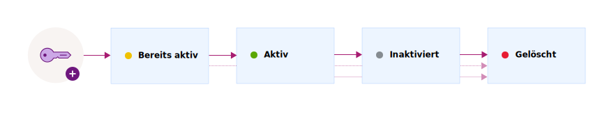

---

copyright:
  years: 2017, 2019
lastupdated: "2019-01-03"

---

{:shortdesc: .shortdesc}
{:codeblock: .codeblock}
{:screen: .screen}
{:new_window: target="_blank"}
{:pre: .pre}
{:tip: .tip}
{:note: .note}
{:important: .important}

# Schlüsselstatus
{: #key-states}

{{site.data.keyword.keymanagementservicefull}} orientiert sich an den Sicherheitsrichtlinien von [NIST SP 800-57 für die Schlüsselstatus ](http://nvlpubs.nist.gov/nistpubs/SpecialPublications/NIST.SP.800-57pt1r4.pdf){: new_window}.
{: shortdesc}

## Schlüsselstatus und -übergänge
{: #key_transitions}

Verschlüsselungsschlüssel durchlaufen während ihrer Laufzeit mehrere Status, die davon abhängig sind, wie lange die Schlüssel bestehen und ob Daten geschützt werden. 

{{site.data.keyword.keymanagementserviceshort}} stellt eine grafische Benutzerschnittstelle und eine REST-API für die Verfolgung von Schlüsseln während der verschiedenen Phasen ihres Lebenszyklus bereit. Das folgende Diagramm veranschaulicht die Status, die ein Schlüssel vom Generieren bis zum Löschen durchläuft.

<table>
  <tr>
    <th>Status</th>
    <th>Beschreibung</th>
  </tr>
  <tr>
    <td>Vor Aktivierung</td>
    <td>Die Schlüssel werden zu Beginn im Status <i>Vor Aktivierung</i> erstellt. Ein Schlüssel in diesem Status kann nicht für den Verschlüsselungsschutz von Daten verwendet werden. </td>
  </tr>
  <tr>
    <td>Aktiv</td>
    <td>Die Schlüssel werden sofort in den Status <i>Aktiv</i> versetzt, wenn das Aktivierungsdatum erreicht wird. Dieser Übergang kennzeichnet den Beginn der Verschlüsselungsperiode eines Schlüssels. Schlüssel ohne Aktivierungsdatum werden sofort aktiviert und bleiben so lange aktiv, bis sie ablaufen oder gelöscht werden.</td>
  </tr>
  <tr>
    <td>Inaktiviert</td>
    <td>Ein Schlüssel wird in den Status <i>Inaktiviert</i> versetzt, wenn ein Ablaufdatum zugewiesen wurde und dieses Ablaufdatum erreicht wird. In diesem Status kann der Schlüssel nicht mehr zum Schutz von Daten durch Verschlüsselung verwendet werden und kann nur noch in den Status <i>Gelöscht</i> versetzt werden.</td>
  </tr>
  <tr>
    <td>Gelöscht</td>
    <td>Gelöschte Schlüssel befinden sich im Status <i>Gelöscht</i>. Schlüssel, die sich in diesem Status befinden, sind nicht wiederherstellbar. Die zugehörigen Metadaten für den Schlüssel werden in der {{site.data.keyword.keymanagementserviceshort}}-Datenbank aufbewahrt.</td>
  </tr>
  <caption style="caption-side:bottom;">Tabelle 1. Beschreibt die Schlüsselzustände und -übergänge.</caption>
</table>

Nachdem Sie dem Service einen Schlüssel hinzugefügt haben, verwenden Sie das {{site.data.keyword.keymanagementserviceshort}}-Dashboard oder die {{site.data.keyword.keymanagementserviceshort}}-REST-APIs, um den Verlauf und die Konfiguration des Schlüsselstatus anzuzeigen. Sie können zu Prüfzwecken die Aktivitätenprüfliste für einen Schlüssel überwachen, indem Sie {{site.data.keyword.keymanagementserviceshort}} in {{site.data.keyword.cloudaccesstrailfull}} integrieren. Wenn beide Services bereitgestellt sind und ausgeführt werden, werden Aktivitätsereignisse generiert und in einem {{site.data.keyword.cloudaccesstrailshort}}-Protokoll automatisch erfasst, wenn Sie in {{site.data.keyword.keymanagementserviceshort}} Schlüssel erstellen und löschen. 

Weitere Informationen finden Sie in der [Überwachung der {{site.data.keyword.keymanagementserviceshort}}-Aktivität ](/docs/services/cloud-activity-tracker/services/security_svcs.html#key_protect){: new_window}.
