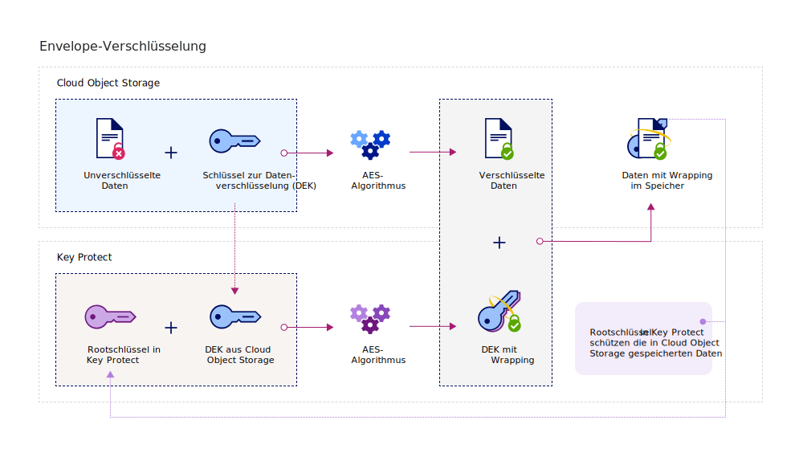

---

copyright:
  years: 2017, 2019
lastupdated: "2019-01-03"

---

{:shortdesc: .shortdesc}
{:codeblock: .codeblock}
{:screen: .screen}
{:new_window: target="_blank"}
{:pre: .pre}
{:tip: .tip}
{:note: .note}
{:important: .important}

# Integration mit {{site.data.keyword.cos_full_notm}}
{: #integrate-cos}

Mit der Kombination aus {{site.data.keyword.keymanagementservicefull}} und {{site.data.keyword.cos_full}} sind Sie Eigner der Sicherheit Ihrer ruhenden Daten. Die folgenden Informationen beschreiben, wie Sie mithilfe des {{site.data.keyword.keymanagementservicelong_notm}}-Service erweiterte Verschlüsselung zu {{site.data.keyword.cos_full}}-Ressourcen hinzufügen.
{: shortdesc}

## Informationen zu {{site.data.keyword.cos_full_notm}}
{: #cos}

{{site.data.keyword.cos_full_notm}} stellt Cloudspeicher für unstrukturierte Daten bereit. Unstrukturierte Daten beziehen sich auf Dateien, Audio- und visuelle Medien, PDFs, komprimierte Datenarchive, Backup-Images, Anwendungsartefakte, Geschäftsdokumente oder andere binäre Objekte.  

Damit die Datenintegrität und Verfügbarkeit gewahrt werden kann, zerlegt {{site.data.keyword.cos_full_notm}} Daten und verteilt sie auf Speicherknoten an mehreren geografischen Standorten. In den einzelnen Speicherknoten befinden sich keine vollständigen Datenkopien. Nur eine Teilmenge von Knoten muss verfügbar sein, damit Sie die Daten im Netz komplett abrufen können. Die providerseitige Verschlüsselung wird bereitgestellt, sodass Ihre ruhenden sowie gerade ausgeführten Daten geschützt sind. Zur Verwaltung des Speichers erstellen Sie Buckets und importieren Sie Objekte mithilfe der {{site.data.keyword.cloud_notm}}-Konsole oder programmgesteuert über die [{{site.data.keyword.cos_full_notm}}-REST-API ](/docs/services/cloud-object-storage/api-reference/about-compatibility-api.html){: new_window}.

Weitere Informationen finden Sie in [Informationen zu COS ](/docs/services/cloud-object-storage/about-cos.html){: new_window}.

## Vorgehensweise bei der Integration
{: #kp_cos_how}

{{site.data.keyword.keymanagementserviceshort}} wird in {{site.data.keyword.cos_full_notm}} integriert, um einen uneingeschränkten Zugriff auf die Sicherheit Ihrer Daten zu erreichen.  

Wenn Sie Daten in Ihre {{site.data.keyword.cos_full_notm}}-Instanz verschieben, werden Ihre Objekte automatisch mit Datenverschlüsselungsschlüsseln (DEKs) verschlüsselt. DEKs werden in {{site.data.keyword.cos_full_notm}} im Service sicher gespeichert, nahe den Ressourcen, die sie verschlüsseln. Wenn Sie auf ein Bucket zugreifen müssen, prüft der Service Ihre Benutzerberechtigung und entschlüsselt für Sie die Objekte im Bucket. Dieses Verschlüsselungsmodell wird als _providerverwaltete Verschlüsselung_.

Um die Sicherheitsvorteile einer _vom Kunden verwalteten Verschlüsselung_ zu aktivieren, können Sie die Envelope-Verschlüsselung zu Ihren DEKs in {{site.data.keyword.cos_full_notm}} hinzufügen, indem der {{site.data.keyword.keymanagementserviceshort}}-Service integriert wird. Mit {{site.data.keyword.keymanagementserviceshort}} stellen Sie sehr sichere Rootschlüssel bereit, der als Masterschlüssel dient, den Sie im Service steuern können. Wenn Sie in {{site.data.keyword.cos_full_notm}} ein Bucket erstellen, können Sie die Envelope-Verschlüsselung für das Bucket bei seiner Erstellung konfigurieren. Mit diesem hinzugefügten Schutz werden die DEKs, die dem Bucket zugeordnet sind, eingeschlossen (oder verschlüsselt), indem ein in {{site.data.keyword.keymanagementserviceshort}} verwalteter Rootschlüssel verwendet wird. Dieses Verfahren wird _Key-Wrapping_ genannt und nutzt mehrere AES-Algorithmen, um den Datenschutz und die Integrität Ihrer DEKs zu gewährleisten. Daher müssen Sie nur den Zugriff auf die zugeordneten Daten steuern.

In der folgenden Abbildung wird dargestellt, wie {{site.data.keyword.keymanagementserviceshort}} in {{site.data.keyword.cos_full_notm}} integriert wird, um Ihre Verschlüsselungsschlüssel zu sichern.

Weitere Informationen darüber, wie die Envelope-Verschlüsselung in {{site.data.keyword.keymanagementserviceshort}} funktioniert, finden Sie in [Envelope-Verschlüsselung](/docs/services/key-protect/concepts/envelope-encryption.html).

## Envelope-Verschlüsselung zu Ihren Speicherbuckets hinzufügen
{: #kp_cos_envelope}

[Nach der Angabe eines Rootschlüssels in {{site.data.keyword.keymanagementserviceshort}}](/docs/services/key-protect/create-root-keys.html) und [der Erteilung des Zugriffs zwischen Ihren Services](/docs/services/key-protect/integrations/integrate-services.html#grant-access) können Sie die Envelope-Verschlüsselung für einen angegebenen Speicherbucket über die {{site.data.keyword.cos_full_notm}}-GUI aktivieren.

 Zur Aktivierung erweiterter Konfigurationsoptionen für den Speicherbucket müssen Sie sicherstellen, dass eine [Berechtigung](/docs/services/key-protect/integrations/integrate-services.html#grant-access) zwischen der {{site.data.keyword.cos_full_notm}}-Serviceinstanz und der {{site.data.keyword.keymanagementserviceshort}}-Serviceinstanz eingerichtet ist.
{: tip}

Gehen Sie wie folgt vor, um eine Envelope-Verschlüsselung zur Ihrem Speicherbucket hinzuzufügen:

1. Klicken Sie im {{site.data.keyword.cos_full_notm}}-Dashboard auf **Bucket erstellen**.
2. Geben Sie die Details für das Bucket an.
3. Wählen Sie im Abschnitt **Erweiterte Konfiguration** den Eintrag **{{site.data.keyword.keymanagementserviceshort}}-Schlüssel hinzufügen** aus.
4. Wählen Sie aus der Liste der {{site.data.keyword.keymanagementserviceshort}}-Serviceinstanzen die Instanz aus, die den Rootschlüssel enthält, den Sie für das Key-Wrapping verwenden möchten.
5. Wählen Sie für **Name des Schlüssels** den Alias des Rootschlüssels aus.
6. Klicken Sie auf **Erstellen**, um die Bucket-Erstellung zu bestätigen.

Sie können mit der {{site.data.keyword.cos_full_notm}}-GUI die Buckets durchsuchen, die von einem {{site.data.keyword.keymanagementserviceshort}}-Rootschlüssel geschützt werden.

### Weitere Schritte

- Weitere Informationen zur Zuordnung der Speicherbuckets zu {{site.data.keyword.keymanagementserviceshort}}-Schlüsseln finden Sie in [Verschlüsselung verwalten](/docs/services/cloud-object-storage/basics/encryption.html#manage-encryption){: new_window}. 
