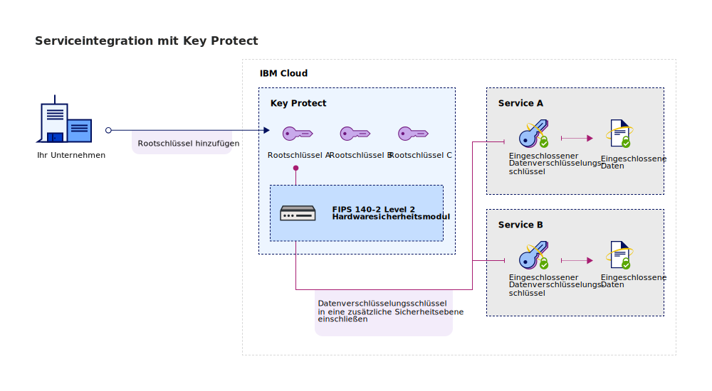

---

copyright:
  years: 2017, 2019
lastupdated: "2019-02-18"

keywords: Key Protect integration, integrate service with Key Protect

subcollection: key-protect

---

{:shortdesc: .shortdesc}
{:codeblock: .codeblock}
{:screen: .screen}
{:new_window: target="_blank"}
{:pre: .pre}
{:tip: .tip}
{:note: .note}
{:important: .important}

# Services integrieren
{: #integrate-services}

{{site.data.keyword.keymanagementservicefull}} wird in Daten- und Speicherlösungen integriert, um Sie dabei zu unterstützen, eine eigene Verschlüsselung in der Cloud zu implementieren und zu verwalten.
{: shortdesc}

[Nach der Erstellung einer Instanz des Service](/docs/services/key-protect?topic=key-protect-provision) können Sie {{site.data.keyword.keymanagementserviceshort}} in die folgenden unterstützten Services integrieren:

<table>
    <tr>
        <th>Service</th>
        <th>Beschreibung</th>
    </tr>
    <tr>
        <td>
          
{{site.data.keyword.cos_full_notm}}

        </td>
        <td>
          
Fügen Sie eine [Envelope-Verschlüsselung](/docs/services/key-protect?topic=key-protect-envelope-encryption) mithilfe von {{site.data.keyword.keymanagementserviceshort}} zu den Speicherbuckets hinzu. Verwenden Sie Rootschlüssel, die Sie in {{site.data.keyword.keymanagementserviceshort}} verwalten, um die Datenverschlüsselungsschlüssel zu schützen, mit denen die ruhenden Daten verschlüsselt sind. Weitere Informationen finden Sie in [Integration mit {{site.data.keyword.cos_full_notm}}](/docs/services/key-protect?topic=key-protect-integrate-cos).

        </td>
    </tr>
    <tr>
        <td>
          
{{site.data.keyword.containerlong_notm}}

        </td>
        <td>
          
Verwenden Sie die [Envelope-Verschlüsselung](/docs/services/key-protect?topic=key-protect-envelope-encryption), um geheime Schlüssel im {{site.data.keyword.containershort_notm}}-Cluster zu schützen. Weitere Informationen finden Sie in [Geheime Kubernetes-Schlüssel mit {{site.data.keyword.keymanagementserviceshort}} verschlüsseln](/docs/containers?topic=containers-encryption#keyprotect).

        </td>
    </tr>
    <tr>
        <td>
          
{{site.data.keyword.databases-for-postgresql_full_notm}}

        </td>
        <td>
          
Schützen Sie Ihre Datenbanken durch Zuordnung von Rootschlüsseln zu Ihrer {{site.data.keyword.databases-for-postgresql}}-Bereitstellung. Weitere Informationen finden Sie in der [Dokumentation zu {{site.data.keyword.databases-for-postgresql}}](/docs/services/databases-for-postgresql?topic=databases-for-postgresql-key-protect).

        </td>
    </tr>
      <tr>
        <td>
          
{{site.data.keyword.cloudant_short_notm}} für {{site.data.keyword.cloud_notm}} ({{site.data.keyword.cloud_notm}}-dediziert)

        </td>
        <td>
          
Stärken Sie Ihre Strategie der Verschlüsselung ruhender Daten, indem Sie Rootschlüssel zu Ihrer {{site.data.keyword.cloudant_short_notm}}-dedizierten Hardwareinstanz zuordnen. Weitere Informationen finden Sie in der [Dokumentation zu {{site.data.keyword.cloudant_short_notm}}](/docs/services/Cloudant/offerings?topic=cloudant-security#secure-access-control).

        </td>
    </tr>
   <caption style="caption-side:bottom;">Tabelle 1. Beschreibung der Integrationen, die für {{site.data.keyword.keymanagementserviceshort}} verfügbar sind</caption>
</table>

## Informationen zur Integration 
{: #understand-integration}

Bei der Integration eines unterstützten Service mit {{site.data.keyword.keymanagementserviceshort}} aktivieren Sie die [Envelope-Verschlüsselung](/docs/services/key-protect?topic=key-protect-envelope-encryption) für diesen Service. Diese Integration ermöglicht die Verwendung eines Rootschlüssels, den Sie in {{site.data.keyword.keymanagementserviceshort}} speichern, um die Datenverschlüsselungsschlüssel einzuschließen (Key-Wrapping), mit denen die ruhenden Daten verschlüsselt sind. 

Beispiel: Sie können einen Rootschlüssel erstellen, diesen Schlüssel in {{site.data.keyword.keymanagementserviceshort}} verwalten und den Rootschlüssel dazu verwenden, die Daten zu schützen, die in verschiedenen Cloud-Services gespeichert sind.

### {{site.data.keyword.keymanagementserviceshort}}-API-Methoden
{: #envelope-encryption-api-methods}

Im Hintergrund führt die {{site.data.keyword.keymanagementserviceshort}}-API den Envelope-Verschlüsselungsprozess aus.  

In der folgenden Tabelle sind die API-Methoden aufgeführt, mit denen die Envelope-Verschlüsselung für eine Ressource hinzugefügt oder entfernt wird.

<table>
  <tr>
    <th>Methode</th>
    <th>Beschreibung</th>
  </tr>
  <tr>
    <td><code>POST /keys/{root_key_ID}?action=wrap</code></td>
    <td><a href="/docs/services/key-protect?topic=key-protect-wrap-keys">Einschließen (Verschlüsseln) eines Datenverschlüsselungsschlüssels</a></td>
  </tr>
  <tr>
    <td><code>POST /keys/{root_key_ID}?action=unwrap</code></td>
    <td><a href="/docs/services/key-protect?topic=key-protect-unwrap-keys">Ausschließen (Entschlüsseln) eines Datenverschlüsselungsschlüssels</a></td>
  </tr>
  <caption style="caption-side:bottom;">Tabelle 2. Beschreibung der {{site.data.keyword.keymanagementserviceshort}}-API-Methoden</caption>
</table>

Weitere Informationen zur programmgesteuerten Verwaltung von Schlüsseln in {{site.data.keyword.keymanagementserviceshort}} finden Sie in der [{{site.data.keyword.keymanagementserviceshort}}-API-Referenzdokumentation ](https://{DomainName}/apidocs/key-protect){: new_window}.
{: tip}

## Unterstützten Service integrieren
{: #grant-access}

Wenn Sie eine Integration hinzufügen möchten, richten Sie über das {{site.data.keyword.iamlong}}-Dashboard eine Berechtigung zwischen den Services ein. Mit den Berechtigungen werden Service-zu-Service-Zugriffsrichtlinien aktiviert, die es Ihnen ermöglichen, eine Ressource im Clouddatenservice einem [Rootschlüssel](/docs/services/key-protect?topic=key-protect-envelope-encryption#key-types) zuzuordnen, den Sie in {{site.data.keyword.keymanagementserviceshort}} verwalten.

Stellen Sie sicher, dass beide Services in derselben Region bereitgestellt werden, bevor Sie eine Berechtigung erstellen. Weitere Informationen zu Serviceberechtigungen finden Sie in [Zugriff zwischen Services erteilen](/docs/iam?topic=iam-serviceauth){: new_window}.
{: note}

Wenn Sie bereit sind, einen Service zu integrieren, führen Sie die folgenden Schritte aus, um eine Berechtigung zu erstellen:

1. Klicken Sie in der Menüleiste auf **Verwalten** &gt; **Sicherheit** &gt; **Zugriff (IAM)** und wählen Sie **Berechtigungen** aus. 
2. Klicken Sie auf **Erstellen**.
3. Wählen Sie einen Quellen- und einen Zielservice für die Berechtigung aus.
 
  Wählen Sie für **Quellenservice** den Clouddatenservice aus, der mit {{site.data.keyword.keymanagementserviceshort}} integriert werden soll. Wählen Sie für **Zielservice** den Eintrag **{{site.data.keyword.keymanagementservicelong_notm}}** aus.

5. Aktivieren Sie die Rolle **Leseberechtigter**.

    Mit den Berechtigungen eines _Leseberechtigten_ kann der Quellenservice die Rootschlüssel anzeigen, die in der angegebenen Instanz von {{site.data.keyword.keymanagementserviceshort}} bereitgestellt sind.

6. Klicken Sie auf **Berechtigen**.

## Weitere Schritte
{: #integration-next-steps}

Fügen Sie erweiterte Verschlüsselung zu Ihren Cloudressourcen hinzu, indem Sie einen Rootschlüssel in {{site.data.keyword.keymanagementserviceshort}} erstellen. Fügen Sie eine neue Ressource zu einem unterstützten Clouddatenservice hinzu und wählen Sie dann den Rootschlüssel aus, der für die erweitertet Verschlüsselung verwendet werden soll.

- Weitere Informationen zum Erstellen von Rootschlüsseln mit dem {{site.data.keyword.keymanagementserviceshort}}-Service finden Sie in [Rootschlüssel erstellen](/docs/services/key-protect?topic=key-protect-create-root-keys).
- Weitere Informationen zur Verwendung eigener Rootschlüssel im {{site.data.keyword.keymanagementserviceshort}}-Service finden Sie in [Rootschlüssel importieren](/docs/services/key-protect?topic=key-protect-import-root-keys).

