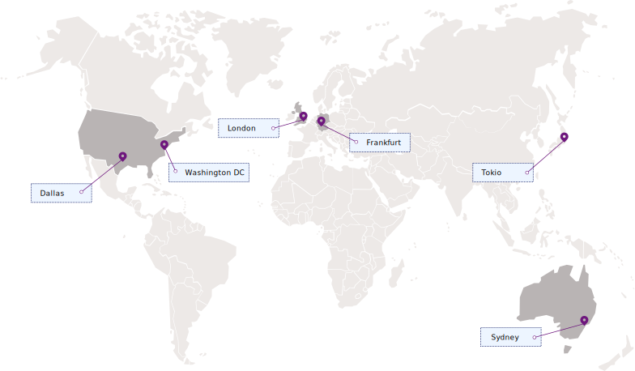

---

copyright:
  years: 2017, 2019
lastupdated: "2019-07-09"

keywords: Key Protect API endpoints, available regions

subcollection: key-protect

---

{:shortdesc: .shortdesc}
{:codeblock: .codeblock}
{:screen: .screen}
{:new_window: target="_blank"}
{:pre: .pre}
{:tip: .tip}
{:note: .note}
{:important: .important}
{:deprecated: .deprecated}

# Regionen und Endpunkte
{: #regions}

Sie können Ihre Anwendungen mit dem {{site.data.keyword.keymanagementservicelong}}-Service verbinden, indem Sie einen regionalen Serviceendpunkt angeben.
{: shortdesc}

## Verfügbare Regionen
{: #available-regions}

{{site.data.keyword.keymanagementserviceshort}} ist in den Regionen und an den Standorten verfügbar, die im Folgenden aufgeführt sind:

## Serviceendpunkte
{: #service-endpoints}

Wenn Sie Ihre {{site.data.keyword.keymanagementserviceshort}}-Ressourcen programmgesteuert verwalten, können Sie mithilfe der folgenden Tabelle die API-Endpunkte bestimmen, die für die Verbindung zur [{{site.data.keyword.keymanagementserviceshort}}-API](https://{DomainName}/apidocs/key-protect) verwendet werden: 

<table>
    <tr>
        <th>Standort</th>
        <th>Service-API-Endpunkt</th>
    </tr>
    <tr>
        <td>Dallas</td>
        <td>
            <code>us-south.kms.cloud.ibm.com</code>
        </td>
    </tr>
    <tr>
        <td>Washington DC</td>
        <td>
            <code>us-east.kms.cloud.ibm.com</code>
        </td>
    </tr>
    <tr>
        <td>London</td>
        <td>
            <code>eu-gb.kms.cloud.ibm.com</code>
        </td>
    </tr>
    <tr>
        <td>Frankfurt</td>
        <td>
            <code>eu-de.kms.cloud.ibm.com</code>
        </td>
    </tr>
    <tr>
        <td>Sydney</td>
        <td>
            <code>au-syd.kms.cloud.ibm.com</code>
        </td>
    </tr>
    <tr>
        <td>Tokyio</td>
        <td>
            <code>jp-tok.kms.cloud.ibm.com</code>
        </td>
    </tr>
    <caption style="caption-side:bottom;">Tabelle 1. Verfügbare Endpunkte für die {{site.data.keyword.keymanagementserviceshort}}-API</caption>
</table>

Sie können weiterhin `https://keyprotect.<region>.bluemix.net` verwenden, um den Service als Ziel für Operationen anzugeben, oder Sie können Ihre Anwendungen mit den neuen `cloud.ibm.com`-Endpunkten aktualisieren. 
{: tip}

Weitere Informationen zur Authentifizierung mit {{site.data.keyword.keymanagementserviceshort}} finden Sie in [Auf die API zugreifen](/docs/services/key-protect?topic=key-protect-set-up-api).
