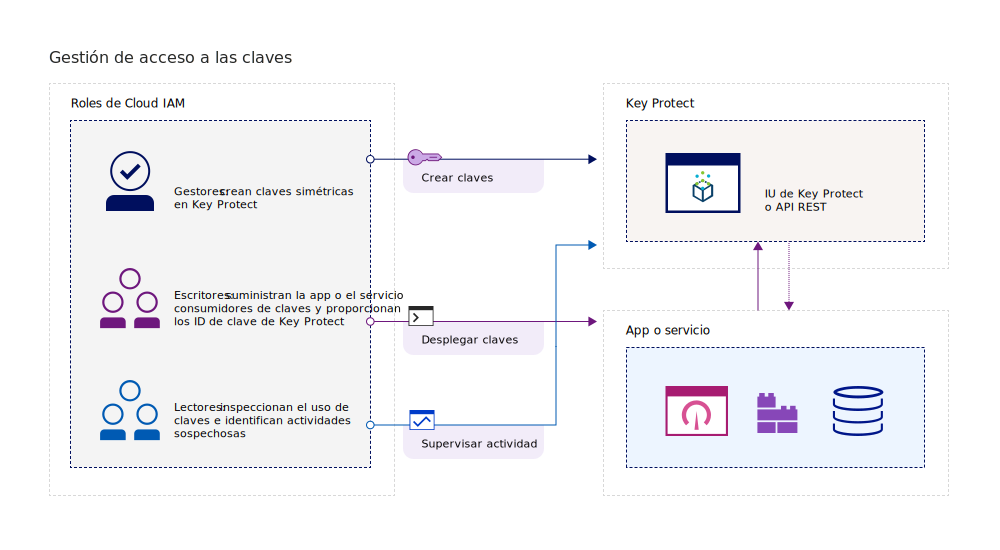
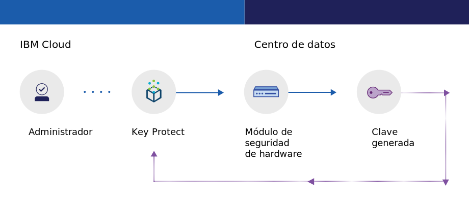
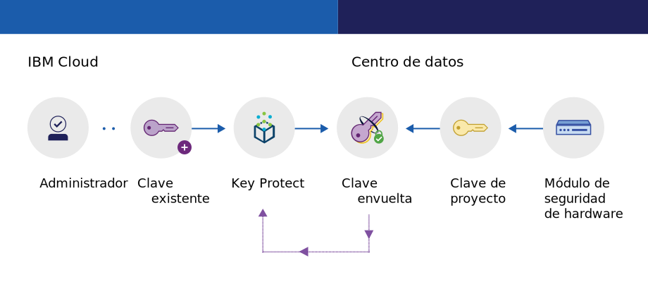

---

copyright:
  years: 2017, 2019
lastupdated: "2019-02-18"

keywords: key management service, KMS, about Key Protect, about KMS, Key Protect use cases, KMS use cases

subcollection: key-protect

---

{:shortdesc: .shortdesc}
{:codeblock: .codeblock}
{:screen: .screen}
{:new_window: target="_blank"}
{:pre: .pre}
{:tip: .tip}
{:note: .note}
{:important: .important}

# Acerca de {{site.data.keyword.keymanagementserviceshort}}
{: #about}

{{site.data.keyword.keymanagementservicefull}} le ayuda a suministrar claves cifradas para apps en servicios de {{site.data.keyword.cloud_notm}}. A medida que gestiona el ciclo de vida de sus claves, puede beneficiarse de saber que sus claves están aseguradas por módulos de hardware (HSM) con certificación FIPS 140-2 Nivel 2 basados en la nube que le protegen contra el robo de información.
{: shortdesc}

## Motivos para utilizar {{site.data.keyword.keymanagementserviceshort}}
{: #use-cases}

Es posible que necesite gestionar claves en los siguientes casos de ejemplo:

<table>
  <tr>
    <th>Caso de ejemplo</th>
    <th>Motivos</th>
  </tr>
  <tr>
    <td>Puede que desee realizar el cifrado de sobre a medida que mueve sus datos a la nube. Necesitará traer su propia clave de cifrado maestra para poder gestionar y proteger otras claves que cifren los datos en reposo.</td>
    <td>Con {{site.data.keyword.keymanagementserviceshort}}, puede [envolver sus claves de cifrado con una clave raíz altamente segura](/docs/services/key-protect?topic=key-protect-envelope-encryption). Puede traer sus propias claves de raíz o crearlas en el servicio.</td>
  </tr>
  <tr>
    <td>Como administrador de TI de una gran empresa, necesita integrar, hacer el seguimiento y rotar miles de claves de muchas ofertas de servicio distintas.</td>
    <td>La interfaz de {{site.data.keyword.keymanagementserviceshort}} simplifica la gestión de múltiples servicios de cifrado. Con el servicio puede gestionar y ordenar claves en una ubicación centralizada, o puede separar claves por proyectos y alojarlas en distintos espacios de {{site.data.keyword.cloud_notm}}.</td>
  </tr>
  <tr>
    <td>Como administrador de seguridad de un sector, como finanzas o jurídico, debe ajustarse a las regulaciones sobre cómo se deben proteger datos. Necesita otorgar acceso controlado a las claves sin poner en riesgo los datos que se protegen.</td>
    <td>Con el servicio, puede controlar el acceso de usuario para gestionar claves [asignando distintos roles de Identity and Access Management](/docs/services/key-protect?topic=key-protect-manage-access#roles). Por ejemplo, puede otorgar acceso de solo lectura a los usuarios que requieran ver la información de creación de claves, sin ver el material de la clave.</td>
  <tr>
    <td>Como desarrollador, desea integrar las aplicaciones preexistentes como, por ejemplo, el almacenamiento de autocifrado, en {{site.data.keyword.keymanagementserviceshort}}.</td>
    <td>Las apps que se encuentran en {{site.data.keyword.cloud_notm}} o fuera pueden integrarse con las API de {{site.data.keyword.keymanagementserviceshort}}. Puede utilizar sus propias claves existentes para las apps. </td>
  </tr>
  <tr>
    <td>El equipo de desarrollo tiene políticas estrictas y necesita encontrar una forma de generar y rotar las claves cada 14 días.</td>
    <td>Gracias a {{site.data.keyword.keymanagementserviceshort}}, puede generar claves rápidamente desde un módulo de seguridad
de hardware (HSM) de {{site.data.keyword.cloud_notm}} que satisfagan sus necesidades de seguridad continua.</td>
  </tr>
</table>

¿Busca una solución de gestión de claves dedicada que dé soporte a módulos de seguridad de hardware (HSM) controlados por el cliente? .[{{site.data.keyword.cloud_notm}} {{site.data.keyword.hscrypto}} (Beta)](/docs/services/hs-crypto?topic=hs-crypto-get-started) se integra con {{site.data.keyword.keymanagementserviceshort}} para habilitar Keep Your Own Keys (KYOK) para {{site.data.keyword.cloud_notm}}, de forma que su organización tiene más control y autoridad sobre sus datos. Consulte la [página de detalles de la oferta de {{site.data.keyword.hscrypto}} ](https://{DomainName}/catalog/services/hyper-protect-crypto-services) para obtener más información.
{: tip}

## Cómo funciona {{site.data.keyword.keymanagementserviceshort}}
{: #kp-how}

{{site.data.keyword.keymanagementservicelong_notm}} le ayuda a gestionar las claves en toda su organización alineando los roles de {{site.data.keyword.cloud_notm}} Identity and Access Management.

Un administrador de TI o de seguridad necesita permisos avanzados que un auditor. Para simplificar el acceso, {{site.data.keyword.keymanagementserviceshort}} se correlaciona con los roles de {{site.data.keyword.cloud_notm}} Identity and Access Management de forma que cada rol tiene una vista distinta del servicio. Para ayudarle a saber qué vista y nivel de acceso se ajustan mejor a sus necesidades, consulte [Gestión de accesos y usuarios](/docs/services/key-protect?topic=key-protect-manage-access#roles).

En el diagrama siguiente se muestra cómo los gestores, lectores y escritores puede interactuar con las claves gestionadas en el servicio.

<dl>
  <dt>Integración de servicios</dt>
    <dd>Los gestores de la instancia de servicio de {{site.data.keyword.keymanagementserviceshort}} gestionan las claves para la criptografía.</dd>
  <dt>Auditorías</dt>
    <dd>Los lectores acceden a una vista de alto nivel de las claves e identifican actividades sospechosas.</dd>
  <dt>Apps</dt>
    <dd>Los escritores gestionan las claves para la criptografía que codifican en apps.</dd>
</dl>

## Arquitectura de {{site.data.keyword.keymanagementserviceshort}}
{: #kp_architecture}

{{site.data.keyword.keymanagementservicelong_notm}} está compuesto por tecnologías aceptadas por el sector.

<dl>
  <dt>Servidor de {{site.data.keyword.cloud_notm}}</dt>
    <dd>La identidad, los proyectos y sus señales del servidor de {{site.data.keyword.cloud_notm}} permiten al servicio {{site.data.keyword.keymanagementserviceshort}} correlacionar recursos con claves.</dd>
  <dt>API para {{site.data.keyword.keymanagementserviceshort}}</dt>
    <dd>La API REST de {{site.data.keyword.keymanagementserviceshort}} permite la creación y gestión de claves. El servicio proporciona multitenencia cifrada.</dd>
  <dt>Interfaz de usuario en {{site.data.keyword.cloud_notm}}</dt>
    <dd>Con la interfaz de usuario (UI) {{site.data.keyword.keymanagementserviceshort}}, puede trabajar de forma segura con sus claves.</dd>
  <dt>Módulo de seguridad de hardware (HSM)</dt>
    <dd>Entre bastidores, los centros de datos de {{site.data.keyword.cloud_notm}} proporcionan hardware para proteger sus claves.</dd>
  <dt>Clúster de base de datos</dt>
    <dd>Puede contar con el almacenamiento redundante y protegido de las claves con una base de datos de clúster.</dd>
</dl>

Los siguientes diagramas muestran cómo funciona {{site.data.keyword.keymanagementserviceshort}} con los módulos de seguridad del hardware para generar claves comparadas con cómo almacena claves el servicio.

