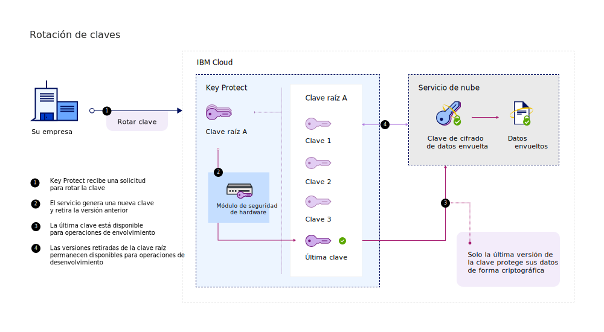
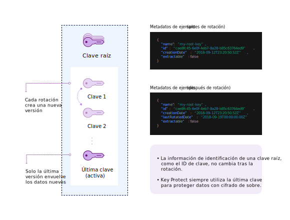

---

copyright:
  years: 2017, 2019
lastupdated: "2019-03-22"

keywords: rotate encryption keys, rotate keys automatically, key rotation

subcollection: key-protect

---

{:shortdesc: .shortdesc}
{:codeblock: .codeblock}
{:screen: .screen}
{:new_window: target="_blank"}
{:pre: .pre}
{:tip: .tip}
{:note: .note}
{:important: .important}

# Rotación de claves de cifrado
{: #key-rotation}

La rotación de claves tiene lugar cuando retira el material de clave original de una clave raíz y le vuelve a asignar una clave generando nuevo material de clave de cifrado.

La rotación de claves de forma regular le ayuda a cumplir los estándares del sector y las mejores prácticas de cifrado. La siguiente tabla describe los mayores beneficios de la rotación de claves:

<table>
  <th>Ventajas</th>
  <th>Descripción</th>
  <tr>
    <td>Gestión de período criptográfico de claves</td>
    <td>La rotación de claves limita la cantidad de tiempo que la información está protegida por una clave. Rotando las claves raíz a intervalos regulares, también se reduce el período criptográfico de las claves. Cuanto más largo es el tiempo de vida de una clave de cifrado, más alta es la probabilidad de que se produzca una brecha de seguridad.</td>
  </tr>
  <tr>
    <td>Mitigación de incidencias</td>
    <td>Si su organización detecta un problema de seguridad, puede rotar inmediatamente la clave para mitigar o reducir los costes asociados con un riesgo de las claves.</td>
  </tr>
  <caption style="caption-side:bottom;">Tabla 1. Describe los beneficios de la rotación de claves</caption>
</table>

La rotación de claves se trata en la NIST Special Publication 800-57, Recommendation for Key Management. Para obtener más información, consulte [NIST SP 800-57 Pt. 1 Rev. 4. ](http://nvlpubs.nist.gov/nistpubs/SpecialPublications/NIST.SP.800-57pt1r4.pdf){: new_window}
{: tip}

## Comparación de las opciones de rotación de claves en {{site.data.keyword.keymanagementserviceshort}}
{: #compare-key-rotation-options}

En {{site.data.keyword.keymanagementserviceshort}}, puede [establecer una política de rotación para una clave](/docs/services/key-protect?topic=key-protect-set-rotation-policy) o [rotar la clave bajo demanda](/docs/services/key-protect?topic=key-protect-rotate-keys), sin necesidad de realizar un seguimiento de su material de clave raíz retirado. 

Las opciones de rotación sólo están disponibles para las claves raíz.
{: note}

<dl>
  <dt>Establecimiento de una política de rotación para una clave</dt>
    <dd>{{site.data.keyword.keymanagementserviceshort}} le ayuda a simplificar la rotación de las claves de cifrado habilitando las políticas de rotación para las claves que genera en el servicio. Tras crear una clave raíz, puede gestionar una política de rotación para la clave en la GUI de {{site.data.keyword.keymanagementserviceshort}} GUI, o con la API. <a href="/docs/services/key-protect?topic=key-protect-rotation-frequency">Elija un intervalo de rotación automático de entre 1 y 12 meses para la clave</a> en función de sus necesidades regulares de seguridad. Cuando es hora de rotar la clave, en base al intervalo de rotación que ha especificado, {{site.data.keyword.keymanagementserviceshort}} sustituye automáticamente la clave por material de clave nuevo.</dd>
  <dt>Rotación de claves bajo demanda</dt>
    <dd>Como administrador de seguridad, es posible que desee tener más control sobre la frecuencia de rotación de las claves. Si no desea establecer una política de rotación automática para una clave, puede crear manualmente una clave nueva para sustituir una clave existente y, a continuación, actualizar las aplicaciones de modo que hagan referencia a la nueva clave. Para simplificar este proceso, puede utilizar {{site.data.keyword.keymanagementserviceshort}} para rotar la clave bajo demanda. En este caso, {{site.data.keyword.keymanagementserviceshort}} crea y sustituye la clave en su nombre por cada solicitud de rotación. La clave retiene los mismos metadatos y el mismo ID de clave.</dd>
</dl>

## Cómo funciona la rotación de claves 
{: #how-key-rotation-works}

La rotación de claves funciona convirtiendo de forma segura un material de clave del estado _Activo_ a un estado de clave _Desactivado_. Para sustituir el material de clave desactivado o retirado, el nuevo material de clave pasa a estado _Activo_ y pasa a estar disponible para las operaciones de cifrado.

### Uso de {{site.data.keyword.keymanagementserviceshort}} para rotar claves
{: #use-key-protect-rotate-keys}

Tenga presentes las consideraciones siguientes al prepararse para utilizar {{site.data.keyword.keymanagementserviceshort}} para la rotación de las claves raíz.

<dl>
  <dt>Rotación de claves raíz generadas en {{site.data.keyword.keymanagementserviceshort}}</dt>
    <dd>Puede utilizar {{site.data.keyword.keymanagementserviceshort}} para rotar una clave raíz que se ha generado en {{site.data.keyword.keymanagementserviceshort}} estableciendo una política de rotación para la clave, o rotando la clave bajo demanda. Los metadatos de la clave raíz, como por ejemplo su ID de clave, no cambian cuando se rota la clave.</dd>
  <dt>Rotación de las claves raíz que se han traído al servicio</dt>
    <dd>Para rotar una clave raíz que inicialmente ha importado al servicio, debe generar y proporcionar nuevo material de clave para la clave. Puede utilizar {{site.data.keyword.keymanagementserviceshort}} para rotar bajo demanda las claves raíz importadas suministrando nuevo material de clave como parte de la solicitud de rotación. Los metadatos de la clave raíz, como por ejemplo su ID de clave, no cambian cuando se rota la clave. Debido a que debe proporcionar un nuevo material de clave para rotar una clave importada, no hay políticas de rotación automáticas disponibles para las claves raíz que hayan importado material de clave.</dd>
  <dt>Gestión del material de clave retirado</dt>
    <dd>{{site.data.keyword.keymanagementserviceshort}} crea un nuevo material de clave cuando se rota una clave raíz. El servicio retira el material de clave antiguo y conserva las versiones retiradas hasta que se suprime la clave raíz. Cuando se utiliza la clave raíz para el cifrado de sobre, {{site.data.keyword.keymanagementserviceshort}} sólo utiliza el material de clave más reciente asociado a la clave. El material de clave retirado ya no se puede utilizar para proteger las claves, pero permanece disponible para las operaciones de desenvolver. Si {{site.data.keyword.keymanagementserviceshort}} detecta que está utilizando material de clave retirado para desempaquetar las DEK, el servicio proporciona una DEK recién envuelta basada en el último material de clave raíz. Puede utilizar la DEK recién envuelta para volver a envolver las claves con el material de clave más reciente.</dd>
 <dt>Habilitación de la rotación de claves para los servicios de datos de {{site.data.keyword.cloud_notm}}</dt>
    <dd>Para habilitar estas opciones de rotación de claves para el servicio de datos en {{site.data.keyword.cloud_notm}}, el servicio de datos debe estar integrado con {{site.data.keyword.keymanagementserviceshort}}. Consulte la documentación de su servicio de datos de {{site.data.keyword.cloud_notm}} o <a href="/docs/services/key-protect?topic=key-protect-integrate-services">consulte nuestra lista de servicios integrados para obtener más información.</a>.</dd>
</dl>

Cuando rote una clave en {{site.data.keyword.keymanagementserviceshort}}, no se le añadirán cargos adicionales. Puede seguir desenvolviendo las claves de cifrado de datos envueltas (WDEK) con material de claves retirado sin ningún coste adicional. Para obtener más información sobre nuestras opciones de precios, consulte la [página del catálogo de {{site.data.keyword.keymanagementserviceshort}}](https://{DomainName}/catalog/services/key-protect).
{: tip}

### Comprender el proceso de rotación de claves
{: #understand-key-rotation-process}

De forma transparente para el usuario, la API de {{site.data.keyword.keymanagementserviceshort}} controla el proceso de rotación de claves.  

En el diagrama siguiente se muestra una vista contextual de la funcionalidad de rotación de claves.

Con cada solicitud de rotación, {{site.data.keyword.keymanagementserviceshort}} asocia el nuevo material de claves con la clave raíz. 

Cuando se completa una rotación, el nuevo material de claves raíz pasa a estar disponible para proteger claves de cifrado de datos (DEK) futuras con [cifrado de sobre](/docs/services/key-protect?topic=key-protect-envelope-encryption). El material de claves retirado pasa al estado _Desactivado_, donde solo se puede utilizar para desenvolver y acceder a DEK más antiguas que todavía no están protegidas por el último material de claves raíz. Si {{site.data.keyword.keymanagementserviceshort}} detecta que utiliza material de claves raíz retirado para desenvolver una DEK antigua, el servicio vuelve a cifrar automáticamente la DEK y devuelve una clave de cifrado de datos envuelta (WDEK) que se basa en el último material de claves raíz. Almacene y utilice la nueva WDEK para futuras operaciones de desenvolvimiento para proteger a sus DEK con el último material de claves raíz.

Para saber cómo utilizar la API de {{site.data.keyword.keymanagementserviceshort}} para rotar sus claves raíz, consulte [Rotación de claves](/docs/services/key-protect?topic=key-protect-rotate-keys).

## Frecuencia de la rotación de claves
{: #rotation-frequency}

Después de generar una clave raíz en {{site.data.keyword.keymanagementserviceshort}}, debe decidir la frecuencia de su rotación. Es posible que desee rotar sus claves debido a cambios de personal, funcionamiento incorrecto del proceso o de acuerdo con la política de caducidad de claves internas de su organización. 

Rote sus claves de forma regular, por ejemplo, cada 30 días, para seguir las mejores prácticas de cifrado. 

| Tipo de rotación | Frecuencia | Descripción
| --- | --- | --- |
| [Rotación de claves basada en políticas](/docs/services/key-protect?topic=key-protect-set-rotation-policy) | Cada 1 - 12 meses | Elija un intervalo de rotación entre 1 y 12 meses para su clave en función de sus necesidades regulares de seguridad. Después de establecer una política de rotación para una clave, el reloj se inicia de forma inmediatamente, basado en la fecha de creación inicial de la clave. Por ejemplo, si establece una política de rotación mensual para una clave que ha creado el `01/02/2019`, {{site.data.keyword.keymanagementserviceshort}} rota automáticamente la clave el `01/03/2019`.|
| [Rotación de claves bajo demanda](/docs/services/key-protect?topic=key-protect-rotate-keys) | Hasta una rotación por hora | Si rota una clave bajo demanda, {{site.data.keyword.keymanagementserviceshort}} permite una rotación por hora para cada clave raíz. |
{: caption="Tabla 2. Opciones de frecuencia de rotación para la rotación de claves en {{site.data.keyword.keymanagementserviceshort}}" caption-side="top"}

## Qué hacer a continuación
{: #rotation-next-steps}

- Para aprender a utilizar {{site.data.keyword.keymanagementserviceshort}} para establecer una política de rotación automática para una clave individual, consulte [Establecimiento de una política de rotación](/docs/services/key-protect?topic=key-protect-set-rotation-policy).
- Para obtener más información sobre la rotación de claves raíz, consulte [Rotación de claves bajo demanda](/docs/services/key-protect?topic=key-protect-rotate-keys).
