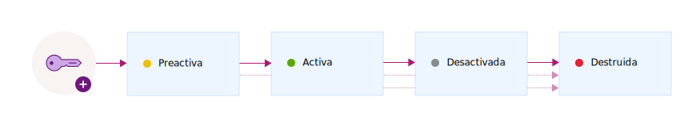

---

copyright:
  years: 2017, 2019
lastupdated: "2019-07-09"

keywords: encryption key states, encryption key lifecycle, manage key lifecycle

subcollection: key-protect

---

{:shortdesc: .shortdesc}
{:screen: .screen}
{:pre: .pre}
{:table: .aria-labeledby="caption"}
{:external: target="_blank" .external}
{:codeblock: .codeblock}
{:tip: .tip}
{:note: .note}
{:important: .important}

# Supervisión del ciclo de vida de las claves de cifrado
{: #key-states}

{{site.data.keyword.keymanagementservicefull}} sigue las directrices de seguridad de [NIST SP 800-57 para estados clave](https://www.nist.gov/publications/recommendation-key-management-part-1-general-0){: external}.
{: shortdesc}

## Estados y transiciones de clave
{: #key-transitions}

Las claves criptográficas, durante su ciclo de vida, pasan por varios estados que son una función de cuánto tiempo hace que las claves existen y si sus datos están protegidos. 

{{site.data.keyword.keymanagementserviceshort}} proporciona una interfaz gráfica de usuario y una API REST para realizar el seguimiento de las claves a medida que pasan por varios estados durante su ciclo de vida. En el siguiente diagrama se muestra cómo una clave pasa por los distintos estados desde que se crea hasta que se destruye.

| Estado | Descripción |
| --- | --- |
| Pre-activación | Las claves se crean inicialmente en el estado de _pre-activación_. No se puede utilizar para proteger datos de forma criptográfica.|
| Activa | Las claves pasan inmediatamente al estado _activo_ en la fecha de activación. Esta transición marca el inicio del periodo criptográfico propiamente dicho de una clave. Las claves sin fecha de activación se activan inmediatamente y permanecen activas hasta que caducan o se destruyen. |
| Desactivada | Una clave pasa al estado de _desactivado_ el día de su fecha de caducidad, si una está asignada. En este estado, la clave no puede proteger criptográficamente los datos y sólo pueden moverse al estado _destruido_.|
| Destruida | Las claves suprimidas están en estado _destruido_. Las claves con este estado no son recuperables. Los metadatos asociados con la clave como, por ejemplo, el nombre y el historial de transiciones de la clave, se mantienen en la base de datos de {{site.data.keyword.keymanagementserviceshort}}. |
{: caption="Tabla 1. Describe los estados y las transiciones de las claves." caption-side="top"}

Después de añadir una clave para el servicio, utilice el panel de control de {{site.data.keyword.keymanagementserviceshort}} o la API REST de {{site.data.keyword.keymanagementserviceshort}} para ver la configuración y el historial de transiciones de las claves. A efectos de auditoría, también puede supervisar la actividad para una clave integrando {{site.data.keyword.keymanagementserviceshort}} con {{site.data.keyword.cloudaccesstrailfull}}. Después de que se hayan suministrado ambos servicios y de que estén en ejecución, los sucesos de actividad se generan de forma automática y se recopilan en un registro de {{site.data.keyword.cloudaccesstrailshort}} cuando crea y suprime claves en {{site.data.keyword.keymanagementserviceshort}}. 

Para obtener más información, consulte [Supervisión de la actividad de {{site.data.keyword.keymanagementserviceshort}}](/docs/services/cloud-activity-tracker?topic=cloud-activity-tracker-kp){: external}.
