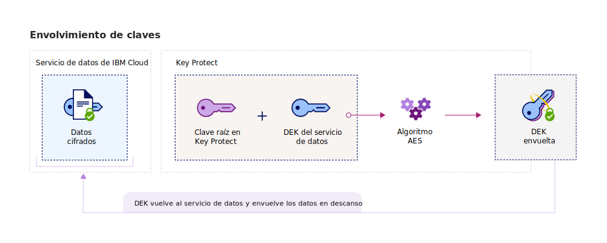
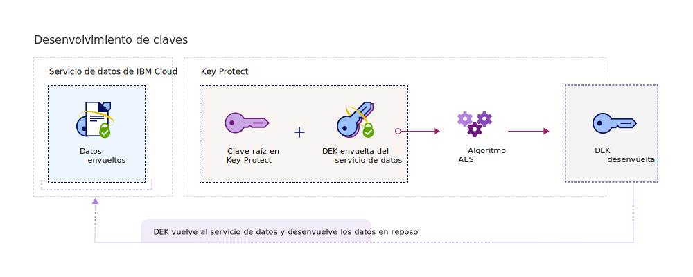

---

copyright:
  years: 2017, 2018
lastupdated: "2018-06-07"

---

{:shortdesc: .shortdesc}
{:codeblock: .codeblock}
{:screen: .screen}
{:new_window: target="_blank"}
{:pre: .pre}
{:tip: .tip}

# Cifrado de sobre
{: #envelope-encryption}

El cifrado de sobre es la práctica de encriptar datos con una clave de cifrado de datos (DEK) y, a continuación, cifrar dicha clave con una clave raíz que puede gestionar de forma integral. 
{: shortdesc}

{{site.data.keyword.keymanagementservicefull}} protege los datos almacenados con cifrado avanzado y ofrece varias ventajas:

<table>
  <th>Ventajas</th>
  <th>Descripción</th>
  <tr>
    <td>Claves de cifrado gestionadas por el cliente</td>
    <td>Con el servicio, puede suministrar claves raíz para proteger la seguridad de los datos cifrados en la nube. Las claves raíz sirven como claves de envolvimiento de claves maestras y que ayudan a gestionar y proteger las claves de cifrado de datos (DEK) suministradas en los servicios de datos de {{site.data.keyword.cloud_notm}}. Puede decidir si importar sus claves raíz existentes o hacer que {{site.data.keyword.keymanagementserviceshort}} las genere en su nombre.</td>
  </tr>
  <tr>
    <td>Protección de integridad y confidencialidad</td>
    <td>{{site.data.keyword.keymanagementserviceshort}} utiliza el algoritmo AES (Advanced Encryption Standard) en la modalidad Galois/Counter (GCM) para crear y proteger claves. Cuando se crean claves en el servicio, {{site.data.keyword.keymanagementserviceshort}} las genera dentro de los límites de confianza de los módulos de seguridad de hardware (HSM) de {{site.data.keyword.cloud_notm}}, de modo que sólo usted tendrá acceso a sus claves de cifrado.</td>
  </tr>
  <tr>
    <td>Destrucción criptográfica de datos</td>
    <td>Si su organización detecta un problema de seguridad o una app ya no necesita un conjunto de datos, puede optar por destruir los datos permanentemente de la nube. Cuando se suprime una clave raíz que protege otras claves DEK, se asegura que no será posible acceder a los datos o descifrar los datos asociados a las claves.</td>
  </tr>
  <tr>
    <td>Delegación del control de acceso de usuario</td>
    <td>{{site.data.keyword.keymanagementserviceshort}} da soporte a un sistema de control de acceso centralizado para permitir el acceso granular a sus claves. [Mediante los permisos avanzados y la asignación de roles de usuario de IAM](/docs/services/keymgmt/keyprotect_manage_access.html#roles), los administradores de seguridad decidirán quién puede acceder a qué claves raíz en el servicio.</td>
  </tr>
  <caption style="caption-side:bottom;">Tabla 1. Describe los beneficios del cifrado gestionado por el cliente</caption>
</table>

## Cómo funciona
{: #overview}

El cifrado de sobre combina la robustez de varios algoritmos de cifrado para proteger sus datos confidenciales en la nube. El mecanismo consiste en envolver una o varias claves de cifrado de datos (DEK) con un cifrado avanzado utilizando una clave raíz que puede gestionar de forma integral. Este proceso de envolvimiento crea DEK envueltas que protegen sus datos almacenamos de una exposición o acceso no autorizado. Cuando se desenvuelve una DEK se invierte el proceso de cifrado de sobre al utilizar la misma clave raíz, permitiendo obtener datos autenticados y sin cifrar.
 
En el diagrama siguiente se muestra una vista contextual de la funcionalidad del envolvimiento de claves.

El cifrado de sobre se trata de forma breve en la NIST Special Publication 800-57, Recommendation for Key Management. Para obtener más información, consulte [NIST SP 800-57 Pt. 1 Rev. 4. ](http://nvlpubs.nist.gov/nistpubs/SpecialPublications/NIST.SP.800-57pt1r4.pdf){: new_window}

## Tipos de clave
{: #key_types}

El servicio da soporte a dos tipos de clave, las claves raíz y las claves estándar, para el cifrado avanzado y la gestión de datos.

<dl>
  <dt>Claves raíz</dt>
    <dd>Las claves raíz son recursos primarios en {{site.data.keyword.keymanagementserviceshort}}. Son claves para envolver claves simétricas que se utilizan como claves raíz de confianza para envolver (cifrando) y desenvolver (descifrando) otras claves almacenadas en un servicio de datos. Con {{site.data.keyword.keymanagementserviceshort}}, puede crear, almacenar y gestionar el ciclo de vida de las claves raíz para obtener un control total de otras claves almacenadas en la nube. A diferencia de una clave estándar, una clave raíz no puede abandonar los límites del servicio {{site.data.keyword.keymanagementserviceshort}}.</dd>
  <dt>Claves estándar</dt>
    <dd>Las claves estándar son claves de cifrado que se utilizan para la criptografía. Generalmente, las claves estándar cifran datos de forma directa. Con {{site.data.keyword.keymanagementserviceshort}}, puede crear, almacenar y gestionar el ciclo de las claves estándar. Después de importar o generar una clave estándar en un servicio, puede exportarla fuera de un recurso de datos como, por ejemplo, un contenedor de almacenamiento, para cifrar información sensible. Las claves estándar que cifran datos almacenados son denominadas claves de cifrado de datos (Data Encryption Keys - DEK) y pueden ser envueltas con cifrado avanzado. Las DEK envueltas no se almacenan en {{site.data.keyword.keymanagementserviceshort}}.</dd>
</dl>

Después de crear claves en {{site.data.keyword.keymanagementserviceshort}}, el sistema devuelve un valor ID que puede utilizar para realizar llamadas de API al servicio. Puede recuperar el valor del ID para las claves con la interfaz gráfica de usuario de {{site.data.keyword.keymanagementserviceshort}} o con la [API de {{site.data.keyword.keymanagementserviceshort}}](https://console.bluemix.net/apidocs/639). 

## Envolvimiento de claves
{: #wrapping}

Las claves raíz sirven para agrupar, gestionar y proteger claves de cifrado de datos (DEK) que se almacenan en la nube. Envuelva una o varias DEK con cifrado avanzado designando una clave raíz en {{site.data.keyword.keymanagementserviceshort}} para que la pueda gestionar en su totalidad. 

Después de designar una clave raíz en {{site.data.keyword.keymanagementserviceshort}}, puede enviar al servicio una solicitud para envolver una clave mediante la API de {{site.data.keyword.keymanagementserviceshort}}. La operación de envolvimiento proporciona al mismo tiempo protección de integridad y confidencialidad para una DEK. En el diagrama siguiente se muestra el funcionamiento del proceso de envolvimiento de clave:

En la siguiente tabla se describen las entradas necesarias para realizar una operación de envolvimiento:
<table>
  <th>Entrada</th>
  <th>Descripción</th>
  <tr>
    <td>ID de clave raíz</td>
    <td>Valor ID para la clave raíz que desea utilizar para envolver. La clave raíz se puede importar en el servicio, u originar en {{site.data.keyword.keymanagementserviceshort}} a partir de sus HSM. Las claves raíz que se utilizan para envolver deben ser de 256, 384 o 512 bits para que la solicitud de envolvimiento finalice de forma satisfactoria.</td>
  </tr>
  <tr>
    <td>Texto sin formato</td>
    <td>Opcional: El material de la clave de la DEK que contiene los datos que desea gestionar y proteger. El texto sin formato que se utiliza para el envolvimiento de claves debe estar codificado en base64. Para generar una DEK de 256 bits, puede omitir el atributo `plaintext`. El servicio genera una DEK codificada en base64 para utilizarla para el envolvimiento de claves.</td>
  </tr>
  <tr>
    <td>Datos de autenticación adicionales (Additional authentication data - AAD)</td>
    <td>Opcional: Una matriz de series que comprueba la integridad del contenido de la clave. Cada serie puede contener hasta 255 caracteres. Si proporciona datos de autenticación adicionales (AAD) durante la solicitud de envolvimiento, debe especificar los mismos AAD durante la posterior solicitud de desenvolvimiento.</td>
  </tr>
    <caption style="caption-side:bottom;">Tabla 2. Entradas necesarias para envolver claves en {{site.data.keyword.keymanagementserviceshort}}</caption>
</table>

Si envía una solicitud de envolvimiento sin especificar el texto sin formato a cifrar, el algoritmo de cifrado AES-GCM genera y convierte un texto sin formato en un formato ininteligible de datos (texto cifrado). La salida de este proceso es una DEK de 256 bits con el nuevo material de clave. El sistema utiliza entonces un algoritmo para envolver la clave AES, que envuelve la DEK y su material de clave con la clave raíz especificada. Una operación de envolvimiento satisfactoria devuelve una DEK envuelta codificada en base64 que se puede almacenar en un servicio o app de {{site.data.keyword.cloud_notm}}. 

## Desenvolvimiento de claves
{: #unwrapping}

El desenvolvimiento de una clave de cifrado de datos (DEK) descifra y autentica el contenido dentro de la clave, devolviendo el material de clave original para su servicio de datos. 

Si su aplicación empresarial necesita acceder al contenido de sus DEK envueltas, puede utilizar la API de {{site.data.keyword.keymanagementserviceshort}} para enviar al servicio una solicitud de desenvolvimiento. Para desenvolver una DEK, se debe especificar el valor del ID de la clave raíz y el valor de `texto cifrado` devuelto durante la solicitud inicial de envolvimiento. Para completar la solicitud de desenvolver, también debe proporcionar los datos adicionales autenticados (AAD) para comprobar la integridad del contenido de la clave.

El siguiente diagrama muestra el mecanismo del desenvolvimiento de clave.

Después de enviar la solicitud de desenvolvimiento, el sistema invierte el proceso de envolvimiento de la clave utilizando los mismos algoritmos AES. Una operación satisfactoria de desenvolvimiento devuelve el valor de `plaintext` codificado en base64 para sus datos de {{site.data.keyword.cloud_notm}} al servicio REST.

