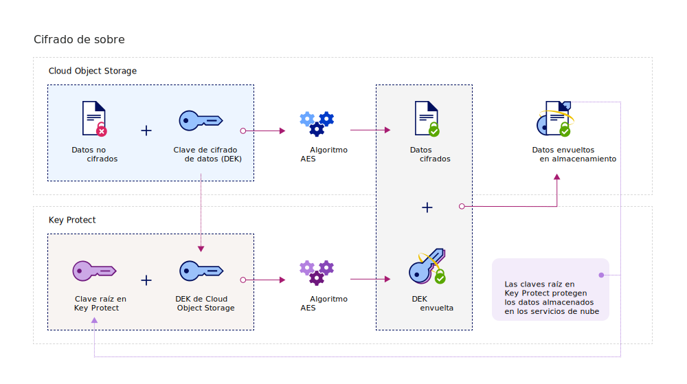

---

copyright:
  years: 2017, 2019
lastupdated: "2019-04-03"

keywords: Key Protect integration, integrate COS with Key Protect

subcollection: key-protect

---

{:shortdesc: .shortdesc}
{:codeblock: .codeblock}
{:screen: .screen}
{:new_window: target="_blank"}
{:pre: .pre}
{:tip: .tip}
{:note: .note}
{:important: .important}

# Integración con {{site.data.keyword.cos_full_notm}}
{: #integrate-cos}

{{site.data.keyword.keymanagementservicefull}} y {{site.data.keyword.cos_full}} trabajan conjuntamente para ayudarle a obtener la seguridad de sus datos en reposo. Aprenda cómo agregar el cifrado avanzado a sus recursos de {{site.data.keyword.cos_full}} utilizando el servicio de {{site.data.keyword.keymanagementservicelong_notm}}.
{: shortdesc}

## Acerca de {{site.data.keyword.cos_full_notm}}
{: #cos}

{{site.data.keyword.cos_full_notm}} proporciona almacenamiento en la nube para datos no estructurados. Datos no estructurados hace referencia a archivos, soportes de audio/visuales, PDF, archivadores de datos comprimidos, imágenes de copia de seguridad, artefactos de aplicaciones, documentos empresariales o cualquier otro objeto binario.  

Para mantener la disponibilidad y la integridad de los datos, {{site.data.keyword.cos_full_notm}} divide y dispersa datos en nodos de almacenamiento en varias ubicaciones geográficas. No hay una copia completa de los datos en un nodo de almacenamiento concreto, y únicamente un subconjunto de nodos debe estar disponible para poder recuperar completamente los datos en la red. Se proporciona cifrado del lado del proveedor, de forma que los datos estén seguros en reposo o al transportarlos. Para gestionar el almacenamiento, se crean contenedores y objetos de importación con la consola de {{site.data.keyword.cloud_notm}}, o mediante programación con la [API REST de {{site.data.keyword.cos_full_notm}} ](/docs/services/cloud-object-storage?topic=cloud-object-storage-compatibility-api){: new_window}.

Para obtener más información, consulte [Acerca de COS ](/docs/services/cloud-object-storage?topic=cloud-object-storage-about){: new_window}.

## Funcionamiento de la integración
{: #kp_cos_how}

{{site.data.keyword.keymanagementserviceshort}} se integra con {{site.data.keyword.cos_full_notm}} para ayudarle a lograr el control total de la seguridad de sus datos.  

A medida que mueve datos en la instancia de {{site.data.keyword.cos_full_notm}}, el servicio automáticamente cifra los objetos con claves de cifrado de datos (DEK). Dentro de {{site.data.keyword.cos_full_notm}}, las DEK se almacenan en el servicio de forma segura, cerca de los recursos que cifran. Cuando es necesario acceder a un contenedor de datos, el servicio comprueba sus permisos de usuario y descifra en su nombre los objetos que contiene. Este modelo de cifrado se denomina _cifrado gestionado por el proveedor_.

Para habilitar las ventajas que ofrece el _cifrado gestionado por el cliente_, puede añadir el cifrado de sobre para sus DEK en {{site.data.keyword.cos_full_notm}} integrándolo en el servicio de {{site.data.keyword.keymanagementserviceshort}}. Con {{site.data.keyword.keymanagementserviceshort}}, las claves raíz de alta seguridad que proporcione servirán como claves maestras que controlará en el servicio. Cuando crea un contenedor de datos en {{site.data.keyword.cos_full_notm}}, puede configurar el cifrado de sobre para dicho contenedor en el momento de su creación. Esta protección añadida envuelve (o cifra) las DEK asociadas con el contenedor con una clave raíz que se gestiona en {{site.data.keyword.keymanagementserviceshort}}. Esta práctica, denominada de _envolvimiento de claves_, utiliza varios algoritmos AES para proteger la privacidad y la integridad de las DEK, de modo que solo usted controlará el acceso a sus datos asociados.

En la figura siguiente se muestra cómo {{site.data.keyword.keymanagementserviceshort}} se integra con {{site.data.keyword.cos_full_notm}} para proteger más sus claves de cifrado. 

Para obtener más información sobre cómo funciona el cifrado de sobre de {{site.data.keyword.keymanagementserviceshort}}, consulte [Protección de datos con cifrado de sobre](/docs/services/key-protect?topic=key-protect-envelope-encryption).

## Adición del cifrado de sobre a sus contenedores de almacenamiento
{: #kp_cos_envelope}

[Después de designar una clave raíz en {{site.data.keyword.keymanagementserviceshort}}](/docs/services/key-protect?topic=key-protect-create-root-keys) y de [otorgar acceso entre sus servicios](/docs/services/key-protect?topic=key-protect-integrate-services#grant-access), puede habilitar el cifrado de sobre para un contenedor de almacenamiento concreto mediante la interfaz gráfica de usuario de {{site.data.keyword.cos_full_notm}}.

 Para habilitar las opciones de configuración avanzadas para el contenedor de almacenamiento, asegúrese de que exista una [autorización](/docs/services/key-protect?topic=key-protect-integrate-services#grant-access) entre las instancias de servicio de {{site.data.keyword.cos_full_notm}} y {{site.data.keyword.keymanagementserviceshort}}.
{: tip}

Para añadir cifrado de sobre a un contenedor de almacenamiento:

1. Desde el panel de control de {{site.data.keyword.cos_full_notm}}, pulse **Crear contenedor**.
2. Especifique los detalles del contenedor.
3. En la sección **Configuración avanzada**, seleccione **Añadir claves de {{site.data.keyword.keymanagementserviceshort}}**.
4. En la lista de instancias de servicio de {{site.data.keyword.keymanagementserviceshort}}, seleccione la instancia que contiene la clave raíz que desea utilizar para envolver claves.
5. En **Nombre de clave**, seleccione el alias de la clave raíz.
6. Pulse **Crear** para confirmar la creación del contenedor de datos.

Desde la interfaz gráfica de usuario de {{site.data.keyword.cos_full_notm}}, examine los contenedores de datos que están protegidos mediante una clave raíz de {{site.data.keyword.keymanagementserviceshort}}.

## Qué hacer a continuación
{: #cos-integration-next-steps}

- Para obtener más información acerca de asociar sus depósitos de almacenamiento con claves de {{site.data.keyword.keymanagementserviceshort}}, consulte [Gestionar cifrado ](/docs/services/cloud-object-storage?topic=cloud-object-storage-manage-encryption){: new_window}. 
