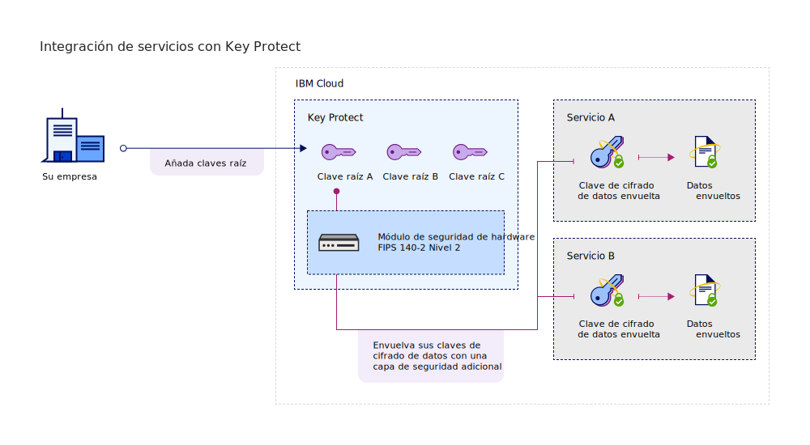

---

copyright:
  years: 2017, 2019
lastupdated: "2019-01-03"

---

{:shortdesc: .shortdesc}
{:codeblock: .codeblock}
{:screen: .screen}
{:new_window: target="_blank"}
{:pre: .pre}
{:tip: .tip}
{:note: .note}
{:important: .important}

# Integración de servicios
{: #integrate-services}

{{site.data.keyword.keymanagementservicefull}} se integra con las soluciones de datos y almacenamiento para ayudarle a traer y gestionar su propio cifrado en la nube.
{: shortdesc}

[Después de crear una instancia de un servicio](/docs/services/key-protect/provision.html), puede integrar {{site.data.keyword.keymanagementserviceshort}} con los siguientes servicios soportados:

<table>
    <tr>
        <th>Servicio</th>
        <th>Descripción</th>
    </tr>
    <tr>
        <td>
          
{{site.data.keyword.cos_full_notm}}

        </td>
        <td>
          
Añada [cifrado de sobre](/docs/services/key-protect/concepts/envelope-encryption.html) a sus depósitos de almacenamiento utilizando {{site.data.keyword.keymanagementserviceshort}}. Utilice claves raíz que gestiona en {{site.data.keyword.keymanagementserviceshort}} para proteger las claves de cifrado de datos que cifran los datos en reposo.

          
Para obtener más información, consulte [Integración con {{site.data.keyword.cos_full_notm}}](/docs/services/key-protect/integrations/integrate-cos.html).

        </td>
    </tr>
    <tr>
        <td>
          
{{site.data.keyword.containerlong}}

        </td>
        <td>
          
Utilice el [cifrado de sobre](/docs/services/key-protect/concepts/envelope-encryption.html) para proteger secretos en el clúster de {{site.data.keyword.containershort_notm}}.

          
Para obtener más información, consulte [Cifrado de secretos de Kubernetes mediante {{site.data.keyword.keymanagementserviceshort}} ](/docs/containers/cs_encrypt.html#keyprotect).

        </td>
    </tr>
   <caption style="caption-side:bottom;">Tabla 1. Describe las integraciones disponibles para {{site.data.keyword.keymanagementserviceshort}}</caption>
</table>

## Comprensión de la integración 
{: #understand-integration}

Cuando integra un servicio con soporte con {{site.data.keyword.keymanagementserviceshort}}, habilita el [cifrado de sobre](/docs/services/key-protect/concepts/envelope-encryption.html) de dicho servicio. Esta integración le permite utilizar una clave raíz que almacena en {{site.data.keyword.keymanagementserviceshort}} para envolver las claves de cifrado de datos que cifran los datos en reposo. 

Por ejemplo, puede crear una clave raíz, gestionar la clave en {{site.data.keyword.keymanagementserviceshort}} y utilizar la clave raíz para proteger los datos que se almacenan en distintos servicios en la nube.

### Métodos de API de {{site.data.keyword.keymanagementserviceshort}}
{: #api-methods}

De forma transparente para el usuario, la API de {{site.data.keyword.keymanagementserviceshort}} lleva a cabo el proceso de cifrado del sobre.  

En la tabla siguiente se listan los métodos API que añaden o eliminan el cifrado de sobre en un recurso.

<table>
  <tr>
    <th>Método</th>
    <th>Descripción</th>
  </tr>
  <tr>
    <td><code>POST /keys/{ID_clave_raíz}?action=wrap</code></td>
    <td><a href="/docs/services/key-protect/wrap-keys.html">Envuelve (cifra) una clave de cifrado de datos</a></td>
  </tr>
  <tr>
    <td><code>POST /keys/{ID_clave_raíz}?action=unwrap</code></td>
    <td><a href="/docs/services/key-protect/unwrap-keys.html">Desenvuelve (descifra) una clave de cifrado de datos</a></td>
  </tr>
  <caption style="caption-side:bottom;">Tabla 2. Describe los métodos API de {{site.data.keyword.keymanagementserviceshort}}</caption>
</table>

Para obtener más información sobre la gestión de claves mediante programación en {{site.data.keyword.keymanagementserviceshort}}, consulte la [documentación de consulta de la API de {{site.data.keyword.keymanagementserviceshort}} ](https://{DomainName}/apidocs/key-protect){: new_window}.
{: tip}

## Integración de un servicio con soporte
{: #grant-access}

Para añadir una integración, cree una autorización entre los servicios utilizando el panel de control de {{site.data.keyword.iamlong}}. Las autorizaciones habilitan las políticas de acceso de servicio a servicio, de modo que pueda asociar un recurso en su servicio de datos en la nube con una [clave raíz](/docs/services/key-protect/concepts/envelope-encryption.html#key-types) que gestiona en {{site.data.keyword.keymanagementserviceshort}}.

Asegúrese de proporcionar los servicios en la misma región antes de crear una autorización. Para obtener más información sobre las autorizaciones de servicio, consulte [Concesión de acceso entre servicios ](/docs/iam/authorizations.html){: new_window}.
{: note}

Cuando esté listo para integrar un servicio, utilice los pasos siguientes para crear una autorización:

1. [Inicie sesión en la consola de {{site.data.keyword.cloud_notm}} ](https://{DomainName}){: new_window}.
2. En la barra de menús, pulse **Gestionar** &gt; **Seguridad** &gt; **Acceso (IAM)** y, a continuación, seleccione **Autorizaciones**. 
3. Pulse **Crear**.
4. Seleccione un origen y un destino para la autorización.
 
  - Para **Servicio de origen**, seleccione el servicio de datos en la nube que desea integrar con {{site.data.keyword.keymanagementserviceshort}}. Por ejemplo, **Cloud Object Storage**.
  - Para **Servicio de destino**, seleccione **{{site.data.keyword.keymanagementservicelong_notm}}**. 
4. Para otorgar un acceso de solo lectura entre los servicios, seleccione el recuadro de selección **Lector**.

    Con los permisos de _Lector_, su servicio de origen puede examinar las claves raíz suministradas en la instancia especificada de {{site.data.keyword.keymanagementserviceshort}}.
5. Pulse **Autorizar**.

### Qué hacer a continuación

Agregue el cifrado avanzado a sus recursos de nube creando una clave raíz en {{site.data.keyword.keymanagementserviceshort}}. Agregue un nuevo recurso a un servicio de datos en la nube soportado y seleccione la clave raíz que desea utilizar para el cifrado avanzado.

- Para obtener más información sobre la creación de claves raíz con el servicio de {{site.data.keyword.keymanagementserviceshort}}, consulte [Creación de claves raíz](/docs/services/key-protect/create-root-keys.html).
- Para obtener más información acerca de traer sus propias claves raíz al servicio de {{site.data.keyword.keymanagementserviceshort}}, consulte [Importación de claves raíz](/docs/services/key-protect/import-root-keys.html).

