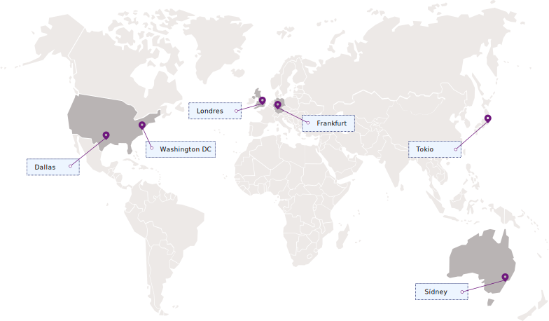

---

copyright:
  years: 2017, 2019
lastupdated: "2019-04-03"

keywords: Key Protect API endpoints, available regions

subcollection: key-protect

---

{:shortdesc: .shortdesc}
{:codeblock: .codeblock}
{:screen: .screen}
{:new_window: target="_blank"}
{:pre: .pre}
{:tip: .tip}
{:note: .note}
{:important: .important}
{:deprecated: .deprecated}

# Regiones y ubicaciones
{: #regions}

Conéctese a sus aplicaciones con el servicio de {{site.data.keyword.keymanagementservicelong}} especificando un punto final de servicio regional.
{: shortdesc}

## Regiones disponibles
{: #available-regions}

{{site.data.keyword.keymanagementserviceshort}} está disponible en las siguientes regiones y ubicaciones: 

## Puntos finales de servicio
{: #service-endpoints}

Si está gestionando sus recursos de {{site.data.keyword.keymanagementserviceshort}} mediante programación, consulte la siguiente tabla para determinar los puntos finales de API que hay que utilizar para conectarse a la API de [{{site.data.keyword.keymanagementserviceshort}}](https://{DomainName}/apidocs/key-protect): 

<table>
    <tr>
        <th>Ubicación</th>
        <th>Punto final de API de servicio</th>
    </tr>
    <tr>
        <td>Dallas</td>
        <td>
            <code>us-south.kms.cloud.ibm.com</code>
        </td>
    </tr>
    <tr>
        <td>Washington DC</td>
        <td>
            <code>us-east.kms.cloud.ibm.com</code>
        </td>
    </tr>
    <tr>
        <td>Londres</td>
        <td>
            <code>eu-gb.kms.cloud.ibm.com</code>
        </td>
    </tr>
    <tr>
        <td>Frankfurt</td>
        <td>
            <code>eu-de.kms.cloud.ibm.com</code>
        </td>
    </tr>
    <tr>
        <td>Sídney</td>
        <td>
            <code>au-syd.kms.cloud.ibm.com</code>
        </td>
    </tr>
    <tr>
        <td>Tokio</td>
        <td>
            <code>jp-tok.kms.cloud.ibm.com</code>
        </td>
    </tr>
    <caption style="caption-side:bottom;">Tabla 1. Muestra los puntos finales disponibles para la API de {{site.data.keyword.keymanagementserviceshort}}</caption>
</table>

Puede seguir utilizando `https://keyprotect.<region>.bluemix.net` como destino para el servicio para las operaciones o puede actualizar las aplicaciones con los nuevos puntos finales de `cloud.ibm.com`.
{: tip}

Para obtener más información sobre la autenticación con {{site.data.keyword.keymanagementserviceshort}}, consulte [Acceso a la API](/docs/services/key-protect?topic=key-protect-set-up-api).
