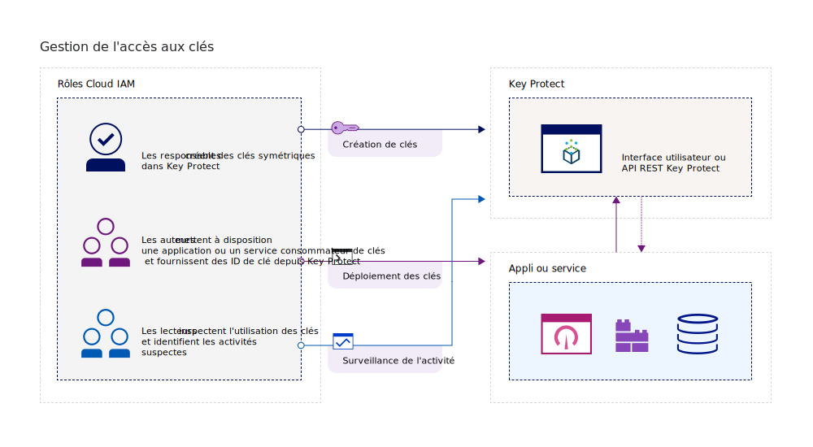
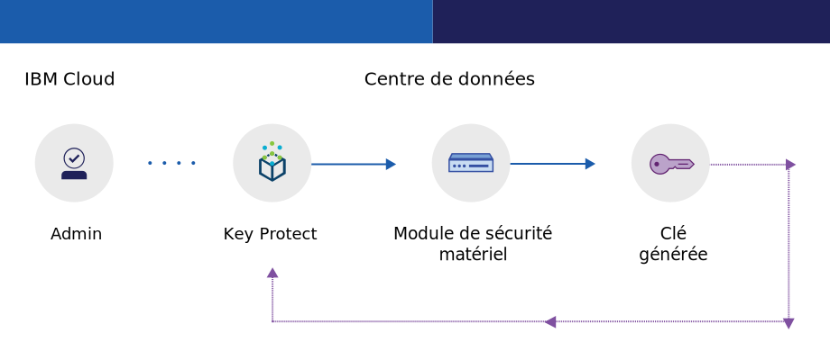
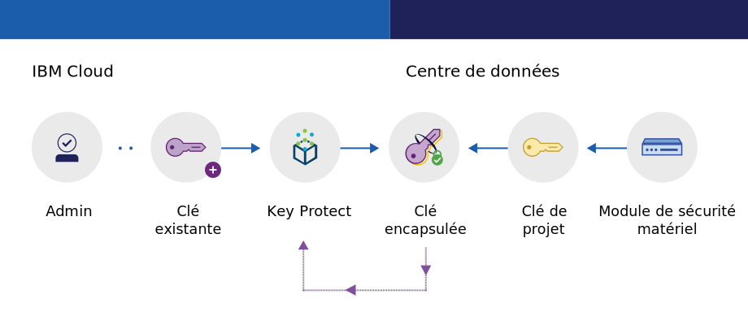

---

copyright:
  years: 2017, 2019
lastupdated: "2019-02-18"

keywords: key management service, KMS, about Key Protect, about KMS, Key Protect use cases, KMS use cases

subcollection: key-protect

---

{:shortdesc: .shortdesc}
{:codeblock: .codeblock}
{:screen: .screen}
{:new_window: target="_blank"}
{:pre: .pre}
{:tip: .tip}
{:note: .note}
{:important: .important}

# A propos de {{site.data.keyword.keymanagementserviceshort}}
{: #about}

{{site.data.keyword.keymanagementservicefull}} permet de mettre à disposition des clés chiffrées pour des applications au sein des services {{site.data.keyword.cloud_notm}}. Dans le cadre de la gestion du cycle de vie de vos clés, sachez que vos clés sont sécurisées par des modules de sécurité matériels basés sur le cloud et certifiés FIPS 140-2 niveau 2 qui vous protègent contre le vol d'informations.
{: shortdesc}

## Pourquoi utiliser {{site.data.keyword.keymanagementserviceshort}} ?
{: #use-cases}

Vous pouvez être amené à gérer des clés dans les scénarios suivants :

<table>
  <tr>
    <th>Scénario</th>
    <th>Raisons</th>
  </tr>
  <tr>
    <td>Si vous souhaitez effectuer un chiffrement d'enveloppe lorsque vous transférez des données dans le cloud. Vous devez apporter votre propre clé de chiffrement principale afin de pouvoir gérer et protéger d'autres clés qui chiffrent vos données au repos. </td>
    <td>Avec {{site.data.keyword.keymanagementserviceshort}}, vous pouvez [encapsuler vos clés DEK avec une clé racine hautement sécurisée](/docs/services/key-protect?topic=key-protect-envelope-encryption). Vous pouvez utiliser vos propres clés racine ou créer des clés dans le service.</td>
  </tr>
  <tr>
    <td>En tant que responsable informatique d'une grande entreprise, vous êtes chargé du traitement (intégration, suivi et rotation) des clés pour de nombreuses offres de service différentes.</td>
    <td>L'interface {{site.data.keyword.keymanagementserviceshort}} simplifie la gestion des services de chiffrement multiples. Avec ce service, vous pouvez gérer et trier des clés dans un emplacement centralisé unique, ou séparer les clés par projet et les héberger dans des espaces {{site.data.keyword.cloud_notm}} différents.</td>
  </tr>
  <tr>
    <td>Vous administrez la sécurité dans le service financier ou juridique d'une entreprise qui est tenue de respecter des règles strictes au niveau de la protection des données. Vous devez accorder des contrôles d'accès aux différentes clés sans pour autant compromettre les données qu'elles sécurisent.</td>
    <td>Avec ce service, vous pouvez contrôler l'accès utilisateur pour la gestion de clés en [affectant des rôles Identity and Access Management différents](/docs/services/key-protect?topic=key-protect-manage-access#roles). Il vous est ainsi possible d'accorder un accès en lecture seule aux utilisateurs qui ont besoin de voir les informations de création de clé sans afficher le matériel de clé.</td>
  <tr>
    <td>En tant que développeur, vous souhaitez intégrer vos applications pré-existantes, telles que le stockage avec auto-chiffrement, à {{site.data.keyword.keymanagementserviceshort}}.</td>
    <td>Les applications installées sur ou en dehors de {{site.data.keyword.cloud_notm}} peuvent s'intégrer aux API {{site.data.keyword.keymanagementserviceshort}}. Vous pouvez utiliser vos clés existantes pour vos applis. </td>
  </tr>
  <tr>
    <td>Votre équipe de développement applique des règles strictes et vous devez disposer d'un moyen pour générer et effectuer une rotation des clés tous les 14 jours.</td>
    <td>Avec {{site.data.keyword.keymanagementserviceshort}}, vous pouvez générer rapidement des clés à partir d'un module de sécurité matériel {{site.data.keyword.cloud_notm}} pour répondre à vos besoins de sécurité actuels.</td>
  </tr>
</table>

Vous recherchez une solution de gestion des clés dédiée qui prenne en charge les modules de sécurité matériels basés sur le cloud et contrôlés par le client ? [{{site.data.keyword.cloud_notm}} {{site.data.keyword.hscrypto}} (bêta)](/docs/services/hs-crypto?topic=hs-crypto-get-started) s'intègre à {{site.data.keyword.keymanagementserviceshort}} pour activer la fonction KYOK (Keep Your Own Keys) pour {{site.data.keyword.cloud_notm}}, afin que votre organisation ait plus de contrôle et d'autorité sur ses données. Consultez les [détails de l'offre {{site.data.keyword.hscrypto}} ](https://{DomainName}/catalog/services/hyper-protect-crypto-services) pour en savoir plus.
{: tip}

## Fonctionnement de {{site.data.keyword.keymanagementserviceshort}}
{: #kp-how}

{{site.data.keyword.keymanagementservicelong_notm}} permet de gérer des clés de chiffrement dans l'ensemble de votre organisation en s'alignant sur les rôles {{site.data.keyword.cloud_notm}} Identity and Access Management.

Un administrateur de sécurité ou un responsable informatique a besoin de droits d'accès avancés qui ne sont pas forcément nécessaires à un auditeur. Pour simplifier l'accès, {{site.data.keyword.keymanagementserviceshort}} établit un mappage avec les rôles {{site.data.keyword.cloud_notm}} Identity and Access Management afin que chaque rôle dispose d'une vue différente du service. Pour vous aider à déterminer la vue ou le niveau d'accès les mieux adaptés à vos besoins, voir [Gestion des utilisateurs et des accès](/docs/services/key-protect?topic=key-protect-manage-access#roles).

Le diagramme ci-dessous indique comment les responsables, les lecteurs et les auteurs peuvent interagir avec des clés gérées dans le service.

<dl>
  <dt>Intégration de services</dt>
    <dd>Les responsables de l'instance de service {{site.data.keyword.keymanagementserviceshort}} gèrent les clés de chiffrement.</dd>
  <dt>Audits</dt>
    <dd>Les lecteurs accèdent une vue globale des clés et identifient les activités suspectes.</dd>
  <dt>Applis</dt>
    <dd>Les auteurs gèrent les clés de chiffrement qu'ils codent dans les applications.</dd>
</dl>

## Architecture de {{site.data.keyword.keymanagementserviceshort}}
{: #kp_architecture}

{{site.data.keyword.keymanagementservicelong_notm}} se compose de technologies acceptées par l'industrie.

<dl>
  <dt>Serveur {{site.data.keyword.cloud_notm}}</dt>
    <dd>L'identité, les projets et les jetons en provenance du serveur {{site.data.keyword.cloud_notm}} permettent au service {{site.data.keyword.keymanagementserviceshort}} de mapper les ressources aux clés.</dd>
  <dt>API pour {{site.data.keyword.keymanagementserviceshort}}</dt>
    <dd>L'API REST {{site.data.keyword.keymanagementserviceshort}} actionne la création et la gestion des clés. Le système fournit un partage de services chiffrés.</dd>
  <dt>Interface utilisateur dans {{site.data.keyword.cloud_notm}}</dt>
    <dd>Du fait de l'interface utilisateur {{site.data.keyword.keymanagementserviceshort}}, vous pouvez utiliser vos clés de façon sécurisée.</dd>
  <dt>Module de sécurité matériel (HSM)</dt>
    <dd>En arrière-plan, les centres de données {{site.data.keyword.cloud_notm}} fournissent le matériel pour protéger vos clés.</dd>
  <dt>Cluster de base de données</dt>
    <dd>Un cluster de base de données garantit un stockage redondant et sécurisé de vos clés.</dd>
</dl>

Le diagramme suivant montre comment {{site.data.keyword.keymanagementserviceshort}} fonctionne avec les modules de sécurité matériel pour générer des clés par rapport à la façon dont le service stocke les clés.

