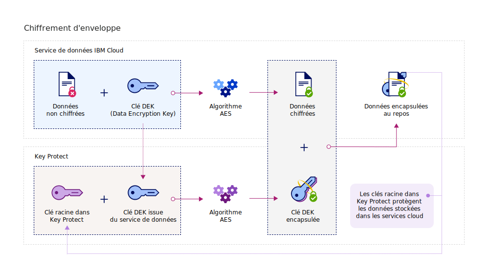
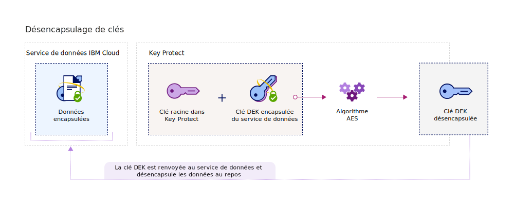

---

copyright:
  years: 2017, 2018
lastupdated: "2018-08-24"

---

{:shortdesc: .shortdesc}
{:codeblock: .codeblock}
{:screen: .screen}
{:new_window: target="_blank"}
{:pre: .pre}
{:tip: .tip}

# Chiffrement d'enveloppe
{: #envelope-encryption}

Le chiffrement d'enveloppe est une procédure consistant à chiffrer des données à l'aide d'une clé DEK (Data Encryption Key), puis à chiffrer la clé DEK avec une clé racine que vous pouvez intégralement gérer. 
{: shortdesc}

{{site.data.keyword.keymanagementservicefull}} protège les données stockées via un mécanisme de chiffrement avancé et offre un certain nombre d'avantages :

<table>
  <th>Avantage</th>
  <th>Description</th>
  <tr>
    <td>Clés de chiffrement gérées par le client</td>
    <td>Avec le service, vous pouvez mettre à disposition des clés racine pour assurer la sécurité des données chiffrées dans le cloud. Les clés racine sont utilisées en tant que clés principales d'encapsulage de clés pour vous aider à gérer et à protéger les clés DEK disponibles dans les services de données {{site.data.keyword.cloud_notm}}. Vous pouvez décider d'importer des clés racine existantes ou demander à {{site.data.keyword.keymanagementserviceshort}} de les générer pour vous.</td>
  </tr>
  <tr>
    <td>Protection de l'intégrité et de la confidentialité</td>
    <td>{{site.data.keyword.keymanagementserviceshort}} utilise l'algorithme AES (Advanced Encryption Standard) en mode GCM (Galois/Counter Mode) pour créer et protéger les clés. Lorsque vous créez des clés dans le service, {{site.data.keyword.keymanagementserviceshort}} les génère dans les limites de confiance des modules HSM {{site.data.keyword.cloud_notm}} afin que vous soyez le seul à pouvoir accéder à vos clés de chiffrement.</td>
  </tr>
  <tr>
    <td>Destruction cryptographique des données</td>
    <td>Si votre organisation détecte un problème de sécurité ou que votre application n'a plus besoin d'un ensemble de données, vous pouvez décider de détruire définitivement les données du cloud. Lorsque vous supprimez une clé racine qui protège d'autres clés DEK, les données associées à la clé ne sont plus accessibles ou ne peuvent plus être déchiffrées.</td>
  </tr>
  <tr>
    <td>Contrôle d'accès utilisateur délégué</td>
    <td>{{site.data.keyword.keymanagementserviceshort}} prend en charge un système de contrôle d'accès centralisé pour permettre un accès granulaire aux clés. [En affectant des rôles utilisateur et des droits avancés IAM](/docs/services/key-protect/manage-access.html#roles), les administrateurs de sécurité déterminent les personnes autorisées à accéder des clés spécifiques du service.</td>
  </tr>
  <caption style="caption-side:bottom;">Tableau 1. Description des avantages du chiffrement géré par le client</caption>
</table>

## Fonctionnement
{: #overview}

Le chiffrement d'enveloppe associe la puissance de plusieurs algorithmes de chiffrement pour protéger les données sensibles du cloud. Il fonctionne en encapsulant une ou plusieurs clés DEK avec un chiffrement avancé via une clé racine que vous pouvez intégralement gérer. Cette procédure d'encapsulage de clés crée des clés DEK encapsulées qui protègent les données stockées contre une exposition ou des accès non autorisés. Le désencapsulage d'une clé DEK annule la procédure de chiffrement d'enveloppe à l'aide de la même clé racine et génère des données déchiffrées et authentifiées.
 
Le diagramme suivant présente une vue contextuelle de la fonction d'encapsulage de clés.

Le chiffrement d'enveloppe est abordé dans le document NIST Special Publication 800-57, Recommendation for Key Management. Pour en savoir plus, voir [NIST SP 800-57 Pt. 1 Rev. 4. ](http://nvlpubs.nist.gov/nistpubs/SpecialPublications/NIST.SP.800-57pt1r4.pdf){: new_window}

## Types de clé
{: #key-types}

Pour le chiffrement avancé et la gestion des données, le service prend en charge deux types de clé, les clés racine et les clés standard.

<dl>
  <dt>Root keys (Clés racine)</dt>
    <dd>Les clés racine représentent les ressources principales de {{site.data.keyword.keymanagementserviceshort}}. Il s'agit de clés d'encapsulage de clés symétriques utilisées en tant que racines de confiance pour l'encapsulage (chiffrement) et le désencapsulage (déchiffrement) d'autres clés stockées dans le service de données. Avec {{site.data.keyword.keymanagementserviceshort}}, vous pouvez créer et stocker des clés et gérer le cycle de vie de clés racine pour contrôler intégralement d'autres clés dans le cloud. Contrairement à la clé standard, une clé racine doit toujours rester dans les limites du service {{site.data.keyword.keymanagementserviceshort}}.</dd>
  <dt>Standard keys (Clés standard)</dt>
    <dd>Les clés standard sont des clés de chiffrement utilisées pour la cryptographie. En général, elles chiffrent les données directement. Avec {{site.data.keyword.keymanagementserviceshort}}, vous pouvez créer, stocker et gérer le cycle de vie des clés standard. Après avoir importé ou généré une clé standard du service, vous pouvez l'exporter dans une ressource de données externe, comme un compartiment de stockage, pour chiffrer des informations sensibles. Les clés standard qui chiffrent des données stockées sont appelées "clés DEK" et peuvent être encapsulées avec un mécanisme de chiffrement avancé. Les clés DEK encapsulées ne sont pas stockées dans {{site.data.keyword.keymanagementserviceshort}}.</dd>
</dl>

Une fois les clés créées dans {{site.data.keyword.keymanagementserviceshort}}, le système renvoie une valeur d'ID que vous pouvez utiliser pour appeler le service via une API. Vous pouvez extraire la valeur d'ID pour vos clés via l'interface graphique de {{site.data.keyword.keymanagementserviceshort}} ou l'[API {{site.data.keyword.keymanagementserviceshort}}](https://console.bluemix.net/apidocs/kms). 

## Encapsulage de clés
{: #wrapping}

Les clés racine permettent de regrouper, de gérer et de protéger les clés DEK (Data Encryption Key) stockées dans le cloud. Vous pouvez encapsuler une ou plusieurs clés DEK avec un chiffrement avancé en désignant une clé racine dans {{site.data.keyword.keymanagementserviceshort}} et la gérer intégralement. 

Après avoir désigné une clé racine dans {{site.data.keyword.keymanagementserviceshort}}, vous pouvez envoyer une demande d'encapsulage de clés au service via l'API {{site.data.keyword.keymanagementserviceshort}}. L'opération d'encapsulage de clés protège à la fois la confidentialité et l'intégrité d'une clé DEK. Le diagramme ci-dessous présente le déroulement du processus d'encapsulage de clés :

Le tableau suivant décrit les valeurs à entrer pour effectuer une opération d'encapsulation de clés :
<table>
  <th>Valeurs à entrer</th>
  <th>Description</th>
  <tr>
    <td>Root key ID</td>
    <td>Valeur d'ID de la clé racine que vous souhaitez utiliser pour l'encapsulage. La clé racine peut être importée dans le service ou peut provenir des modules HSM du service {{site.data.keyword.keymanagementserviceshort}}. Pour qu'une demande d'encapsulage aboutisse, les clés racine utilisées doivent être des clés de 256, 384 ou 512 bits.</td>
  </tr>
  <tr>
    <td>Plaintext</td>
    <td>Facultatif : Matériel relatif à la clé DEK qui contient les données à gérer et à protéger. Le texte brut utilisé pour l'encapsulage de clé doit être codé en base64. Pour générer une clé DEK de 256 bits, vous pouvez omettre l'attribut `plaintext`. Le service génère une clé DEK codée en base64 à utiliser pour l'encapsulage de clés.</td>
  </tr>
  <tr>
    <td>Additional authentication data (AAD)</td>
    <td>Facultatif : Tableau de chaînes qui vérifie l'intégrité du contenu de la clé. Chaque chaîne peut inclure jusqu'à 255 caractères. Si vous indiquez des données d'authentification supplémentaires lors d'une demande d'encapsulage, vous devez indiquer les mêmes données lors de la demande de désencapsulage ultérieure.</td>
  </tr>
    <caption style="caption-side:bottom;">Tableau 2. Entrées requises pour l'encapsulage de clés dans {{site.data.keyword.keymanagementserviceshort}}</caption>
</table>

Si vous envoyez une demande d'encapsulage sans indiquer le texte brut à chiffrer, l'algorithme de chiffrement AES-GCM génère et convertit un texte brut en données incompréhensibles appelées "texte chiffré". Cette procédure génère une clé DEK de 256 bits avec un nouveau matériel de clé. Le système utilise ensuite un algorithme d'encapsulage de clé AES, qui encapsule la clé DEK et son matériel avec la clé racine indiquée. Une opération d'encapsulage réussie renvoie une clé DEK encapsulée en base64 que vous pouvez stocker dans une application ou un service {{site.data.keyword.cloud_notm}}. 

## Désencapsulage de clés
{: #unwrapping}

La procédure de désencapsulage d'une clé DEK déchiffre le contenu d'une clé DEK et authentifie son contenu en renvoyant le matériel de la clé d'origine au service de données. 

Si l'application métier doit accéder au contenu des clés encapsulées, vous pouvez utiliser l'API {{site.data.keyword.keymanagementserviceshort}} pour envoyer une demande de désencapsulage au service. Pour désencapsuler une clé DEK, vous devez indiquer la valeur de l'ID de la clé racine et la valeur `ciphertext` renvoyée lors de la demande d'encapsulage initiale. Pour effectuer une demande de désencapsulage, vous devez également indiquer les données authentifiées supplémentaires (AAD) pour vérifier l'intégrité du contenu de la clé.

Le diagramme suivant présente le déroulement de la procédure de désencapsulage de clés

Une fois que vous avez envoyé la demande de désencapsulage, le système annule la procédure d'encapsulage de clés en utilisant les mêmes algorithmes AES. Une opération de désencapsulage réussie renvoie une valeur `plaintext` codée en base64 pour votre service de données au repos {{site.data.keyword.cloud_notm}}.

