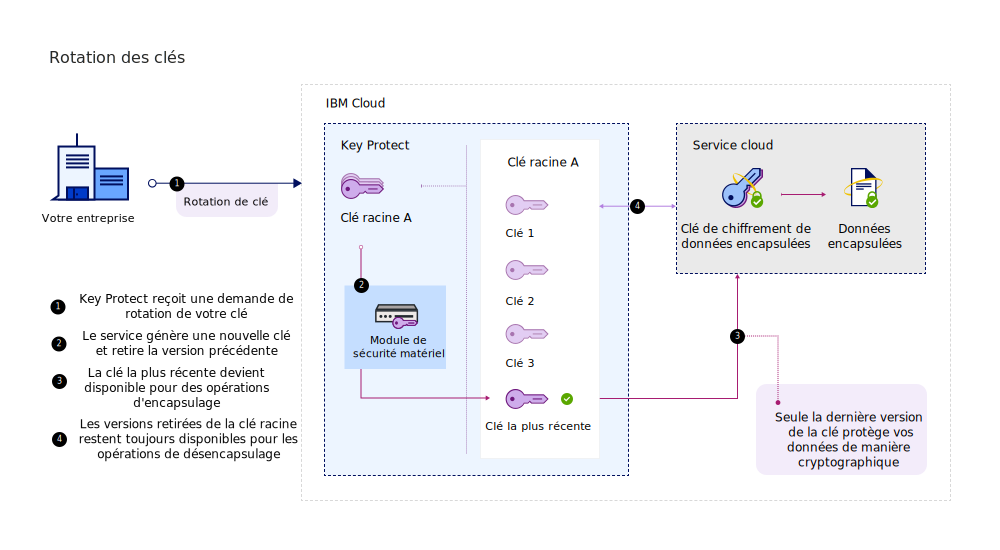
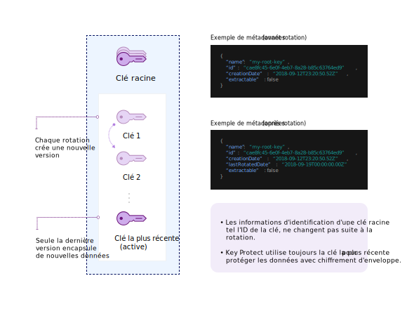

---

copyright:
  years: 2017, 2019
lastupdated: "2019-03-22"

keywords: rotate encryption keys, rotate keys automatically, key rotation

subcollection: key-protect

---

{:shortdesc: .shortdesc}
{:codeblock: .codeblock}
{:screen: .screen}
{:new_window: target="_blank"}
{:pre: .pre}
{:tip: .tip}
{:note: .note}
{:important: .important}

# Rotation des clés de chiffrement
{: #key-rotation}

La rotation des clés s'effectue lorsque vous retirez le matériel de clé d'origine d'une clé racine et remplacez la clé en générant un nouveau matériel de clé cryptographique.

Procéder régulièrement à une rotation des clés vous aide à respecter les normes en vigueur de l'industrie et les meilleures pratiques en matière de cryptographie. Le tableau suivant décrit les principaux avantages de la rotation des clés :

<table>
  <th>Avantage</th>
  <th>Description</th>
  <tr>
    <td>Gestion de la cryptopériode des clés</td>
    <td>La rotation des clés limite la durée durant laquelle vos informations sont protégées par une clé spécifique. En procédant à une rotation des clés à intervalles réguliers, vous raccourcissez également la cryptopériode des clés. Plus la durée de vie d'une clé de chiffrement est longue, plus le risque de violation de la sécurité est élevé.</td>
  </tr>
  <tr>
    <td>Atténuation d'incidents</td>
    <td>Si votre organisation détecte un problème de sécurité, vous pouvez immédiatement effectuer une rotation de la clé afin d'atténuer ou de réduire les coûts associés à une clé non fiable.</td>
  </tr>
  <caption style="caption-side:bottom;">Tableau 1. Description des avantages de la rotation des clés</caption>
</table>

La rotation des clés est abordée dans le document NIST Special Publication 800-57, Recommendation for Key Management. Pour en savoir plus, voir [NIST SP 800-57 Pt. 1 Rev. 4. ](http://nvlpubs.nist.gov/nistpubs/SpecialPublications/NIST.SP.800-57pt1r4.pdf){: new_window}
{: tip}

## Comparaison de vos options de rotation de clés dans {{site.data.keyword.keymanagementserviceshort}}
{: #compare-key-rotation-options}

Dans {{site.data.keyword.keymanagementserviceshort}}, vous pouvez [définir une politique de rotation de clés pour une clé](/docs/services/key-protect?topic=key-protect-set-rotation-policy) ou [effectuer une rotation de clé à la demande](/docs/services/key-protect?topic=key-protect-rotate-keys), sans nécessité de contrôler le matériel de clé racine retiré. 

Les options de rotation sont uniquement disponibles pour les clés racine.
{: note}

<dl>
  <dt>Définition d'une politique de rotation pour une clé</dt>
    <dd>{{site.data.keyword.keymanagementserviceshort}} vous aide à simplifier la rotation des clés de chiffrement en activant des politiques de rotation pour les clés, que vous générez dans le service. Après avoir créé une clé racine, vous pouvez gérer une politique de rotation pour la clé dans l'interface utilisateur de {{site.data.keyword.keymanagementserviceshort}} ou avec l'API. <a href="/docs/services/key-protect?topic=key-protect-rotation-frequency">Choisissez un intervalle de rotation automatique compris entre 1 et 12 mois pour votre clé</a> en fonction de vos besoins de sécurité actuels. Lorsqu'il est temps de procéder à la rotation de la clé conformément à l'intervalle de rotation spécifié, {{site.data.keyword.keymanagementserviceshort}} remplace automatiquement la clé par le nouveau matériel de clé.</dd>
  <dt>Rotation des clés à la demande</dt>
    <dd>En tant qu'administrateur de la sécurité, il est possible que vous souhaitiez avoir plus de contrôle sur la fréquence de rotation de vos clés. Si vous ne souhaitez pas définir une politique de rotation automatique pour une clé, vous pouvez créer une nouvelle clé manuellement pour remplacer une clé existante, puis mettre à jour vos applications pour qu'elles fassent référence à la nouvelle clé. Pour simplifier ce processus, vous pouvez utiliser {{site.data.keyword.keymanagementserviceshort}} pour effectuer une rotation de la clé à la demande. Dans ce scénario, {{site.data.keyword.keymanagementserviceshort}} crée et remplace la clé à votre place à chaque demande de rotation. La clé conserve les mêmes métadonnées et le même ID de clé.</dd>
</dl>

## Fonctionnement de la rotation des clés 
{: #how-key-rotation-works}

La rotation des clés consiste à faire passer la clé d'un état _Actif_ à un état _Désactivé_ en toute sécurité. Pour remplacer le matériel de clé désactivé ou retiré, le nouveau matériel de clé passe à l'état _Actif_ et devient disponible pour les opérations cryptographiques.

### Utilisation de {{site.data.keyword.keymanagementserviceshort}} pour la rotation des clés
{: #use-key-protect-rotate-keys}

Tenez compte des considérations suivantes lorsque vous vous préparez à utiliser {{site.data.keyword.keymanagementserviceshort}} pour la rotation des clés racine.

<dl>
  <dt>Rotation des clés racine générées dans {{site.data.keyword.keymanagementserviceshort}}</dt>
    <dd>Vous pouvez utiliser {{site.data.keyword.keymanagementserviceshort}} pour effectuer la rotation d'une clé racine générée dans {{site.data.keyword.keymanagementserviceshort}} en définissant une politique de rotation pour la clé, ou en effectuant une rotation de la clé à la demande. Les métadonnées de la clé racine, telles que son ID de clé, ne changent pas lorsque vous effectuez une rotation de clé.</dd>
  <dt>Rotation des clés racine que vous apportez au service</dt>
    <dd>Pour effectuer une rotation d'une clé racine initialement importée vers le service, vous devez générer et fournir un nouveau matériel de clé pour la clé. Vous pouvez utiliser {{site.data.keyword.keymanagementserviceshort}} pour effectuer une rotation des clés racine importées à la demande en fournissant un nouveau matériel de clé dans le cadre de la demande de rotation. Les métadonnées de la clé racine, telles que son ID de clé, ne changent pas lorsque vous effectuez une rotation de clé. Comme vous devez fournir un nouveau matériel de clé pour effectuer la rotation d'une clé importée, les politiques de rotation automatiques ne sont pas disponibles pour les clés racine qui ont un matériel de clé importé.</dd>
  <dt>Gestion du matériel de clé retiré</dt>
    <dd>{{site.data.keyword.keymanagementserviceshort}} crée un nouveau matériel de clé après la rotation d'une clé racine. Le service retire l'ancien matériel de clé et conserve les versions retirées jusqu'à ce que la clé racine soit supprimée. Lorsque vous utilisez la clé racine pour le chiffrement d'enveloppe, {{site.data.keyword.keymanagementserviceshort}} utilise uniquement le dernier matériel de clé associé à la clé. Le matériel de clé retiré ne peut plus être utilisé pour protéger les clés, mais il reste disponible pour les opérations de désencapsulage. Si {{site.data.keyword.keymanagementserviceshort}} détecte que vous utilisez un matériel de clé retiré pour désencapsuler les clés de chiffrement de données, le service fournit une clés de chiffrement de données nouvellement encapsulée, basée sur le dernier matériel de clé racine. Vous pouvez utiliser la nouvelle clés de chiffrement de données encapsulée pour ré-encapsuler les clés avec le dernier matériel de clé.</dd>
 <dt>Activation de la rotation des clés pour les services de données {{site.data.keyword.cloud_notm}}</dt>
    <dd>Pour activer ces options de rotation de clés pour votre service de données sur {{site.data.keyword.cloud_notm}}, le service de données doit être intégré à {{site.data.keyword.keymanagementserviceshort}}. Reportez-vous à la documentation de votre service de données {{site.data.keyword.cloud_notm}} ou <a href="/docs/services/key-protect?topic=key-protect-integrate-services">consultez notre liste des services intégrés pour en savoir plus</a>.</dd>
</dl>

Lorsque vous effectuez une rotation de clé dans {{site.data.keyword.keymanagementserviceshort}}, aucun frais supplémentaire ne vous est facturé. Vous pouvez continuer à désencapsuler vos clés de chiffrement de données encapsulées avec du matériel de clé retiré sans coût supplémentaire. Pour plus d'informations sur nos options de tarification, voir la [page Catalogue {{site.data.keyword.keymanagementserviceshort}}](https://{DomainName}/catalog/services/key-protect).
{: tip}

### Présentation du processus de rotation des clés
{: #understand-key-rotation-process}

En arrière-plan, l'API {{site.data.keyword.keymanagementserviceshort}} exécute le processus de rotation des clés.  

Le diagramme suivant présente une vue contextuelle de la fonction de rotation des clés.

A chaque demande de rotation, {{site.data.keyword.keymanagementserviceshort}} associe un nouveau matériel de clé à votre clé racine. 

Une fois la rotation terminée, le nouveau matériel de clé racine est disponible pour protéger les futures clés de chiffrement de données avec le [chiffrement d'enveloppe](/docs/services/key-protect?topic=key-protect-envelope-encryption). Le matériel retiré est placé à l'état _Désactivé_, dans lequel il ne peut être utilisé que pour désencapsuler et accéder aux anciennes clés de chiffrement de données qui ne sont pas encore protégées par le matériel le plus récent. Si {{site.data.keyword.keymanagementserviceshort}} détecte que vous utilisez du matériel retiré pour désencapsuler une ancienne clé de chiffrement de données, le service chiffre de nouveau automatiquement la clé de chiffrement de données et renvoie une clé de chiffrement de données encapsulée selon le dernier matériel de clé racine. Stockez et utilisez la nouvelle clé de chiffrement de données encapsulée pour vos futures opérations de désencapsulage de manière à protéger vos clés de chiffrement de données avec le matériel de clé racine le plus récent.

Pour savoir comment utiliser l'API {{site.data.keyword.keymanagementserviceshort}} pour effectuer une rotation de vos clés racine, voir [Rotation des clés](/docs/services/key-protect?topic=key-protect-rotate-keys).

## Fréquence de rotation des clés
{: #rotation-frequency}

Après avoir généré une clé racine dans {{site.data.keyword.keymanagementserviceshort}}, vous décidez de la fréquence de sa rotation. Vous pouvez effectuer une rotation des clés en raison d'une rotation de personnel, d'un dysfonctionnement de processus ou selon les règles d'expiration des clés internes de votre organisation. 

Effectuez régulièrement une rotation des clés, par exemple tous les 30 jours pour respecter les meilleures pratiques en matière de cryptographie. 

| Type de rotation | Fréquence | Description
| --- | --- | --- |
| [Rotation des clés basée sur des politiques](/docs/services/key-protect?topic=key-protect-set-rotation-policy) | Tous les 1 à 12 mois | Choisissez un intervalle de rotation compris entre 1 et 12 mois pour votre clé en fonction de vos besoins en sécurité actuels. Une fois qu'une politique de rotation est définie pour une clé, l'horloge démarre immédiatement en fonction de la date de création initiale de la clé. Par exemple, si vous définissez une politique de rotation mensuelle pour une clé que vous avez créée le `01/02/2019`, {{site.data.keyword.keymanagementserviceshort}} effectuera une rotation automatique de la clé le `01/03/2019`.|
| [Rotation des clés à la demande](/docs/services/key-protect?topic=key-protect-rotate-keys) | Jusqu'à une rotation par heure | Si vous effectuez une rotation de clé à la demande, {{site.data.keyword.keymanagementserviceshort}} autorise une rotation par heure pour chaque clé racine. |
{: caption="Tableau 2. Options de fréquence de rotation pour la rotation des clés dans {{site.data.keyword.keymanagementserviceshort}}" caption-side="top"}

## Etapes suivantes
{: #rotation-next-steps}

- Pour savoir comment utiliser {{site.data.keyword.keymanagementserviceshort}} pour définir une politique de rotation automatique pour une clé individuelle, voir [Définition d'une politique de rotation](/docs/services/key-protect?topic=key-protect-set-rotation-policy).
- Pour en savoir plus sur la rotation manuelle des clés racine, voir [Rotation des clés à la demande](/docs/services/key-protect?topic=key-protect-rotate-keys).
