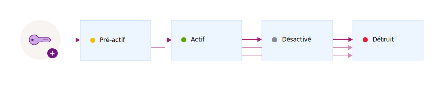

---

copyright:
  years: 2017, 2019
lastupdated: "2019-02-18"

keywords: encryption key states, encryption key lifecycle, manage key lifecycle

subcollection: key-protect

---

{:shortdesc: .shortdesc}
{:codeblock: .codeblock}
{:screen: .screen}
{:new_window: target="_blank"}
{:pre: .pre}
{:tip: .tip}
{:note: .note}
{:important: .important}

# Contrôle du cycle de vie des clés de chiffrement
{: #key-states}

{{site.data.keyword.keymanagementservicefull}} respecte les règles de sécurité établies par le document [NIST Special Publication 800-57 relatif aux états des clés ](http://nvlpubs.nist.gov/nistpubs/SpecialPublications/NIST.SP.800-57pt1r4.pdf){: new_window}.
{: shortdesc}

## Etats et transitions de clés
{: #key_transitions}

Au cours de leur existence, les clés cryptographiques connaissent plusieurs états en fonction de leur durée de vie et de la protection des données. 

{{site.data.keyword.keymanagementserviceshort}} fournit une interface graphique et une API REST pour le suivi des clés au fur et à mesure qu'elles passent d'un état à un autre tout au long de leur cycle de vie. Le diagramme ci-dessous décrit les différents états connus par la clé passe entre sa génération et sa destruction.

<table>
  <tr>
    <th>Etat</th>
    <th>Description</th>
  </tr>
  <tr>
    <td>Pré-activation</td>
    <td>Les clés sont initialement créées à l'état <i>Pré-activation</i>. Une clé pré-active ne peut pas être utilisée pour protéger des données via des mécanismes cryptographiques.</td>
  </tr>
  <tr>
    <td>Actif</td>
    <td>Les clés passent immédiatement à l'état <i>Actif</i> à la date d'activation. Cette transition marque le début de la cryptopériode d'une clé. Les clés sans date d'activation deviennent immédiatement actives et le restent jusqu'à leur expiration ou leur destruction.</td>
  </tr>
  <tr>
    <td>Désactivé</td>
    <td>Une clé passe à l'état <i>Désactivé</i> à sa date d'expiration, le cas échéant. Dans cet état, la clé ne peut pas protéger les données par chiffrement et peut uniquement passer à l'état <i>Détruit</i>.</td>
  </tr>
  <tr>
    <td>Détruit</td>
    <td>Les clés supprimées sont à l'état <i>Détruit</i>. Les clés dans cet état sont irrécupérables. Les métadonnées associées à une clé, comme le nom et l'historique des transitions de la clé, sont conservées dans la base de données {{site.data.keyword.keymanagementserviceshort}}. </td>
  </tr>
  <caption style="caption-side:bottom;">Tableau 1. Description des états et des transitions d'une clé.</caption>
</table>

Après avoir ajouté une clé au service, utilisez le tableau de bord {{site.data.keyword.keymanagementserviceshort}} ou les API REST {{site.data.keyword.keymanagementserviceshort}} pour afficher la configuration et l'historique des transitions de la clé. A des fins d'audit, vous pouvez également surveiller le journal d'activité d'une clé en intégrant {{site.data.keyword.keymanagementserviceshort}} à {{site.data.keyword.cloudaccesstrailfull}}. Une fois que les services sont mis à disposition et en cours d'exécution, les événements d'activité sont générés et collectés automatiquement dans un journal {{site.data.keyword.cloudaccesstrailshort}} lorsque vous créez et supprimez des clés dans {{site.data.keyword.keymanagementserviceshort}}. 

Pour plus d'informations, voir [Surveillance de l'activité {{site.data.keyword.keymanagementserviceshort}} ](/docs/services/cloud-activity-tracker?topic=cloud-activity-tracker-kp){: new_window}.
