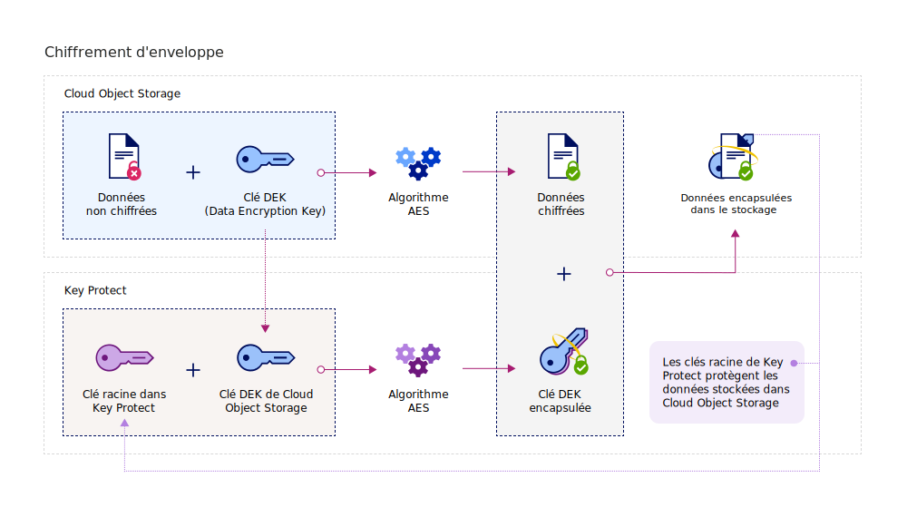

---

copyright:
  years: 2017, 2019
lastupdated: "2019-04-03"

keywords: Key Protect integration, integrate COS with Key Protect

subcollection: key-protect

---

{:shortdesc: .shortdesc}
{:codeblock: .codeblock}
{:screen: .screen}
{:new_window: target="_blank"}
{:pre: .pre}
{:tip: .tip}
{:note: .note}
{:important: .important}

# Intégration à {{site.data.keyword.cos_full_notm}}
{: #integrate-cos}

{{site.data.keyword.keymanagementservicefull}} et {{site.data.keyword.cos_full}} fonctionnent conjointement pour vous permettre de posséder la sécurité de vos données au repos. Découvrez comment ajouter un chiffrement avancé à vos ressources {{site.data.keyword.cos_full}} à l'aide du service {{site.data.keyword.keymanagementservicelong_notm}}.
{: shortdesc}

## A propos d'{{site.data.keyword.cos_full_notm}}
{: #cos}

{{site.data.keyword.cos_full_notm}} permet le stockage de données non structurées dans le cloud. Les données non structurées représentent des fichiers, des supports audiovisuels, des fichiers PDF, des archives de données compressées, des images de sauvegarde, des artefacts d'application, des documents professionnels et tout autre objet binaire.  

Pour assurer l'intégrité et la disponibilité des données, {{site.data.keyword.cos_full_notm}} fractionne et transmet les données à des noeuds de stockage situés dans différentes zones géographiques. Aucune copie complète des données ne se trouve sur un noeud de stockage unique et un seul sous-ensemble de noeuds disponible suffit pour vous permettre d'extraire les données sur le réseau. Un chiffrement côté fournisseur est mis en oeuvre pour sécuriser les données au repos et en cours de traitement. Pour gérer le stockage, vous pouvez créer des compartiments et importer des objets à l'aide de la console {{site.data.keyword.cloud_notm}} ou à l'aide d'un programme via l'[API REST {{site.data.keyword.cos_full_notm}} ](/docs/services/cloud-object-storage?topic=cloud-object-storage-compatibility-api-about#compatibility-api-about){: new_window}.

Pour plus d'informations, voir [A propos de COS ](/docs/services/cloud-object-storage?topic=cloud-object-storage-about-ibm-cloud-object-storage){: new_window}.

## Fonctionnement de l'intégration
{: #kp_cos_how}

{{site.data.keyword.keymanagementserviceshort}} s'intègre à {{site.data.keyword.cos_full_notm}} pour vous permettre de contrôler intégralement la sécurité de vos données.  

Lorsque vous transférez des données vers l'instance {{site.data.keyword.cos_full_notm}}, le service chiffre automatiquement vos objets avec des clés DEK (Data Encryption Key). Dans {{site.data.keyword.cos_full_notm}}, les clés DEK sont stockées en toute sécurité dans le service, à proximité des ressources qu'elles chiffrent. Si vous devez accéder à un compartiment, le service vérifie vos droits utilisateur et déchiffre pour vous les objets stockés dans le compartiment. Ce modèle de chiffrement est appelé _chiffrement géré par le fournisseur_.

Pour bénéficier des avantages du _chiffrement géré par le client_ en matière de sécurité, vous pouvez ajouter un mécanisme de chiffrement d'enveloppe à vos clés DEK dans {{site.data.keyword.cos_full_notm}} en l'intégrant au service {{site.data.keyword.keymanagementserviceshort}}. Avec {{site.data.keyword.keymanagementserviceshort}}, vous mettez à disposition des clés racine hautement sécurisées que vous utilisez en tant que clés principales et que vous contrôlez dans le service. Lorsque vous créez un compartiment dans {{site.data.keyword.cos_full_notm}}, vous pouvez configurer le chiffrement d'enveloppe du compartiment au moment de sa création. Cette protection supplémentaire encapsule (ou chiffre) les clés DEK associées au compartiment via une clé racine gérée dans {{site.data.keyword.keymanagementserviceshort}}. Cette pratique, appelée _encapsulage de clés_, utilise plusieurs algorithmes AES pour protéger la confidentialité et l'intégrité de vos clés DEK et vous permettre de contrôler l'accès aux données associées.

La figure ci-dessous explique comment {{site.data.keyword.keymanagementserviceshort}} s'intègre à {{site.data.keyword.cos_full_notm}} pour renforcer la sécurité de vos clés de chiffrement.

Pour savoir comment fonctionne le chiffrement d'enveloppe dans {{site.data.keyword.keymanagementserviceshort}}, voir [Protection des données avec le chiffrement d'enveloppe](/docs/services/key-protect?topic=key-protect-envelope-encryption).

## Ajout du chiffrement d'enveloppe à des compartiments de stockage
{: #kp_cos_envelope}

[Après avoir désigné une clé racine dans {{site.data.keyword.keymanagementserviceshort}}](/docs/services/key-protect?topic=key-protect-create-root-keys) et [accordé un accès entre vos services](/docs/services/key-protect?topic=key-protect-integrate-services#grant-access), vous pouvez activer le chiffrement d'enveloppe pour un compartiment de stockage spécifique à l'aide de l'interface graphique {{site.data.keyword.cos_full_notm}}.

 Pour activer des options de configuration avancées du compartiment de stockage, vérifiez qu'une [autorisation](/docs/services/key-protect?topic=key-protect-integrate-services#grant-access) existe entre vos instances de service {{site.data.keyword.cos_full_notm}} et {{site.data.keyword.keymanagementserviceshort}}.
{: tip}

Pour ajouter le chiffrement d'enveloppe à votre compartiment de stockage, procédez comme suit :

1. Dans le tableau de bord {{site.data.keyword.cos_full_notm}}, cliquez sur **Create bucket**.
2. Indiquez les détails du compartiment.
3. Dans la section **Advanced Configuration**, sélectionnez **Add {{site.data.keyword.keymanagementserviceshort}} Keys**.
4. Dans la liste d'instances de service {{site.data.keyword.keymanagementserviceshort}}, sélectionnez l'instance qui contient la clé racine à utiliser pour l'encapsulage de clés.
5. Pour le **nom de la clé**, sélectionnez l'alias de la clé racine.
6. Cliquez sur **Create** pour confirmer la création de compartiments.

Dans l'interface graphique {{site.data.keyword.cos_full_notm}}, vous pouvez parcourir les compartiments protégés par une clé racine {{site.data.keyword.keymanagementserviceshort}}.

## Etapes suivantes
{: #cos-integration-next-steps}

- Pour plus d'informations sur l'association de vos compartiments de stockage à des clés {{site.data.keyword.keymanagementserviceshort}}, voir [Gestion du chiffrement ](/docs/services/cloud-object-storage?topic=cloud-object-storage-manage-encryption){: new_window}. 
