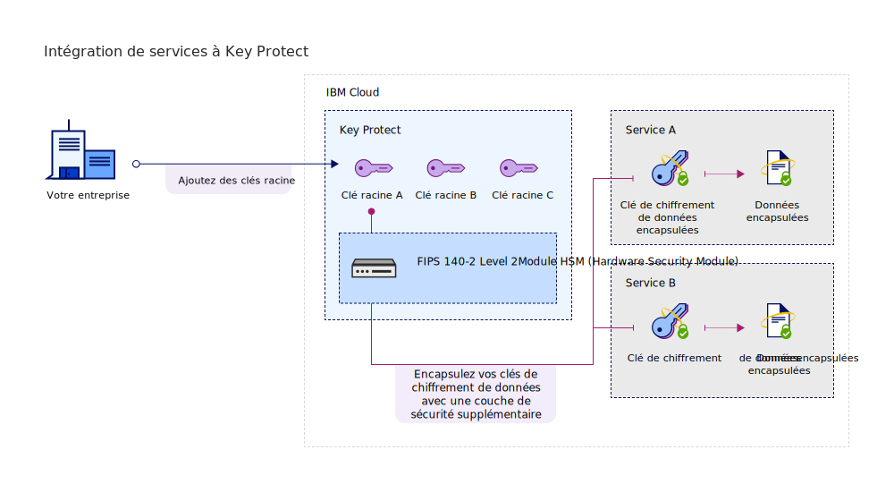

---

copyright:
  years: 2017, 2019
lastupdated: "2019-04-03"

keywords: Key Protect integration, integrate service with Key Protect

subcollection: key-protect

---

{:shortdesc: .shortdesc}
{:codeblock: .codeblock}
{:screen: .screen}
{:new_window: target="_blank"}
{:pre: .pre}
{:tip: .tip}
{:note: .note}
{:important: .important}

# Intégration de services
{: #integrate-services}

{{site.data.keyword.keymanagementservicefull}} s'intègre aux solutions de données et de stockage pour vous aider à apporter et gérer votre propre chiffrement dans le cloud.
{: shortdesc}

[Après avoir créé une instance du service](/docs/services/key-protect?topic=key-protect-provision), vous pouvez intégrer {{site.data.keyword.keymanagementserviceshort}} aux services pris en charge suivants :

<table>
    <tr>
        <th>Maintenance</th>
        <th>Description</th>
    </tr>
    <tr>
        <td>
          
{{site.data.keyword.cos_full_notm}}

        </td>
        <td>
          
Ajoutez le [chiffrement d'enveloppe](/docs/services/key-protect?topic=key-protect-envelope-encryption) à vos compartiments de stockage à l'aide de {{site.data.keyword.keymanagementserviceshort}}. Utilisez les clés racine que vous gérez dans {{site.data.keyword.keymanagementserviceshort}} pour protéger les clés de chiffrement de données qui chiffrent vos données au repos. Pour en savoir plus, consultez la section [Intégration à {{site.data.keyword.cos_full_notm}}](/docs/services/key-protect?topic=key-protect-integrate-cos).

        </td>
    </tr>
    <tr>
        <td>
          
{{site.data.keyword.containerlong_notm}}

        </td>
        <td>
          
Utilisez le [chiffrement d'enveloppe](/docs/services/key-protect?topic=key-protect-envelope-encryption) pour protéger des valeurs confidentielles dans votre cluster {{site.data.keyword.containershort_notm}}. Pour en savoir plus, consultez la section [Chiffrement des secrets Kubernetes à l'aide de {{site.data.keyword.keymanagementserviceshort}}](/docs/containers?topic=containers-encryption#keyprotect).

        </td>
    </tr>
    <tr>
        <td>
          
{{site.data.keyword.databases-for-postgresql_full_notm}}

        </td>
        <td>
          
Protégez vos bases de données en associant des clés racine à votre déploiement {{site.data.keyword.databases-for-postgresql}}. Pour en savoir plus, consultez la [documentation de {{site.data.keyword.databases-for-postgresql}}](/docs/services/databases-for-postgresql?topic=databases-for-postgresql-key-protect).

        </td>
    </tr>
      <tr>
        <td>
          
{{site.data.keyword.cloudant_short_notm}} pour {{site.data.keyword.cloud_notm}} ({{site.data.keyword.cloud_notm}} dédié)

        </td>
        <td>
          
Renforcez votre stratégie de chiffrement au repos en associant des clés racine à votre instance {{site.data.keyword.cloudant_short_notm}} Dedicated Hardware. Pour en savoir plus, consultez la [documentation de {{site.data.keyword.cloudant_short_notm}}](/docs/services/Cloudant/offerings?topic=cloudant-security#secure-access-control).

        </td>
    </tr>
   <caption style="caption-side:bottom;">Tableau 1. Description des intégrations qui sont disponibles pour {{site.data.keyword.keymanagementserviceshort}}</caption>
</table>

## Compréhension de votre intégration 
{: #understand-integration}

Lorsque vous intégrez un service pris en charge à {{site.data.keyword.keymanagementserviceshort}}, vous activez le [chiffrement d'enveloppe](/docs/services/key-protect?topic=key-protect-envelope-encryption) pour ce service. Cette intégration vous permet d'utiliser une clé racine que vous stockez dans {{site.data.keyword.keymanagementserviceshort}} pour encapsuler les clés de chiffrement de données qui chiffrent vos données au repos. 

Par exemple, vous pouvez créer une clé racine, gérer la clé dans {{site.data.keyword.keymanagementserviceshort}} et utiliser la clé racine pour protéger les données qui sont stockées dans différents services cloud.

### Méthodes de l'API {{site.data.keyword.keymanagementserviceshort}}
{: #envelope-encryption-api-methods}

En arrière-plan, l'API {{site.data.keyword.keymanagementserviceshort}} exécute la procédure de chiffrement d'enveloppe.  

Le tableau suivant répertorie les méthodes de l'API qui ajoutent ou retirent le chiffrement d'enveloppe sur une ressource :

<table>
  <tr>
    <th>Méthode</th>
    <th>Description</th>
  </tr>
  <tr>
    <td><code>POST /keys/{root_key_ID}?action=wrap</code></td>
    <td><a href="/docs/services/key-protect?topic=key-protect-wrap-keys">Encapsule (chiffre) une clé de chiffrement de données</a></td>
  </tr>
  <tr>
    <td><code>POST /keys/{root_key_ID}?action=unwrap</code></td>
    <td><a href="/docs/services/key-protect?topic=key-protect-unwrap-keys">Désencapsule (déchiffre) une clé de chiffrement de données</a></td>
  </tr>
  <caption style="caption-side:bottom;">Tableau 2. Description des méthodes de l'API {{site.data.keyword.keymanagementserviceshort}}</caption>
</table>

Pour plus d'informations sur la gestion de vos clés à l'aide d'un programme dans {{site.data.keyword.keymanagementserviceshort}}, voir la [documentation de référence de l'API {{site.data.keyword.keymanagementserviceshort}} ](https://{DomainName}/apidocs/key-protect){: new_window}.
{: tip}

## Intégration d'un service pris en charge
{: #grant-access}

Pour ajouter une intégration, créez une autorisation entre les services à l'aide du tableau de bord {{site.data.keyword.iamlong}}. Les autorisations activent des règles d'accès de service à service pour vous permettre d'associer une ressource de votre service de données de cloud à une [clé racine](/docs/services/key-protect?topic=key-protect-envelope-encryption#key-types) que vous gérez dans {{site.data.keyword.keymanagementserviceshort}}.

Prenez soin de mettre à disposition les deux services dans la même région avant de créer une autorisation. Pour en savoir plus sur les autorisations de service, voir [Octroi de droits d'accès entre les services ](/docs/iam?topic=iam-serviceauth){: new_window}.
{: note}

Lorsque vous êtes prêt à intégrer un service, procédez comme suit pour créer une autorisation :

1. Dans la barre de menu, cliquez sur **Gérer** &gt; **Sécurité** &gt; **Accès (IAM)**, puis sélectionnez **Autorisations**. 
2. Cliquez sur **Créer**.
3. Sélectionnez un service source et cible pour l'autorisation.
 
  Pour **Service source**, sélectionnez le service de données de cloud que vous souhaitez intégrer à {{site.data.keyword.keymanagementserviceshort}}. Pour **Service cible**, sélectionnez **{{site.data.keyword.keymanagementservicelong_notm}}**.

5. Activez le rôle **Lecteur**.

    Avec les droits _Lecteur_, votre service source peut parcourir les clés racine mises à disposition dans l'instance {{site.data.keyword.keymanagementserviceshort}} indiquée.

6. Cliquez sur **Autoriser**.

## Etapes suivantes
{: #integration-next-steps}

Ajoutez un chiffrement avancé à vos ressources de cloud en créant une clé racine dans {{site.data.keyword.keymanagementserviceshort}}. Ajoutez une nouvelle ressource à un service de données de cloud pris en charge, puis sélectionnez la clé racine que vous souhaitez utiliser pour le chiffrement avancé.

- Pour en savoir plus sur la création de clés racine avec le service {{site.data.keyword.keymanagementserviceshort}}, voir [Création de clés racine](/docs/services/key-protect?topic=key-protect-create-root-keys).
- Pour en savoir plus sur l'apport de vos propres clés racine au service {{site.data.keyword.keymanagementserviceshort}}, voir [Importation de clés racine](/docs/services/key-protect?topic=key-protect-import-root-keys).

