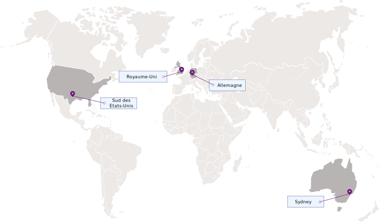

---

copyright:
  years: 2017, 2018
lastupdated: "2018-06-07"

---

{:shortdesc: .shortdesc}
{:codeblock: .codeblock}
{:screen: .screen}
{:new_window: target="_blank"}
{:pre: .pre}
{:tip: .tip}

# Régions et emplacements
{: #regions-and-locations}

Vous pouvez connecter vos applications au service {{site.data.keyword.keymanagementservicelong_notm}} en indiquant un noeud final de service régional.
{: shortdesc}

## Régions disponibles
{: #regions}

{{site.data.keyword.keymanagementserviceshort}} est disponible dans les régions et emplacements suivants :

## Noeuds finaux de service
{: #endpoints}

Si vous gérez vos ressources {{site.data.keyword.keymanagementserviceshort}} via un programme, reportez-vous au tableau suivant pour déterminer les noeuds finaux d'API à utiliser lorsque vous vous connectez à l'[API {{site.data.keyword.keymanagementserviceshort}}](https://console.bluemix.net/apidocs/639) : 

<table>
    <tr>
        <th>Nom de région</th>
        <th>Emplacement géographique</th>
        <th>Noeud final d'API de service</th>
    </tr>
    <tr>
        <td>Allemagne</td>
        <td>Francfort, Allemagne</td>
        <td>
            <code>keyprotect.eu-de.bluemix.net</code>
        </td>
    </tr>
    <tr>
        <td>Sydney</td>
        <td>Sydney, Australie</td>
        <td>
            <code>keyprotect.au-syd.bluemix.net</code>
        </td>
    </tr>
    <tr>
        <td>Royaume-Uni</td>
        <td>Londres, Angleterre</td>
        <td>
            <code>keyprotect.eu-gb.bluemix.net</code>
        </td>
    </tr>
    <tr>
        <td>Sud des Etats-Unis</td>
        <td>Dallas, Etats-Unis</td>
        <td>
            <code>keyprotect.us-south.bluemix.net</code>
        </td>
    </tr>
    <caption style="caption-side:bottom;">Tableau 1. Noeuds finaux disponibles pour l'API {{site.data.keyword.keymanagementserviceshort}}</caption>
</table>

Pour les instances de service {{site.data.keyword.keymanagementserviceshort}} existant dans une organisation ou un espace Cloud Foundry, utilisez le noeud final  `https://ibm-key-protect.edge.bluemix.net` existant pour interagir avec l'API {{site.data.keyword.keymanagementserviceshort}}.
{: tip}

Pour plus d'informations sur l'authentification auprès de {{site.data.keyword.keymanagementserviceshort}}, voir la rubrique [Accès à l'API](/docs/services/keymgmt/keyprotect_authentication.html).
