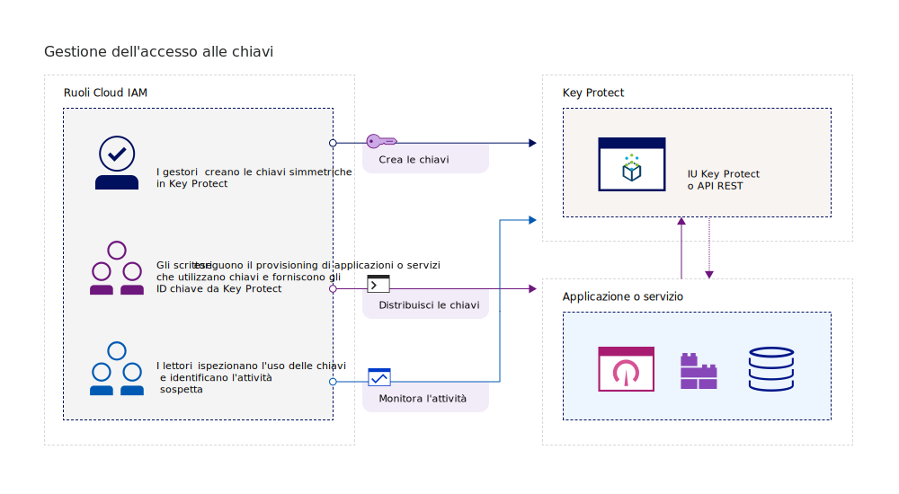
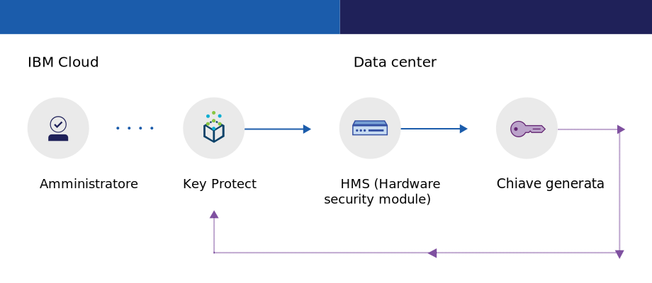
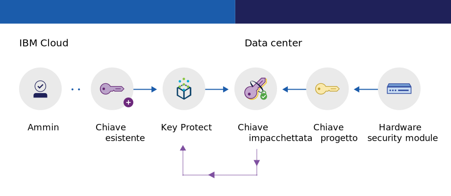

---

copyright:
  years: 2017, 2019
lastupdated: "2019-04-03"

keywords: key management service, KMS, about Key Protect, about KMS, Key Protect use cases, KMS use cases

subcollection: key-protect

---

{:shortdesc: .shortdesc}
{:codeblock: .codeblock}
{:screen: .screen}
{:new_window: target="_blank"}
{:pre: .pre}
{:tip: .tip}
{:note: .note}
{:important: .important}

# Informazioni su {{site.data.keyword.keymanagementserviceshort}}
{: #about}

{{site.data.keyword.keymanagementservicefull}} ti aiuta ad eseguire il provisioning di chiavi crittografate per le applicazioni nei servizi {{site.data.keyword.cloud_notm}}. Mentre gestisci il ciclo di vita delle tue chiavi, puoi ottenere dei benefici sapendo che le tue chiavi sono protette dagli HSM (Hardware Security Module) basati sul cloud certificati FIPS 140-2 Level 2 che proteggono dal furto di informazioni.
{: shortdesc}

## Motivi per usare {{site.data.keyword.keymanagementserviceshort}}
{: #use-cases}

Potresti aver bisogno di gestire le chiavi nei seguenti scenari:

| Scenari | Motivi|
| --- | ---- |
| Come amministratore IT per una grande azienda, hai bisogno di integrare, tracciare e ruotare le chiavi di crittografia per molte offerte di servizio differenti. | L'interfaccia {{site.data.keyword.keymanagementserviceshort}}
semplifica la gestione di più servizi di codifica. Con il servizio, puoi gestire e ordinare le chiavi di crittografia in un'ubicazione centralizzata o puoi separarle per progetto e posizionarle in spazi {{site.data.keyword.cloud_notm}} differenti. |
| Come sviluppatore, vuoi integrare le tue applicazioni pre-esistenti, come l'archiviazione con crittografia automatica, in {{site.data.keyword.keymanagementserviceshort}}. | La applicazioni in o al di fuori di {{site.data.keyword.cloud_notm}} possono
essere integrate con le API {{site.data.keyword.keymanagementserviceshort}}. Puoi utilizzare le tue chiavi esistenti per le tue applicazioni. |
| Il tuo team di sviluppo ha politiche rigorose e hai bisogno di un modo per generare e ruotare le chiavi ogni 30 giorni. | Con {{site.data.keyword.keymanagementserviceshort}}, puoi generare le chiavi rapidamente da un HSM (hardware security module) {{site.data.keyword.cloud_notm}}. Quando è il momento di sostituire una chiave, puoi [ruotare la chiave su richiesta](/docs/services/key-protect?topic=key-protect-rotate-keys) oppure [impostare una politica di rotazione](/docs/services/key-protect?topic=key-protect-set-rotation-policy) per la chiave per soddisfare le tue esigenze di sicurezza continuativa. |
| Sei un amministratore della sicurezza di una azienda, come un leader finanziario o un avvocato, che deve
rispettare la governance su come vengono protetti i dati. Devi concedere l'accesso controllato alle chiavi
senza compromettere la sicurezza dei dati. | Con il servizio, puoi controllare l'accesso utente per gestire le chiavi
[assegnando ruoli di gestione dell'accesso e dell'identità differenti](/docs/services/key-protect?topic=key-protect-manage-access#roles). Ad esempio,
puoi concedere l'accesso in sola lettura agli utenti che necessitano di visualizzare le informazioni sulla creazione delle chiavi senza
visualizzare il materiale della chiave. |
| Vuoi eseguire la crittografia envelope poiché sposti i dati nel cloud. Hai bisogno di utilizzare le tue chiavi di crittografia master in modo da poter gestire e proteggere le altre chiavi che codificano i tuoi dati inattivi. | Con {{site.data.keyword.keymanagementserviceshort}}, puoi [impacchettare (crittografare) le tue chiavi di crittografia dei dati con una chiave root altamente sicura](/docs/services/key-protect?topic=key-protect-envelope-encryption). Puoi portare le tue proprie chiavi root o crearle nel servizio.|

Stai cercando una soluzione di gestione delle chiavi dedicata che supporta gli HSM (hardware security module) basati sul cloud e controllati dal cliente? [{{site.data.keyword.cloud_notm}} {{site.data.keyword.hscrypto}}](/docs/services/hs-crypto?topic=hs-crypto-get-started) si integra con {{site.data.keyword.keymanagementserviceshort}} per abilitare KYOK (Keep Your Own Keys) per {{site.data.keyword.cloud_notm}}, in modo che la tua organizzazione abbia maggiore controllo e autorità sui propri dati. Per ulteriori informazioni, vedi la [pagina dei dettagli dell'offerta {{site.data.keyword.hscrypto}} ](https://{DomainName}/catalog/services/hyper-protect-crypto-services).
{: tip}

## Come funziona {{site.data.keyword.keymanagementserviceshort}}
{: #kp-how}

{{site.data.keyword.keymanagementservicelong_notm}} ti aiuta nella gestione delle chiavi di crittografia nella tua organizzazione eseguendo l'allineamento con i ruoli di gestione dell'accesso e dell'identità
{{site.data.keyword.cloud_notm}}.

Un amministratore della sicurezza o IT
necessita di autorizzazioni avanzate rispetto a un revisore. Per semplificare l'accesso, {{site.data.keyword.keymanagementserviceshort}}
mappa i ruoli di gestione dell'accesso e dell'identità {{site.data.keyword.cloud_notm}} in modo che ogni ruolo abbia una visualizzazione diversa
del servizio. Per agevolare l'orientamento alla visualizzazione e al livello di accesso che meglio rispondono alle tue esigenze, vedi [Gestione di utenti e accesso](/docs/services/key-protect?topic=key-protect-manage-access#roles).

Il seguente diagramma mostra come i gestori, i lettori e gli scrittori possono interagire con le chiavi gestite nel servizio.

<dl>
  <dt>Integrazione dei servizi</dt>
    <dd>I gestori della tua istanza del servizio {{site.data.keyword.keymanagementserviceshort}}
gestiscono le chiavi per la codifica.</dd>
  <dt>Revisioni</dt>
    <dd>I lettori accedono a una vista di alto livello delle chiavi e identificano le attività sospette.</dd>
  <dt>Applicazioni</dt>
    <dd>Gli scrittori gestiscono le chiavi per la crittografia che codificano nelle applicazioni.</dd>
</dl>

## Architettura {{site.data.keyword.keymanagementserviceshort}}
{: #kp_architecture}

{{site.data.keyword.keymanagementservicelong_notm}} si articola
in tecnologie accettate dal settore.

<dl>
  <dt>Server {{site.data.keyword.cloud_notm}}</dt>
    <dd>Identità, progetti e i loro token dal server {{site.data.keyword.cloud_notm}} che abilitano il servizio
{{site.data.keyword.keymanagementserviceshort}} ad associare le risorse alle chiavi.</dd>
  <dt>API per {{site.data.keyword.keymanagementserviceshort}}</dt>
    <dd>L'API REST {{site.data.keyword.keymanagementserviceshort}}
ti guida nella creazione e gestione della chiave. Il servizio fornisce una tenancy multipla crittografata..</dd>
  <dt>Interfaccia utente in {{site.data.keyword.cloud_notm}}</dt>
    <dd>Con l'interfaccia utente (IU) {{site.data.keyword.keymanagementserviceshort}},
puoi lavorare con le tue chiavi in modo sicuro.</dd>
  <dt>HSM (Hardware Security Module)</dt>
    <dd>Dietro le quinte, i data center {{site.data.keyword.cloud_notm}} forniscono l'hardware per proteggere le tue chiavi.</dd>
  <dt>Cluster database</dt>
    <dd>Puoi contare su un'archiviazione ridondante e sicura delle tue chiavi con un database in cluster.</dd>
</dl>

I seguenti diagrammi mostrano come {{site.data.keyword.keymanagementserviceshort}}
utilizza gli HSM (Hardware Security Module) per generare le chiavi in confronto a come il servizio archivia le chiavi.

