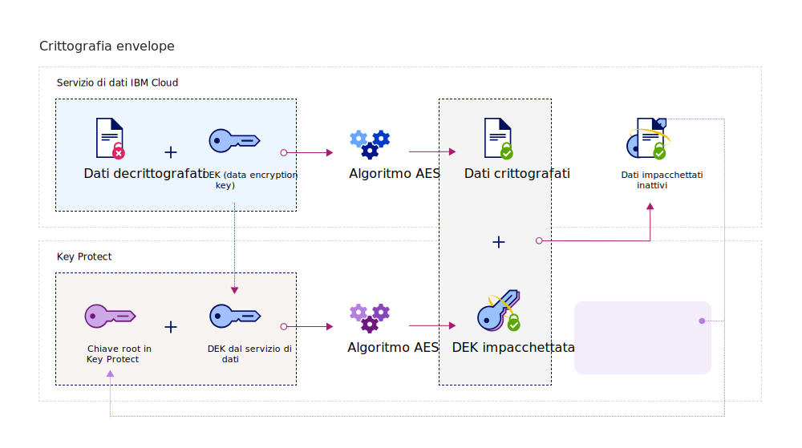
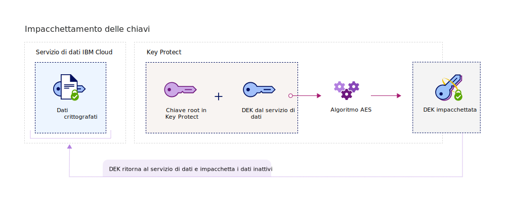

---

copyright:
  years: 2017, 2018
lastupdated: "2018-08-24"

---

{:shortdesc: .shortdesc}
{:codeblock: .codeblock}
{:screen: .screen}
{:new_window: target="_blank"}
{:pre: .pre}
{:tip: .tip}

# Crittografia envelope
{: #envelope-encryption}

La crittografia envelope è la pratica di codificare i dati con una chiave di crittografia dei dati (DEK) e poi codificare la DEK con una chiave root che puoi completamente gestire. 
{: shortdesc}

{{site.data.keyword.keymanagementservicefull}} protegge i tuoi dati archiviati con la codifica avanzata e offre diversi vantaggi:

<table>
  <th>Vantaggio</th>
  <th>Descrizione</th>
  <tr>
    <td>Chiavi di crittografia gestite dal cliente</td>
    <td>Con il servizio, puoi fornire le chiavi di crittografia per proteggere la sicurezza dei tuoi dati codificati nel cloud. Le chiavi root sono utilizzate come chiavi master di impacchettamento della chiave, che ti aiutano a gestire e proteggere le chiavi di crittografia dei dati (DEK) fornite nei servizi di dati {{site.data.keyword.cloud_notm}}. Decidi se importare le tue chiavi root esistenti o che {{site.data.keyword.keymanagementserviceshort}} le generi al tuo posto.</td>
  </tr>
  <tr>
    <td>Protezione integrità e riservatezza</td>
    <td>{{site.data.keyword.keymanagementserviceshort}} utilizza l'algoritmo AES (Advanced Encryption Standard) in GCM (Galois/Counter Mode) per creare e proteggere le chiavi. Quando crei le chiavi nel servizio, {{site.data.keyword.keymanagementserviceshort}} le genera in un limite di trust di HSM (hardware security module) {{site.data.keyword.cloud_notm}}, quindi solo tu hai accesso alle tue chiavi di crittografia.</td>
  </tr>
  <tr>
    <td>Distruzione crittografica dei dati</td>
    <td>Se la tua organizzazione rileva un problema di sicurezza o la tua applicazione non ha più bisogno di una serie di dati, puoi scegliere di distruggere i dati in modo permanente dal cloud. Quando elimini una chiave root che protegge altre DEK, ti assicuri che i dati associati alle chiavi non siano più accessibili o decodificabili.</td>
  </tr>
  <tr>
    <td>Controllo dell'accesso utente delegato</td>
    <td>{{site.data.keyword.keymanagementserviceshort}} supporta un sistema di controllo dell'accesso centralizzato per abilitare l'accesso granulare alle tue chiavi. [Assegnando i ruoli utente IAM e le autorizzazioni avanzate](/docs/services/key-protect/manage-access.html#roles), gli amministratori della sicurezza possono decidere chi può accedere a quali chiavi root nel servizio.</td>
  </tr>
  <caption style="caption-side:bottom;">Tabella 1. Descrive i vantaggi della codifica gestita dal cliente</caption>
</table>

## Come funziona
{: #overview}

La crittografia envelope combina la forza di più algoritmi di codifica per proteggere i tuoi dati sensibili nel cloud. Funziona impacchettando una o più chiavi di crittografia dei dati (DEK) con la codifica avanzata utilizzando una chiave root che puoi completamente gestire. Questo processo di impacchettamento della chiave crea DEK impacchettate che proteggono i tuoi dati archiviati dall'esposizione o dall'accesso non autorizzato. Annullare l'impacchettamento di una chiave inverte il processo di crittografia envelope utilizzando la stessa chiave root, lasciando i dati non autenticati e decrittografati.
 
Il seguente diagramma mostra una vista contestuale della funzionalità di impacchettamento della chiave.

La crittografia envelope è trattata brevemente in NIST Special Publication 800-57, Recommendation for Key Management. Per ulteriori informazioni, consulta [NIST SP 800-57 Pt. 1 Rev. 4. ](http://nvlpubs.nist.gov/nistpubs/SpecialPublications/NIST.SP.800-57pt1r4.pdf){: new_window}

## Tipi di chiave
{: #key-types}

Il servizio supporta due tipi di chiavi, le chiavi root e le chiavi standard, per la crittografia avanzata e la gestione dei dati.

<dl>
  <dt>Chiavi root</dt>
    <dd>Le chiavi root sono le risorse principali in {{site.data.keyword.keymanagementserviceshort}}. Sono le chiavi di impacchettamento della chiave simmetriche utilizzate come radice di attendibilità per l'impacchettamento (crittografia) e lo spacchettamento (decrittografia) di altre chiavi archiviate in un servizio di dati. Con {{site.data.keyword.keymanagementserviceshort}}, puoi creare, memorizzare e gestire il ciclo di vita delle chiavi root per ottenere il controllo completo di altre chiavi archiviate nel cloud. A differenza di una chiave standard, una chiave root non può mai lasciare i confini del servizio {{site.data.keyword.keymanagementserviceshort}}.</dd>
  <dt>Chiavi standard</dt>
    <dd>Le chiavi standard sono le chiavi di codifica utilizzate per la crittografia. Generalmente, le chiavi standard codificano direttamente i dati. Con {{site.data.keyword.keymanagementserviceshort}}, puoi creare, memorizzare e gestire il ciclo di vita delle chiavi standard. Dopo aver importato o generato una chiave standard nel servizio, puoi esportarla in una risorsa di dati esterna, come un bucket di archiviazione, per codificare le informazioni sensibili. Le chiavi standard che codificano i dati archiviati sono chiamate chiavi di crittografia dei dati (DEK), che possono essere impacchettate con la crittografia avanzata. Le DEK impacchettate sono archiviate in {{site.data.keyword.keymanagementserviceshort}}.</dd>
</dl>

Dopo aver creato le chiavi in {{site.data.keyword.keymanagementserviceshort}}, il sistema restituisce un valore ID che puoi utilizzare per effettuare le chiamate API al servizio. Puoi richiamare il valore ID delle tue chiavi con la GUI {{site.data.keyword.keymanagementserviceshort}} o l'API [{{site.data.keyword.keymanagementserviceshort}}](https://console.bluemix.net/apidocs/kms). 

## Impacchettamento delle chiavi
{: #wrapping}

Le chiavi root ti aiutano a raggruppare, gestire e proteggere le chiavi di crittografia dei dati (DEK) archiviate cloud. Puoi impacchettare una o più DEK con la crittografia avanzata designando una chiave root in {{site.data.keyword.keymanagementserviceshort}} che puoi gestire completamente. 

Dopo aver designato una chiave root in {{site.data.keyword.keymanagementserviceshort}}, puoi inviare una richiesta di impacchettamento della chiave al servizio utilizzando l'API {{site.data.keyword.keymanagementserviceshort}}. L'operazione di impacchettamento della chiave fornisce la protezione di integrità e riservatezza per una DEK. Il seguente diagramma mostra il processo di impacchettamento della chiave in azione:

La seguente tabella descrive gli input necessari per eseguire un'operazione di impacchettamento della chiave:
<table>
  <th>Input</th>
  <th>Descrizione</th>
  <tr>
    <td>ID chiave root</td>
    <td>Il valore ID della chiave root che vuoi utilizzare per l'impacchettamento. La chiave root può essere importata nel servizio oppure può essere originata in {{site.data.keyword.keymanagementserviceshort}} dai propri HSM. Le chiavi root utilizzate per l'impacchettamento devono essere di 256, 384 o 512 bit in modo che una richiesta di impacchettamento possa avere esito positivo.</td>
  </tr>
  <tr>
    <td>Testo non crittografato</td>
    <td>Facoltativo: il materiale della chiave della DEK che contiene i dati che vuoi gestire e proteggere. Un testo non crittografato che viene utilizzato per l'impacchettamento della chiave che deve essere codificato con base64. Per generare una DEK a 256-bit, puoi omettere l'attributo `plaintext`. Il servizio genera una DEK codificata con base64 da utilizzare per l'impacchettamento della chiave.</td>
  </tr>
  <tr>
    <td>Ulteriori dati di autenticazione (AAD)</td>
    <td>Facoltativo: un array di stringhe che controlla l'integrità dei contenuti della chiave. Ogni stringa può contenere fino a 255 caratteri. Se fornisci AAD durante una richiesta di impacchettamento, devi specificare lo stesso AAD durante la richiesta di spacchettamento successiva.</td>
  </tr>
    <caption style="caption-side:bottom;">Tabella 2. Input richiesto per l'impacchettamento della chiave in {{site.data.keyword.keymanagementserviceshort}}</caption>
</table>

Se invii una richiesta di impacchettamento senza specificare il testo non crittografato da codificare, l'algoritmo di codifica AES-GCM genera e converte un testo non crittografato in una forma incomprensibile di dati chiamato testo cifrato. Questo processo fornisce una DEK a 256-bit con il nuovo materiale della chiave. Il sistema quindi utilizza l'algoritmo di impacchettamento della chiave AES, che impacchetta la DEK e il relativo materiale della chiave con la chiave root specificata. Un'operazione di impacchettamento corretta restituisce una DEK impacchettata codificata con base64 che puoi archiviare in un servizio o un'applicazione {{site.data.keyword.cloud_notm}}. 

## Spacchettamento delle chiavi
{: #unwrapping}

Lo spacchettamento di una chiave di crittografia dei dati (DEK) decodifica e autentica il contenuto nella chiave, restituendo il materiale della chiave originale al tuo servizio di dati. 

Se la tua applicazione di business deve accedere ai contenuti delle tue DEK impacchettate, puoi utilizzare l'API {{site.data.keyword.keymanagementserviceshort}} per inviare una richiesta di spacchettamento al servizio. Per spacchettare una DEK, specifica il valore ID della chiave root e il valore `ciphertext` restituito durante la richiesta di impacchettamento iniziale. Per completare la richiesta di spacchettamento, devi inoltre fornire ulteriori dati autenticati (AAD) per controllare l'integrità dei contenuti della chiave.

Il seguente diagramma mostra lo spacchettamento della chiave in azione.

Dopo aver inviato la richiesta di spacchettamento, il sistema inverte il processo di impacchettamento della chiave utilizzando gli stessi algoritmi AES. Un'operazione di spacchettamento corretta restituisce il valore `plaintext` codificato con base64 al servizio di dati inattivi {{site.data.keyword.cloud_notm}}.

