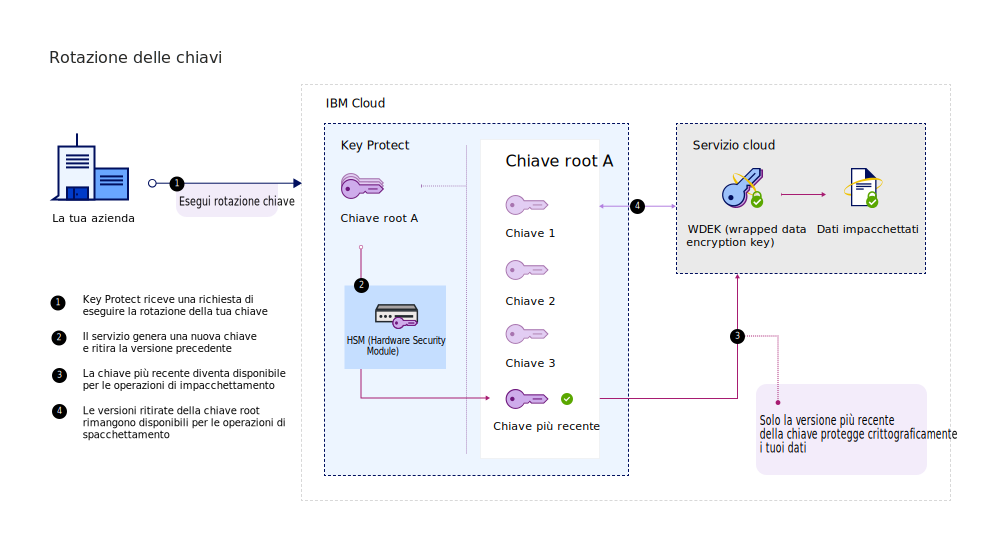
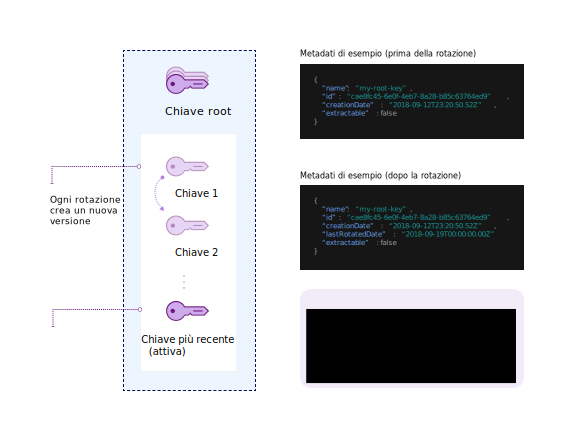

---

copyright:
  years: 2017, 2019
lastupdated: "2019-07-09"

keywords: rotate encryption keys, rotate keys automatically, key rotation

subcollection: key-protect

---

{:shortdesc: .shortdesc}
{:screen: .screen}
{:pre: .pre}
{:table: .aria-labeledby="caption"}
{:external: target="_blank" .external}
{:codeblock: .codeblock}
{:tip: .tip}
{:note: .note}
{:important: .important}

# Rotazione delle chiavi di crittografia
{: #key-rotation}

La rotazione delle chiavi ha luogo quando ritiri il materiale della chiave originale di una chiave root e lo sostituisci generando del nuovo materiale della chiave crittografico.

Eseguire la rotazione delle chiavi su base regolare aiuta a soddisfare gli standard del settore e le prassi ottimali crittografiche. La seguente tabella descrive i vantaggi principali della rotazione delle chiavi:

| Vantaggio | Descrizione |
| --- | --- |
| Gestione del periodo di crittografia per le chiavi | La rotazione della chiave limita per quanto tempo le tue informazioni vengono protette da una singola chiave. Eseguendo la rotazione delle tue chiavi root a intervalli regolari, puoi anche abbreviare il periodo di crittografia delle chiavi. Più lunga è la durata di una chiave di crittografia e più elevata è la probabilità di una violazione della sicurezza. |
| Mitigazione degli incidenti | Se la tua organizzazione rileva un problema di sicurezza, puoi eseguire immediatamente la rotazione della chiave per attenuare o ridurre i costi associati alla compromissione di una chiave. |
{: caption="Tabella 1. Descrive i vantaggi della rotazione delle chiavi" caption-side="top"}

La rotazione delle chiavi è trattata in NIST Special Publication 800-57, Recommendation for Key Management. Per ulteriori informazioni, consulta [NIST SP 800-57 Pt. 1 Rev. 4.](https://www.nist.gov/publications/recommendation-key-management-part-1-general-0){: external}
{: tip}

## Confronto delle tue opzioni di rotazione della chiave in {{site.data.keyword.keymanagementserviceshort}}
{: #compare-key-rotation-options}

In {{site.data.keyword.keymanagementserviceshort}}, puoi [configurare una politica di rotazione per una chiave](/docs/services/key-protect?topic=key-protect-set-rotation-policy) o [ruotare la chiave su richiesta](/docs/services/key-protect?topic=key-protect-rotate-keys), senza dover tenere traccia del tuo materiale della chiave root ritirato. 

Le opzioni di rotazione sono disponibili solo per le chiavi root.
{: note}

<dl>
  <dt>Configurazione di una politica di rotazione per una chiave</dt>
    <dd>{{site.data.keyword.keymanagementserviceshort}} ti aiuta a semplificare la rotazione per le chiavi di crittografia abilitando le politiche di rotazione per le chiavi che generi nel servizio. Dopo aver creato una chiave root, puoi gestire una politica di rotazione per la chiave nella GUI {{site.data.keyword.keymanagementserviceshort}} o con l'API. <a href="/docs/services/key-protect?topic=key-protect-key-rotation#rotation-frequency">Scegli un intervallo di rotazione automatico compreso tra 1 e 12 mesi per la tua chiave</a> in base alle tue esigenze di sicurezza continuativa. Quando è il momento di ruotare la chiave in base all'intervallo di rotazione che hai specificato, {{site.data.keyword.keymanagementserviceshort}} sostituisce automaticamente la chiave con il nuovo materiale della chiave.</dd>
  <dt>Rotazione delle chiavi su richiesta</dt>
    <dd>Come amministratore della sicurezza, potresti voler avere maggiore controllo sulla frequenza di rotazione delle tue chiavi. Se non vuoi impostare una politica di rotazione automatica per una chiave, puoi creare manualmente una nuova chiave per sostituirne una esistente e poi aggiornare le tue applicazioni in modo che facciano riferimento alla nuova chiave. Per semplificare questo processo, puoi utilizzare {{site.data.keyword.keymanagementserviceshort}} per ruotare la chiave su richiesta. In questo scenario, {{site.data.keyword.keymanagementserviceshort}} crea e sostituisce la chiave al tuo posto con ogni richiesta di rotazione. La chiave conserva gli stessi metadati e ID della chiave.</dd>
</dl>

## Come funziona la rotazione delle chiavi 
{: #how-key-rotation-works}

La rotazione delle chiavi funziona mediante il passaggio, in modo protetto, del materiale della chiave da uno stato della chiave di _Attiva_ a uno stato di _Disattivata_. Per sostituire il materiale della chiave ritirato o disattivato, il nuovo materiale della chiave passa allo stato di _Attiva_ e diventa disponibile per le operazioni crittografiche.

### Utilizzo di {{site.data.keyword.keymanagementserviceshort}} per ruotare le chiavi
{: #use-key-protect-rotate-keys}

Tieni presenti le seguenti considerazioni quando ti prepari ad utilizzare {{site.data.keyword.keymanagementserviceshort}} per ruotare le chiavi root.

<dl>
  <dt>Rotazione delle chiavi root generate in {{site.data.keyword.keymanagementserviceshort}}</dt>
    <dd>Puoi utilizzare {{site.data.keyword.keymanagementserviceshort}} per ruotare una chiave root generata in {{site.data.keyword.keymanagementserviceshort}} configurando una politica di rotazione per la chiave o ruotando la chiave su richiesta. I metadati per la chiave root, come il relativo ID della chiave, non cambiano quando ruoti la chiave.</dd>
  <dt>Rotazione delle chiavi root che porti nel servizio</dt>
    <dd>Per ruotare una chiave root che hai inizialmente importato nel servizio, devi generare e fornire del nuovo materiale della chiave per la chiave. Puoi utilizzare {{site.data.keyword.keymanagementserviceshort}} per ruotare le chiavi root importate su richiesta fornendo il nuovo materiale della chiave come parte della richiesta di rotazione. I metadati per la chiave root, come il relativo ID della chiave, non cambiano quando ruoti la chiave. Poiché devi fornire il nuovo materiale della chiave per ruotare una chiave importata, non sono disponibili delle politiche di rotazione automatica per le chiavi root che hanno importato il materiale della chiave.</dd>
  <dt>Gestione del materiale della chiave ritirato</dt>
    <dd>{{site.data.keyword.keymanagementserviceshort}} crea del nuovo materiale della chiave dopo che hai ruotato una chiave root. Il servizio ritira il vecchio materiale della chiave e conserva le versioni ritirate finché la chiave root non viene eliminata. Quando utilizzi la chiave root per la crittografia envelope, {{site.data.keyword.keymanagementserviceshort}} utilizza solo il materiale più recente associato alla chiave. Il materiale della chiave ritirato non può essere più utilizzato per proteggere le chiavi, ma rimane disponibile per le operazioni di spacchettamento. Se {{site.data.keyword.keymanagementserviceshort}} rileva che stai utilizzando del materiale della chiave ritirato per spacchettare le DEK, il servizio fornisce una DEK appena impacchettata basata sul materiale della chiave root più recente.</dd>
 <dt>Abilitazione della rotazione della chiave per i servizi di dati {{site.data.keyword.cloud_notm}}</dt>
    <dd>Per abilitare queste opzioni di rotazione della chiave per il tuo servizio di dati su {{site.data.keyword.cloud_notm}}, il servizio di dati deve essere integrato con {{site.data.keyword.keymanagementserviceshort}}. Fai riferimento alla documentazione per il tuo servizio di dati {{site.data.keyword.cloud_notm}} o <a href="/docs/services/key-protect?topic=key-protect-integrate-services">vedi il nostro elenco di servizi integrati per ulteriori informazioni</a>.</dd>
</dl>

Quando esegui la rotazione di una chiave in {{site.data.keyword.keymanagementserviceshort}}, non ci sono ulteriori addebiti a tuo carico. Puoi continuare a spacchettare le tue WDEK (wrapped data encryption key) con il materiale della chiave ritirato senza alcun costo supplementare. Per ulteriori informazioni sulle nostre opzioni di prezzo, consulta la [pagina del catalogo {{site.data.keyword.keymanagementserviceshort}}](https://{DomainName}/catalog/services/key-protect).
{: tip}

### Descrizione del processo di rotazione della chiave
{: #understand-key-rotation-process}

Dietro le quinte, l'API {{site.data.keyword.keymanagementserviceshort}} guida il processo di rotazione della chiave.  

Il seguente diagramma mostra una vista contestuale della funzionalità di rotazione delle chiavi.

Con ciascuna richiesta di rotazione, {{site.data.keyword.keymanagementserviceshort}} associa il nuovo materiale della chiave alla tua chiave root. 

Per ulteriori informazioni su come utilizzare l'API {{site.data.keyword.keymanagementserviceshort}} per eseguire la rotazione delle tue chiavi root, vedi [Rotazione delle chiavi](/docs/services/key-protect?topic=key-protect-rotate-keys). 
{: tip}

## Frequenza di rotazione delle chiavi
{: #rotation-frequency}

Dopo che hai generato una chiave root in {{site.data.keyword.keymanagementserviceshort}}, decidi la frequenza della sua rotazione. Potesti voler eseguire la rotazione delle tue chiavi per un avvicendamento del personale, un malfunzionamento del processo oppure in base alla politica interna di scadenza delle chiavi della tua organizzazione. 

Esegui la rotazione delle tue chiavi regolarmente, ad esempio ogni 30 giorni, per soddisfare le prassi ottimali crittografiche. 

| Tipo di rotazione | Frequenza | Descrizione |
| --- | --- | --- |
| [Rotazione della chiave basata sulla politica](/docs/services/key-protect?topic=key-protect-set-rotation-policy) | Ogni 1 - 12 mesi | Scegli un intervallo di rotazione compreso tra 1 e 12 mesi per la tua chiave in base alle tue esigenze di sicurezza continuativa. Dopo aver configurato una politica di rotazione per una chiave, l'orologio parte immediatamente in base alla data di creazione iniziale per la chiave. Ad esempio, se configuri una politica di rotazione mensile per una chiave che hai creato il `2019/02/01`, {{site.data.keyword.keymanagementserviceshort}} ruota automaticamente la chiave il `2019/03/01`.|
| [Rotazione della chiave su richiesta](/docs/services/key-protect?topic=key-protect-rotate-keys) | Fino a una rotazione per ora | Se stai ruotando una chiave su richiesta, {{site.data.keyword.keymanagementserviceshort}} consente una rotazione all'ora per ciascuna chiave root. |
{: caption="Tabella 2. Opzioni di frequenza della rotazione per le chiavi in {{site.data.keyword.keymanagementserviceshort}}" caption-side="top"}

## Operazioni successive
{: #rotation-next-steps}

- Per ulteriori informazioni su come utilizzare {{site.data.keyword.keymanagementserviceshort}} per configurare una politica di rotazione automatica per una singola chiave, vedi [Configurazione di una politica di rotazione](/docs/services/key-protect?topic=key-protect-set-rotation-policy).
- Per ulteriori informazioni sulla rotazione manuale delle chiavi root, vedi [Rotazione delle chiavi su richiesta](/docs/services/key-protect?topic=key-protect-rotate-keys).
