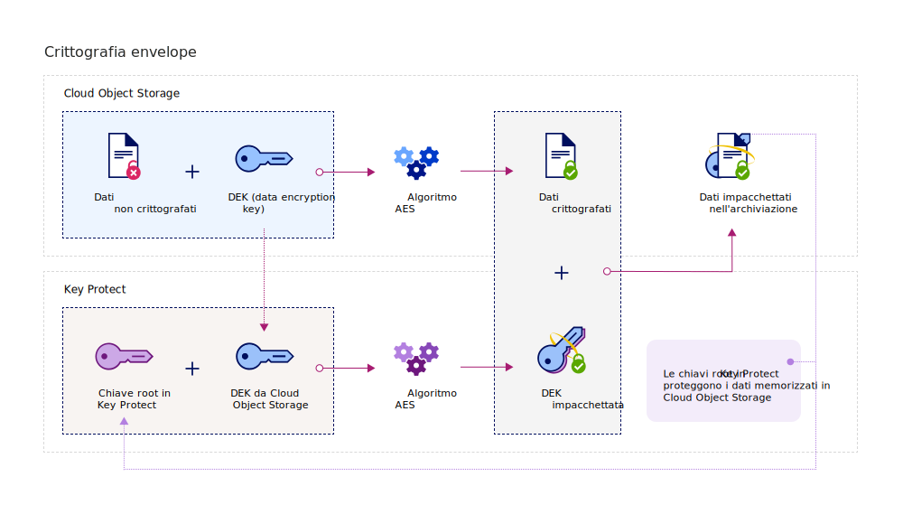

---

copyright:
  years: 2017, 2019
lastupdated: "2019-07-09"

keywords: Key Protect integration, integrate COS with Key Protect

subcollection: key-protect

---

{:shortdesc: .shortdesc}
{:screen: .screen}
{:pre: .pre}
{:table: .aria-labeledby="caption"}
{:external: target="_blank" .external}
{:codeblock: .codeblock}
{:tip: .tip}
{:note: .note}
{:important: .important}

# Integrazione con {{site.data.keyword.cos_full_notm}}
{: #integrate-cos}

{{site.data.keyword.keymanagementservicefull}} e {{site.data.keyword.cos_full}} lavorano insieme per aiutarti a gestire la sicurezza dei tuoi dati inattivi. Scopri come aggiungere la crittografia avanzata alle tue risorse {{site.data.keyword.cos_full}} attraverso il servizio {{site.data.keyword.keymanagementservicelong_notm}}.
{: shortdesc}

## Informazioni su {{site.data.keyword.cos_full_notm}}
{: #cos}

{{site.data.keyword.cos_full_notm}} fornisce l'archiviazione cloud per i dati non strutturati. I dati non strutturati si riferiscono a file, supporti audio/video, PDF, archivi di dati compressi, immagini di backup, risorse dell'applicazione, documenti di business o tutti gli altri oggetti binari.  

Per mantenere l'integrità e la disponibilità dei dati, {{site.data.keyword.cos_full_notm}} suddivide e distribuisce i dati ai nodi di archiviazione tra più ubicazioni geografiche. Nessuna copia completa dei dati risiede in un singolo nodo di archiviazione e solo un sottoinsieme di nodi deve essere disponibile in modo che puoi recuperare appieno i dati sulla rete. Viene fornita la codifica lato fornitore, per cui i dati sono protetti sia quando inattivi che attivi. Per gestire l'archiviazione, crea i bucket e importa gli oggetti con la console {{site.data.keyword.cloud_notm}} o in modo programmatico utilizzando l'[API REST {{site.data.keyword.cos_full_notm}}](/docs/services/cloud-object-storage?topic=cloud-object-storage-compatibility-api){: external}.

Per ulteriori informazioni, vedi [Informazioni su COS](/docs/services/cloud-object-storage?topic=cloud-object-storage-about){: external}.

## Come funziona l'integrazione
{: #kp-cos-how}

{{site.data.keyword.keymanagementserviceshort}} si integra con {{site.data.keyword.cos_full_notm}} per aiutarti ad avere il controllo completo della sicurezza dei tuoi dati.  

Quando sposti i dati nella tua istanza di {{site.data.keyword.cos_full_notm}}, il servizio automaticamente codifica i tuoi oggetti con le chiavi di crittografia dei dati (DEK). In {{site.data.keyword.cos_full_notm}}, le DEK sono archiviate nel servizio in modo sicuro, accanto alle risorse che codificano. Quando hai bisogno di accedere a un bucket, il servizio controlla le autorizzazioni utente e decodifica gli oggetti nel bucket per te. Questo modello di codifica è chiamato _codifica gestita dal provider_.

Per abilitare i vantaggi della sicurezza della _codifica gestita dal cliente_, puoi aggiungere la crittografia envelope alle tue DEK in {{site.data.keyword.cos_full_notm}} eseguendo l'integrazione con il servizio {{site.data.keyword.keymanagementserviceshort}}. Con {{site.data.keyword.keymanagementserviceshort}}, fornisci chiavi root altamente sicure, che fungono da chiavi master che controlli nel servizio. Quando crei un bucket in {{site.data.keyword.cos_full_notm}}, puoi configurare la crittografia envelope per il bucket alla sua creazione. Questa protezione aggiunta impacchetta (o codifica) le DEK associate al bucket utilizzando una chiave root che puoi gestire in {{site.data.keyword.keymanagementserviceshort}}. La procedura, denominata _impacchettamento della chiave_, utilizza più algoritmi AES per proteggere la privacy e l'integrità delle tue DEK, per cui solo tu controlli l'accesso ai loro dati associati.

La seguente figura mostra in che modo {{site.data.keyword.keymanagementserviceshort}} si integra con {{site.data.keyword.cos_full_notm}} per proteggere ulteriormente le tue chiavi di crittografia.

Per ulteriori informazioni su come funziona la crittografia envelope in {{site.data.keyword.keymanagementserviceshort}}, consulta [Protezione dei dati con la crittografia envelope](/docs/services/key-protect?topic=key-protect-envelope-encryption).

## Aggiunta della crittografia envelope ai tuoi bucket di archiviazione
{: #kp-cos-envelope}

[Dopo aver designato una chiave root in {{site.data.keyword.keymanagementserviceshort}}](/docs/services/key-protect?topic=key-protect-create-root-keys) e [concesso l'accesso tra i tuoi servizi](/docs/services/key-protect?topic=key-protect-integrate-services#grant-access), puoi abilitare la crittografia envelope per un bucket di archiviazione specificato utilizzando la GUI {{site.data.keyword.cos_full_notm}}.

 Per abilitare le opzioni di configurazione avanzate per il tuo bucket di archiviazione, assicurati che esista una [autorizzazione](/docs/services/key-protect?topic=key-protect-integrate-services#grant-access) tra le tue istanze del servizio {{site.data.keyword.cos_full_notm}} e {{site.data.keyword.keymanagementserviceshort}}.
{: tip}

Per aggiungere la crittografia envelope al tuo bucket di archiviazione:

1. Dal tuo dashboard {{site.data.keyword.cos_full_notm}}, fai clic su **Create bucket**.
2. Specifica i dettagli del bucket.
3. Nella sezione **Advanced Configuration**, seleziona **Add {{site.data.keyword.keymanagementserviceshort}} Keys**.
4. Dall'elenco delle istanze del servizio {{site.data.keyword.keymanagementserviceshort}}, seleziona l'istanza che contiene la chiave root che vuoi utilizzare per l'impacchettamento della chiave.
5. Per **Key Name**, seleziona l'alias della chiave root.
6. Fai clic su **Create** per confermare la creazione del bucket.

Dalla GUI {{site.data.keyword.cos_full_notm}}, puoi sfogliare i bucket protetti da una chiave root {{site.data.keyword.keymanagementserviceshort}}.

## Operazioni successive
{: #cos-integration-next-steps}

- Per ulteriori informazioni sull'associazione dei tuoi bucket di archiviazione con le chiavi {{site.data.keyword.keymanagementserviceshort}}, vedi [Manage encryption](/docs/services/cloud-object-storage?topic=cloud-object-storage-encryption#encryption){: external}. 
