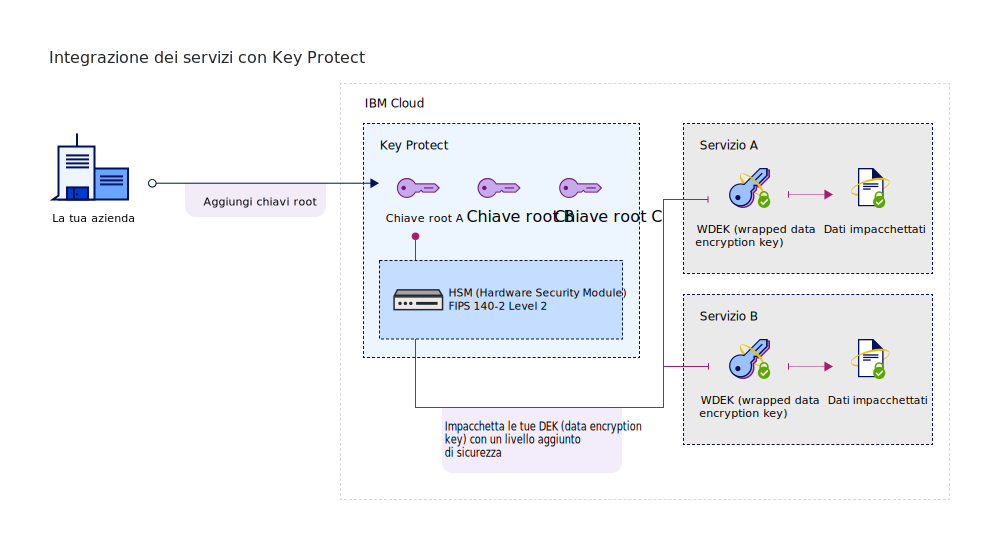

---

copyright:
  years: 2017, 2018
lastupdated: "2018-06-07"

---

{:shortdesc: .shortdesc}
{:codeblock: .codeblock}
{:screen: .screen}
{:new_window: target="_blank"}
{:pre: .pre}
{:tip: .tip}

# Integrazione dei servizi
{: #integrations}

{{site.data.keyword.keymanagementservicefull}} si integra con i dati e le soluzioni di archiviazione per aiutarti a portare e gestire la tua crittografia nel cloud.
{: shortdesc}

[Dopo aver creato un'istanza del servizio](/docs/services/keymgmt/keyprotect_provision.html), puoi integrare {{site.data.keyword.keymanagementserviceshort}} con i seguenti servizi supportati:

<table>
    <tr>
        <th>Servizio</th>
        <th>Descrizione</th>
    </tr>
    <tr>
        <td>
          
{{site.data.keyword.cos_full_notm}}

        </td>
        <td>
          
Aggiungi la [crittografia envelope](/docs/services/keymgmt/concepts/keyprotect_envelope.html) ai tuoi bucket di archiviazione utilizzando {{site.data.keyword.keymanagementserviceshort}}. Utilizza le chiavi root che gestisci in {{site.data.keyword.keymanagementserviceshort}} per proteggere le chiavi di crittografia dei dati che codificano i tuoi dati inattivi.

          
Per ulteriori informazioni, consulta [Integrazione con {{site.data.keyword.cos_full_notm}}](/docs/services/keymgmt/integrations/keyprotect_cloud-object-storage.html).

        </td>
    </tr>
   <caption style="caption-side:bottom;">Tabella 1. Descrive le integrazioni disponibili per {{site.data.keyword.keymanagementserviceshort}}</caption>
</table>

## Informazioni sulla tua integrazione 
{: #understand_integration}

Quando integri un servizio supportato con {{site.data.keyword.keymanagementserviceshort}}, abiliti la [crittografia envelope](/docs/services/keymgmt/concepts/keyprotect_envelope.html) per tale servizio. Questa integrazione ti consente di utilizzare una chiave root che memorizzi in {{site.data.keyword.keymanagementserviceshort}} per impacchettare le chiavi di crittografia dei dati che codificano i tuoi dati inattivi. 

Ad esempio, puoi creare una chiave root, gestire la chiave in {{site.data.keyword.keymanagementserviceshort}} e utilizzarla per proteggere i dati memorizzati tra diversi servizi cloud.

### Metodi API {{site.data.keyword.keymanagementserviceshort}}
{: #api_methods}

Dietro le quinte, l'API {{site.data.keyword.keymanagementserviceshort}} guida il processo di crittografia envelope.  

La seguente tabella elenca i metodi API che aggiungono o rimuovono la crittografia envelope su una risorsa.

<table>
  <tr>
    <th>Metodo</th>
    <th>Descrizione</th>
  </tr>
  <tr>
    <td><code>POST /keys/{root_key_ID}?action=wrap</code></td>
    <td><a href="/docs/services/keymgmt/keyprotect_wrap_keys.html">Impacchetta (codifica) una chiave di crittografia dei dati</a></td>
  </tr>
  <tr>
    <td><code>POST /keys/{root_key_ID}?action=wrap</code></td>
    <td><a href="/docs/services/keymgmt/keyprotect_unwrap_keys.html">Spacchetta (decodifica) una chiave di crittografia dei dati</a></td>
  </tr>
  <caption style="caption-side:bottom;">Tabella 2. Descrive i metodi API {{site.data.keyword.keymanagementserviceshort}}</caption>
</table>

Per ulteriori informazioni sulla gestione a livello programmatico delle tue chiavi in {{site.data.keyword.keymanagementserviceshort}}, consulta la [Documentazione di riferimento API {{site.data.keyword.keymanagementserviceshort}} ](https://console.bluemix.net/apidocs/639){: new_window} per degli esempi di codice.
{: tip}

## Integrazione di un servizio supportato
{: #grant_access}

Per aggiungere un'integrazione, crea un'autorizzazione tra i servizi utilizzando il dashboard {{site.data.keyword.iamlong}}. Le autorizzazioni abilitano le politiche di accesso da servizio a servizio, pertanto puoi associare una risorsa nel tuo servizio di dati cloud con una [chiave root](/docs/services/keymgmt/concepts/keyprotect_envelope.html#key_types) che gestisci in {{site.data.keyword.keymanagementserviceshort}}.

Prima di creare un'autorizzazione, assicurati di fornire entrambi i servizi nella stessa regione. Per ulteriori informazioni sulle autorizzazioni dei servizi, vedi [Concessione dell'accesso tra i servizi ](/docs/iam/authorizations.html){: new_window}.
{: tip}

Quando sei pronto per integrare un servizio, usa la seguente procedura per creare un'autorizzazione:

1. [Accedi alla console {{site.data.keyword.cloud_notm}} ](https://console.bluemix.net/){: new_window}.
2. Dalla barra dei menu, fai clic su **Manage** &gt; **Security** &gt; **Identity and Access** e seleziona **Authorizations**. 
3. Fai clic su **Crea**.
4. Seleziona un'origine e una destinazione per l'autorizzazione.
 
  - Per **Source service**, seleziona il servizio di dati cloud che vuoi integrare con {{site.data.keyword.keymanagementserviceshort}}. Ad esempio, **Cloud Object Storage**.
  - Per **Target service**, seleziona **{{site.data.keyword.keymanagementservicelong_notm}}**. 
4. Per concedere l'accesso in sola lettura tra i servizi, seleziona la casella di spunta **Reader**.

    Con le autorizzazioni _Reader_, il tuo servizio di origine può sfogliare le chiavi root fornite nell'istanza specificata di {{site.data.keyword.keymanagementserviceshort}}.
5. Fai clic su **Authorize**.

### Operazioni successive

Aggiungi la crittografia avanzata alle tue risorse cloud creando una chiave root in {{site.data.keyword.keymanagementserviceshort}}. Aggiungi una nuova risorsa a un servizio di dati cloud supportato e quindi seleziona la chiave root che vuoi utilizzare per la crittografia avanzata.

- Per ulteriori informazioni sulla creazione di chiavi root con il servizio {{site.data.keyword.keymanagementserviceshort}}, vedi [Creazione delle chiavi root](/docs/services/keymgmt/keyprotect_create_root.html).
- Per ulteriori informazioni su come portare le tue proprie chiavi root al servizio {{site.data.keyword.keymanagementserviceshort}}, vedi [Importazione delle chiavi root](/docs/services/keymgmt/keyprotect_import_root.html).

