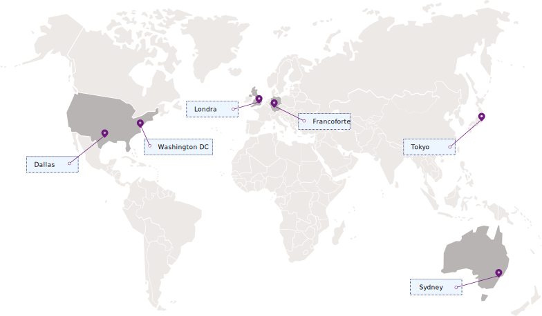

---

copyright:
  years: 2017, 2019
lastupdated: "2019-04-03"

keywords: Key Protect API endpoints, available regions

subcollection: key-protect

---

{:shortdesc: .shortdesc}
{:codeblock: .codeblock}
{:screen: .screen}
{:new_window: target="_blank"}
{:pre: .pre}
{:tip: .tip}
{:note: .note}
{:important: .important}
{:deprecated: .deprecated}

# Regioni e ubicazioni
{: #regions}

Puoi collegarti alle tue applicazioni con il servizio {{site.data.keyword.keymanagementservicelong}} specificando un endpoint del servizio regionale.
{: shortdesc}

## Regioni disponibili
{: #available-regions}

{{site.data.keyword.keymanagementserviceshort}} è disponibile nelle seguenti regioni e ubicazioni:

## Endpoint del servizio
{: #service-endpoints}

Se stai gestendo le tue risorse {{site.data.keyword.keymanagementserviceshort}} programmaticamente, consulta la seguente tabella per determinare gli endpoint API da utilizzare quando stabilisci una connessione all'[API {{site.data.keyword.keymanagementserviceshort}}](https://{DomainName}/apidocs/key-protect): 

<table>
    <tr>
        <th>Ubicazione</th>
        <th>Endpoint API del servizio</th>
    </tr>
    <tr>
        <td>Dallas</td>
        <td>
            <code>us-south.kms.cloud.ibm.com</code>
        </td>
    </tr>
    <tr>
        <td>Washington DC</td>
        <td>
            <code>us-east.kms.cloud.ibm.com</code>
        </td>
    </tr>
    <tr>
        <td>Londra</td>
        <td>
            <code>eu-gb.kms.cloud.ibm.com</code>
        </td>
    </tr>
    <tr>
        <td>Francoforte</td>
        <td>
            <code>eu-de.kms.cloud.ibm.com</code>
        </td>
    </tr>
    <tr>
        <td>Sydney</td>
        <td>
            <code>au-syd.kms.cloud.ibm.com</code>
        </td>
    </tr>
    <tr>
        <td>Tokyo</td>
        <td>
            <code>jp-tok.kms.cloud.ibm.com</code>
        </td>
    </tr>
    <caption style="caption-side:bottom;">Tabella 1. Mostra gli endpoint disponibili per l'API {{site.data.keyword.keymanagementserviceshort}}</caption>
</table>

Puoi continuare a usare `https://keyprotect.<region>.bluemix.net` per interagire con l'API Key Protect oppure puoi aggiornare le tue applicazioni con i nuovi endpoint `cloud.ibm.com`. 
{: tip}

Per ulteriori informazioni sull'autenticazione con {{site.data.keyword.keymanagementserviceshort}}, vedi [Accesso all'API](/docs/services/key-protect?topic=key-protect-set-up-api).
