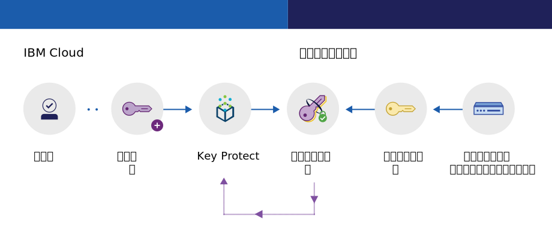

---

copyright:
  years: 2017, 2019
lastupdated: "2019-02-18"

keywords: key management service, KMS, about Key Protect, about KMS, Key Protect use cases, KMS use cases

subcollection: key-protect

---

{:shortdesc: .shortdesc}
{:codeblock: .codeblock}
{:screen: .screen}
{:new_window: target="_blank"}
{:pre: .pre}
{:tip: .tip}
{:note: .note}
{:important: .important}

# {{site.data.keyword.keymanagementserviceshort}} の概要
{: #about}

{{site.data.keyword.keymanagementservicefull}} は、{{site.data.keyword.cloud_notm}} サービス上のアプリの暗号鍵をプロビジョンするときに役立ちます。 鍵のライフサイクルを管理する際に、情報の盗難を防止する FIPS 140-2 レベル 2 認証のクラウド・ベースのハードウェア・セキュリティー・モジュール (HSM) によって鍵が保護されていることを認識していると役立つことがあります。
{: shortdesc}

## {{site.data.keyword.keymanagementserviceshort}} を使用する理由
{: #use-cases}

以下のようなシナリオで鍵を管理する必要が生じる場合があります。

<table>
  <tr>
    <th>シナリオ</th>
    <th>理由</th>
  </tr>
  <tr>
    <td>データをクラウドに移動するので、エンベロープ暗号化を実行する必要があります。 独自のマスター暗号鍵を取り込んで、保存データを暗号化している他の鍵を管理および保護できるようにする必要があります。</td>
    <td>{{site.data.keyword.keymanagementserviceshort}} を使用すると、[データ暗号鍵を非常にセキュアなルート鍵でラップすることができます](/docs/services/key-protect?topic=key-protect-envelope-encryption)。 独自のルート鍵を持ち込むことも、サービス内でルート鍵を作成することもできます。</td>
  </tr>
  <tr>
    <td>大企業の IT 管理者として、数多くのさまざまなサービス・オファリング用の鍵を統合、追跡、およびローテートさせる必要があります。</td>
    <td>{{site.data.keyword.keymanagementserviceshort}} インターフェースは、複数の暗号化サービスの管理を簡素化します。 このサービスを使用すると、鍵の管理や分類を 1 カ所で集中的に行うことも、プロジェクト別に鍵を分離して別々の {{site.data.keyword.cloud_notm}} スペースに格納することもできます。</td>
  </tr>
  <tr>
    <td>データの保護方法に対するガバナンスを遵守する必要がある、業界 (財務や法律など) のセキュリティー管理者です。 保護しているデータを危険にさらすことなく、鍵の制御アクセスを認可する必要があります。</td>
    <td>このサービスを使用すると、[異なる Identity and Access Management の役割を割り当てる](/docs/services/key-protect?topic=key-protect-manage-access#roles)ことによって、鍵を管理するためのユーザーのアクセス権限を制御できます。 例えば、鍵の素材を表示せずに鍵の作成情報を表示する必要があるユーザーに対しては、読み取り専用アクセス権限を付与できます。</td>
  <tr>
    <td>開発者として、自己暗号化ストレージなどの既存のアプリケーションを {{site.data.keyword.keymanagementserviceshort}} に統合する必要があります。</td>
    <td>{{site.data.keyword.cloud_notm}} 上、またはその外部のアプリは、
{{site.data.keyword.keymanagementserviceshort}} API と統合できます。 独自の既存の鍵をご使用のアプリに使用することも可能です。 </td>
  </tr>
  <tr>
    <td>開発チームは厳しいポリシーを定めており、14 日ごとに鍵を生成してローテートさせる手段が必要です。</td>
    <td>{{site.data.keyword.keymanagementserviceshort}} を使用すると、{{site.data.keyword.cloud_notm}} ハードウェア・セキュリティー・モジュール (HSM) から迅速に鍵を生成し、継続的にセキュリティーのニーズを満たすことができます。</td>
  </tr>
</table>

ユーザー制御のクラウド・ベースのハードウェア・セキュリティー・モジュール (HSM) をサポートする、専用の鍵管理ソリューションをお探しの場合、[{{site.data.keyword.cloud_notm}} {{site.data.keyword.hscrypto}} (ベータ)](/docs/services/hs-crypto?topic=hs-crypto-get-started) と {{site.data.keyword.keymanagementserviceshort}} との統合によって {{site.data.keyword.cloud_notm}} での Keep Your Own Keys (KYOK) が可能になり、データに対する組織の制御および権限が強まります。詳しくは、[{{site.data.keyword.hscrypto}} オファリング詳細ページ ](https://{DomainName}/catalog/services/hyper-protect-crypto-services) をご覧ください。
{: tip}

## {{site.data.keyword.keymanagementserviceshort}} の機能方法
{: #kp-how}

{{site.data.keyword.keymanagementservicelong_notm}} は、{{site.data.keyword.cloud_notm}} の「ID およびアクセス管理」の役割と協調して、組織全体の暗号鍵を管理するのを支援します。

IT またはセキュリティーの管理者に必要とされる高度な許可は、監査員には必要がない可能性があります。 アクセスを簡素化するために、{{site.data.keyword.keymanagementserviceshort}} を {{site.data.keyword.cloud_notm}} の「ID およびアクセス管理」の役割にマップして、各役割がそれぞれ異なるビューのサービスを持つようにします。 どのビューとアクセス・レベルが自分のニーズに最も適しているかを判断するには、[ユーザーおよびアクセス権限の管理](/docs/services/key-protect?topic=key-protect-manage-access#roles)を参照してください。

次の図は、管理者、リーダー、およびライターが、サービスで管理されている鍵とどのように相互作用できるかを示しています。

<dl>
  <dt>サービスの統合</dt>
    <dd>{{site.data.keyword.keymanagementserviceshort}} サービス・インスタンスの管理者は、暗号化用の鍵を管理します。</dd>
  <dt>監査</dt>
    <dd>リーダーは、鍵の概略ビューにアクセスし、疑わしいアクティビティーを特定します。</dd>
  <dt>アプリ</dt>
    <dd>ライターは、アプリにコーディングする暗号化用の鍵を管理します。</dd>
</dl>

## {{site.data.keyword.keymanagementserviceshort}} アーキテクチャー
{: #kp_architecture}

{{site.data.keyword.keymanagementservicelong_notm}} は、業界で認められたテクノロジーで構成されています。

<dl>
  <dt>{{site.data.keyword.cloud_notm}} サーバー</dt>
    <dd>{{site.data.keyword.cloud_notm}} サーバーからの ID、プロジェクト、およびトークンにより、{{site.data.keyword.keymanagementserviceshort}} サービスはリソースを鍵にマップすることができます。</dd>
  <dt>{{site.data.keyword.keymanagementserviceshort}} の API</dt>
    <dd>{{site.data.keyword.keymanagementserviceshort}} REST API は、鍵の作成と管理を駆動します。 サービスは暗号化されたマルチテナンシーを提供します。</dd>
  <dt>{{site.data.keyword.cloud_notm}} のユーザー・インターフェース</dt>
    <dd>{{site.data.keyword.keymanagementserviceshort}} のユーザー・インターフェース (UI) では、安全に鍵の処理を行えます。</dd>
  <dt>ハードウェア・セキュリティー・モジュール (HSM)</dt>
    <dd>{{site.data.keyword.cloud_notm}} データ・センターは、鍵を保護するためのハードウェアを舞台裏で提供しています。</dd>
  <dt>データベース・クラスター</dt>
    <dd>クラスター化されたデータベースを使用した豊富で安全な鍵の保管を期待できます。</dd>
</dl>

以下の図は、{{site.data.keyword.keymanagementserviceshort}} がハードウェア・セキュリティー・モジュールと連携して鍵を生成する方法と、サービスによる鍵の保管方法を対比して示しています。

