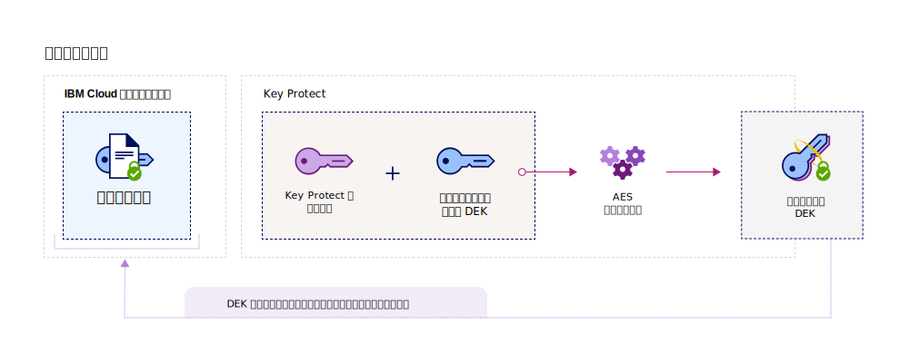
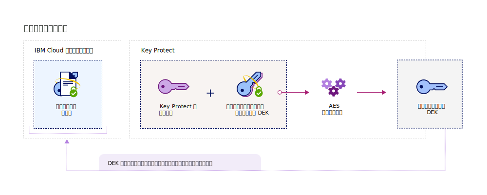

---

copyright:
  years: 2017, 2018
lastupdated: "2018-08-24"

---

{:shortdesc: .shortdesc}
{:codeblock: .codeblock}
{:screen: .screen}
{:new_window: target="_blank"}
{:pre: .pre}
{:tip: .tip}

# エンベロープ暗号化
{: #envelope-encryption}

エンベロープ暗号化とは、データ暗号鍵 (DEK) を使用してデータを暗号化し、次にその DEK を、ユーザーが完全に管理できるルート鍵を使用して暗号化する手法です。 
{: shortdesc}

{{site.data.keyword.keymanagementservicefull}} は、拡張暗号化を使用して保管データを保護し、以下のようないくつかの利点を提供します。

<table>
  <th>利点</th>
  <th>説明</th>
  <tr>
    <td>顧客管理の暗号鍵</td>
    <td>ユーザーは、サービスを使用して、クラウド内の暗号化データのセキュリティーを保護するためにルート鍵をプロビジョンできます。 ルート鍵はマスター鍵ラップ鍵としての機能を果たし、{{site.data.keyword.cloud_notm}} データ・サービス内でプロビジョンされたデータ暗号鍵 (DEK) を管理および保護するのに役立ちます。 ユーザーは、既存のルート鍵をインポートするのか、代わりに {{site.data.keyword.keymanagementserviceshort}} に生成させるのかを決定します。</td>
  </tr>
  <tr>
    <td>機密性と保全性の保護</td>
    <td>{{site.data.keyword.keymanagementserviceshort}} は、Galois/Counter Mode (GCM) で拡張暗号化標準 (AES) アルゴリズムを使用して、鍵を作成および保護します。 サービスで鍵を作成する場合、{{site.data.keyword.keymanagementserviceshort}} は {{site.data.keyword.cloud_notm}} ハードウェア・セキュリティー・モジュール (HSM) の信頼境界内に鍵を生成するため、ユーザーのみが暗号鍵へのアクセス権限を持ちます。</td>
  </tr>
  <tr>
    <td>データの暗号シュレッディング</td>
    <td>組織でセキュリティー問題が検出された場合、またはアプリで一連のデータが不要になった場合、そのデータをクラウドから完全に破棄することを選択できます。 他の DEK を保護しているルート鍵を削除すると、その鍵に関連付けられているデータにはアクセスすることも、暗号化解除することもできなくなります。</td>
  </tr>
  <tr>
    <td>委任されたユーザー・アクセス制御</td>
    <td>{{site.data.keyword.keymanagementserviceshort}} では、鍵に対する細分化されたアクセスを可能にするために、集中アクセス制御システムをサポートしています。 [IAM ユーザー役割と拡張許可を割り当てることにより](/docs/services/key-protect/manage-access.html#roles)、セキュリティー管理者は、サービス内でどのユーザーがどのルート鍵にアクセスできるかを決定します。</td>
  </tr>
  <caption style="caption-side:bottom;">表 1. ユーザー管理の暗号化の利点についての説明</caption>
</table>

## 仕組み
{: #overview}

エンベロープ暗号化は、複数の暗号化アルゴリズムの長所を組み合わせて、クラウド内の機密データを保護します。 これは、ユーザーが完全に管理できるルート鍵を使用して、1 つ以上のデータ暗号鍵 (DEK) を拡張暗号化によりラッピングすることで実現します。 この鍵ラッピング・プロセスにより、ラップされた DEK が作成され、保管データを無許可アクセスや機密漏れから保護します。 DEK のアンラップは、同じルート鍵を使用してエンベロープ暗号化プロセスの逆の動作を行い、その結果、データが暗号化解除されて認証されます。
 
次の図は、鍵ラッピング機能のコンテキスト・ビューを示しています。

エンベロープ暗号化については、NIST Special Publication 800-57, Recommendation for Key Management に簡単な説明があります。 詳しくは、[NIST SP 800-57 Pt. 1 Rev. 4 ](http://nvlpubs.nist.gov/nistpubs/SpecialPublications/NIST.SP.800-57pt1r4.pdf){: new_window} を参照してください。

## 鍵のタイプ
{: #key-types}

サービスでは、データの拡張暗号化および管理のために、ルート鍵と標準鍵の 2 つの鍵タイプをサポートしています。

<dl>
  <dt>ルート鍵</dt>
    <dd>ルート鍵は、{{site.data.keyword.keymanagementserviceshort}} の 1 次リソースです。 これは、データ・サービス内に保管されている他の鍵をラッピング (暗号化) およびアンラッピング (暗号化解除) するための信頼のルートとして使用される、対称鍵ラップ鍵です。 {{site.data.keyword.keymanagementserviceshort}} を使用して、ルート鍵の作成、保管、およびライフサイクルの管理を行うことができます。これにより、クラウド内に保管された他の鍵を完全に制御できるようになります。 標準鍵とは異なり、ルート鍵は {{site.data.keyword.keymanagementserviceshort}} サービスの境界から外に出ることは決してできません。</dd>
  <dt>標準鍵</dt>
    <dd>標準鍵は、暗号化に使用される暗号鍵です。 通常、標準鍵はデータを直接暗号化します。 {{site.data.keyword.keymanagementserviceshort}} を使用して、標準鍵の作成、保管、およびライフサイクルの管理を行うことができます。 サービス内で標準鍵をインポートまたは生成した後、ストレージ・バケットなどの外部データ・リソースに鍵をエクスポートして、機密情報を暗号化できます。 保管データを暗号化する標準鍵は、データ暗号鍵 (DEK) と呼ばれ、これは拡張暗号化を使用してラップできます。 ラップされた DEK は、{{site.data.keyword.keymanagementserviceshort}} 内に保管されません。</dd>
</dl>

{{site.data.keyword.keymanagementserviceshort}} で鍵を作成すると、システムは ID 値を返します。これを使用して、サービスに対して API 呼び出しを行うことができます。 {{site.data.keyword.keymanagementserviceshort}} GUI または [{{site.data.keyword.keymanagementserviceshort}} API](https://console.bluemix.net/apidocs/kms) を使用して、鍵の ID 値を取得できます。 

## 鍵のラッピング
{: #wrapping}

ルート鍵は、クラウド内に保管されたデータ暗号鍵 (DEK) をグループ化、管理、および保護するのに役立ちます。 {{site.data.keyword.keymanagementserviceshort}} 内で、ユーザーが完全に管理できるルート鍵を指定することにより、拡張暗号化を使用して 1 つ以上の DEK をラップできます。 

{{site.data.keyword.keymanagementserviceshort}} 内でルート鍵を指定した後、{{site.data.keyword.keymanagementserviceshort}} API を使用して、サービスに対して鍵ラップ要求を送信できます。 鍵ラップ操作は、DEK の機密性と保全性の両方の保護を実現します。 次の図は、鍵ラッピング・プロセスのアクションを示しています。

次の表は、鍵ラップ操作を実行するために必要な入力について説明しています。
<table>
  <th>入力</th>
  <th>説明</th>
  <tr>
    <td>ルート鍵 ID</td>
    <td>ラッピングに使用するルート鍵の ID 値。 ルート鍵は、サービスにインポートすることも、{{site.data.keyword.keymanagementserviceshort}} でその HSM から発生させることもできます。 ラップ要求を正常に実行できるように、ラッピングに使用されるルート鍵は 256 ビット、384 ビット、または 512 ビットでなければなりません。</td>
  </tr>
  <tr>
    <td>プレーン・テキスト</td>
    <td>オプション: 管理および保護するデータが入っている DEK の鍵の素材。 鍵ラッピングに使用されるプレーン・テキストは、Base64 エンコードでなければなりません。 256 ビット DEK を生成する場合は、`plaintext` 属性を省略できます。 サービスは、鍵ラッピングに使用するために base64 エンコード DEK を生成します。</td>
  </tr>
  <tr>
    <td>追加認証データ (AAD)</td>
    <td>オプション: 鍵の内容の保全性をチェックするストリングの配列。 各ストリングは、最大 255 文字を保持できます。 ラップ要求時に AAD を提供した場合は、後続のアンラップ要求時にも同じ AAD を指定する必要があります。</td>
  </tr>
    <caption style="caption-side:bottom;">表 2. {{site.data.keyword.keymanagementserviceshort}} の鍵ラッピングに必要な入力</caption>
</table>

暗号化するプレーン・テキストを指定せずにラップ要求を送信すると、AES-GCM 暗号化アルゴリズムによりプレーン・テキストが生成され、暗号文と呼ばれる理解できない形式のデータに変換されます。 このプロセスは、新しい鍵の素材を使用して 256 ビット DEK を出力します。 次に、システムは、AES 鍵ラッピング・アルゴリズムを使用します。このアルゴリズムは、指定されたルート鍵を使用して DEK とその鍵素材をラップします。 ラップ操作に成功すると、Base64 エンコードでラップされた DEK が返され、それを {{site.data.keyword.cloud_notm}} アプリやサービスに保管できます。 

## 鍵のアンラッピング
{: #unwrapping}

データ暗号鍵 (DEK) をアンラップすると、鍵の内容を暗号化解除して認証し、元の鍵素材をデータ・サービスに返します。 

ビジネス・アプリケーションが、アンラップされた DEK の内容にアクセスする必要がある場合、{{site.data.keyword.keymanagementserviceshort}} API を使用して、アンラップされた要求をサービスに送信できます。 DEK をアンラップするには、ルート鍵の ID 値と、最初のラップ要求時に返された `ciphertext` 値を指定します。 アンラップ要求を実行するには、鍵の内容の保全性をチェックするために、追加認証データ (AAD) も提供する必要があります。

次の図は、鍵のアンラッピングのアクションを示しています。

アンラップ要求を送信すると、システムは同じ AES アルゴリズムを使用して、鍵ラッピング・プロセスの逆を実行します。 アンラップ操作が成功すると、base64 エンコード `plaintext` 値が {{site.data.keyword.cloud_notm}} 保存データ・サービスに返されます。

