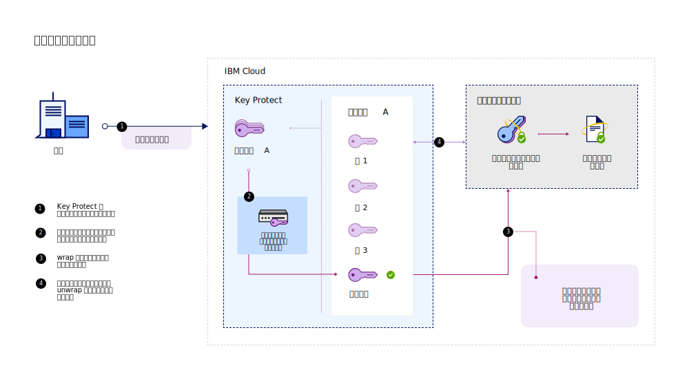
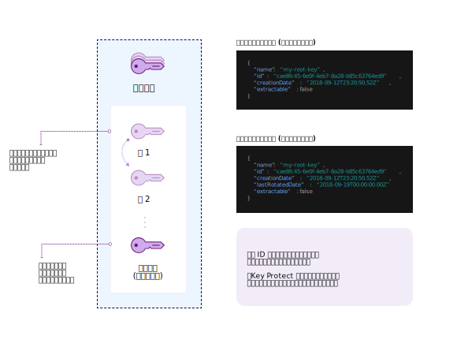

---

copyright:
  years: 2017, 2019
lastupdated: "2019-03-22"

keywords: rotate encryption keys, rotate keys automatically, key rotation

subcollection: key-protect

---

{:shortdesc: .shortdesc}
{:codeblock: .codeblock}
{:screen: .screen}
{:new_window: target="_blank"}
{:pre: .pre}
{:tip: .tip}
{:note: .note}
{:important: .important}

# 暗号鍵のローテート
{: #key-rotation}

ルート鍵の元の鍵素材を無効にし、新しい暗号鍵素材を生成することによって鍵を変更すると、鍵がローテーションされます。

定期的に鍵をローテートすると、業界標準や暗号のベスト・プラクティスに準拠するのに役立ちます。 以下の表では、鍵のローテーションの主な利点について説明します。

<table>
  <th>利点</th>
  <th>説明</th>
  <tr>
    <td>鍵の暗号期間の管理</td>
    <td>鍵のローテーションは、情報が単一の鍵によって保護される期間を制限します。定期的な間隔でルート鍵をローテートすることで、鍵の暗号期間も短くなります。 暗号鍵の存続期間が長くなればなるほど、セキュリティー・ブリーチの可能性が高まります。</td>
  </tr>
  <tr>
    <td>インシデントの緩和</td>
    <td>組織でセキュリティー問題が検出された場合、即時に鍵をローテートすることで、鍵漏えいに伴うコストを緩和または削減できます。</td>
  </tr>
  <caption style="caption-side:bottom;">表 1. 鍵のローテーションの利点の説明</caption>
</table>

鍵のローテーションは、NIST Special Publication 800-57 の『Recommendation for Key Management』で説明されています。 詳しくは、[NIST SP 800-57 Pt. 1 Rev. 4 ](http://nvlpubs.nist.gov/nistpubs/SpecialPublications/NIST.SP.800-57pt1r4.pdf){: new_window} を参照してください。
{: tip}

## {{site.data.keyword.keymanagementserviceshort}} での鍵のローテーションのオプションの比較
{: #compare-key-rotation-options}

{{site.data.keyword.keymanagementserviceshort}} では、[鍵のローテーション・ポリシーの設定](/docs/services/key-protect?topic=key-protect-set-rotation-policy)または[オンデマンドでの鍵のローテート](/docs/services/key-protect?topic=key-protect-rotate-keys)を、無効にされたルート鍵素材の追跡を必要とせずに行うことができます。 

ローテーションのオプションは、ルート鍵に対してのみ使用可能です。
{: note}

<dl>
  <dt>鍵のローテーション・ポリシーの設定</dt>
    <dd>{{site.data.keyword.keymanagementserviceshort}} を使用して暗号鍵のローテーションを単純化するには、このサービス内で生成する鍵に対するローテーション・ポリシーを有効にします。ルート鍵を作成した後、その鍵のローテーション・ポリシーを {{site.data.keyword.keymanagementserviceshort}} GUI または API を使用して管理できます。現行のセキュリティー・ニーズに基づいて、<a href="/docs/services/key-protect?topic=key-protect-rotation-frequency">1 カ月から 12 カ月の範囲で鍵の自動ローテーション間隔を選択</a>します。指定したローテーション間隔に基づいて鍵をローテートするときになったら、鍵は新しい鍵素材で {{site.data.keyword.keymanagementserviceshort}} によって自動的に置き換えられます。</dd>
  <dt>オンデマンドでの鍵のローテート</dt>
    <dd>セキュリティー管理者として、鍵のローテーション頻度をもっと制御したい場合があります。鍵の自動ローテーション・ポリシーを設定したくない場合は、既存の鍵を置換するための新しい鍵を手動で作成し、新しい鍵を参照するようにアプリケーションを更新することができます。このプロセスを単純化するため、{{site.data.keyword.keymanagementserviceshort}} を使用して、オンデマンドで鍵をローテートできます。このシナリオでは、各ローテーション要求で {{site.data.keyword.keymanagementserviceshort}} がユーザーに代わって鍵を作成して置換します。鍵のメタデータおよび鍵 ID はそのまま保持されます。</dd>
</dl>

## 鍵のローテーションの仕組み 
{: #how-key-rotation-works}

鍵のローテーションは、鍵素材の状態を_アクティブ_ から_非アクティブ_ にセキュアに遷移させることで機能します。非アクティブにされた (または無効にされた) 鍵素材を置き換えるために、新しい鍵素材が_アクティブ_ 状態に移行し、暗号操作に使用可能になります。

### {{site.data.keyword.keymanagementserviceshort}} を使用した鍵のローテート
{: #use-key-protect-rotate-keys}

{{site.data.keyword.keymanagementserviceshort}} を使用したルート鍵のローテートを準備するときには、以下の考慮事項に留意してください。

<dl>
  <dt>{{site.data.keyword.keymanagementserviceshort}} 内で生成されたルート鍵のローテート</dt>
    <dd>{{site.data.keyword.keymanagementserviceshort}} 内で生成されたルート鍵は、鍵のローテーション・ポリシーを設定するか、オンデマンドで鍵をローテートすることによって、{{site.data.keyword.keymanagementserviceshort}} を使用してローテートできます。ルート鍵のメタデータ (鍵 ID など) は、鍵をローテートしても変更されません。</dd>
  <dt>サービスに取り込んだルート鍵のローテート</dt>
    <dd>ユーザーがサービスにインポートしたものが元であるルート鍵をローテートするには、鍵の新しい鍵素材を生成して提供する必要があります。ローテーション要求の一環として新しい鍵素材を供給することによって、{{site.data.keyword.keymanagementserviceshort}} を使用して、インポートされたルート鍵をオンデマンドでローテートできます。ルート鍵のメタデータ (鍵 ID など) は、鍵をローテートしても変更されません。インポートされた鍵をローテートするためには新しい鍵素材を提供する必要があるため、鍵素材がインポートされたものであるルート鍵には自動ローテーション・ポリシーは使用できません。</dd>
  <dt>無効にされた鍵素材の管理</dt>
    <dd>ルート鍵をローテートすると、新しい鍵素材が {{site.data.keyword.keymanagementserviceshort}} によって作成されます。このサービスは、古い鍵素材を無効にし、ルート鍵が削除されるまで無効状態を保持します。エンベロープ暗号化にルート鍵を使用する場合、鍵と関連付けられた最新の鍵素材のみが {{site.data.keyword.keymanagementserviceshort}} によって使用されます。無効にされた鍵素材は鍵を保護するためには使用できなくなりますが、アンラップ操作には使用可能なままです。{{site.data.keyword.keymanagementserviceshort}} は、廃止された鍵素材が DEK をアンラップするために使用されていることを検出すると、最新のルート鍵素材に基づいた、新しくラップされた DEK を提供します。この新しくラップされた DEK を使用して、最新の鍵素材で鍵をラップし直すことができます。</dd>
 <dt>{{site.data.keyword.cloud_notm}} データ・サービスに対する鍵のローテーションの有効化</dt>
    <dd>鍵のローテーションに関するこれらのオプションを {{site.data.keyword.cloud_notm}} 上のデータ・サービスで使用可能にするには、データ・サービスが {{site.data.keyword.keymanagementserviceshort}} と統合されている必要があります。{{site.data.keyword.cloud_notm}} データ・サービスの資料を参照するか、または、<a href="/docs/services/key-protect?topic=key-protect-integrate-services">統合されたサービスのリスト</a>で詳細を確認してください。</dd>
</dl>

{{site.data.keyword.keymanagementserviceshort}} で鍵をローテートしても、追加料金は発生しません。 追加コストなしで、廃止した鍵素材を使用して、ラップ済みデータ暗号鍵 (WDEK) を引き続きアンラップできます。 料金オプションについて詳しくは、[{{site.data.keyword.keymanagementserviceshort}} カタログ・ページ](https://{DomainName}/catalog/services/key-protect)を参照してください。
{: tip}

### 鍵のローテーション・プロセスの概要
{: #understand-key-rotation-process}

背景では、鍵のローテーション・プロセスが {{site.data.keyword.keymanagementserviceshort}} API によって駆動されます。  

以下の図では、鍵のローテーション機能のコンテキスト・ビューを示します。

ローテーション要求が行われるごとに、{{site.data.keyword.keymanagementserviceshort}} は新しい鍵素材をルート鍵に関連付けます。 

ローテーションが完了すると、新しいルート鍵素材が、[エンベロープ暗号化](/docs/services/key-protect?topic=key-protect-envelope-encryption)で今後のデータ暗号鍵 (DEK) を保護するために使用可能になります。 廃止された鍵素材は_非アクティブ_ 状態に移行し、最新のルート鍵素材でまだ保護されていない古い DEK のアンラップおよびアクセスにのみ使用できます。 廃止されたルート鍵素材を使用して古い DEK をアンラップしていることが {{site.data.keyword.keymanagementserviceshort}} で検出されると、サービスによって自動的に DEK が再暗号化され、最新のルート鍵素材に基づいたラップ済みデータ暗号鍵 (WDEK) が返されます。 今後のアンラップ操作用に新しい WDEK が保管されて使用されるため、最新のルート鍵素材で DEK を保護することになります。

{{site.data.keyword.keymanagementserviceshort}} API を使用してルート鍵をローテートする方法については、『[鍵のローテート](/docs/services/key-protect?topic=key-protect-rotate-keys)』を参照してください。

## 鍵のローテーションの頻度
{: #rotation-frequency}

{{site.data.keyword.keymanagementserviceshort}} でルート鍵を生成した後に、そのローテーションの頻度を決定します。 鍵のローテートは、従業員の変更やプロセスの誤動作が生じたために必要となることもあれば、組織の内部鍵有効期限ポリシーに従うために必要になることもあります。 

暗号のベスト・プラクティスに準拠するために、例えば 30 日ごとなど、定期的に鍵をローテートしてください。 

| ローテーション・タイプ | 頻度 | 説明
| --- | --- | --- |
| [ポリシー・ベースの鍵のローテーション](/docs/services/key-protect?topic=key-protect-set-rotation-policy) | 1 カ月ごとから12 カ月ごと | 現在のセキュリティーのニーズに基づいて、1 カ月から 12 カ月の範囲で鍵のローテーション間隔を選択します。鍵にローテーション・ポリシーを設定すると、鍵の初期作成日に基づいて即時に刻時機構が始動します。例えば、`2019/02/01` に作成した鍵に月次ローテーション・ポリシーを設定した場合、{{site.data.keyword.keymanagementserviceshort}} はその鍵を `2019/03/01` に自動的にローテートします。|
| [オンデマンドでの鍵のローテーション](/docs/services/key-protect?topic=key-protect-rotate-keys) | 1 時間当たり最大 1 回のローテーション | 鍵をオンデマンドでローテートする場合、{{site.data.keyword.keymanagementserviceshort}} では、各ルート鍵について、1 時間に 1 回のローテーションが許可されます。|
{: caption="表 2. {{site.data.keyword.keymanagementserviceshort}} での鍵のローテーションの頻度のオプション" caption-side="top"}

## 次に行うこと
{: #rotation-next-steps}

- {{site.data.keyword.keymanagementserviceshort}} を使用して個別の鍵に自動ローテーション・ポリシーを設定する方法について詳しくは、[ローテーション・ポリシーの設定](/docs/services/key-protect?topic=key-protect-set-rotation-policy)を参照してください。
- ルート鍵を手動でローテートすることについて詳しくは、[オンデマンドでの鍵のローテート](/docs/services/key-protect?topic=key-protect-rotate-keys)を参照してください。
