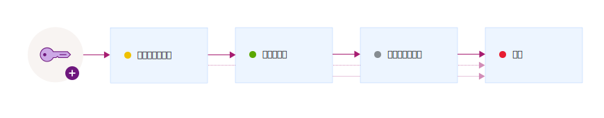

---

copyright:
  years: 2017, 2018
lastupdated: "2018-06-07"

---

{:shortdesc: .shortdesc}
{:codeblock: .codeblock}
{:screen: .screen}
{:new_window: target="_blank"}
{:pre: .pre}
{:tip: .tip}

# 鍵の状態
{: #key-states}

{{site.data.keyword.keymanagementservicefull}} は、[NIST SP 800-57 for key states ](http://nvlpubs.nist.gov/nistpubs/SpecialPublications/NIST.SP.800-57pt1r4.pdf){: new_window} によるセキュリティー・ガイドラインに従っています。
{: shortdesc}

## 鍵の状態および遷移
{: #key_transitions}

暗号鍵は、存続期間中にいくつかの状態を遷移していきます。これらの状態は、鍵が存続している期間の長さ、およびデータが保護されているかどうかに応じて変化します。 

{{site.data.keyword.keymanagementserviceshort}} で提供されているグラフィカル・ユーザー・インターフェースまたは REST API を使用して、鍵のライフサイクルにおける状態の変化を追跡できます。 次の図は、鍵がその生成から消滅までの間にいくつかの状態を経過する様子を示しています。

<table>
  <tr>
    <th>状態</th>
    <th>説明</th>
  </tr>
  <tr>
    <td>アクティベーション前</td>
    <td>鍵は、最初に<i>アクティベーション前</i> 状態で作成されます。 データを暗号で保護するためにアクティブ化前の鍵を使用することはできません。</td>
  </tr>
  <tr>
    <td>アクティブ</td>
    <td>鍵は、アクティベーション日に即時に<i>アクティブ</i> 状態に遷移します。 この遷移は、鍵の暗号期間の開始をマークします。 アクティベーション日が指定されない鍵は、即時にアクティブになり、有効期限が切れるか破棄されるまでアクティブのままです。</td>
  </tr>
  <tr>
    <td>非アクティブ化</td>
    <td>鍵は、有効期限が割り当てられている場合、期限日付に<i>非アクティブ化</i> 状態に遷移します。 この状態では、鍵は暗号化によってデータを保護することはできず、<i>破棄</i> 状態にのみ遷移できます。</td>
  </tr>
  <tr>
    <td>破棄</td>
    <td>削除された鍵は、<i>破棄</i> 状態になります。 この状態の鍵は、リカバリーできません。 鍵の遷移履歴や名前など、鍵に関連付けられているメタデータは、{{site.data.keyword.keymanagementserviceshort}} データベースに保管されます。</td>
  </tr>
  <caption style="caption-side:bottom;">表 1. 鍵の状態および遷移についての説明</caption>
</table>

サービスに鍵を追加した後、{{site.data.keyword.keymanagementserviceshort}} ダッシュボードまたは {{site.data.keyword.keymanagementserviceshort}} REST API を使用して、鍵の遷移の履歴および構成を確認できます。 監査の目的では、{{site.data.keyword.keymanagementserviceshort}} を {{site.data.keyword.cloudaccesstrailfull}} と統合することで、鍵のアクティビティー証跡をモニターすることもできます。 両方のサービスがプロビジョンされて実行された後、{{site.data.keyword.keymanagementserviceshort}} で鍵を作成したり削除したりすると、アクティビティー・イベントが生成され、自動的に {{site.data.keyword.cloudaccesstrailshort}} ログに収集されます。 

詳しくは、[{{site.data.keyword.keymanagementserviceshort}} アクティビティーのモニター ](/docs/services/cloud-activity-tracker/services/security_svcs.html#key_protect){: new_window} を参照してください。
