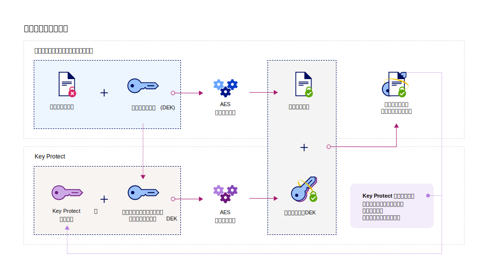

---

copyright:
  years: 2017, 2018
lastupdated: "2018-08-24"

---

{:shortdesc: .shortdesc}
{:codeblock: .codeblock}
{:screen: .screen}
{:new_window: target="_blank"}
{:pre: .pre}
{:tip: .tip}

# {{site.data.keyword.cos_full_notm}} との統合
{: #integrate-cos}

{{site.data.keyword.keymanagementservicefull}} および {{site.data.keyword.cos_full}} が連携して、保存中データのセキュリティーを確保するのを支援します。 {{site.data.keyword.keymanagementservicelong_notm}} サービスを使用して拡張暗号化を {{site.data.keyword.cos_full}} リソースに追加する方法を説明します。
{: shortdesc}

## {{site.data.keyword.cos_full_notm}} の概要
{: #cos}

{{site.data.keyword.cos_full_notm}} は、非構造化データ用のクラウド・ストレージを提供します。 非構造化データとは、ファイル、オーディオビジュアル・メディア、PDF、圧縮データ・アーカイブ、バックアップ・イメージ、アプリケーション成果物、ビジネス文書、その他のバイナリー・オブジェクトを指します。  

データの保全性と可用性を維持するために、{{site.data.keyword.cos_full_notm}} は、複数の地理的位置にわたる複数のストレージ・ノード間に、データをスライスし、分散させます。 データの完全なコピーは、単一のストレージ・ノードには存在しません。ノードのサブセットが使用可能であれば、ネットワーク上のデータを完全に取り出すことができます。 プロバイダー・サイドで暗号化が提供されているため、データは保存中も移動中も保護されています。 ストレージを管理するには、バケットを作成し、{{site.data.keyword.cloud_notm}} コンソールを使用して、あるいは [{{site.data.keyword.cos_full_notm}}REST API ](/docs/services/cloud-object-storage/api-reference/about-compatibility-api.html){: new_window} を使用してプログラムで、オブジェクトをインポートします。

詳しくは、[COS 概要 ](/docs/services/cloud-object-storage/about-cos.html){: new_window} を参照してください。

## 統合が動作する仕組み
{: #kp_cos_how}

{{site.data.keyword.keymanagementserviceshort}} は {{site.data.keyword.cos_full_notm}} と統合して、データのセキュリティーを完全に管理できるように支援します。  

ユーザーがデータを {{site.data.keyword.cos_full_notm}} のインスタンスに移動すると、サービスは自動的にデータ暗号鍵 (DEK) を使用してオブジェクトを暗号化します。 {{site.data.keyword.cos_full_notm}} 内で、DEK はサービス内の、暗号化したリソースの近くに安全に保管されます。 ユーザーがバケットにアクセスする必要がある場合、サービスはユーザーの許可を検査し、ユーザーのためにバケット内のオブジェクトを暗号化解除します。 この暗号化モデルは、_プロバイダー管理の暗号化_ と呼ばれます。

_顧客管理の暗号化_ のセキュリティー上の利点を活用するには、{{site.data.keyword.keymanagementserviceshort}} サービスと統合することで、{{site.data.keyword.cos_full_notm}} 内の DEK にエンベロープ暗号化を追加します。 {{site.data.keyword.keymanagementserviceshort}} を使用して、非常にセキュアなルート鍵をプロビジョンします。このルート鍵は、ユーザーがサービス内で管理するマスター鍵としての機能を果たします。 {{site.data.keyword.cos_full_notm}} 内にバケットを作成する場合、バケットの作成時にエンベロープ暗号化を構成できます。 この追加された保護は、ユーザーが{{site.data.keyword.keymanagementserviceshort}} 内で管理するルート鍵を使用して、バケットに関連付けられた DEK をラップ (つまり、暗号化) します。 この手法は、_鍵ラッピング_ と呼ばれ、複数の AES アルゴリズムを使用して DEK のプライバシーおよび保全性を保護します。そのため、ユーザーは関連付けられたデータへのアクセスを制御するだけで済みます。

次の図は、{{site.data.keyword.keymanagementserviceshort}} を {{site.data.keyword.cos_full_notm}} と統合して、暗号鍵をさらにセキュアにする方法を示しています。

{{site.data.keyword.keymanagementserviceshort}} 内でエンベロープ暗号化がどのように機能するかについて詳しくは、[エンベロープ暗号化](/docs/services/key-protect/concepts/envelope-encryption.html)を参照してください。

## ストレージ・バケットへのエンベロープ暗号化の追加
{: #kp_cos_envelope}

[{{site.data.keyword.keymanagementserviceshort}} でルート鍵を指定](/docs/services/key-protect/create-root-keys.html)し、[サービス間のアクセス権限を付与](/docs/services/key-protect/integrations/integrate-services.html#grant-access)した後で、{{site.data.keyword.cos_full_notm}} GUI を使用して、指定のストレージ・バケットに対してエンベロープ暗号化を有効にすることができます。

 ストレージ・バケットに対して拡張構成オプションを有効にするには、{{site.data.keyword.cos_full_notm}} と {{site.data.keyword.keymanagementserviceshort}} のサービス・インスタンス間に[許可](/docs/services/key-protect/integrations/integrate-services.html#grant-access)が存在することを確認してください。
{: tip}

ストレージ・バケットにエンベロープ暗号化を追加するには、以下の手順を実行します。

1. {{site.data.keyword.cos_full_notm}} ダッシュボードで、**「バケットの作成 (Create bucket)」**をクリックします。
2. バケットの詳細を指定します。
3. **「拡張構成」**セクションで、**「Key Protect 鍵の追加 (Add {{site.data.keyword.keymanagementserviceshort}} Keys)」**を選択します。
4. {{site.data.keyword.keymanagementserviceshort}} サービス・インスタンスのリストから、鍵ラッピングに使用するルート鍵が入っているインスタンスを選択します。
5. **「鍵の名前 (Key Name)」**に、ルート鍵の別名を選択します。
6. **「作成」**をクリックして、バケットの作成を確認します。

{{site.data.keyword.cos_full_notm}} GUI から、{{site.data.keyword.keymanagementserviceshort}} ルート鍵で保護されたバケットを表示できます。

### 次に行うこと

- ストレージ・バケットを {{site.data.keyword.keymanagementserviceshort}} 鍵と関連付けることについて詳しくは、[Manage encryption ](/docs/services/cloud-object-storage/basics/encryption.html#manage-encryption){: new_window} を参照してください。 
